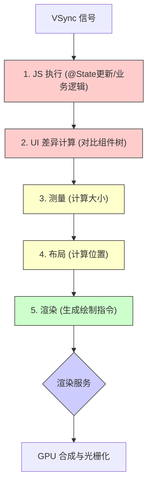
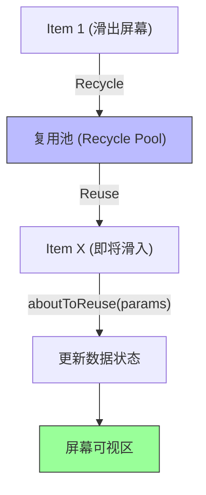

# 鸿蒙开发高级（十七）：性能调优实战 (Performance Deep Dive)

> 🔗 **项目地址**：[https://github.com/briefness/HarmonyDemo](https://github.com/briefness/HarmonyDemo)

> **摘要**：性能直接决定 App 的用户体验。本文将从**底层渲染原理**出发，剖析**UI 渲染瓶颈**、**ArkTS 内存管理**，并结合 **DevEco Profiler** 工具，提供性能优化解决方案。

## 一、核心理论：流畅度的本质

要优化性能，首先要理解“卡顿”从何而来。

### 1.1 16.6ms 刷新率与 VSync
大多数手机屏幕刷新率为 60Hz，意味着每帧的时间窗口仅有 **16.6ms**（1000ms / 60）。
*   **VSync (垂直同步信号)**：每 16.6ms 发送一次信号，通知 CPU/GPU 开始准备下一帧画面。
*   **掉帧 (Jank)**：如果代码逻辑（JS 执行 + 布局计算 + 渲染指令生成）耗时超过 16.6ms，错过了当次 VSync 信号，屏幕就会保持显示上一帧的画面。连续丢帧会导致明显的“卡顿”。

### 1.2 渲染管线 (Render Pipeline)
HarmonyOS 的渲染流程大致如下：


**优化核心目标**：减少 Diff 范围、降低 Layout 复杂度、缩短 JS 执行时间。

---

## 二、列表渲染优化：重中之重

长列表（List/Grid）是性能问题的常见区域。

### 2.1 必须使用 LazyForEach
标准的 `ForEach` 会一次性渲染所有数据项，如果数据量大，启动瞬间会阻塞 UI 线程。`LazyForEach` 则按需渲染。

**代码对比**：
```typescript
// ❌ 错误示范：数据量大时易卡顿
List() {
  ForEach(this.items, (item) => {
    ListItem() { ... }
  })
}

// ✅ 正确示范
List() {
  LazyForEach(this.dataSource, (item) => {
    ListItem() { ... }
  }, (item) => item.id) // 键值生成器至关重要！
}
```

### 2.2 组件复用 (@Reusable)
即使使用了 `LazyForEach`，当用户快速滑动时，频繁的创建（Create）和销毁（Destroy）组件依然会消耗 CPU 并触发 GC。
**@Reusable** 标记允许系统将滑出屏幕的组件缓存到“对象池”中，再次滑入时直接复用，只需更新数据。



**实现步骤**：
1.  自定义组件添加 `@Reusable` 装饰器。
2.  实现 `aboutToReuse(params)` 接口，在此处更新状态。

```typescript
@Component
@Reusable // 1. 标记为可复用
struct ArticleCard {
  @State title: string = ''
  @State desc: string = ''

  // 2. 当组件被复用时回调，params 是新传入的参数
  aboutToReuse(params: { title: string, desc: string }) {
    this.title = params.title;
    this.desc = params.desc;
    // 技巧：这里不需要重新执行 build()，状态变量更新会自动触发局部的 UI 刷新
  }

  build() {
    Column() {
      Text(this.title).fontSize(18)
      Text(this.desc).fontColor(Color.Gray)
    }
  }
}
```

### 2.3 列表优化的策略
**IDDataSource + LazyForEach + @Reusable + cachedCount**

*   **cachedCount**: 设置列表可视区域外预加载的节点数量，平滑滑动体验。
    ```typescript
    List() { ... }
    .cachedCount(2) // 预加载屏幕外 2 个 Item，空间换时间
    ```

---

## 三、布局与渲染优化技巧

### 3.1 减少嵌套层级 (Layout Flattening)
布局层级越深，`Measure` 和 `Layout` 耗时呈指数级增长。
*   **优化前**：嵌套了 3 层 Stack/Column 来实现重叠定位。
*   **优化后**：使用 `RelativeContainer` 或 `GridRow`/`GridCol` 进行扁平化布局。

### 3.2 显隐控制：if vs visibility
*   **if/else**: 真正的“创建/销毁”。条件切换时会触发 DOM 树的移除和重建。适用于**状态不常改变**的大块 UI。
*   **visibility**: 仅仅是“看不见”，组件还在树上，内存还在。适用于**频繁切换**（如闪烁光标、折叠面板）的场景。
    *   `Visibility.None`: 不占位，不绘制（类似 `display: none`）。
    *   `Visibility.Hidden`: 占位，不绘制（类似 `visibility: hidden`）。

### 3.3 图片加载优化
*   **指定尺寸**：尽量使用 `resize` 属性缩小解码尺寸，避免将 4K 图片原样加载到 小头像框中。
*   **同步 vs 异步**：默认 Image 组件异步加载，不阻塞 UI。确保不要在主线程进行耗时的图片处理。

---

## 四、状态管理优化

### 4.1 状态更新的精确控制
不要把整个大对象设为 `@State` 并传递给子组件。ArkUI 的状态观测是基于第一层属性的。

**❌ 性能差的做法**：
```typescript
@State bigData: BigObject = ...
// 传递整个对象，任何小属性变动可能导致不必要的深层检测
ChildComponent({ data: this.bigData })
```

**✅ 性能好的做法**：
按需传递基本类型或使用 `@ObjectLink` 拆分粒度。

### 4.2 避免在 build() 中做复杂计算
`build()` 函数会频繁执行。这是定义 UI 结构的场所，不是写业务逻辑的地方。
*   **Bad**: `Text(this.calculateComplexValue(this.count))`
*   **Good**: 在 `@Watch` 或事件回调中计算好，存入 `@State showValue`，`build` 中直接读取。

---

## 五、线程模型与并发 (Concurrency)

UI 线程（主线程）极其宝贵，任何超过 5ms 的逻辑都应该警惕。

### 5.1 TaskPool (任务池)
对于复杂的计算（如大文件校验、图像滤镜、复杂数据排序），**必须**移出主线程。
HarmonyOS 推荐使用 `TaskPool`（比 Worker 更轻量易用）。

```typescript
import { taskpool } from '@kit.ArkTS';

@Concurrent
function computeHeavyTask(args: number): number {
  // 模拟耗时计算
  return fibonacci(args);
}

// 在 UI 线程调用
async function runTask() {
  let result = await taskpool.execute(computeHeavyTask, 40);
}
```

---

## 六、实战工具：DevEco Profiler

没有数据支撑的优化不可靠。DevEco Studio 内置的 Profiler 是强大的诊断工具。

### 6.1 启动分析
点击底部的 **Profiler** 标签 -> 选择设备和 App -> 点击 **Realtime Monitor**。

### 6.2 关键指标解读
1.  **Frame (帧率分析)**
    *   **绿色帧**：正常。
    *   **红色帧**：掉帧。
    *   **操作**：点击红色帧，下方会展开 Call Stack（调用栈）。
    *   **分析**：查看是否有 `GCRuntime`（垃圾回收）或 `Layout[n]`（过度布局）耗时过长。

2.  **ArkTS Memory (内存分析)**
    *   查看 Heap Dump（堆快照）。
    *   如果发现某种对象（如 `EntryAbility` 或自定义组件）数量只增不减，说明存在**内存泄漏**。

### 6.3 SmartPerf Host (高级)
对于系统级性能分析（如查看 RenderService、System 进程耗时），可以使用 SmartPerf 工具抓取 trace 文件分析。

---

## 七、总结 Checklist

在发布 App 前，请对照以下清单自查：

1.  [ ] **列表流畅度**：是否使用了 `LazyForEach` + `@Reusable` + `cachedCount`？
2.  [ ] **布局层级**：是否移除了无用的 Container？最大嵌套深度是否控制在 5-8 层以内？
3.  [ ] **图片内存**：是否加载了过大的图片？是否及时释放了 PixelMap？
4.  [ ] **状态更新**：日志里是否有 "Component update" 过于频繁？
5.  [ ] **GC 频率**：是否在每一帧（如 `onScroll`）里创建了大量临时对象？

---

> **性能优化从未有终点**。它需要在功能开发和体验之间寻找平衡点。合理运用上述技巧，将显著提升 HarmonyOS 应用的运行流畅度。


