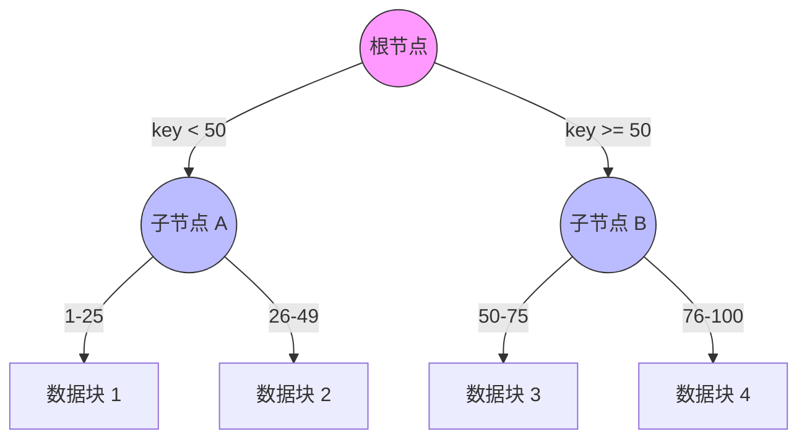
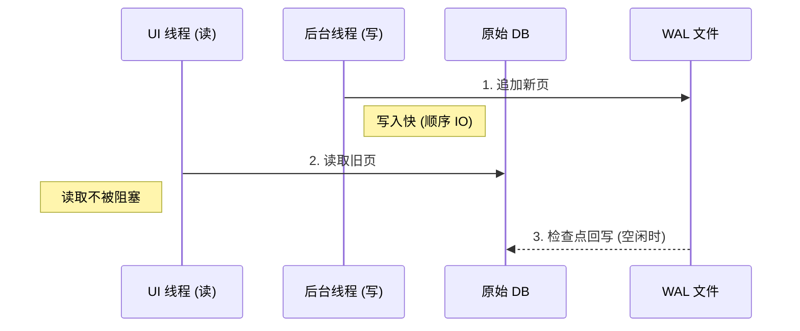

# 鸿蒙开发进阶（九）：本地数据库 (RDB) 深度解析

> 🔗 **项目地址**：[https://github.com/briefness/HarmonyDemo](https://github.com/briefness/HarmonyDemo)

> **更新说明**：本文将介绍 RDB 的 API，以及 SQLite 底层的 **B-Tree 索引** 和 **WAL** 机制。

## 一、理论基础：数据库为什么快？

### 1.1 B-Tree 索引
为什么在百万条数据中查询 ID 只需要几毫秒？
因为 RDB (基于 SQLite) 使用 **B-Tree** 结构存储索引。


```mermaid
graph TD
    Root((根节点)) -->|key < 50| Left((子节点 A))
    Root -->|key >= 50| Right((子节点 B))
    Left -->|1-25| L1[数据块 1]
    Left -->|26-49| L2[数据块 2]
    Right -->|50-75| R1[数据块 3]
    Right -->|76-100| R2[数据块 4]
    
    style Root fill:#f9f,stroke:#333
    style Left fill:#bbf,stroke:#333
    style Right fill:#bbf,stroke:#333
```

*   它是一种平衡树结构。
*   查找时间复杂度为 **O(log N)**。
*   **最佳实践**: 经常作为查询条件的字段（如 `userId`, `createTime`），建议创建 Index。

### 1.2 WAL (Write-Ahead Logging)
SQLite 默认开启 WAL 模式。
*   **原理**: 修改数据时，不直接改原文件 `db`，而是先追加写入日志文件 `db-wal`。
*   **优势**: 读写完全并发。写操作不会阻塞读操作 (No Locking)。
*   这保证了后台数据同步时不阻塞 UI 读取。


```mermaid
sequenceDiagram
    participant UI as UI 线程 (读)
    participant BG as 后台线程 (写)
    participant DB as 原始 DB
    participant WAL as WAL 文件
    
    BG->>WAL: 1. 追加新页
    Note right of BG: 写入快 (顺序 IO)
    UI->>DB: 2. 读取旧页
    Note left of UI: 读取不被阻塞
    WAL-->>DB: 3. 检查点回写 (空闲时)
```

## 二、核心概念：谓词 (Predicates)

`RdbPredicates` 是 SQL `WHERE` 子句的封装。

```typescript
// SELECT * FROM TASK WHERE ID = 5 AND DONE = 1
let predicates = new relationalStore.RdbPredicates('TASK');
predicates.equalTo('ID', 5).and().equalTo('DONE', 1);
```

常用谓词方法一览：

| 方法 | 对应 SQL | 示例 |
|------|---------|------|
| `equalTo(field, value)` | `field = value` | `.equalTo('STATUS', 1)` |
| `notEqualTo(field, value)` | `field != value` | `.notEqualTo('DONE', 1)` |
| `greaterThan(field, value)` | `field > value` | `.greaterThan('PRICE', 100)` |
| `like(field, pattern)` | `field LIKE pattern` | `.like('NAME', '%手机%')` |
| `in(field, values)` | `field IN (...)` | `.in('ID', [1, 2, 3])` |
| `orderByAsc(field)` | `ORDER BY field ASC` | `.orderByAsc('CREATE_TIME')` |
| `limit(count)` | `LIMIT count` | `.limit(20)` |

## 三、核心 API 流程

### 3.1 初始化 (init)
```typescript
const store = await relationalStore.getRdbStore(context, {
  name: 'TaskStore.db',
  securityLevel: relationalStore.SecurityLevel.S1 // 数据安全等级，S1-S4
});
```

安全等级说明：
*   **S1**: 普通数据（如应用配置）。
*   **S2**: 一般个人数据（如消息记录）。
*   **S3**: 敏感个人数据（如健康数据）。
*   **S4**: 关键敏感数据（如密码、密钥）。

### 3.2 建表与索引

```typescript
// 建表
await store.executeSql(
  `CREATE TABLE IF NOT EXISTS TASK (
    ID INTEGER PRIMARY KEY AUTOINCREMENT,
    TITLE TEXT NOT NULL,
    DONE INTEGER DEFAULT 0,
    CREATE_TIME INTEGER NOT NULL,
    CATEGORY TEXT
  )`
);

// 创建索引（提升查询性能）
await store.executeSql(
  `CREATE INDEX IF NOT EXISTS idx_task_category ON TASK(CATEGORY)`
);
```

### 3.3 CRUD 操作

```typescript
// Insert
const valueBucket: relationalStore.ValuesBucket = {
  'TITLE': '学习 ArkTS',
  'DONE': 0,
  'CREATE_TIME': Date.now(),
  'CATEGORY': '学习'
};
const rowId = await store.insert('TASK', valueBucket);

// Update
const updateValues: relationalStore.ValuesBucket = { 'DONE': 1 };
const updatePredicates = new relationalStore.RdbPredicates('TASK');
updatePredicates.equalTo('ID', rowId);
await store.update(updateValues, updatePredicates);

// Delete
const deletePredicates = new relationalStore.RdbPredicates('TASK');
deletePredicates.equalTo('ID', rowId);
await store.delete(deletePredicates);
```

### 3.4 游标 (ResultSet)
查询返回的 `ResultSet` 是一个游标，指向数据行的**前一行**。

```typescript
const predicates = new relationalStore.RdbPredicates('TASK');
predicates.equalTo('DONE', 0).orderByDesc('CREATE_TIME');

const resultSet = await store.query(predicates, ['ID', 'TITLE', 'CREATE_TIME']);
const tasks: Task[] = [];

while (resultSet.goToNextRow()) {
  tasks.push({
    id: resultSet.getLong(resultSet.getColumnIndex('ID')),
    title: resultSet.getString(resultSet.getColumnIndex('TITLE')),
    createTime: resultSet.getLong(resultSet.getColumnIndex('CREATE_TIME')),
  });
}

// ⚠️ 必须关闭！否则耗尽连接池
resultSet.close();
```

## 四、数据库版本管理 (Migration)

应用更新后表结构可能变化。通过 `version` 字段控制迁移：

```typescript
const STORE_CONFIG: relationalStore.StoreConfig = {
  name: 'TaskStore.db',
  securityLevel: relationalStore.SecurityLevel.S1
};

const store = await relationalStore.getRdbStore(context, STORE_CONFIG);
const currentVersion = store.version;

if (currentVersion === 0) {
  // 首次安装：建表
  await store.executeSql(`CREATE TABLE IF NOT EXISTS TASK (...)`);
  store.version = 1;
}

if (currentVersion === 1) {
  // v1 -> v2：添加 PRIORITY 字段
  await store.executeSql(`ALTER TABLE TASK ADD COLUMN PRIORITY INTEGER DEFAULT 0`);
  store.version = 2;
}

if (currentVersion === 2) {
  // v2 -> v3：添加索引
  await store.executeSql(`CREATE INDEX IF NOT EXISTS idx_task_priority ON TASK(PRIORITY)`);
  store.version = 3;
}
```

这种递增式迁移确保了无论用户从哪个版本升级，数据库结构都能正确演进，且已有数据不会丢失。

## 五、事务处理 (Transaction)

多个写操作需要保证原子性时，使用事务：

```typescript
try {
  await store.beginTransaction();
  
  // 多个操作要么全部成功，要么全部回滚
  await store.executeSql(`UPDATE ACCOUNT SET BALANCE = BALANCE - 100 WHERE ID = 1`);
  await store.executeSql(`UPDATE ACCOUNT SET BALANCE = BALANCE + 100 WHERE ID = 2`);
  
  await store.commit(); // 提交
} catch (e) {
  await store.rollBack(); // 回滚
  console.error('转账失败:', e);
}
```

## 六、Preferences vs RDB

鸿蒙的数据持久化有两种方案，适用场景完全不同：

| 维度 | Preferences | RDB |
|------|------------|-----|
| 底层 | XML/JSON 键值对 | SQLite 关系型数据库 |
| 数据量 | 少量（几十个键值对） | 大量（数万条记录） |
| 查询能力 | 只能按 key 取值 | 支持 SQL 级别的复杂查询 |
| 适用场景 | 用户设置、主题偏好、登录状态 | 消息列表、商品目录、日志记录 |
| 性能 | 全量加载到内存，启动快 | 按需查询，首次启动略慢 |

```typescript
// Preferences 用法
import { preferences } from '@kit.ArkData';

const store = await preferences.getPreferences(context, 'settings');
await store.put('theme', 'dark');
await store.put('fontSize', 16);
await store.flush(); // 持久化到磁盘
```

## 七、常见问题

1.  **异步**: RDB 的 I/O 是异步的，必须 `await`。忘了 `await` 是最常见的 Bug——操作看起来执行了但数据没变。
2.  **Boolean 映射**: SQLite 不支持 Boolean，通常使用 Integer (0/1)。
3.  **主键自增**: 推荐 `ID INTEGER PRIMARY KEY AUTOINCREMENT`。
4.  **ResultSet 泄漏**: 每次 `query()` 后必须 `close()`。如果在循环中反复查询却忘了关闭，连接池会耗尽导致应用崩溃。
5.  **并发安全**: 同一个 `RdbStore` 实例在多个 TaskPool 线程中使用时需要注意读写冲突。WAL 模式支持一写多读，但不允许多写并发。

## 八、总结

掌握 RDB 是处理复杂业务数据的基础。
*   理解 **B-Tree**，知道何时建索引。
*   理解 **WAL**，知道为什么读写互不干扰。
*   善用 **事务**，保证多步操作的原子性。
*   合理选择 **Preferences vs RDB**，避免杀鸡用牛刀。

下一篇，将探讨 **状态管理 (State Management)** V2 版本的 **Proxy 机制**。
