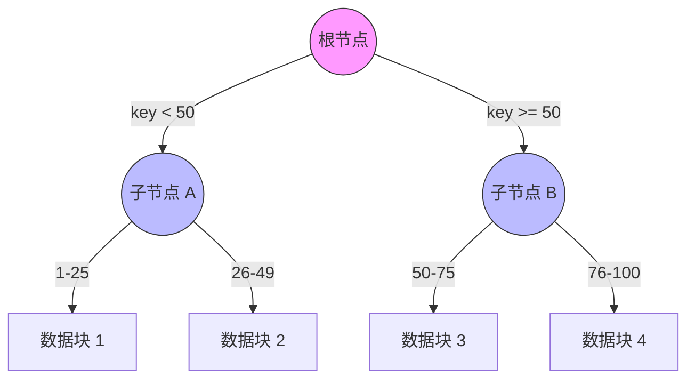
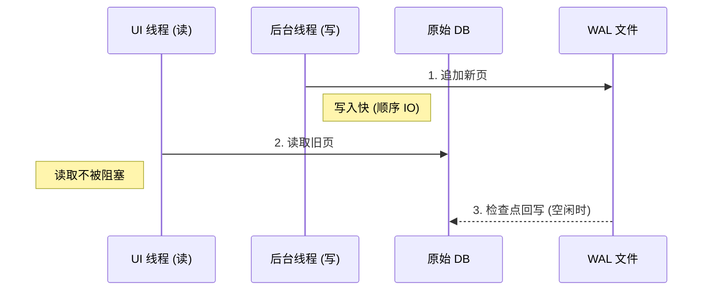

# 鸿蒙开发进阶（九）：本地数据库 (RDB) 深度解析

> 🔗 **项目地址**：[https://github.com/briefness/HarmonyDemo](https://github.com/briefness/HarmonyDemo)

> **更新说明**：本文将介绍 RDB 的 API，以及 SQLite 底层的 **B-Tree 索引** 和 **WAL** 机制。

## 一、理论基础：数据库为什么快？

### 1.1 B-Tree 索引
为什么在百万条数据中查询 ID 只需要几毫秒？
因为 RDB (基于 SQLite) 使用 **B-Tree** 结构存储索引。



*   它是一种平衡树结构。
*   查找时间复杂度为 **O(log N)**。
*   **最佳实践**: 经常作为查询条件的字段（如 `userId`, `createTime`），建议创建 Index。

### 1.2 WAL (Write-Ahead Logging)
SQLite 默认开启 WAL 模式。
*   **原理**: 修改数据时，不直接改原文件 `db`，而是先追加写入日志文件 `db-wal`。
*   **优势**: 读写完全并发。写操作不会阻塞读操作 (No Locking)。
*   这保证了后台数据同步时不阻塞 UI 读取。



## 二、核心概念：谓词 (Predicates)

`RdbPredicates` 是 SQL `WHERE` 子句的封装。

```typescript
// SELECT * FROM TASK WHERE ID = 5 AND DONE = 1
let predicates = new relationalStore.RdbPredicates('TASK');
predicates.equalTo('ID', 5).and().equalTo('DONE', 1);
```

## 三、核心 API 流程

### 3.1 初始化 (init)
```typescript
const store = await relationalStore.getRdbStore(context, {
  name: 'TaskStore.db',
  securityLevel: relationalStore.SecurityLevel.S1 // 数据安全等级，S1-S4
});
```

### 3.2 游标 (ResultSet)
查询返回的 `ResultSet` 是一个游标，指向数据行的**前一行**。
*   **注意**: ResultSet 持有资源，使用完毕必须 `close()`，以免耗尽连接池。

## 四、常见问题

1.  **异步**: RDB 的 I/O 是异步的，必须 `await`。
2.  **Boolean 映射**: SQLite 不支持 Boolean，通常使用 Integer (0/1)。
3.  **主键自增**: 推荐 `ID INTEGER PRIMARY KEY AUTOINCREMENT`。

## 五、总结

掌握 RDB 是处理复杂业务数据的基础。
*   理解 **B-Tree**，知道何时建索引。
*   理解 **WAL**，知道为什么读写互不干扰。

下一篇，将探讨 **状态管理 (State Management)** V2 版本的 **Proxy 机制**。


