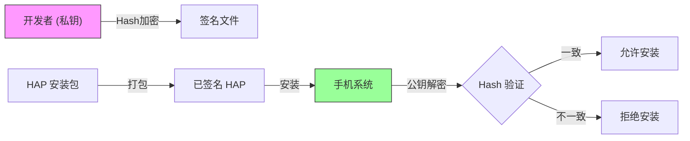
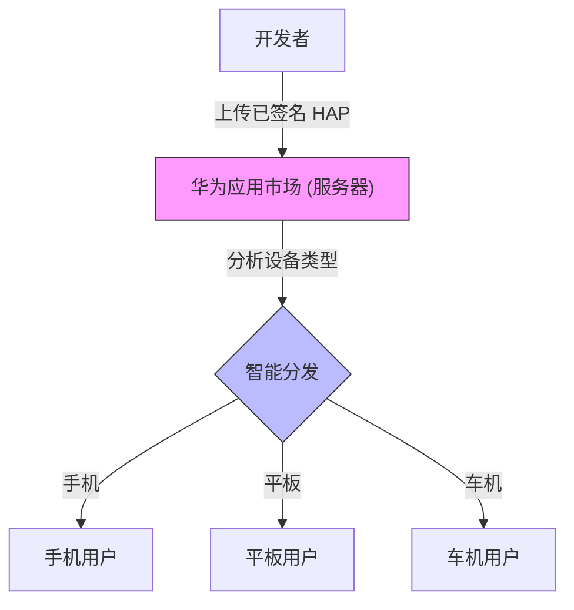

# 鸿蒙开发高级（二十）：分发与商业化 (Publishing)

> 🔗 **项目地址**：[https://github.com/briefness/HarmonyDemo](https://github.com/briefness/HarmonyDemo)

> **更新说明**：本文将介绍 **数字签名 (Code Signing)** 原理、AppScope 及上架流程。

## 一、理论基础：数字签名与 AppScope

### 1.1 为什么需要签名？
防止篡改。



1.  **非对称加密**: 开发者持有**私钥 (Private Key)**，华为持有**公钥 (Public Key)**。
2.  **签名过程**: 私钥对 App 的 HASH 值加密，生成签名信息。
3.  **验签过程**: 手机安装时，系统用公钥解密签名，验证 HASH 是否一致。

### 1.2 AppScope 工程结构
`AppScope` 文件夹是全工程的公共配置。
*   `bundleName`: 应用的唯一标识（如 `com.example.app`）。**上架后不可修改**。
*   `versionCode`: 必须单调递增。

## 二、隐私合规 (Privacy)

这是上架过程中的关键环节。

### 2.1 隐私政策时机
**规则**: 在用户点击“同意”按钮之前，App **不能发送网络请求**。
建议：
在 `EntryAbility.onCreate` 里检查标记位。如果未同意，直接加载一个纯本地的 `PrivacyPage`，阻断主页面的初始化。

在 `EntryAbility.onCreate` 里检查标记位。如果未同意，直接加载一个纯本地的 `PrivacyPage`，阻断主页面的初始化。

### 2.2 常见驳回原因（避坑指南）
AppGallery 的审核非常严格，以下是高频被拒原因：
*   **过度索权**：申请了用户未触发的权限（如一启动就申请相机）。原则：**用时再申请**。
*   **UGC 监管**：如果有用户发帖功能，必须有**举报/屏蔽**机制和**内容审核**（无论是人工还是 AI）。
*   **隐私弹窗**：必须包含“不同意退出 App”的选项，且不能在用户点击同意前收集任何设备信息（包括 Mac 地址）。
*   **纯净模式**: 务必在设置中开启“纯净模式”进行跑测。如果应用中包含诱导下载、非官方渠道更新的弹窗，会被直接拦截并驳回。

## 三、安全加固 (App Guard)

对于金融、政务类应用，仅仅代码混淆是不够的。你需要防范 **动态注入 (Hook)** 和 **二次打包**。

### 3.1 核心防护手段
1.  **完整性校验 (Integrity Check)**: 应用启动时，校验自身的签名和包体积。如果发现被篡改（如被植入了广告 SDK），直接退出。
2.  **防调试 (Anti-Debug)**: 检测到 Debugger 挂载时，主动 Crash。
3.  **加密资源**: 将核心 API Key 或配置加密存储（结合 Asset Store Kit），防止被 `strings` 命令直接提取。

> **商业化建议**：可以使用华为 AppGallery Connect 提供的 **“应用安全检测”** 服务，它会在云端对你的 HAP 进行静态和动态扫描，出具详细的漏洞报告。

---

## 四、代码混淆 (Obfuscation)

商业级应用必须开启混淆，以保护源码并减小包体积。
HarmonyOS NEXT 提供了原生混淆能力。

1.  **配置开关**:
    在 `build-profile.json5` 中开启：
    ```json5
    "buildOption": {
      "arkOptions": {
        "obfuscation": {
          "ruleOptions": {
            "enable": true,
            "files": ["./obfuscation-rules.ets"]
          }
        }
      }
    }
    ```
2.  **编写规则**:
    在 `obfuscation-rules.ets` 中保留关键类名（如反射用到的类）：
    ```text
    -keep-class-name
    MyReflectClass
    ```

## 五、多设备分发

HarmonyOS 的核心愿景是 **One Super Device**。
在 `Project Structure` 勾选 Tablet/Car，并做好响应式布局。
AppGallery 会自动将应用分发给不同设备用户，无需上传多个包。



## 六、全系列总结

至此，全系列**理论增强**圆满结束。
从第一篇的 ArkTS 编译原理，到最后一篇的 RSA 数字签名。
不仅学会了 *How* (怎么写)，更深入理解了 *Why* (为什么这么设计)。

希望这些内容对开发 HarmonyOS 应用有所帮助。
**Happy Coding!**


