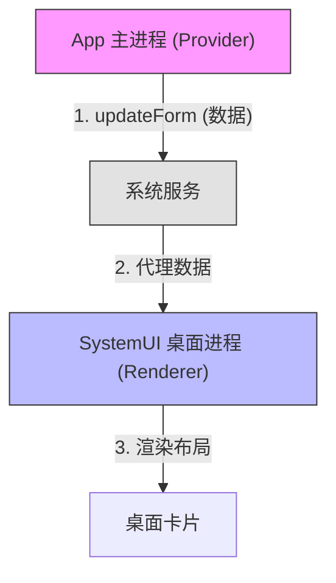
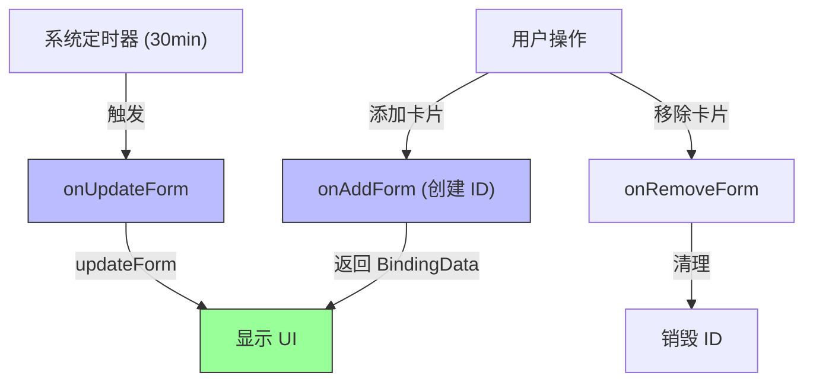

# 鸿蒙开发进阶（十六）：元服务与万能卡片 (Atomic Services & Cards)

> 🔗 **项目地址**：[https://github.com/briefness/HarmonyDemo](https://github.com/briefness/HarmonyDemo)

> **更新说明**：本文将介绍卡片的 **渲染分离机制** 及开发约束。

## 一、理论基础：渲染分离 (Snapshot Rendering)

### 1.1 为什么卡片的交互受限？
万能卡片（Form）不是一个迷你 App，而是由 **SystemUI 进程** 渲染的界面。

1.  **进程分离**:
    *   **App 进程**: 负责提供数据 (`FormBindingData`)。
    *   **SystemUI 进程**: 负责解析布局、绘制卡片。
2.  **安全性与性能**:
    为了保证桌面性能，系统限制卡片执行复杂的 JS 逻辑、高频动画及复杂 Canvas 绘图。

### 1.2 快照技术
当调用 `updateForm` 时，系统序列化布局树，桌面进程收到后进行布局更新。
这使得卡片非常省电。

## 二、核心组件：FormProvider

卡片的后台逻辑是由 `FormExtensionAbility` 管理的。

### 2.1 生命周期
*   `onAddForm`: 用户把卡片拖到桌面上。
*   `onUpdateForm`: 定时刷新（最小 30 分钟）。
*   `onRemoveForm`: 用户移除卡片。

> **最佳实践**: 在 `onUpdateForm` 里，不要做耗时操作。通过 TaskPool 异步获取数据，再调用 `formProvider.updateForm`。

## 三、开发约束 (Restrictions)

由于渲染机制限制，只能使用 ArkTS 的**子集**。
*   ❌ **不支持**: `List`, `Scroll` (除了特定组件), 自定义组件的复杂生命周期。
*   ✅ **支持**: `Column`, `Row`, `Image`, `Text`, `Button`.

## 四、交互：postCardAction
卡片的主要交互方式。
*   **router**: 跳回 App。
*   **call**: 后台静默执行（如：切歌）。
    *   注意：`call` 事件有 5 秒限制。超时未返回，系统会终止 Action。

## 五、总结

开发卡片需要遵循 **“克制”** 的原则。
它是 App 的延伸，负责展示核心信息。

下一篇，将进入 **性能调优**，利用 Profiler 进行性能分析。

