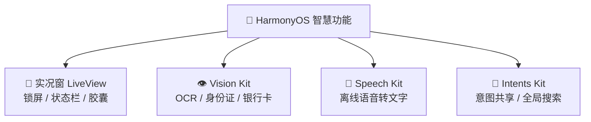

# 鸿蒙开发高级（十七）：智慧功能 (Smart Features)

> 🔗 **项目地址**：[https://github.com/briefness/HarmonyDemo](https://github.com/briefness/HarmonyDemo)

HarmonyOS NEXT 不仅有独特的交互，更内置了强大的 AI 能力和实时信息展示机制。
本章将介绍如何利用 **实况窗 (Live View)** 和 **系统原生 AI (Vision/Speech)** 让应用变得更“聪明”。

## 一、实况窗 (Live View)



实况窗是 HarmonyOS 呈现长时任务（Long-term Task）的核心形态，如打车进度、外卖配送、录音时长等。
它比普通通知更持久，比前台应用更轻量，能在锁屏、通知中心和胶囊位展示。

### 1.1 核心概念

*   **LiveViewManager**: 管理实况窗的生命周期（创建、更新、结束）。
*   **LiveViewData**: 数据模型，包含进度、状态文本等。

### 1.2 开发实战

使用 `LiveViewKit` 构建一个简单的计时器实况窗。

```typescript
import { liveViewManager } from '@kit.LiveViewKit';

// 1. 构建初始数据
const liveViewData: liveViewManager.LiveViewData = {
  id: 1001, // 业务ID
  // 场景分类（关键）：系统会严格审核。例如外卖、打车、导航等
  sceneType: liveViewManager.SceneType.FOOD_DELIVERY, 
  priority: liveViewManager.LiveViewPriority.HIGH, // 明确优先级，决定胶囊位的抢占逻辑
  content: {
    title: "正在录音",
    text: "00:15",
    type: liveViewManager.ViewType.CAPSULE | liveViewManager.ViewType.CARD, // 支持胶囊和卡片
    // 交互增强：点击实况窗跳转到特定页面
    viewAction: {
      action: "router.push",
      abilityName: "EntryAbility",
      uri: "pages/RecordingDetail"
    }
  },
  // 胶囊特有配置
  capsule: {
    status: liveViewManager.CapsuleStatus.RUNNING,
    icon: $r('app.media.ic_mic_on'), // 建议使用 SVG 格式以适配不同分辨率
    backgroundColor: '#FF0000'
  }
};

// 2. 启动实况窗
liveViewManager.startLiveView(liveViewData).then(() => {
  console.info('LiveView started!');
});

// 3. 更新进度
setInterval(() => {
  liveViewData.content.text = "00:16";
  liveViewManager.updateLiveView(liveViewData);
}, 1000);

// 4. 结束 (必须)：任务完成后必须明确结束，避免系统资源浪费
// liveViewManager.stopLiveView(liveViewData);
```

### 1.3 深度细节：状态机与生命周期

实况窗不仅仅是显示，它更强调**任务的生命周期**。

*   **生命周期对齐**：务必确保 `start` 与 `stop` 成对出现。即便 App 异常退出（Crash 或被杀），也应通过 **Background Tasks (后台任务)** 的清理机制来移除过期的实况窗，避免给用户造成“死任务”的困扰。
*   **场景严格分级**：`sceneType` 决定了系统给予的视觉优先级。不要滥用高优先级场景（如导航），否则会导致审核被拒。
```

> **注意**：实况窗需要申请 `ohos.permission.KEEP_BACKGROUND_RUNNING` 权限，并通常配合后台任务使用。

## 二、AI 视觉 (Vision Kit)

HarmonyOS 提供了系统级的视觉能力，无需集成庞大的第三方 SDK 即可实现 OCR 和图像识别。

### 2.1 文本识别 (Text Recognition)

直接从图片中提取文字，支持多语言。

> **🔒 隐私优势**：Vision Kit 大部分能力（包括 OCR）是在 **端侧 (On-device)** 完成的。这意味着识别身份证、银行卡等敏感信息时，数据无需上传云端，极大降低了合规风险。
>
> **⚡ 性能贴士**：对于高分辨率图片的 OCR，建议放入 `TaskPool` 或 `Worker` 线程中异步执行，避免长时间占用主线程导致 UI 掉帧。

```typescript
import { textRecognition } from '@kit.VisionKit';

async function recognizeText(pixelMap: PixelMap) {
  try {
    const result = await textRecognition.recognizeText(pixelMap);
    console.info(`识别结果: ${result.value}`);
    // result.value 包含提取的所有文本
  } catch (error) {
    console.error('OCR failed:', error);
  }
}
```

### 2.2 视觉控件 (Vision Component)

可以直接在 UI 中嵌入系统提供的拍摄控件，自动完成身份证、银行卡扫描。

```typescript
import { RecognizerComponent } from '@kit.VisionKit';

@Component
struct IDCardScanner {
  build() {
    Column() {
       // 系统预置的身份证扫描组件
      RecognizerComponent({
        type: textRecognition.RecognizerType.ID_CARD,
        onComplete: (res) => {
          console.info('姓名:', res.result.name);
          console.info('号码:', res.result.idNum);
        }
      })
    }
  }
}
```

## 三、AI 语音 (Core Speech Kit)

无需联网，基于端侧大模型实现语音转文字。

### 3.1 语音听写 (Speech Recognizer)

```typescript
import { speechRecognizer } from '@kit.CoreSpeechKit';

let asrEngine = await speechRecognizer.createEngine({
  language: 'zh-CN',
  online: 0 // 0 表示离线模式，隐私更安全
});

// 开始监听
asrEngine.startListening({
  onResult: (result) => {
    console.info('实时转写:', result.transcript);
  }
});
```

## 四、进阶：意图框架 (Intents Kit)

既然提到了“智慧”，就不能忽略 **Intents Kit**。它是让 App 真正融入鸿蒙生态的关键。

*   **意图共享**：将业务逻辑封装为"意图"注册给系统。
*   **场景举例**：
    *   告诉系统"用户正在听歌" -> 小艺建议可能会在特定时间推荐该 App。
    *   注册“搜索食谱”意图 -> 用户在系统全局搜索栏输入菜名，直接展示你 App 内的食谱卡片。

## 五、总结

针对不同的智慧场景，需要选择合适的技术方案：

| 功能 | 适用场景 | 关键 Kit | 核心优势 |
| :--- | :--- | :--- | :--- |
| **实况窗** | 强实时、长耗时任务 (打车/外卖/录音) | **LiveViewKit** | 锁屏/状态栏常驻，无需反复点开 App |
| **通用 OCR** | 扫描文档、提取图片信息 | **VisionKit** | 系统级高精度、支持多国语言 |
| **垂域识别** | 身份证、银行卡、行驶证 | **VisionKit (UI 控件)** | 预置 UI 引导，开发成本几乎为零，**端侧处理** |
| **离线语音** | 语音输入、实时字幕、隐私场景 | **CoreSpeechKit** | 响应快、零流量消耗、数据不落云 |
| **意图** | 全局搜索、小艺建议推荐 | **IntentsKit** | 主动把服务推送到用户面前 |

结合这些智慧能力，应用将不再是一个孤岛，而是鸿蒙智慧生态有机的一部分。

下篇文章回归架构设计，讨论如何管理日益复杂的代码——**[组件化与工程架构](./Components.md)**。
