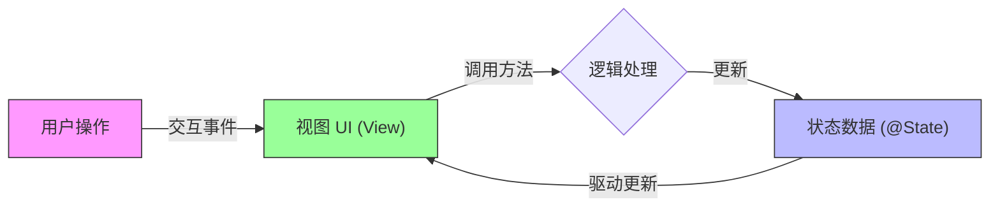
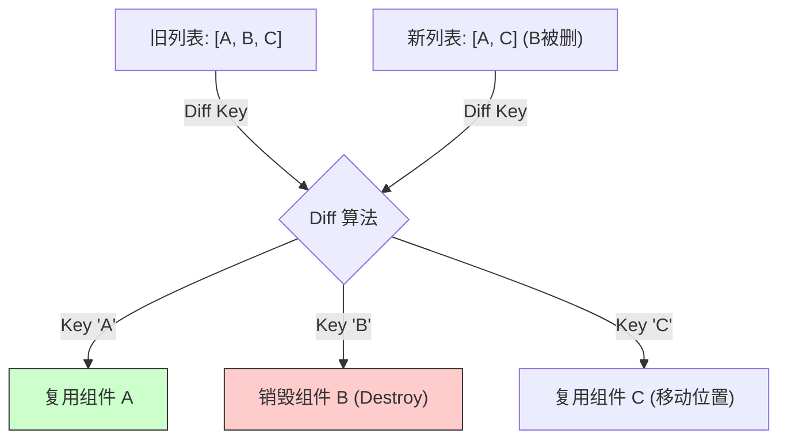

# 鸿蒙开发入门（三）：动态列表与状态管理

> 🔗 **项目地址**：[https://github.com/briefness/HarmonyDemo](https://github.com/briefness/HarmonyDemo)

在前两篇文章中，介绍了静态 UI 的构建和 ArkUI 的渲染管线。本文将实现**动态交互**。

本节将实现一个经典的**待办事项列表（ToDo List）**。这是一个 **MVVM (Model-View-ViewModel)** 模式在鸿蒙开发中的典型案例。

## 一、理论核心：MVVM 与 状态机

在鸿蒙开发中，ArkTS 的设计融合了 ViewModel 的理念，无需显式编写。



### 1.1 UI = f(State)

这是声明式 UI 的终极公式。
*   **UI**: 界面。
*   **State**: 数据（如 `@State todos`）。
*   **f**: `build()` 函数。

**状态机 (State Machine) 思维**：
不要通过操作 UI（如“删掉这个 Text”）来更新界面，而要操作数据（如“从数组里删掉字符串”）。
只要数组（State）变了，`build()` 函数（f）就会自动重新计算，生成新的 UI。

这就是**数据驱动**的本质。

## 二、目标效果

本节的目标是创建一个功能完备的 ToDo List：
1.  **输入**: 绑定 `@State newTodo`。
2.  **展示**: 绑定 `@State todos` 数组，使用 `ForEach` 渲染。
3.  **修改**: `push` 添加，`splice` 删除，自动触发刷新。

## 三、代码实现

```typescript
@Entry
@Component
struct TodoListPage {
  // --- Model (数据层) ---
  // 状态变量：驱动 UI 的核心
  @State newTodo: string = '' 
  @State todos: Array<string> = ['Learn ArkTS', 'Build UI', 'Write Article'] 

  build() {
    Column() {
      // --- View (视图层) ---
      
      // 1. 标题
      Text('My Todo List')
        .fontSize(24)
        .fontWeight(FontWeight.Bold)
        .margin({ top: 20, bottom: 20 })

      // 2. 输入区域
      Row() {
        TextInput({ placeholder: 'Add a new task', text: this.newTodo }) 
          // 双向绑定：View 变化 (输入) -> Model 变化 (this.newTodo)
          .layoutWeight(1) 
          .onChange((value: string) => {
            this.newTodo = value
          })
          .onSubmit(() => {
            this.addTodo()
          })
        
        Button('Add')
          .onClick(() => {
            this.addTodo()
          })
          .margin({ left: 10 })
      }
      .width('90%')
      .margin({ bottom: 20 })

      // 3. 列表区域
      List() {
        // 核心循环：将数据映射为 UI
        ForEach(this.todos, (item: string, index: number) => {
          ListItem() {
            Row() {
              Text(item)
                .fontSize(18)
                .width('70%')

              Button('Delete')
                .type(ButtonType.Normal)
                .backgroundColor(Color.Red) 
                .fontSize(14)
                .height(30)
                .onClick(() => {
                  this.deleteTodo(index)
                })
            }
            .width('100%')
            .padding(15)
            .justifyContent(FlexAlign.SpaceBetween) 
            .backgroundColor('#F5F5F5')
            .borderRadius(10)
            .margin({ bottom: 10 })
          }
        }, (item: string) => item) // 键值生成器：性能优化的关键
      }
      .width('90%')
      .layoutWeight(1) // 列表占据剩余空间
    }
    .width('100%')
    .height('100%')
  }

  // --- Logic (逻辑层) ---
  
  addTodo() {
    if (this.newTodo.trim() !== '') {
      // 只要修改数据，UI 自动刷新
      this.todos.push(this.newTodo)
      this.newTodo = '' 
    }
  }

  deleteTodo(index: number) {
    // 只要修改数据，UI 自动刷新
    this.todos.splice(index, 1)
  }
}
```

## 四、关键深度解析

### 4.1 数组代理的底层逻辑 (Why Push Works)
ArkTS 重写了 `@State` 装饰的数组原型的 `push`, `pop`, `splice` 等方法。
当代码执行 `this.todos.push(x)` 时：
1.  **拦截**: ArkTS 运行时捕获该操作。
2.  **标记**: 将当前组件标记为 "Dirty" (脏)。
3.  **调度**: 在下一个 VSync 信号到来时，重新执行 `build()`。

> **注意**: 如果使用 `this.todos[0] = 'New'`，在旧版本 ArkUI 中可能无法触发更新（但在新版中已优化）。为了保险，建议使用 `splice` 或整体赋值。

### 4.2 ForEach 的性能秘密
```typescript
ForEach(this.todos, itemGenerator, keyGenerator)
```
第三个参数 `keyGenerator` (`(item) => item`) 至关重要。
如果没有它，框架可能需要销毁整个列表再重建。有了它，框架可以对比新旧 ID：
*   ID 没变？UI 复用！
*   ID 变了？新建或删除。
这对长列表性能至关重要。



### 4.3 状态管理的陷阱 (Pitfalls)

1.  **嵌套对象更新失效**:
    `@State` 默认是**浅层监听**的。
    ```typescript
    @State user = { name: 'Lucas', age: 18 };
    // ...
    this.user.age = 19; // ✅ 触发更新
    
    // 但是如果是嵌套对象
    @State user = { address: { city: 'Shanghai' } };
    this.user.address.city = 'Beijing'; // ❌ 不会触发更新！
    ```
    **解决**: 使用 `@Observed` 装饰类 + `@ObjectLink` 接收，或者等到学习“状态管理 V2” 章节。

2.  **build 中禁止修改状态**:
    ```typescript
    build() {
      // ❌ 绝对禁止！会导致 build -> change -> build -> change ... 死循环
      this.count++; 
      Text(`${this.count}`)
    }
    ```

## 五、结语

回顾这一阶段的学习：
1.  **HelloHarmony**: 从 ArkTS 编译原理到 HAP 结构。
2.  **BasicUI**: 从 Measure/Layout/Draw 管线到声明式基础。
3.  **TodoList**: 深刻践行了 `UI = f(State)` 的 MVVM 哲学。

目前，已经掌握了鸿蒙开发的**基石**。
下一阶段将探索页面路由、动画及自定义绘图。
