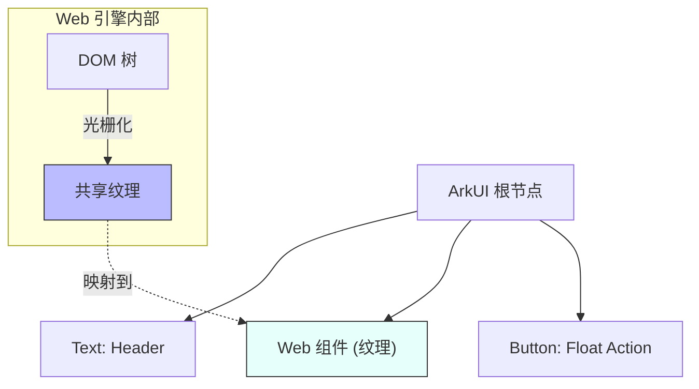
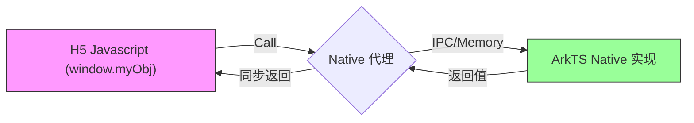
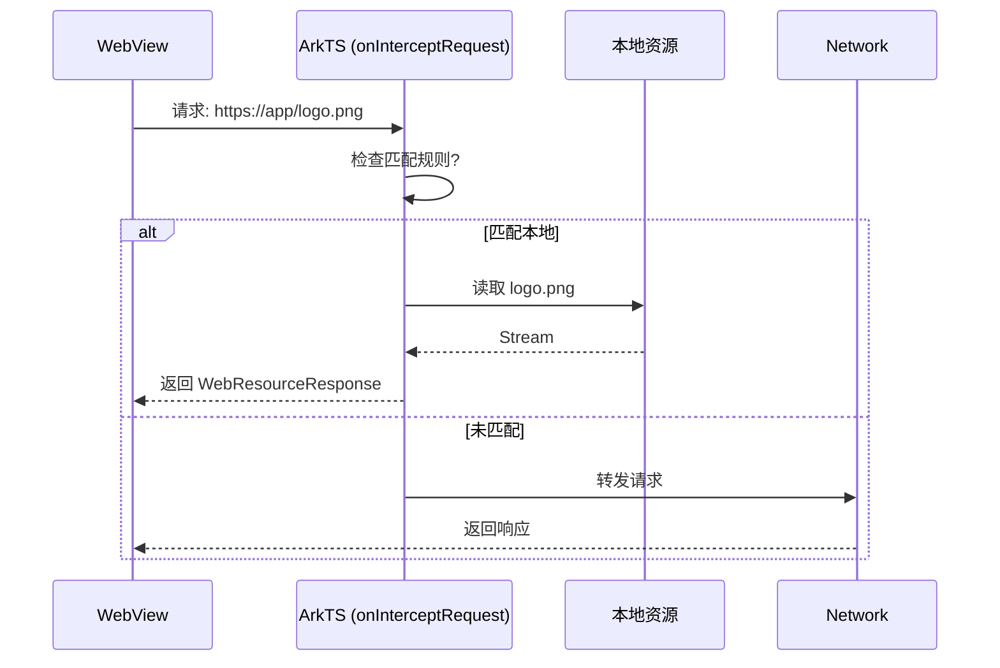

# 鸿蒙开发进阶（十三）：混合开发 (Web & JSBridge)

> 🔗 **项目地址**：[https://github.com/briefness/HarmonyDemo](https://github.com/briefness/HarmonyDemo)

> **更新说明**：本文将介绍 **同层渲染 (Same-Layer Rendering)** 技术及 **JSBridge** 双向通信。

## 一、理论基础：Web 渲染机制

### 1.1 同层渲染 (Same-Layer Rendering)
在传统的 Hybrid 开发中，WebView 通常作为独立窗口（Surface），容易出现层级覆盖或点击穿透问题。

HarmonyOS 的 Web 组件采用了先进的 **同层渲染** 技术：
1.  Web 内核将 HTML 渲染为纹理 (Texture)。
2.  这个纹理被视为 ArkUI 渲染树中的一个普通节点 (RenderNode)。
3.  Web 组件可以和原生组件 (Text, Image) **任意层叠、嵌套**。
4.  这使得 Web 组件支持响应手势事件。



## 二、基础用法

```typescript
Web({ src: 'https://www.huawei.com', controller: this.controller })
  .javaScriptAccess(true)
  .domStorageAccess(true)
```

## 三、深度交互：JSBridge 原理

传统的注入方式（`loadUrl("javascript:...")`）效率较低。
HarmonyOS 提供了 **Native <-> JS 双向对象代理**。

### 3.1 ArkTS 调用 H5
`runJavaScript` 向 JS 引擎的主循环 (Event Loop) 投递一个 Task，异步执行，不阻塞 ArkTS UI 线程。

### 3.2 H5 调用 ArkTS (注册代理)



```typescript
this.controller.registerJavaScriptProxy(new Bridge(), "myObj", ["callNative"]);
```
**原理**：
1.  Native 侧创建 C++ 对象存根。
2.  Web 内核侧在 `window` 对象上挂载一个 Proxy。
3.  JS 调用 `window.myObj.func()` 时，Proxy 拦截调用，序列化参数。
4.  通过 IPC 管道（跨进程模式）或内存调用（单进程模式）传递给 Native。
5.  **同步返回**：支持 JS 同步拿到 Native 的返回值。

## 四、进阶：资源拦截

通过 `onInterceptRequest`，可以构建一个 **Local Web Server**。
*   请求 `https://app/image.png` -> 拦截 -> 读取本地 rawfile -> 返回流。
*   这能实现 H5 页面的 **“离线秒开”**。



## 五、总结

Web 组件实现了与 Native 的深度融合。
*   **渲染上**：它融入了 ArkUI 树。
*   **通信上**：它打通了 JS 与 C++ 的通道。

混合开发利用 Web 的灵活性和 Native 的高性能，实现优势互补。

下一篇，将探讨 **并发与 Actor 模型**。


