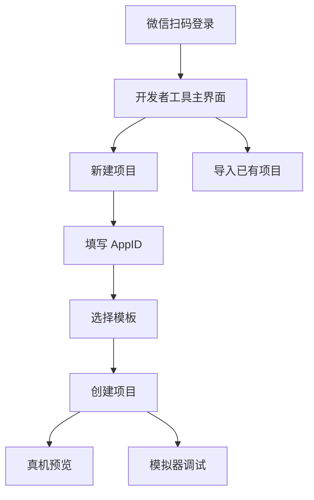

# 00. 启程：环境准备与小程序初体验

小程序像一个被微信严格管控的"浏览器中的浏览器"——它运行在微信的沙箱环境里，不能为所欲为，必须遵守微信制定的游戏规则。这个系列的第一篇，先把开发环境跑通，再来拆解这套规则。

> **环境：** 微信开发者工具 latest，小程序基础库 3.x，无需 Node.js / npm（本系列原生开发）

---

## 1. 账号与工具准备

### 1.1 注册小程序账号

访问 [微信公众平台](https://mp.weixin.qq.com/)，选择"小程序"，完成主体信息登记。个人开发者可以注册个人类型小程序（功能受限，但足够学习）。

注册完成后，在**开发管理 → 开发设置**中找到：
- **AppID（小程序 ID）**：小程序的唯一标识，类似身份证号
- **AppSecret（小程序密钥）**：调用某些高级 API 必备，**妥善保管，切勿泄露**

> 小程序必须通过 AppID 才能体验完整功能。使用微信开发者工具创建项目时，如果不填 AppID，只能体验"游客模式"，部分 API 无法调用。

### 1.2 安装开发者工具

```bash
# macOS 用户推荐使用 DMG 安装包
# 下载地址：https://developers.weixin.qq.com/miniprogram/dev/devtools/download.html
```

Windows 用户下载 exe 安装包，一路 Next 即可。

安装完成后，使用微信扫码登录，进入主界面：



### 1.3 新建第一个项目

点击"新建项目"，填写以下信息：

| 字段 | 说明 |
|------|------|
| 项目名称 | 任意，如 `hello-miniprogram` |
| 目录 | 本地空文件夹路径 |
| AppID | 粘贴你的小程序 AppID |
| 开发模式 | 选择"小程序" |
| 后端服务 | 选择"不使用云服务"（云开发后续专题） |
| 语言 | 选择"JavaScript" |

点击"创建"，等待片刻，模拟器中出现小程序界面。

---

## 2. 项目结构全解析

创建完成后，目录结构如下：

```
hello-miniprogram/
├── pages/
│   └── index/
│       ├── index.js       # 页面逻辑
│       ├── index.wxml     # 页面结构（类似 HTML）
│       ├── index.wxss     # 页面样式（类似 CSS）
│       └── index.json     # 页面配置
├── utils/                  # 工具函数目录
├── app.js                  # 小程序全局逻辑（入口）
├── app.json                # 小程序全局配置
├── app.wxss                # 小程序全局样式
├── project.config.json     # 开发者工具项目配置（不必提交到仓库）
└── sitemap.json            # SEO 配置（微信爬虫规则）
```

关键文件一一拆解：

### 2.1 `app.js` — 小程序的 main 函数

```javascript
// app.js
App({
  // 小程序启动时触发（全局只触发一次）
  onLaunch() {
    // 初始化逻辑：检查登录态、加载全局数据
    console.log("小程序启动了");
  },

  // 所有页面共享的全局数据
  globalData: {
    userInfo: null,
    apiBase: "https://api.example.com",
  },
});
```

`App()` 是小程序的全局构造器，类似于 React 中的 `<App>` 或 Vue 中的 `new Vue()`。所有页面和组件都可以通过 `getApp()` 获取全局实例。

### 2.2 `app.json` — 小程序的总指挥

```json
{
  // 小程序所有页面路径（必填，路径不能含后缀）
  "pages": [
    "pages/index/index",
    "pages/logs/logs"
  ],

  // 全局窗口外观配置
  "window": {
    "backgroundTextStyle": "light",
    "navigationBarBackgroundColor": "#ffffff",
    "navigationBarTitleText": "我的小程序",
    "navigationBarTextStyle": "black"
  },

  // 底部 tabBar 配置（如需多 tab）
  "tabBar": {
    "color": "#999999",
    "selectedColor": "#07C160",
    "backgroundColor": "#ffffff",
    "list": [
      { "pagePath": "pages/index/index", "text": "首页" },
      { "pagePath": "pages/logs/logs", "text": "日志" }
    ]
  },

  // 全局组件注册
  "usingComponents": {},
  // 组件版本（推荐 2）
  "componentFramework": "glass-easel",
  // 小程序版本
  "lazyCodeLoading": "requiredComponents"
}
```

### 2.3 `app.wxss` — 全局样式

```css
/* app.wxss */
page {
  /* 小程序中，page 是最外层容器 */
  font-family: -apple-system, BlinkMacSystemFont, sans-serif;
  font-size: 28rpx;
  color: #333;
  background-color: #f5f5f5;
}

/* 全局工具类 */
.flex {
  display: flex;
}

/* 全局样式复用 */
.container {
  padding: 24rpx;
}
```

---

## 3. 第一个页面：Hello World

打开 `pages/index/index.js`：

```javascript
// pages/index/index.js
Page({
  // 页面的初始数据（类似 React 的 useState 初始值）
  data: {
    message: "Hello, Miniprogram!",
    count: 0,
  },

  // 页面加载时触发（类似 componentDidMount）
  onLoad() {
    console.log("index 页面加载了");
  },

  // 点击事件的处理函数
  addCount() {
    this.setData({
      count: this.data.count + 1,
    });
  },
});
```

对应的 `index.wxml`：

```html
<!-- pages/index/index.wxml -->
<view class="container">
  <!-- 数据绑定：{{}} 语法 -->
  <text class="title">{{message}}</text>

  <!-- 计数器展示 -->
  <view class="counter">
    <text>当前计数：{{count}}</text>
  </view>

  <!-- 点击事件：bindtap 绑定方法 -->
  <button bindtap="addCount">点我 +1</button>
</view>
```

对应的 `index.wxss`：

```css
/* pages/index/index.wxss */
.container {
  padding: 40rpx;
  display: flex;
  flex-direction: column;
  align-items: center;
}

.title {
  font-size: 48rpx;
  font-weight: bold;
  color: #07C160;
  margin-bottom: 40rpx;
}

.counter {
  font-size: 36rpx;
  color: #666;
  margin-bottom: 40rpx;
}

button {
  width: 300rpx;
  background-color: #07C160;
  color: #ffffff;
  border-radius: 8rpx;
}
```

> **运行结果**：点击按钮，计数 +1，界面实时更新。这就是小程序最核心的数据驱动模式——`setData` 修改数据，视图自动同步。

---

## 4. 开发者工具使用指南

### 4.1 模拟器 vs 真机调试

| 调试方式 | 优点 | 缺点 |
|---------|------|------|
| **模拟器** | 启动快、截图方便、无需手机 | 某些 API 行为与真机有差异（如支付、分享） |
| **真机调试** | 完全真实环境、所有 API 可用 | 需要手机扫码、网络要求高 |
| **预览** | 生成二维码供他人体验 | 需要上传代码（上传前可加测试参数） |

> **实战建议**：UI 布局和业务逻辑在模拟器调试，最终交付前务必在真机测试一遍。

### 4.2 调试面板核心功能

- **Console**：执行 JS 表达式，查看日志
- **Sources**：断点调试，查看调用栈
- **Network**：查看网络请求（注意：小程序请求走的是 `network` 面板，不是 XHR）
- **Storage**：查看本地存储数据
- **AppData**：实时查看和修改当前页面的 data（**核心调试工具**）
- **Wxml**：查看渲染后的 DOM 树，修改样式实时生效

> **小技巧**：在 AppData 面板中双击某个 data 字段，可以直接修改值，页面会立即响应——这对调试数据联动特别有用。

---

## 5. rpx 单位：设计师的贴心设计

小程序引入了一个叫 `rpx`（responsive pixel）的响应式单位，彻底解决了多屏幕适配问题。

**核心规则**：

- 设计稿以 **750px 宽度**为基准（iPhone 6 屏幕宽度）
- 1rpx = 1px / 750 = 0.5px（iPhone 6 上）
- 小程序会自动将 rpx 换算为真实像素

| 设备宽度 | 750rpx 实际宽度 |
|---------|----------------|
| iPhone 5 (320px) | 320px |
| iPhone 6 (375px) | 375px |
| iPhone 12 (390px) | 390px |
| iPad (1024px) | 683px |

```css
/* 实践中的换算 */
.avatar {
  width: 100rpx;   /* = 50px (iPhone 6) */
  height: 100rpx;
  border-radius: 50%;
}

.full-width {
  width: 750rpx;  /* 永远等于屏幕宽度 */
  padding: 24rpx;
}
```

> **为什么是 750rpx？** 设计稿最常用 750px 宽度（iPhone 6 逻辑像素）。设计师给标注时，把 px 数值直接填入 rpx，零换算成本。

---

## 6. 常见坑点

**1. AppID 填写错误导致无法调用 API**

刚注册的小程序，AppSecret 默认是隐藏的，需要点击"重置"才能获取。重置后旧密钥立即失效。

**2. pages 路径写错导致页面空白**

`app.json` 中 pages 数组的第一项是默认首页。如果路径指向的文件不存在，编译会报错但不一定给出清晰提示。

**3. 真机调试时网络请求失败**

小程序默认只允许请求已备案的域名。开发阶段在 `project.config.json` 中可以勾选"不校验合法域名"：

```json
{
  "appid": "your-appid",
  "setting": {
    "urlCheck": false  // 开发阶段关闭域名校验
  }
}
```

**4. rpx 在模拟器和真机表现不一致**

某些旧机型（尤其是 Android 低端机）对 rpx 的渲染有精度问题。涉及精确对齐的布局，建议在真机测试。

---

## 延伸思考

小程序原生开发的体验介于"网页开发"和"App 开发"之间——比 H5 能力强（原生组件、微信 API），比 App 开发门槛低（JavaScript、无需编译原生代码）。

但正因为它站在两个世界的中间，所以有独特的限制：
- **双线程架构**牺牲了 H5 的灵活性，换来了更安全的环境
- **白名单域名校验**让前端工程师必须和后端同学配合，不能"先上线再说"
- **包体积限制（2MB 单包）**迫使开发者必须做精细的工程规划

理解这些约束的设计意图，比单纯记 API 重要得多。

---

## 总结

- 微信小程序运行在微信的沙箱环境中，通过**双线程架构**（渲染层 WebView + 逻辑层 JS Engine）实现安全隔离
- `App()` 是全局入口，`Page()` 是页面构造器，`Component()` 是组件构造器
- `app.json` 配置所有页面路径和全局窗口外观
- `rpx` 是专为小程序设计的响应式单位，设计稿 750px 换算零成本
- 开发者工具的 AppData 面板是调试数据联动的神器

---

## 参考

- [微信开发者工具官方文档](https://developers.weixin.qq.com/miniprogram/dev/devtools/devtools.html)
- [微信小程序开发框架指南](https://developers.weixin.qq.com/miniprogram/dev/framework/)
- [小程序框架设计解读](https://github.com/jiejaylin/mini-program-architect)
