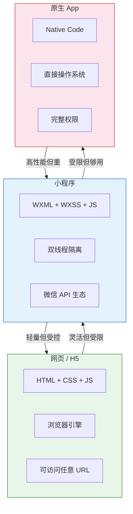
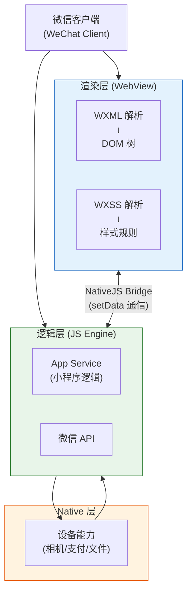
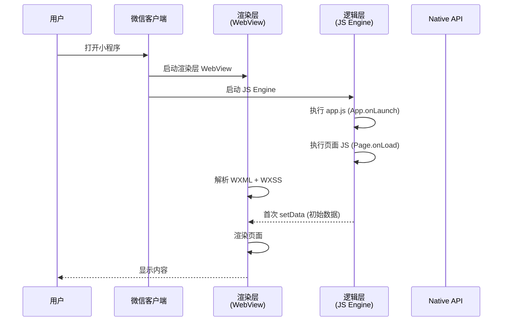
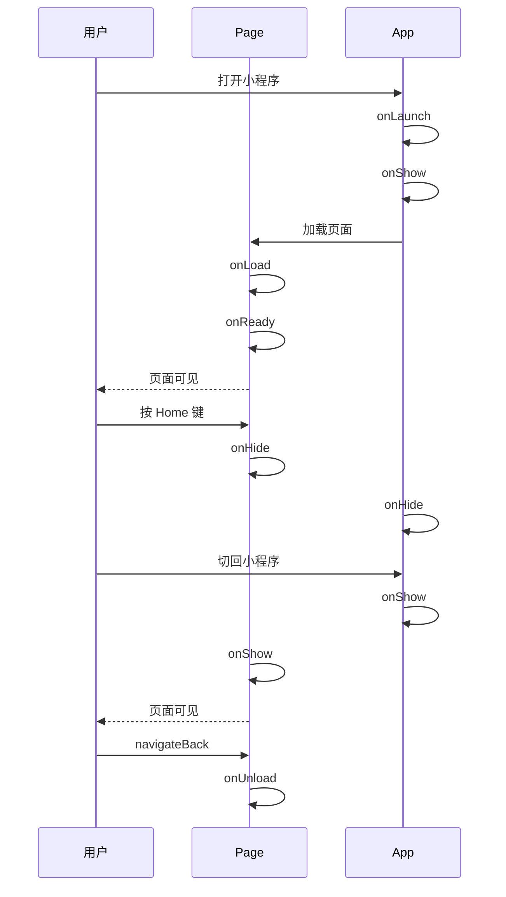
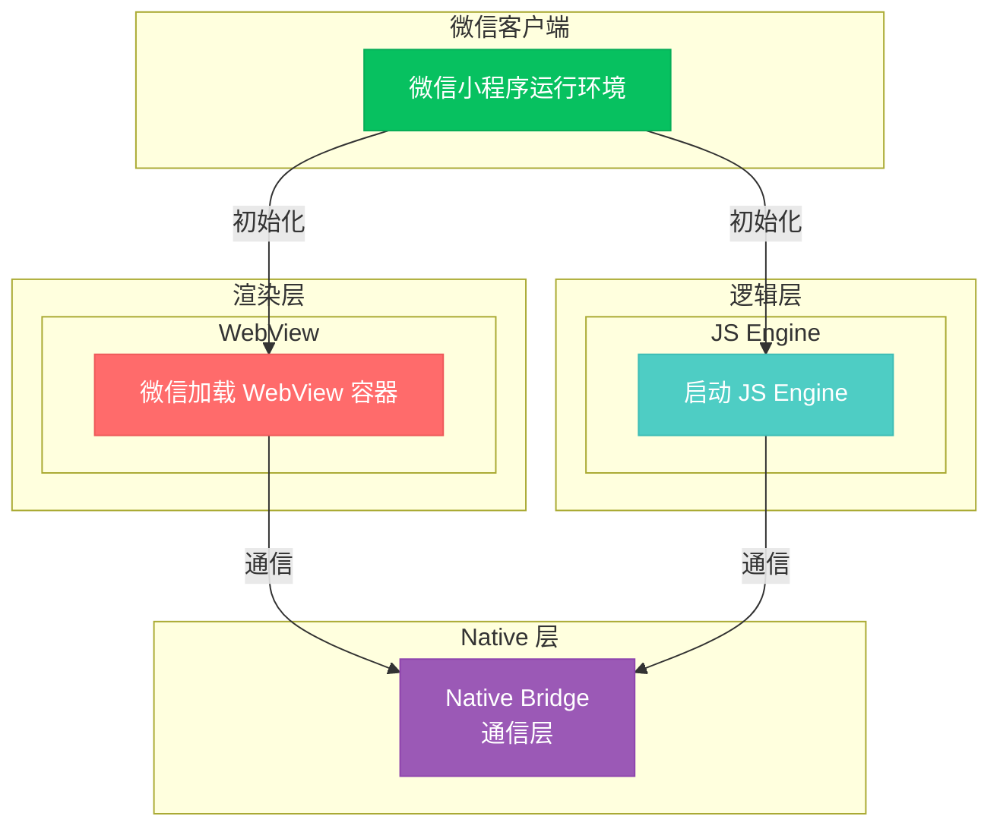
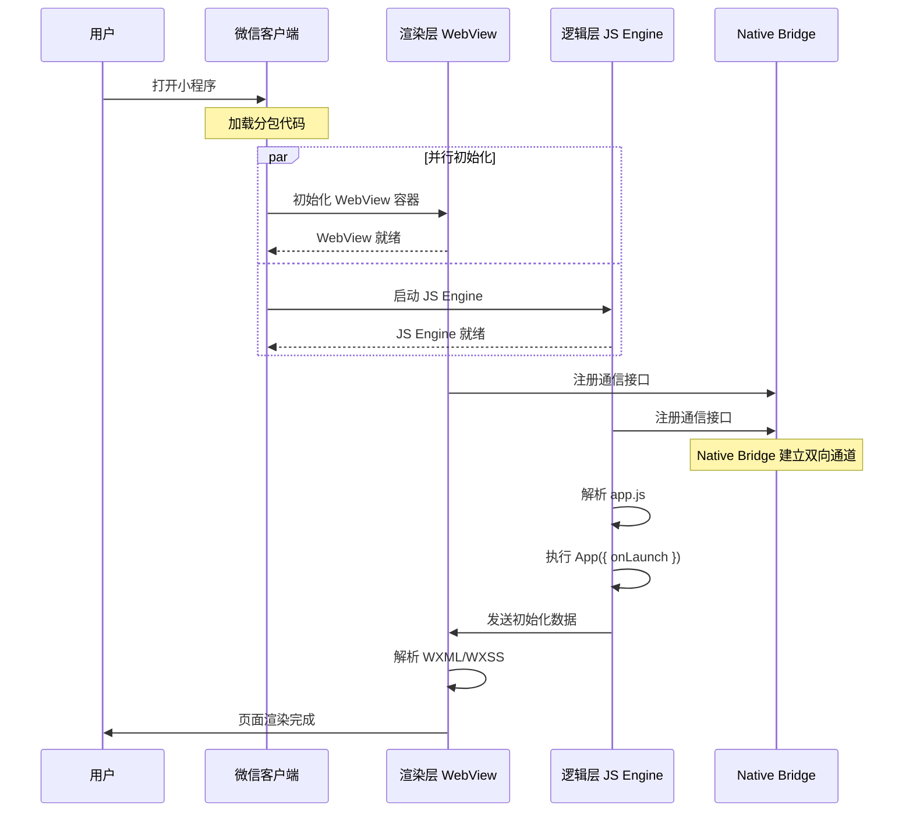

# 01. 微信小程序全景：从打开到渲染

打开一个微信小程序，从点击到看到内容，只需要零点几秒——但这零点几秒背后，发生了极其精密的工程协作。小程序既不是网页，也不是原生 App，它是微信用自己的沙箱规则重新定义的一种"受限运行环境"。

理解这套架构，是写出高质量小程序的前提。

> **环境：** 微信开发者工具 latest，小程序基础库 3.x

---

## 1. 小程序 vs H5 vs 原生 App

三个技术方向各有优劣，小程序处于中间地带：



| 维度 | H5 网页 | 小程序 | 原生 App |
|------|---------|--------|---------|
| 渲染性能 | 依赖浏览器 | 双线程隔离 | 直接 GPU 渲染 |
| 系统权限 | 受限（需授权） | 微信授权体系 | 完全开放 |
| 分发方式 | URL 链接 | 微信内搜索/扫码 | 应用商店 |
| 包体积 | 无限制 | 单包 ≤ 2MB | 几十 MB |
| 更新方式 | 实时更新 | 微信审核后更新 | 用户主动更新 |
| 开发成本 | 低 | 中 | 高 |

> **关键洞察**：小程序用"受限"换来了"安全"和"体验"。微信的审核机制虽然繁琐，但保证了整个生态的质量下限；双线程架构虽然牺牲了部分灵活性，但避免了恶意代码直接操作用户手机。

---

## 2. 双线程架构详解

这是小程序最核心的设计，理解它就能理解小程序的绝大多数行为。

### 2.1 为什么需要双线程？

浏览器中，JS 和渲染共享同一个线程。如果 JS 执行一个耗时计算，页面会卡住（这就是为什么复杂网页会"假死"）。微信在设计小程序时，把这个风险彻底隔离了。



**两条线程的职责分工**：

- **渲染层（WebView）**：负责 WXML → DOM 树，WXSS → 样式计算，最终绘制像素到屏幕。渲染线程永远不执行业务 JS。
- **逻辑层（JS Engine）**：执行 app.js、页面 JS、组件 JS，处理数据逻辑，调用微信 API。逻辑层永远不直接操作 DOM。

**两者之间的通信**：通过微信客户端内置的 `NativeJS Bridge` 传递。逻辑层调用 `setData()` 时，数据被序列化后跨线程传递到渲染层，渲染层更新 DOM。

### 2.2 setData 的本质

`setData` 不是 React/Vue 中的响应式系统，它的本质是一次**跨线程的消息传递**：

```javascript
// pages/index/index.js
Page({
  data: {
    title: "原始标题",
    list: [1, 2, 3],
  },

  updateTitle() {
    // 这不是直接修改 DOM，而是：
    // 1. 将 { title: "新标题" } 序列化
    // 2. 跨线程发送给渲染层
    // 3. 渲染层合并数据，重新渲染
    this.setData({ title: "新标题" });
  },

  updateList() {
    // 常见坑：每次 setData 都是一次完整的数据快照传递
    // list 很长时，频繁调用会性能下降
    this.setData({
      list: [...this.data.list, 4], // 浅拷贝引用不变，渲染层感知不到
    });
    // 正确做法：创建新引用
    this.setData({
      list: this.data.list.concat([4]), // concat 返回新数组
    });
  },
});
```

> **setData 的关键约束**：数据必须通过 `setData` 驱动更新，直接修改 `this.data.xxx = value` 不会触发视图更新。

---

## 3. 小程序启动流程全图解



启动分为两个阶段：

**冷启动**：小程序进程不存在，需要全新初始化（耗时最长）
**热启动**：小程序进程存在，只需从后台切换到前台（耗时短）

---

## 4. 文件配置体系

### 4.1 全局配置 `app.json`

```json
{
  "pages": [
    "pages/index/index",
    "pages/detail/detail",
    "pages/mine/mine"
  ],
  "window": {
    "navigationBarTitleText": "我的应用",
    "enablePullDownRefresh": false,
    "backgroundColor": "#f5f5f5"
  },
  "tabBar": {
    "selectedColor": "#07C160",
    "list": [
      { "pagePath": "pages/index/index", "text": "首页" },
      { "pagePath": "pages/mine/mine", "text": "我的" }
    ]
  },
  "permission": {
    "scope.userLocation": {
      "desc": "用于展示附近商家"
    }
  }
}
```

### 4.2 页面配置 `page.json`

页面目录下可以有自己的 `page.json`，覆盖全局 `window` 配置：

```json
{
  "navigationBarTitleText": "商品详情",
  "enablePullDownRefresh": true,
  "usingComponents": {
    "my-header": "/components/header/index"
  }
}
```

---

## 5. 生命周期体系

小程序有三套独立的生命周期：App 级别、Page 级别、Component 级别。

### 5.1 App 生命周期

```javascript
// app.js
App({
  onLaunch() {
    // 小程序首次初始化时触发（全局只执行一次）
  },
  onShow() {
    // 小程序启动，或从后台切换到前台时触发
  },
  onHide() {
    // 小程序进入后台时触发（如按 Home 键）
  },
  onError(err) {
    // 小程序发生 JS 错误时触发
    console.error("小程序报错：", err);
  },
  onPageNotFound(res) {
    // 打开的页面不存在时触发
    // 可用于做 404 重定向
  },
});
```

### 5.2 Page 生命周期

```javascript
// pages/index/index.js
Page({
  // 1. 页面加载（数据从逻辑层首次到达渲染层）
  onLoad(query) {
    // query 是页面启动时的参数（如从分享链接进入）
    console.log("页面参数：", query);
  },

  // 2. 页面初次渲染完成（视图层 DOM 构建完毕）
  onReady() {
    // 可以开始操作 DOM 了（但小程序没有 DOM，只有 WXML）
    // 适合：启动动画、请求首屏数据
  },

  // 3. 页面显示（每次进入页面都会触发）
  onShow() {
    // 适合：从其他页面返回时刷新数据
  },

  // 4. 页面隐藏（每次离开页面都会触发）
  onHide() {
    // 适合：暂停计时器、保存草稿
  },

  // 5. 页面卸载（销毁）
  onUnload() {
    // 适合：清理定时器、解绑事件
  },

  // 下拉刷新
  onPullDownRefresh() {
    // 需在 page.json 中开启 enablePullDownRefresh
    this.fetchData();
  },

  // 上拉加载更多
  onReachBottom() {
    this.loadMore();
  },

  // 页面滚动
  onPageScroll(obj) {
    console.log("滚动位置：", obj.scrollTop);
  },
});
```

### 5.3 生命周期时序图



---

### 可视化：启动流程动态演示

下面通过图示展示微信小程序的双线程启动时序和初始化过程。

#### 小程序启动架构图



#### 启动流程时序图



#### 启动步骤动画演示

下方动画演示启动的 6 个关键步骤：

```html
<div class="startup-demo">
  <div class="demo-title">小程序启动流程</div>

  <div class="arch-diagram">
    <div class="layer wechat">
      <div class="layer-label">微信客户端</div>
      <div class="node" id="wx-node">微信加载分包</div>
    </div>

    <div class="dual-threads">
      <div class="layer render">
        <div class="layer-label">渲染层 WebView</div>
        <div class="node" id="web-node">WebView 就绪</div>
        <div class="node sub" id="parse-node">WXML/WXSS 解析</div>
      </div>
      <div class="layer logic">
        <div class="layer-label">逻辑层 JS Engine</div>
        <div class="node" id="js-node">JS Engine 启动</div>
        <div class="node sub" id="app-node">app.js 执行</div>
      </div>
    </div>

    <div class="layer native">
      <div class="layer-label">Native Bridge</div>
      <div class="node bridge" id="bridge-node">通信层就绪</div>
    </div>
  </div>

  <div class="step-display">
    <div class="step-num" id="stepNum">—</div>
    <div class="step-desc" id="stepDesc">点击下方按钮开始演示</div>
  </div>

  <div class="controls">
    <button class="btn" onclick="startupStep()">▶ 下一步</button>
    <button class="btn" onclick="startupPlay()">⏵ 自动播放</button>
    <button class="btn" onclick="startupReset()">↺ 重置</button>
  </div>
</div>

<style>
.startup-demo {
  background: #1a1a2e;
  border-radius: 12px;
  padding: 24px;
  font-family: 'SF Mono', 'Fira Code', monospace;
  color: #e0e0e0;
  max-width: 700px;
  margin: 0 auto;
}
.demo-title {
  text-align: center;
  font-size: 16px;
  color: #ffd700;
  margin-bottom: 20px;
}
.arch-diagram {
  display: flex;
  flex-direction: column;
  gap: 12px;
  margin-bottom: 20px;
}
.layer {
  display: flex;
  flex-direction: column;
  gap: 8px;
  padding: 12px 16px;
  border-radius: 8px;
  border: 1px solid;
}
.layer-label {
  font-size: 11px;
  font-weight: bold;
  text-transform: uppercase;
  letter-spacing: 1px;
  margin-bottom: 4px;
}
.wechat {
  background: rgba(7, 193, 96, 0.1);
  border-color: #07C160;
}
.wechat .layer-label { color: #07C160; }
.render {
  background: rgba(255, 107, 107, 0.1);
  border-color: #FF6B6B;
}
.render .layer-label { color: #FF6B6B; }
.logic {
  background: rgba(78, 205, 196, 0.1);
  border-color: #4ECDC4;
}
.logic .layer-label { color: #4ECDC4; }
.native {
  background: rgba(155, 89, 182, 0.1);
  border-color: #9B59B6;
}
.native .layer-label { color: #9B59B6; }
.dual-threads {
  display: grid;
  grid-template-columns: 1fr 1fr;
  gap: 12px;
}
.node {
  background: #16213e;
  border: 1px solid #0f3460;
  border-radius: 6px;
  padding: 10px 14px;
  font-size: 13px;
  color: #aaa;
  text-align: center;
  transition: all 0.4s ease;
  position: relative;
}
.node.sub {
  font-size: 12px;
  padding: 8px 12px;
  border-color: #1a1a3e;
  background: #0d1117;
}
.node.bridge {
  text-align: center;
}
.node.active {
  border-color: #ffd700;
  background: #2a2a4a;
  color: #ffd700;
  box-shadow: 0 0 15px rgba(255, 215, 0, 0.3);
  transform: scale(1.02);
}
.node.done {
  border-color: #00ff88;
  background: #0a3d2a;
  color: #00ff88;
}
.step-display {
  text-align: center;
  margin-bottom: 16px;
  padding: 12px;
  background: #0d1117;
  border-radius: 8px;
  border: 1px solid #30363d;
}
.step-num {
  font-size: 14px;
  color: #ffd700;
  font-weight: bold;
  margin-bottom: 4px;
}
.step-desc {
  font-size: 14px;
  color: #cdd6f4;
}
.controls {
  display: flex;
  justify-content: center;
  gap: 12px;
}
.btn {
  background: #4a4a6a;
  border: none;
  color: #fff;
  padding: 8px 20px;
  border-radius: 6px;
  cursor: pointer;
  font-family: inherit;
  font-size: 13px;
  transition: background 0.2s;
}
.btn:hover { background: #6a6a8a; }
</style>

<script>
const steps = [
  { node: 'wx-node', num: 'Step 1', desc: '用户打开小程序，微信加载分包' },
  { node: 'bridge-node', num: 'Step 2', desc: '初始化 Native Bridge 通信层' },
  { node: 'web-node', num: 'Step 3', desc: '渲染层 WebView 就绪' },
  { node: 'js-node', num: 'Step 4', desc: '逻辑层 JS Engine 启动' },
  { node: 'parse-node', num: 'Step 5', desc: 'WXML/WXSS 解析为 DOM 树' },
  { node: 'app-node', num: 'Step 6', desc: 'app.js 全局逻辑执行' },
];
let stepIdx = 0;
let timer = null;

function activateStep(idx) {
  if (idx < 0 || idx >= steps.length) return;
  document.querySelectorAll('.node').forEach(n => n.classList.remove('active'));
  const s = steps[idx];
  document.getElementById(s.node).classList.add('active');
  document.getElementById('stepNum').textContent = s.num;
  document.getElementById('stepDesc').textContent = s.desc;
  // Mark as done after a delay
  setTimeout(() => {
    document.getElementById(s.node).classList.remove('active');
    document.getElementById(s.node).classList.add('done');
  }, 600);
}

function startupStep() {
  if (timer) { clearTimeout(timer); timer = null; }
  activateStep(stepIdx);
  stepIdx++;
  if (stepIdx >= steps.length) {
    stepIdx = 0;
  }
}

function startupPlay() {
  if (timer) { clearTimeout(timer); timer = null; }
  stepIdx = 0;
  document.querySelectorAll('.node').forEach(n => n.classList.remove('active','done'));
  function next() {
    if (stepIdx >= steps.length) {
      stepIdx = 0;
      return;
    }
    activateStep(stepIdx);
    stepIdx++;
    timer = setTimeout(next, 1200);
  }
  next();
}

function startupReset() {
  if (timer) { clearTimeout(timer); timer = null; }
  stepIdx = 0;
  document.querySelectorAll('.node').forEach(n => n.classList.remove('active','done'));
  document.getElementById('stepNum').textContent = '—';
  document.getElementById('stepDesc').textContent = '点击下方按钮开始演示';
}
</script>
```

> **说明**：点击「下一步」逐步演示启动流程；点击「自动播放」连续演示所有步骤。

---

## 7. 常见坑点

**1. onLoad 和 onReady 的执行顺序误解**

很多新手会在 `onLoad` 中尝试获取元素的尺寸信息——但 `onLoad` 执行时，渲染层的 DOM 树还没构建完成，元素尺寸获取不到。正确的做法是在 `onReady` 中操作，或者使用 `wx.createSelectorQuery()` 的回调。

**2. 热启动不触发 onLoad**

小程序从后台切回来是热启动，`onLoad` 不会再次执行。如果需要每次进入都刷新数据，应该放在 `onShow` 中。

**3. 多 WebView 耗内存**

小程序可以同时运行多个 WebView（页面栈管理）。在低端 Android 设备上，超过 5 个 WebView 可能会导致内存不足崩溃。养成及时清理页面栈的习惯（`wx.navigateBack`）。

**4. App onLaunch 和页面 onLoad 的竞态**

`app.js` 的 `onLaunch` 和第一个页面的 `onLoad` 是异步执行的（虽然绝大多数情况下 `onLaunch` 先完成）。如果页面需要用到全局数据，应该通过 `getApp().globalData` 在 `onLoad` 中等待数据就绪。

---

## 延伸思考

小程序的双线程架构是一个**安全优先**的设计决策。如果渲染层可以直接执行 JS，恶意代码可以读取相册、监听键盘、伪造支付——微信无法管控。强制 JS 只在逻辑层执行，并通过受限的 Bridge 通信，等于给小程序装上了一个"牢笼"。

但这个"牢笼"带来了一个工程上的副产品：**性能不对称**。每次 `setData` 都是一次序列化 + 跨线程通信，如果数据量过大或调用过于频繁，会出现明显的卡顿。所以小程序对 `setData` 的使用提出了严格要求：只传必要数据，避免大数组整体更新。

这也是为什么理解架构如此重要——写出"能用"的小程序很简单，写出"流畅"的小程序需要对每一层设计都有敬畏。

---

## 总结

- 小程序 = 双线程隔离（渲染层 WebView + 逻辑层 JS Engine）+ Native API + 微信生态
- `setData` 的本质是跨线程消息传递，不是响应式绑定
- App / Page / Component 三套生命周期独立运行
- `onLoad` 执行时渲染层尚未完成，`onReady` 才是 DOM 就绪的信号
- 热启动不触发 `onLoad`，`onShow` 才是每次进入页面都会执行的钩子

---

## 参考

- [微信小程序框架设计官方解读](https://developers.weixin.qq.com/miniprogram/dev/framework/runtime/js-runtime.html)
- [小程序性能优化指南](https://developers.weixin.qq.com/miniprogram/dev/framework/performance/tips/start_up.html)
- [小程序的架构与生态](https://github.com/zqHex/mini-program-deep-dive)

---

**下一篇**进入 **WXML 速成：微信的 HTML 长什么样**——模板语法、事件绑定、组件系统。
