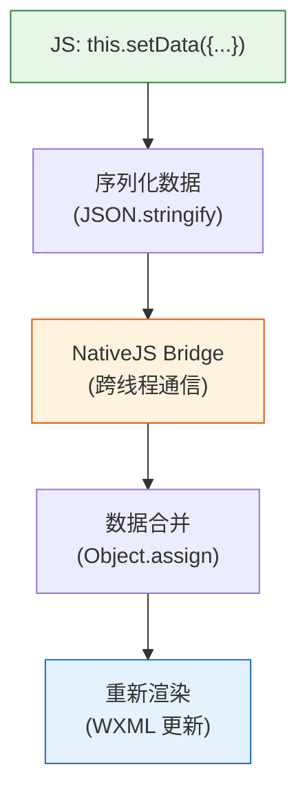

# 02. WXML 速成：微信的 HTML 长什么样

WXML（WeiXin Markup Language）是小程序的页面结构语言。它看起来像 HTML，但它的设计目标完全不同——HTML 用来描述任意网页结构，WXML 用来描述**受限的、声明式的、数据驱动的界面**。

学习 WXML 的核心，是掌握它与 HTML 的三个本质差异：**数据驱动**、**模板复用**、**组件化**。

> **环境：** 微信开发者工具 latest，小程序基础库 3.x

---

## 1. 数据绑定：{{}} 语法

WXML 不允许直接操作 DOM，所有视图变化必须通过数据驱动。

```html
<!-- pages/index/index.wxml -->

<!-- 基本数据绑定 -->
<text>{{message}}</text>

<!-- 表达式运算 -->
<text>{{a + b}}</text>

<!-- 三元运算 -->
<text>{{flag ? '显示' : '隐藏'}}</text>

<!-- 字符串拼接 -->
<text>{{'编号：' + id}}</text>

<!-- 调用方法 -->
<text>{{formatTime(timestamp)}}</text>

<!-- 逻辑运算 -->
<text wx:if="{{count > 0}}">{{count}}</text>
```

对应的 JS：

```javascript
// pages/index/index.js
Page({
  data: {
    message: "Hello World",
    a: 1,
    b: 2,
    flag: true,
    id: 1001,
    count: 5,
    timestamp: Date.now(),
  },

  formatTime(ts) {
    const date = new Date(ts);
    return `${date.getHours()}:${date.getMinutes()}`;
  },
});
```

> **核心原则**：`{{}}` 内部可以放**任何 JS 表达式**，但不能直接调用 `this`，不能写 `if` 语句（用 `wx:if`）。

---

## 2. 条件渲染：wx:if vs hidden

两个条件渲染指令有本质区别：

```html
<!-- wx:if：完全不渲染（DOM 中不存在） -->
<view wx:if="{{isLoggedIn}}">
  <text>欢迎回来，{{username}}</text>
</view>

<!-- wx:elif / wx:else -->
<view wx:if="{{role === 'admin'}}">管理员面板</view>
<view wx:elif="{{role === 'user'}}">用户面板</view>
<view wx:else>游客视图</view>

<!-- hidden：渲染但隐藏（display: none） -->
<view hidden="{{!isLoggedIn}}">
  <text>请先登录</text>
</view>
```

| 特性 | `wx:if` | `hidden` |
|------|---------|---------|
| DOM 存在性 | 不存在（条件为 false 时） | 始终存在 |
| 渲染成本 | 切换时重新创建/销毁 | 仅切换显示状态 |
| 切换频率 | 低频（适合偶尔切换） | 高频（适合频繁切换） |
| 初始开销 | 高（需要创建 DOM） | 低 |

> **实战经验**：如果是登录/未登录这种低频切换，用 `wx:if`；如果是列表中的展开/收起，用 `hidden`。

---

## 3. 列表渲染：wx:for

### 3.1 基础用法

```html
<!-- wx:for 遍历数组 -->
<view wx:for="{{items}}" wx:key="id">
  {{index + 1}}. {{item.name}} - {{item.price}}元
</view>

<!-- wx:for-index 和 wx:for-item：自定义索引和变量名 -->
<view wx:for="{{items}}"
      wx:for-index="i"
      wx:for-item="product"
      wx:key="product.id">
  {{i + 1}}. {{product.name}}
</view>

<!-- 遍历对象（不推荐，顺序不保证） -->
<view wx:for="{{obj}}" wx:key="{{index}}">
  {{index}}: {{item}}
</view>
```

> **wx:key 的重要性**：`wx:key` 告诉小程序如何高效地追踪列表项的变化。没有 `wx:key` 时，列表项变化会导致整个列表重新渲染；有 `wx:key` 则只更新变化的项。

### 3.2 wx:key 的两种写法

```html
<!-- 绑定唯一 ID（推荐） -->
<view wx:for="{{products}}" wx:key="id">

<!-- 使用 *this（当数组项是字符串或数字时） -->
<view wx:for="{{tags}}" wx:key="*this">
```

### 3.3 多层嵌套循环

```javascript
// 典型场景：分类 + 商品
Page({
  data: {
    categories: [
      {
        name: "水果",
        items: [
          { id: 1, name: "苹果", price: 5 },
          { id: 2, name: "香蕉", price: 3 },
        ],
      },
      {
        name: "饮料",
        items: [
          { id: 3, name: "可乐", price: 3 },
        ],
      },
    ],
  },
});
```

```html
<view wx:for="{{categories}}" wx:key="name">
  <view class="category-title">{{item.name}}</view>
  <view wx:for="{{item.items}}"
        wx:for-item="goods"
        wx:key="id">
    {{goods.name}} - {{goods.price}}元
  </view>
</view>
```

---

## 4. 模板复用：import 和 include

### 4.1 import：引用独立模板

```html
<!-- templates/card.wxml -->
<template name="productCard">
  <view class="card">
    <image src="{{image}}" mode="aspectFill"/>
    <text>{{title}}</text>
    <text class="price">¥{{price}}</text>
  </view>
</template>
```

```html
<!-- pages/index/index.wxml -->
<!-- 1. 引入模板文件 -->
<import src="/templates/card.wxml"/>

<!-- 2. 使用模板，传入数据 -->
<template is="productCard" data="{{...product}}"/>

<!-- 3. 批量渲染 -->
<block wx:for="{{products}}">
  <template is="productCard" data="{{...item}}"/>
</block>
```

### 4.2 include：直接拷贝代码

```html
<!-- header.wxml -->
<view class="header">
  <text>标题</text>
</view>
```

```html
<!-- pages/index/index.wxml -->
<!-- include 会把目标文件的整个 wxml 内容拷贝到当前位置 -->
<include src="/components/header.wxml"/>

<view class="content">页面内容</view>

<include src="/components/footer.wxml"/>
```

> **import vs include 的区别**：import 只引入 `<template>` 标签内的内容；include 把整个文件的 wxml 代码原样复制。

---

## 5. 事件系统：bind 和 catch

事件绑定是小程序交互的核心。

### 5.1 基础事件类型

| 事件类型 | 触发时机 |
|---------|---------|
| `tap` | 点击（300ms 内 touchstart + touchend） |
| `longpress` | 长按（350ms 后触发，优于 longtap） |
| `touchstart` | 手指触摸开始 |
| `touchmove` | 手指触摸后移动 |
| `touchend` | 手指触摸结束 |
| `touchcancel` | 触摸被中断（如来电） |
| `input` | 输入框输入（对应原生 `input` 事件） |
| `change` | 输入框输入完成（对应原生 `change` 事件） |

### 5.2 bindtap vs catchtap

```html
<!-- bind：冒泡事件（事件向上传播） -->
<view bindtap="handleTap">
  <view bindtap="handleInner">
    点我
  </view>
</view>

<!-- catch：阻止冒泡（事件在此处停止传播） -->
<view bindtap="handleOuter">
  <view catchtap="handleInner">
    点我（不会触发 handleOuter）
  </view>
</view>

<!-- capture-bind / capture-catch：捕获阶段 -->
<view capture-bind:tap="handleCapture">
  <view capture-catch:tap="handleCaptureStop">
    先触发 handleCaptureStop，不会触发 handleCapture
  </view>
</view>
```

### 5.3 获取事件详细信息

```javascript
Page({
  handleTap(e) {
    // e.detail：事件携带的数据
    console.log("当前组件 dataset：", e.currentTarget.dataset);
    // dataset：wxml 上 data-* 自定义属性的集合
    // timestamp：事件触发时间戳
    // touches：触摸点信息
  },

  handleInput(e) {
    console.log("输入值：", e.detail.value);
  },

  handleFormSubmit(e) {
    // 表单提交时，所有表单数据都在 detail.value 中
    console.log("表单数据：", e.detail.value);
  },
});
```

### 5.4 事件传参的正确姿势

小程序没有 Vue 的 `$emit`，传参靠 `data-` 属性：

```html
<!-- wxml：通过 data-* 传递参数 -->
<button wx:for="{{users}}"
        bindtap="handleDelete"
        data-id="{{item.id}}"
        data-name="{{item.name}}">
  删除 {{item.name}}
</button>
```

```javascript
// js：事件处理函数中读取
handleDelete(e) {
  const { id, name } = e.currentTarget.dataset;
  console.log(`删除用户：${name}，ID：${id}`);
},
```

---

## 6. WXML 渲染管线流程图



---

## 7. 常用内置组件

| 组件 | 用途 | 注意事项 |
|------|------|---------|
| `view` | 容器（相当于 div） | 建议用 flex 布局 |
| `text` | 文本 | 只有它支持 `selectable` 属性 |
| `image` | 图片 | 必须设置宽高，否则 0×0 |
| `scroll-view` | 可滚动容器 | 必须指定高度 |
| `swiper` | 轮播图 | 需配合 `swiper-item` 使用 |
| `navigator` | 页面链接 | 类似 `<a>` |
| `button` | 按钮 | 有开放能力（open-type） |
| `input` | 输入框 | type 属性决定键盘类型 |
| `textarea` | 多行输入 | fixed 定位有坑 |
| `picker` | 选择器 | 联动选择需自己实现 |
| `map` | 地图 | 需要申请腾讯地图 key |

### 7.1 image 组件的 mode 属性

```html
<!-- aspectFill：保持比例，裁剪填满（最常用） -->
<image src="{{img}}" mode="aspectFill" style="width:200rpx;height:200rpx;"/>

<!-- aspectFit：保持比例，完整显示 -->
<image src="{{img}}" mode="aspectFit"/>

<!-- widthFix：宽度固定，高度自适应 -->
<image src="{{img}}" mode="widthFix"/>

<!-- scaleToFill：不保持比例，强制拉伸填满 -->
<image src="{{img}}" mode="scaleToFill"/>
```

> **实战建议**：列表图片统一用 `aspectFill` + 固定宽高，商品详情大图用 `aspectFit`。

---

## 8. 常见坑点

**1. wx:for 中的 wx:key 写成了字符串**

```html
<!-- 错误：wx:key="id" 会被当作字面字符串 "id" -->
<view wx:for="{{items}}" wx:key="id">

<!-- 正确：wx:key="id" 在模板中会被解析为变量 id -->
<view wx:for="{{items}}" wx:key="id">
```

**2. setData 更新数组时直接用索引修改**

```javascript
// 错误：直接改索引，渲染层感知不到
this.data.items[0].name = "新名字";
this.setData({ items: this.data.items }); // 仍然可能不更新

// 正确：创建新引用
const items = [...this.data.items];
items[0] = { ...items[0], name: "新名字" };
this.setData({ items });
```

**3. 在 WXML 中调用方法时忘记 bind this**

```html
<!-- 如果方法需要访问 this.data，必须在 JS 中用箭头函数 -->
<button bindtap="handleTap">点我</button>
```

```javascript
// 错误写法
handleTap() {
  this.setData({ ... }); // this 指向 undefined
}

// 正确写法：在 Page 构造器中使用箭头函数
Page({
  data: {},
  handleTap: () => {
    this.setData({ ... }); // 箭头函数保持 this 引用
  },
});
```

**4. textarea 在 iOS 和 Android 表现不一致**

textarea 的 `fixed` 模式在 iOS 上会随页面滚动，在 Android 上是固定的。这是微信的已知问题，没有完美解决方案，通常通过 CSS 条件编译处理。

---

## 延伸思考

WXML 的设计哲学可以总结为三个字：**受限的**。受限带来安全，但也带来工程上的权衡。

比如 `wx:for` 缺少 `trackBy`（类似 Vue 的 `:key` 支持函数），导致复杂列表的更新性能不如 Vue 的虚拟 DOM。但另一方面，WXML 的更新是直接命令式的（`setData` 触发精确更新），而不是 Vue 的"响应式追踪 + 批量更新"，两者各有优劣。

理解这个权衡，才能在小程序中写出真正高效的代码——不是避免用 `wx:for`，而是理解它的性能模型，在正确的场景用它。

---

## 总结

- `{{}}` 数据绑定：支持表达式，不支持语句
- `wx:if`（不渲染）vs `hidden`（display:none）：根据切换频率选择
- `wx:for` + `wx:key`：列表渲染的标准组合
- `bindtap`（冒泡）vs `catchtap`（阻止冒泡）：根据交互需求选择
- 事件传参：靠 `data-*` 属性 + `e.currentTarget.dataset`
- `import` 只引入模板，`include` 拷贝全部 wxml

---

## 参考

- [WXML 官方文档](https://developers.weixin.qq.com/miniprogram/dev/framework/view/wxml/)
- [WXSS 官方文档](https://developers.weixin.qq.com/miniprogram/dev/framework/view/wxss.html)
- [weui-wxss 组件库](https://github.com/Tencent/weui-wxss)

---

**下一篇**进入 **WXSS 速成：微信的 CSS 改造版**——rpx 适配、flexbox 注意事项、样式隔离。
