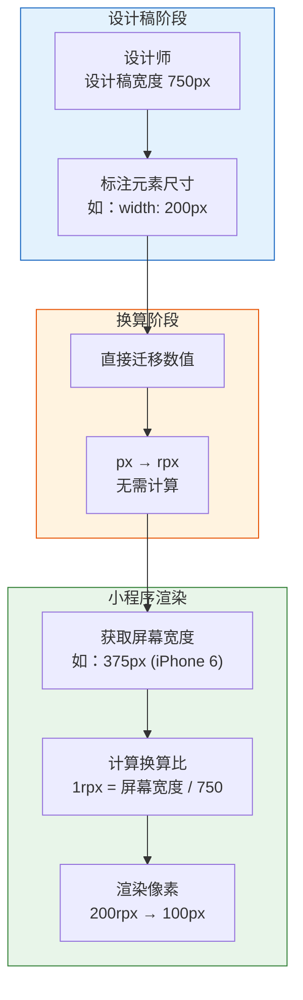
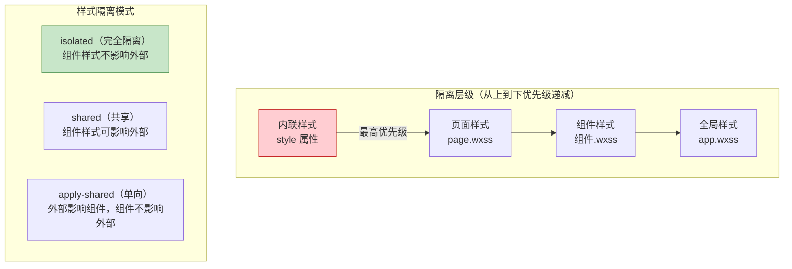

# 03. WXSS 速成：微信的 CSS 改造版

WXSS（WeiXin Style Sheets）是微信对 CSS 的扩展和改进。它保留了 CSS 的核心语法，增加了 `rpx` 响应式单位、全局样式、样式导入等小程序特有能力，同时**删除了**部分 CSS 能力（如 `*` 通配符选择器）。

学 WXSS 的核心，是理解它与标准 CSS 的差异，以及如何用 CSS 的思维写出适配良好的小程序样式。

> **环境：** 微信开发者工具 latest，小程序基础库 3.x

---

## 1. rpx 响应式单位：设计稿适配的核心

### 1.1 rpx 的换算原理

rpx 是小程序独有的响应式像素单位。它根据屏幕宽度自动换算，确保设计稿标注的数值直接可用。

```css
/* 设计稿标注宽度：750px（iPhone 6 标准）
   1rpx = 750px / 750 = 1px (iPhone 6 上)
   1rpx = 屏幕宽度 / 750
*/

/* 设计稿标注：100px → 直接写 100rpx */
.card {
  width: 100rpx;
  height: 100rpx;
  padding: 24rpx;
  margin: 16rpx;
  font-size: 28rpx;
}
```

| 设备 | 屏幕宽度 | 750rpx 实际宽度 | 1rpx = ? px |
|------|---------|----------------|-------------|
| iPhone 5 | 320px | 320px | 0.426px |
| iPhone 6 | 375px | 375px | 0.5px |
| iPhone 12 | 390px | 390px | 0.52px |
| iPhone 14 Pro Max | 430px | 430px | 0.573px |
| iPad Mini | 744px | 744px | 0.992px |

### 1.2 rpx 换算流程图



### 1.3 设计稿换算实战

设计师通常使用 2x 或 3x 图：
- 设计稿：750px 宽度（对应 iPhone 6）
- 标注值：物理像素值（如 200px）
- 小程序：直接使用标注值（200rpx = 200px @ 375w 屏幕）

```css
/* 典型移动端页面布局 */
.container {
  padding: 32rpx;
}

.list-item {
  display: flex;
  align-items: center;
  padding: 24rpx 32rpx;
  border-bottom: 1rpx solid #eee; /* 细线分隔 */
}

.list-item .avatar {
  width: 96rpx;   /* 48px @ 2x 设计稿 */
  height: 96rpx;
  border-radius: 50%;
  margin-right: 24rpx;
}

.list-item .info {
  flex: 1;
  display: flex;
  flex-direction: column;
}

.list-item .name {
  font-size: 32rpx;  /* 16px @ 2x 设计稿 */
  color: #333;
  margin-bottom: 8rpx;
}

.list-item .desc {
  font-size: 24rpx;  /* 12px @ 2x 设计稿 */
  color: #999;
}
```

---

## 2. @import 导入与样式分层

### 2.1 样式文件组织

```
pages/
├── index/
│   ├── index.wxss          # 页面私有样式（仅对当前页面生效）
│   ├── index.js
│   ├── index.wxml
│   └── index.json
├── detail/
│   └── detail.wxss         # 另一个页面的样式
└── ...
components/
└── my-header/
    └── my-header.wxss      # 组件样式
```

### 2.2 样式优先级

```
内联样式（style 属性） > 页面样式（page.wxss） > 组件样式（组件.wxss） > 全局样式（app.wxss）
```

> **注意**：组件有样式隔离机制（默认 `isolated`），组件内的样式不会影响外部。

### 2.3 @import 导入公共样式

```css
/* app.wxss：全局公共样式 */
@import "./styles/common.wxss";
@import "./styles/variables.wxss";

page {
  font-family: -apple-system, BlinkMacSystemFont, sans-serif;
  font-size: 28rpx;
  color: #333;
  background-color: #f5f5f5;
}
```

```css
/* pages/index/index.wxss */
@import "../../styles/mixins.wxss";

/* 页面私有样式 */
.index-container {
  padding: 32rpx;
}
```

---

## 3. flexbox 布局：小程序的万能布局方案

小程序推荐使用 flexbox 进行布局，比传统的 `block` + `float` 更加强大和可控。

### 3.1 flex 基础

```css
/* app.wxss */
page {
  /* 小程序的根容器默认是 block，需要手动设为 flex */
}

/* 垂直居中 */
.center {
  display: flex;
  justify-content: center;
  align-items: center;
}

/* 水平两端对齐 */
.between {
  display: flex;
  justify-content: space-between;
  align-items: center;
}

/* 垂直水平居中 */
.middle {
  display: flex;
  flex-direction: column;
  justify-content: center;
  align-items: center;
}
```

### 3.2 flex-wrap 换行

```css
/* 商品网格（两列布局） */
.goods-grid {
  display: flex;
  flex-wrap: wrap;
  padding: 16rpx;
}

.goods-item {
  width: 50%;        /* 两列 */
  box-sizing: border-box;
  padding: 16rpx;
}

.goods-item:nth-child(odd) {
  padding-right: 8rpx;
}

.goods-item:nth-child(even) {
  padding-left: 8rpx;
}
```

### 3.3 flex 属性速查

```css
.item {
  /* flex-grow: 扩展比例（默认 0，不扩展） */
  flex: 1;           /* = flex: 1 1 0% */

  /* flex-shrink: 收缩比例（默认 1，可收缩） */
  flex-shrink: 0;    /* 固定宽度，不收缩 */

  /* flex-basis: 基准大小 */
  flex-basis: 200rpx;

  /* 简写 */
  flex: 1;           /* 等分剩余空间 */
  flex: 0 0 200rpx;  /* 固定宽度 */
  flex: 0 1 200rpx;  /* 可收缩 */
}
```

---

## 4. 常用 UI 样式模式

### 4.1 卡片样式

```css
/* pages/index/index.wxss */
.card {
  background-color: #ffffff;
  border-radius: 16rpx;
  padding: 24rpx;
  margin: 16rpx;
  box-shadow: 0 2rpx 12rpx rgba(0, 0, 0, 0.08);
}

.card-title {
  font-size: 32rpx;
  font-weight: bold;
  color: #333;
  margin-bottom: 16rpx;
}

.card-content {
  font-size: 28rpx;
  color: #666;
  line-height: 1.6;
}
```

### 4.2 按钮样式

```css
/* 全局按钮样式 */
.btn {
  height: 80rpx;
  line-height: 80rpx;
  border-radius: 8rpx;
  font-size: 28rpx;
  text-align: center;
  margin: 24rpx 32rpx;
}

.btn-primary {
  background-color: #07C160;
  color: #ffffff;
}

.btn-default {
  background-color: #ffffff;
  color: #333;
  border: 1rpx solid #ddd;
}

.btn-disabled {
  background-color: #cccccc;
  color: #ffffff;
}

/* 按压反馈 */
.btn:active {
  opacity: 0.8;
  transform: scale(0.98);
}
```

### 4.3 文字省略

```css
/* 单行省略 */
.single-line {
  overflow: hidden;
  text-overflow: ellipsis;
  white-space: nowrap;
}

/* 两行省略（需配合 wx:if） */
.two-lines {
  overflow: hidden;
  text-overflow: ellipsis;
  display: -webkit-box;
  -webkit-line-clamp: 2;
  -webkit-box-orient: vertical;
}
```

---

## 5. 样式隔离层级图

样式在小程序中有严格的隔离层级，理解这个层级才能写出正确的样式覆盖：



---

## 6. 样式隔离与组件

### 5.1 组件样式隔离

默认情况下，组件样式只对组件自身生效，不会污染页面和其他组件：

```css
/* components/my-card/my-card.wxss */

/* 这个 .title 只对组件内的 .title 生效 */
.title {
  font-size: 32rpx;
  color: #333;
}

/* 使用 :host 可以选中组件根元素 */
:host {
  display: block;
  background-color: #fff;
}
```

### 5.2 外部样式类

有时候需要从页面传入样式来覆盖组件内部样式：

```javascript
// components/my-badge/my-badge.js
Component({
  externalClasses: ['my-class'],  // 声明外部样式类
  properties: {
    text: String,
  },
});
```

```html
<!-- 页面 wxml -->
<my-badge text="99+" my-class="custom-badge"/>
```

```css
/* 页面 wxss */
.custom-badge {
  color: red !important;  /* 覆盖组件样式 */
  font-size: 24rpx;
}
```

---

## 7. 图标方案对比

| 方案 | 优点 | 缺点 | 适用场景 |
|------|------|------|---------|
| icon 组件 | 原生、性能好 | 图标有限（仅 9 个基础图标） | 简单场景 |
| iconfont (font-class) | 图标丰富、颜色可控 | 需要下载字体文件 | 多数场景 |
| SVG inline | 清晰、可动态修改颜色 | 代码量大、缓存差 | 少量图标 |
| Base64 image | 无请求 | 包体积大、无法批量换色 | 固定图标 |
| CDN 图片 | 无包体积压力 | 依赖网络 | 运营类图标 |

```html
<!-- 方案一：iconfont (推荐) -->
<!-- 1. 在 iconfont.cn 生成字体文件 -->
<!-- 2. 在 app.wxss 引入：@import "./fonts/iconfont.wxss"; -->
<text class="iconfont icon-home"></text>

<!-- 方案二：CDN 图片 (运营图标) -->
<image src="https://example.com/icon-promo.png"
       mode="aspectFit"
       class="promo-icon"/>
```

---

## 8. 暗黑模式适配

### 7.1 系统级暗黑模式

```css
/* app.wxss */

/* 亮色模式（默认） */
page {
  background-color: #ffffff;
  color: #333333;
}

/* 暗黑模式 */
@media preprocessor-theme-dark {
  page {
    background-color: #1a1a1a;
    color: #e0e0e0;
  }

  .card {
    background-color: #2a2a2a;
  }
}
```

### 7.2 手动切换暗黑模式

```javascript
// app.js
App({
  onLaunch() {
    // 监听系统主题变化
    wx.onThemeChange((res) => {
      this.globalData.isDark = res.theme === 'dark';
      // 通知所有页面更新主题
    });
  },
});
```

```css
/* 使用 CSS 变量简化主题切换 */
page {
  --bg-color: #ffffff;
  --text-color: #333333;
  --border-color: #eeeeee;
}

@media preprocessor-theme-dark {
  page {
    --bg-color: #1a1a1a;
    --text-color: #e0e0e0;
    --border-color: #333333;
  }
}

.card {
  background-color: var(--bg-color);
  color: var(--text-color);
  border-color: var(--border-color);
}
```

---

## 9. 常见坑点

**1. flex 子元素不换行**

```css
/* 错误：flex 默认 nowrap，子元素会被压缩 */
.container {
  display: flex;
}

/* 正确：显式声明换行 */
.container {
  display: flex;
  flex-wrap: wrap; /* 必须加这行 */
}
```

**2. image 组件没有宽高导致布局抖动**

```html
<!-- 错误：图片未加载时容器高度为 0，图片加载后页面跳动 -->
<image src="{{img}}"/>

<!-- 正确：预留固定宽高或 aspectRatio -->
<image src="{{img}}"
       mode="aspectFill"
       style="width: 200rpx; height: 200rpx;"/>

<!-- 或者用 aspectRatio 保留比例 -->
<image src="{{img}}"
       mode="widthFix"
       style="width: 100%;"/>
```

**3. scroll-view 必须设置高度**

```html
<!-- 错误：没有高度，scroll-view 不会生效 -->
<scroll-view scroll-y>
  <view>内容...</view>
</scroll-view>

<!-- 正确：给 scroll-view 设置固定或 calc 高度 -->
<scroll-view scroll-y style="height: 100vh;">
  <view>内容...</view>
</scroll-view>
```

**4. rpx 精度问题导致 1px 线条消失**

```css
/* 在某些大屏设备上，1rpx 可能渲染为 0.5px 以下，被系统忽略 */
.border {
  border-bottom: 1rpx solid #eee; /* 消失 */
}

/* 解决方案：用 2rpx，或者用阴影代替 */
.border {
  border-bottom: 2rpx solid #eee;
  /* 或 */
  box-shadow: 0 1rpx 0 #eee;
}
```

**5. 小程序不支持通配符选择器**

```css
/* 错误：小程序不支持 * 通配符 */
* {
  box-sizing: border-box;
}

/* 正确：使用 page 作为根选择器 */
page {
  box-sizing: border-box;
}
```

---

## 延伸思考

WXSS 的设计哲学是**做减法**：删除了通配符选择器、动画 `from/to` 语法（改用 JS 控制），换来的是更可预测的样式行为和更好的性能。

但这也意味着小程序中几乎所有**复杂动画**都需要通过 JS 或 Canvas 实现，不能用纯 CSS keyframes 完成。下一篇讲组件系统时会涉及到这个限制的工程解法——如何用 `animation` 属性配合 WXML 模板，实现流畅的过渡动画。

rpx 虽然方便，但它的本质是一个**线性缩放模型**。在超宽屏（折叠屏、平板）上，rpx 的换算会导致文字和按钮过大。生产级小程序通常会设置一个最大宽度限制（`max-width`），在平板等设备上保持合理的布局。

---

## 总结

- **rpx** 是响应式核心：设计稿 750px 宽度，标注值直接迁移
- **flexbox** 是推荐布局方案，配合 `flex-wrap` 实现多列布局
- **样式隔离**：组件默认 isolated，外部样式通过 `externalClasses` 注入
- **暗黑模式**：`@media preprocessor-theme-dark` + CSS 变量实现系统级适配
- **小程序不支持 `*` 通配符**，`box-sizing` 需在 `page` 上设置

---

## 参考

- [WXSS 官方文档](https://developers.weixin.qq.com/miniprogram/dev/framework/view/wxss.html)
- [CSS 属性兼容性列表](https://developers.weixin.qq.com/miniprogram/dev/framework/view/css.html)
- [weui-wxss 视觉组件库](https://github.com/Tencent/weui-wxss)

---

**下一篇**进入 **JavaScript 逻辑层：App / Page / Component 构造器**——小程序的 JS 环境特性与 App/Page/Component 的本质。
