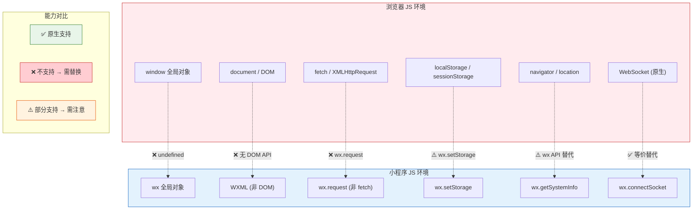

# 04. JavaScript 环境：被阉割过的 JavaScript

小程序运行在微信客户端内置的 JavaScript 引擎中——不是浏览器 V8，而是 iOS 用 JavaScriptCore、Android 用 V8。这个环境支持 ES6+ 语法，但**完全不支持浏览器 BOM/DOM API**（`window`、`document`、`location`、`fetch` 统统不存在）。

这是小程序和 H5 的本质区别之一。理解了这个差异，就理解了很多"为什么 H5 代码在小程序里跑不了"的问题。

> **环境：** 微信开发者工具 latest，小程序基础库 3.x

---

## 1. 小程序 JS 环境 vs 浏览器环境

### 1.1 被移除的全局对象

```javascript
// 以下这些在浏览器中存在的全局对象，小程序中不存在
typeof window        // "undefined"
typeof document      // "undefined"
typeof location      // "undefined"
typeof fetch         // "undefined"
typeof XMLHttpRequest // "undefined"
typeof localStorage  // "undefined"（Storage API 是 wx.xxx，不是全局对象）
```

### 1.2 小程序 JS vs 浏览器 JS 能力对比图



### 1.3 微信提供的替代 API

| 浏览器 API | 小程序替代 | 说明 |
|-----------|-----------|------|
| `window` | `wx` 全局对象 | 所有微信 API 挂载在 wx 下 |
| `fetch` / `axios` | `wx.request()` | 网络请求 |
| `localStorage` | `wx.setStorage()` / `wx.getStorage()` | 本地存储 |
| `location.href` | `wx.navigateTo()` / `wx.redirectTo()` | 页面跳转 |
| `alert` / `prompt` | `wx.showToast()` / `wx.showModal()` | 交互提示 |
| `setTimeout` / `setInterval` | 同标准 JS，全局可用 | 定时器可用 |
| `console` | 同标准，可使用 | 支持 log/warn/error |

```javascript
// 小程序中的典型代码模式
wx.showLoading({ title: '加载中...' });

wx.request({
  url: 'https://api.example.com/data',
  success(res) {
    console.log('数据：', res.data);
    wx.hideLoading();
  },
  fail(err) {
    wx.showToast({ title: '请求失败', icon: 'none' });
  },
});
```

---

## 2. App() / Page() / Component() 构造器

小程序使用构造器模式创建应用、页面和组件，而不是 ES6 class。这套 API 脱胎于早期微信设计（2017年），虽然后续支持了 Component构造器，但 Page() 模式至今仍被广泛使用。

### 2.1 App() 全局构造器

```javascript
// app.js
App({
  // 全局数据（所有页面和组件都可以通过 getApp() 访问）
  globalData: {
    userInfo: null,
    apiBase: 'https://api.example.com',
    token: '',
  },

  // 小程序初始化完成（仅触发一次）
  onLaunch() {
    console.log('小程序启动了');
    // 检查登录态
    this.checkLoginStatus();
    // 获取设备信息
    this.getSystemInfo();
  },

  // 小程序从后台切到前台
  onShow(options) {
    console.log('小程序显示了', options);
  },

  // 小程序从前台切到后台
  onHide() {
    console.log('小程序隐藏了');
    // 保存状态
  },

  // JS 报错时触发
  onError(err) {
    console.error('Error:', err);
  },

  // 打开的页面不存在
  onPageNotFound(res) {
    wx.redirectTo({ url: '/pages/index/index' });
  },

  // ===== 自定义方法 =====
  checkLoginStatus() {
    const token = wx.getStorageSync('token');
    if (token) {
      this.globalData.token = token;
    }
  },

  getSystemInfo() {
    wx.getSystemInfo({
      success: (res) => {
        this.globalData.systemInfo = res;
        this.globalData.isIphone = res.platform === 'ios';
      },
    });
  },
});
```

```javascript
// 在任意页面或组件中获取全局实例
const app = getApp();
console.log(app.globalData.userInfo);
console.log(app.globalData.apiBase);
```

### 2.2 Page() 页面构造器

```javascript
// pages/index/index.js
Page({
  // 页面初始数据（类似 React useState 的初始值）
  data: {
    title: '首页',
    list: [],
    loading: false,
    userInfo: null,
  },

  // 页面加载时触发（类似 componentDidMount）
  onLoad(query) {
    // query: 页面启动参数，如从分享链接进入时传递的参数
    console.log('页面参数:', query);
    this.loadData();
  },

  // 页面初次渲染完成
  onReady() {
    // DOM 树已构建，可以操作 WXML 了
    // 适合：获取元素尺寸、启动动画
    this.getElementRect();
  },

  // 页面显示（每次进入都会触发）
  onShow() {
    // 从其他页面返回时刷新数据
    if (this.data.needRefresh) {
      this.loadData();
    }
  },

  // 页面隐藏
  onHide() {
    // 暂停轮播、停止录音等
  },

  // 页面卸载
  onUnload() {
    // 清理定时器、解绑事件监听
    if (this.timer) {
      clearInterval(this.timer);
    }
  },

  // 下拉刷新（需在 page.json 开启 enablePullDownRefresh）
  onPullDownRefresh() {
    this.loadData().finally(() => {
      wx.stopPullDownRefresh();
    });
  },

  // 上拉触底
  onReachBottom() {
    if (!this.data.loading) {
      this.loadMore();
    }
  },

  // 页面滚动
  onPageScroll(obj) {
    // obj.scrollTop: 滚动位置
  },

  // 分享
  onShareAppMessage(res) {
    if (res.from === 'button') {
      console.log('点击分享按钮');
    }
    return {
      title: '分享标题',
      path: '/pages/index/index?id=123',
      imageUrl: '/assets/share.jpg',
    };
  },

  // ===== 事件处理函数 =====
  handleTap() {
    // 更新数据，触发视图更新
    this.setData({ title: '新标题' });
  },

  // ===== 自定义方法 =====
  async loadData() {
    this.setData({ loading: true });
    try {
      const data = await fetchList();
      this.setData({ list: data, loading: false });
    } catch (err) {
      this.setData({ loading: false });
      wx.showToast({ title: '加载失败', icon: 'none' });
    }
  },
});
```

### 2.3 Component() 组件构造器

```javascript
// components/my-component/my-component.js
Component({
  // 组件的内部数据（与页面的 data 完全等价）
  data: {
    value: '',
  },

  // 组件属性（从外部传入，类似 React props）
  properties: {
    title: {
      type: String,
      value: '默认标题',
    },
    // 完整属性定义
    user: {
      type: Object,
      value: null,
      observer(newVal, oldVal) {
        // 属性变化时自动触发
        console.log('user changed:', newVal);
      },
    },
  },

  // 组件数据路径映射（用于性能优化）
  // 定义哪些 data 和 properties 会影响视图
  dataPaths: {
    'list[0].name': 'updateFirstItem',
  },

  // 组件生命周期（注意与页面生命周期不同）
  lifetimes: {
    created() {
      // 组件创建，数据和 methods 还没准备好
      // 可以添加事件 listeners
      console.log('组件 created');
    },
    attached() {
      // 组件进入页面节点树
      // 初始化数据
      console.log('组件 attached');
    },
    ready() {
      // 组件布局完成
      console.log('组件 ready');
    },
    moved() {
      // 组件被移动到新位置
    },
    detached() {
      // 组件从页面节点树移除
      // 清理定时器、事件监听
      console.log('组件 detached');
    },
  },

  // 所在页面的生命周期
  pageLifetimes: {
    show() {
      // 组件所在页面显示
    },
    hide() {
      // 组件所在页面隐藏
    },
  },

  // 组件方法（必须用箭头函数或手动 bind）
  methods: {
    handleTap() {
      // 修改组件自身数据
      this.setData({ value: 'new value' });
      // 触发自定义事件，通知父组件
      this.triggerEvent('customevent', { value: 'hello' });
    },
  },
});
```

---

## 3. 模块化：CommonJS vs ES Module

小程序支持两种模块系统：CommonJS（`module.exports` / `require`）和 ES Module（`export` / `import`）。但两者**不能混用**，且部分场景有坑。

### 3.1 CommonJS（小程序原生方式）

```javascript
// utils/math.js
const add = (a, b) => a + b;
const multiply = (a, b) => a * b;

module.exports = {
  add,
  multiply,
};
```

```javascript
// pages/index/index.js
const { add, multiply } = require('../../utils/math.js');
console.log(add(1, 2));      // 3
console.log(multiply(3, 4)); // 12
```

### 3.2 ES Module（需要 project.config.json 配置）

```json
{
  "setting": {
    "es6Modules": true
  }
}
```

```javascript
// utils/format.js
export const formatTime = (date) => {
  // ...
};
export default formatTime;
```

```javascript
// pages/index/index.js
import { formatTime } from '../../utils/format.js';
import formatTimeAlias from '../../utils/format.js';
formatTime(new Date());
```

### 3.3 常见坑点

```javascript
// 坑一：循环引用导致 undefined
// a.js
const { b } = require('./b.js');
module.exports = { name: 'a', b };

// b.js
const { name } = require('./a.js'); // a.js 还没导出完成，name 是 undefined
module.exports = { name: 'b', extra: name }; // extra 是 undefined
```

```javascript
// 坑二：相对路径写错（./utils 和 utils/ 不一样）
const utils = require('./utils');   // 正确：相对于当前文件
const utils = require('utils');      // 错误：尝试从 node_modules 加载

// 坑三：ES Module 和 CommonJS 混用报错
// utils.js
module.exports = { foo: 1 };        // CommonJS

// page.js
import { foo } from '../../utils';  // 编译时报错：无法混用
```

---

## 4. ES6+ 语法在小程序中的支持

小程序 JS 引擎对 ES6+ 支持良好，但需要注意转译和 polyfill 的问题。

### 4.1 支持的语法

```javascript
// 箭头函数
const add = (a, b) => a + b;

// Promise
const request = () => new Promise((resolve, reject) => {
  wx.request({
    url: '...',
    success: resolve,
    fail: reject,
  });
});

// async/await
async function fetchData() {
  try {
    const res = await request();
    return res.data;
  } catch (err) {
    console.error(err);
  }
}

// 解构赋值
const { name, age } = this.data.user;
const [first, ...rest] = [1, 2, 3, 4];

// class
class User {
  constructor(name) {
    this.name = name;
  }
  greet() {
    return `Hello, ${this.name}`;
  }
}

// 模板字符串
const html = `<div>${name} is ${age} years old</div>`;
```

### 4.2 不支持或需注意的 API

| 特性 | 状态 | 替代方案 |
|------|------|---------|
| `import()` 动态导入 | 部分支持 | 预加载分包 |
| `Symbol` | 支持 | 无 |
| `Proxy` | iOS 8+ / Android 部分支持 | 避免使用 |
| `BigInt` | 不支持 | 避免大数运算 |
| `fetch` | 不支持 | `wx.request()` |
| `WebSocket` | 支持（wx.connectSocket） | 无 |

---

## 5. 作用域与 this

小程序的作用域模型与标准 JavaScript 有微妙差异，理解它能避免大量调试时间。

### 5.1 Page/Component 中的 this

```javascript
// pages/index/index.js
Page({
  data: { value: 0 },

  handleClick() {
    // this === Page 实例，可以访问 setData、data
    console.log(this.data.value); // 0

    // 异步回调中的 this 陷阱
    wx.request({
      url: '...',
      success(res) {
        // 这里的 this !== Page 实例
        // 解决方案一：箭头函数
      },
    });

    // 解决方案：保存引用
    const that = this;
    wx.request({
      url: '...',
      success(res) {
        that.setData({ value: res.data.value }); // 正确
      },
    });
  },

  // 最佳实践：用箭头函数（推荐）
  handleClick: () => {
    // 箭头函数不会创建自己的 this
    // 所以这里的 this 在编译后会被正确绑定
  },
});
```

### 5.2 定时器管理

```javascript
Page({
  data: { time: 0 },
  timer: null,

  onLoad() {
    // 错误：定时器未保存引用，无法清理
    setInterval(() => {
      this.setData({ time: this.data.time + 1 });
    }, 1000);
  },

  onUnload() {
    // 错误：无法清理定时器
  },
});
```

```javascript
// 正确做法：保存定时器引用
Page({
  data: { time: 0 },
  timer: null,

  onLoad() {
    this.timer = setInterval(() => {
      this.setData({ time: this.data.time + 1 });
    }, 1000);
  },

  onHide() {
    if (this.timer) {
      clearInterval(this.timer);
      this.timer = null;
    }
  },

  onUnload() {
    // 清理工作放在 onHide 中，onUnload 也需要一份
    if (this.timer) {
      clearInterval(this.timer);
      this.timer = null;
    }
  },
});
```

---

## 6. TypeScript 全面支持（2026 年小程序标配）

微信开发者工具从 2022 年起全面支持 TypeScript，小程序项目可以无缝使用 TS 的类型系统。

### 6.1 为什么小程序要用 TypeScript

- **类型安全**：WXML 没有类型约束，TS 弥补这块短板
- **IDE 支持更好**：VS Code / WebStorm 自动补全，类型错误实时提示
- **重构安全**：改一个字段名，TS 自动追踪所有引用

### 6.2 tsconfig.json 配置

```json
{
  "compilerOptions": {
    "target": "ES2020",
    "module": "CommonJS",
    "strict": true,
    "esModuleInterop": true,
    "skipLibCheck": true,
    "moduleResolution": "node",
    "lib": ["ES2020"]
  },
  "include": ["**/*.ts"],
  "exclude": ["node_modules"]
}
```

### 6.3 Page / Component 的类型定义

```typescript
// types/miniprogram.d.ts

// 扩展 Page 的类型定义
interface IPageOptions<T extends Record<string, any> = any> {
  data?: T;
  onLoad?: (query?: Record<string, string>) => void;
  onShow?: () => void;
  onReady?: () => void;
  onHide?: () => void;
  onUnload?: () => void;
  onPullDownRefresh?: () => void;
  onReachBottom?: () => void;
  onPageScroll?: (obj: { scrollTop: number }) => void;
  onShareAppMessage?: (res: any) => { title: string; path: string; imageUrl?: string };
  [key: string]: any;
}

// 页面使用类型
type Page<D = any> = (options: IPageOptions<D> & ThisType<PageInstance<D>>) => void;

// 组件类型
interface IComponentOptions<T = any> {
  data?: T;
  properties?: Record<string, any>;
  methods?: Record<string, Function>;
  lifetimes?: Record<string, Function>;
  pageLifetimes?: Record<string, Function>;
  [key: string]: any;
}

type Component<D = any> = (options: IComponentOptions<D> & ThisType<ComponentInstance<D>>) => void;
```

### 6.4 带类型的页面示例

```typescript
// pages/index/index.ts

// 定义页面 Data 类型
interface IndexData {
  title: string;
  count: number;
  list: UserItem[];
  loading: boolean;
  userInfo: UserInfo | null;
}

// 定义页面方法
interface IndexMethods {
  onLoad: (query?: { id?: string }) => void;
  onShareAppMessage: () => ShareData;
  handleTap: () => void;
  fetchList: () => Promise<void>;
}

// 定义数据结构
interface UserItem {
  id: number;
  name: string;
  avatar: string;
}

interface UserInfo {
  id: string;
  name: string;
  role: 'admin' | 'user' | 'guest';
}

interface ShareData {
  title: string;
  path: string;
  imageUrl?: string;
}

// 完整类型化的 Page
const app = getApp<IAppOption>();

Page<Data, Methods>({
  data: {
    title: '首页',
    count: 0,
    list: [],
    loading: false,
    userInfo: null,
  } as IndexData,

  onLoad(query) {
    console.log('页面参数:', query?.id);
    this.fetchList();
  },

  handleTap() {
    this.setData({ count: this.data.count + 1 });
  },

  onShareAppMessage(): ShareData {
    return {
      title: this.data.title,
      path: `/pages/index/index?id=${this.data.userInfo?.id}`,
    };
  },

  async fetchList(): Promise<void> {
    this.setData({ loading: true });
    try {
      const res = await request<UserItem[]>({ url: '/api/list' });
      this.setData({ list: res });
    } finally {
      this.setData({ loading: false });
    }
  },
});

// 工具函数的类型安全
function request<T>(options: RequestOptions): Promise<T> {
  return new Promise((resolve, reject) => {
    wx.request({
      ...options,
      success: (res) => {
        if (res.statusCode === 200) {
          resolve(res.data as T);
        } else {
          reject(new Error(`HTTP ${res.statusCode}`));
        }
      },
      fail: reject,
    });
  });
}
```

### 6.5 组件的 TypeScript 写法

```typescript
// components/product-card/product-card.ts

// 组件 Props 类型
interface ProductCardProps {
  title: string;
  price: number;
  imageUrl: string;
  /** 商品 ID */
  productId: string;
  /** 点击回调 */
  onAddCart?: (productId: string, price: number) => void;
  /** 规格 */
  specs?: Spec[];
}

interface Spec {
  name: string;
  value: string;
}

interface ProductCardData {
  isCollected: boolean;
  imageLoaded: boolean;
}

interface ProductCardMethods {
  handleTap: () => void;
  handleAddCart: () => void;
  handleImageLoad: () => void;
}

// Component 泛型：Data、Properties、Methods
Component<ProductCardData, ProductCardProps, ProductCardMethods>({
  // 组件内部数据
  data: {
    isCollected: false,
    imageLoaded: false,
  },

  // 属性（带类型）
  properties: {
    title: String,
    price: Number,
    imageUrl: String,
    productId: String,
    onAddCart: null,
    specs: Array,
  },

  // 方法（带类型）
  methods: {
    handleTap() {
      // 触发父组件回调，带类型化参数
      this.triggerEvent('customevent', {
        productId: this.properties.productId as string,
      });
    },

    handleAddCart() {
      const { onAddCart, productId, price } = this.properties;
      if (onAddCart) {
        onAddCart(productId as string, price as number);
      }
    },

    handleImageLoad() {
      this.setData({ imageLoaded: true });
    },
  },
});
```

---

## 7. 常见坑点

**1. 在 onLoad 中同步读取 Storage 数据**

```javascript
// 错误：getStorageSync 会阻塞主线程
onLoad() {
  const token = wx.getStorageSync('token'); // 阻塞！
}

// 正确：用异步 API
onLoad() {
  wx.getStorage({
    key: 'token',
    success: (res) => {
      this.setData({ token: res.data });
    },
  });
}
```

**2. Component 中直接调用 this.triggerEvent 报错**

Component 实例不自动暴露 `triggerEvent` 给 `methods` 以外的属性。如果 Component 中有独立的普通函数（非 methods 中定义），需要显式调用。

```javascript
Component({
  methods: {
    handleTap() {
      this.triggerEvent('myevent', { data: 123 });
    },
  },
});
```

**3. 使用箭头函数定义 onLoad 等生命周期**

```javascript
// 错误：生命周期函数必须是普通函数
const onLoad = (query) => { ... };
Page({ onLoad }); // 框架不会正确绑定 this

// 正确：直接写在对象字面量中
Page({
  onLoad(query) {
    console.log(this); // 正确指向 Page 实例
  },
});
```

---

## 延伸思考

小程序 JS 环境的设计，本质上是"功能受控"。移除 `window` / `document` / `fetch` 等全局对象，目的是防止恶意代码通过这些 API 获取用户隐私或劫持页面。

但这也带来一个实际工程问题：**大量的 npm 包无法在小程序中直接使用**。比如 `lodash` 可以用（纯 JS），但 `axios` 不行（底层用 `XMLHttpRequest`），`dayjs` 可以用（纯日期计算）。

对于 npm 生态的态度应该是：**纯 JS 库优先，需要 polyfill 的库慎重，涉及 DOM/BOM 的库不考虑**。

---

## 总结

- 小程序 JS 环境不支持 `window` / `document` / `fetch`，使用 `wx.*` 替代
- `App()` / `Page()` / `Component()` 是三种独立的构造器，各自拥有独立的生命周期
- 定时器必须在 `onUnload` / `onHide` 中清理，否则会内存泄漏
- CommonJS 和 ES Module 不可以混用
- 箭头函数适合定义事件处理方法，但生命周期函数必须用普通函数

---

## 参考

- [微信小程序框架 API](https://developers.weixin.qq.com/miniprogram/dev/api/)
- [小程序 JS 运行时说明](https://developers.weixin.qq.com/miniprogram/dev/framework/runtime/js-runtime.html)
- [ES6 语法支持情况](https://developers.weixin.qq.com/miniprogram/dev/framework/details.html)

---

**下一篇**进入 **异步编程：wx.request 与网络请求封装**——Promise 化、请求拦截器、async/await 最佳实践。
