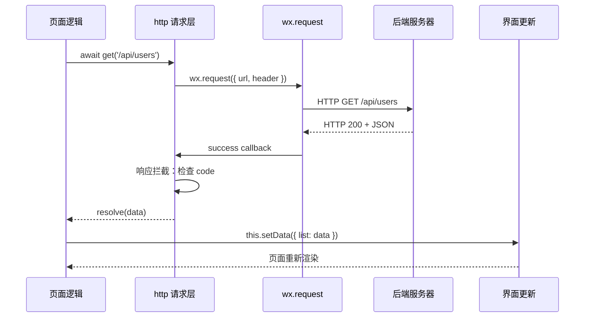
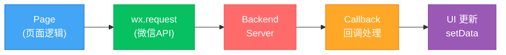
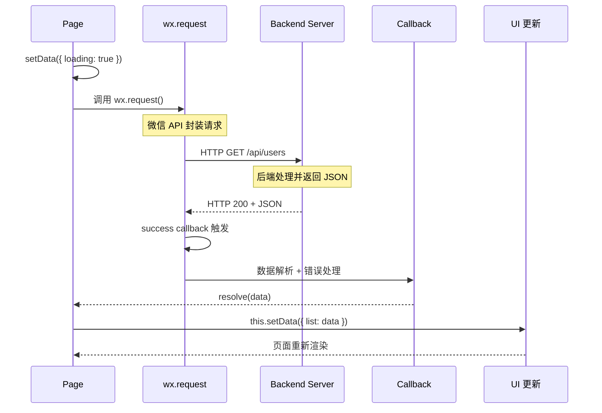
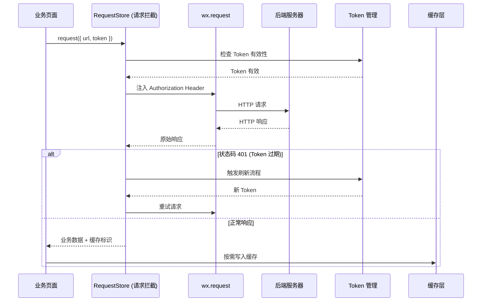

# 05. 异步编程：wx.request 与网络请求封装

小程序的网络请求 API `wx.request()` 基于回调模式，不支持 Promise。直接用回调写业务逻辑，很快就会陷入"回调地狱"——请求嵌套请求，错误处理散落各处，代码难以维护。

本篇的目标是：**把 wx.request 封装成一套完整的请求层**，包括 Promise 化、拦截器、自动管理 Token、错误统一处理。

> **环境：** 微信开发者工具 latest，小程序基础库 3.x

---

## 1. wx.request 基础回顾

### 1.1 基本用法

```javascript
wx.request({
  url: 'https://api.example.com/users',
  method: 'GET',
  data: { page: 1, size: 20 },
  header: {
    'content-type': 'application/json',
    'Authorization': 'Bearer ' + token,
  },
  success(res) {
    // res.statusCode: HTTP 状态码
    // res.data: 后端返回数据
    // res.header: 响应头
    if (res.statusCode === 200) {
      console.log('数据：', res.data);
    }
  },
  fail(err) {
    // 网络错误或请求被拦截
    console.error('请求失败：', err);
  },
  complete() {
    // 无论成功失败都会执行（类似 finally）
    wx.hideLoading();
  },
});
```

### 1.2 wx.request 的限制

```javascript
// 小程序请求有严格的安全限制：

// 1. 域名必须备案，且在小程序后台添加（开发阶段可关闭校验）
wx.request({
  url: 'https://api.example.com/data',
  // project.config.json 中设置 "urlCheck": false 可临时绕过
});

// 2. 单次请求超时时间（默认 60s）
wx.request({
  url: '...',
  timeout: 30000, // 30 秒超时
});

// 3. 并发请求数量限制（iOS 5个、Android 10个）
// 超出限制的请求会排队等待

// 4. POST 请求默认 content-type 是 application/x-www-form-urlencoded
// 如需 JSON，需要显式设置
wx.request({
  method: 'POST',
  header: { 'content-type': 'application/json' },
  data: JSON.stringify({ name: '张三', age: 18 }),
});
```

---

## 2. Promise 封装：告别回调地狱

### 2.1 基础 Promise 封装

```javascript
// utils/request.js

/**
 * Promise 化的 wx.request
 * @param {Object} options - 同 wx.request 参数
 * @returns {Promise}
 */
const request = (options) => {
  return new Promise((resolve, reject) => {
    wx.request({
      ...options,
      success: (res) => {
        if (res.statusCode >= 200 && res.statusCode < 300) {
          resolve(res.data);
        } else {
          reject(res);
        }
      },
      fail: (err) => {
        reject(err);
      },
    });
  });
};

export default request;
```

### 2.2 带错误码统一处理

```javascript
// utils/request.js

const CODE_SUCCESS = 0;
const CODE_UNAUTHORIZED = 401;

const request = (options) => {
  return new Promise((resolve, reject) => {
    wx.request({
      ...options,
      success: (res) => {
        const { statusCode, data } = res;

        if (statusCode >= 200 && statusCode < 300) {
          // 假设后端返回格式为 { code, data, message }
          if (data.code === CODE_SUCCESS) {
            resolve(data.data);
          } else if (data.code === CODE_UNAUTHORIZED) {
            // Token 过期，跳转登录
            handleUnauthorized();
            reject(data);
          } else {
            // 业务错误
            reject(data);
          }
        } else {
          reject({ message: `HTTP ${statusCode} 错误`, res });
        }
      },
      fail: (err) => {
        wx.showToast({
          title: '网络连接失败',
          icon: 'none',
          duration: 2000,
        });
        reject({ message: '网络错误', err });
      },
    });
  });
};

// 统一的未授权处理
const handleUnauthorized = () => {
  wx.removeStorageSync('token');
  wx.redirectTo({ url: '/pages/login/login' });
};

export default request;
```

---

## 3. 请求拦截器：全局 Loading + Token 注入

### 3.1 请求拦截器

```javascript
// utils/http.js

/**
 * 请求配置
 */
const config = {
  baseURL: 'https://api.example.com',
  timeout: 30000,
};

/**
 * 通用请求方法
 * @param {string} url - 请求路径
 * @param {Object} options - 请求选项
 */
const http = (url, options = {}) => {
  return new Promise(async (resolve, reject) => {
    // ========== 请求拦截：构建完整配置 ==========
    const token = wx.getStorageSync('token');
    const header = {
      'content-type': 'application/json',
      ...options.header, // 允许外部覆盖
    };

    // 自动注入 Token（如果有）
    if (token) {
      header['Authorization'] = `Bearer ${token}`;
    }

    // 全局 Loading（可选）
    if (options.showLoading !== false) {
      wx.showLoading({ title: '加载中...', mask: true });
    }

    const requestOptions = {
      url: url.startsWith('http') ? url : config.baseURL + url,
      method: options.method || 'GET',
      data: options.data || {},
      header,
      timeout: options.timeout || config.timeout,
    };

    // ========== 发起请求 ==========
    wx.request({
      ...requestOptions,
      success: (res) => {
        wx.hideLoading();

        // ========== 响应拦截：处理业务错误 ==========
        if (res.statusCode === 200) {
          const { code, data, message } = res.data;
          if (code === 0) {
            resolve(data);
          } else if (code === 401) {
            // Token 过期
            handleUnauthorized();
            reject({ code, message });
          } else {
            // 业务错误，显示后端返回的消息
            if (options.showError !== false) {
              wx.showToast({ title: message || '请求失败', icon: 'none' });
            }
            reject({ code, message });
          }
        } else {
          wx.showToast({ title: `服务器错误 (${res.statusCode})`, icon: 'none' });
          reject({ statusCode: res.statusCode });
        }
      },
      fail: (err) => {
        wx.hideLoading();
        wx.showToast({ title: '网络异常', icon: 'none' });
        reject({ message: '网络请求失败', err });
      },
    });
  });
};

// ========== 快捷方法 ==========
export const get = (url, data, options = {}) => {
  return http(url, { method: 'GET', data, ...options });
};

export const post = (url, data, options = {}) => {
  return http(url, { method: 'POST', data, ...options });
};

export const put = (url, data, options = {}) => {
  return http(url, { method: 'PUT', data, ...options });
};

export const del = (url, data, options = {}) => {
  return http(url, { method: 'DELETE', data, ...options });
};

export default http;
```

### 3.2 使用方式

```javascript
// pages/index/index.js
import { get, post } from '../../utils/http.js';

Page({
  data: {
    list: [],
    loading: false,
  },

  onLoad() {
    this.fetchList();
  },

  async fetchList() {
    this.setData({ loading: true });
    try {
      const data = await get('/api/users', { page: 1, size: 20 });
      this.setData({ list: data.list });
    } catch (err) {
      console.error('获取列表失败', err);
    } finally {
      this.setData({ loading: false });
    }
  },

  async submitForm() {
    try {
      const result = await post('/api/submit', {
        name: '张三',
        age: 18,
      });
      wx.showToast({ title: '提交成功' });
    } catch (err) {
      console.error('提交失败', err);
    }
  },
});
```

---

## 4. 异步请求的时序图



---

### 可视化：异步网络请求完整时序

下面通过图示展示 `wx.request` 异步请求的完整流程。

#### 请求流程架构图



#### 请求时序图



#### 完整请求流程动画

下方演示 `wx.request` 的完整请求过程：

下方时序图展示了 `wx.request` 封装后的完整请求流程：



#### 请求拦截器的三个职责

| 职责 | 实现位置 | 说明 |
|-----|---------|------|
| **请求拦截** | `RequestStore.interceptors.request` | 自动注入 Token、统一加签、挂载 `onShow` 回调 |
| **响应拦截** | `RequestStore.interceptors.response` | 401 自动刷新 Token 并重试、统一错误处理 |
| **缓存策略** | 业务层按需调用 | 列表页优先读缓存、详情页直发请求 |

> **说明**：请求拦截器利用了 `Promise` 的链式调用，`Promise.resolve(data)` 透传，`Promise.reject(error)` 触发错误处理分支。注意：只有状态码 401 才走 Token 刷新，500 类错误直接抛出不重试。


> **说明**：点击「下一步」逐步演示 wx.request 异步请求的完整流程；Promise 封装可以让回调写法更优雅。

---

## 6. 常见网络相关 API 补充

### 6.1 文件上传与下载

```javascript
// 上传文件
wx.chooseImage({
  count: 1,
  success(res) {
    const filePath = res.tempFilePaths[0];
    wx.uploadFile({
      url: 'https://api.example.com/upload',
      filePath,
      name: 'file',
      header: { Authorization: `Bearer ${token}` },
      success(res) {
        const data = JSON.parse(res.data);
        console.log('上传成功：', data.url);
      },
    });
  },
});

// 下载文件
wx.downloadFile({
  url: 'https://example.com/image.jpg',
  success(res) {
    // res.tempFilePath: 临时文件路径
    wx.saveImageToPhotosAlbum({
      filePath: res.tempFilePath,
      success() {
        wx.showToast({ title: '保存成功' });
      },
    });
  },
});
```

### 6.2 WebSocket 实时通信

```javascript
// 建立连接
wx.connectSocket({
  url: 'wss://api.example.com/ws',
  header: { Authorization: `Bearer ${token}` },
});

// 监听消息
wx.onSocketMessage((res) => {
  console.log('收到消息：', res.data);
  const data = JSON.parse(res.data);
  // 处理实时消息
});

// 发送消息
wx.sendSocketMessage({
  data: JSON.stringify({ type: 'ping' }),
});

// 断开连接
wx.closeSocket();
```

---

## 7. 常见坑点

**1. 请求参数 data 未序列化**

```javascript
// 错误：POST JSON 时没序列化
wx.request({
  method: 'POST',
  data: { name: '张三' }, // 默认被序列化为 key=value&key=value
});

// 正确：指定 content-type + 序列化
wx.request({
  method: 'POST',
  data: JSON.stringify({ name: '张三' }),
  header: { 'content-type': 'application/json' },
});
```

**2. 在真机上请求失败，但开发者工具正常**

```javascript
// 原因一：域名未备案或未添加到后台
// 解决：开发阶段在 project.config.json 设置 urlCheck: false

// 原因二：TLS 版本不兼容（Android 要求 TLS 1.2+）
// 解决：服务端升级 TLS 配置

// 原因三：使用了 HTTP（非 HTTPS）
// 解决：微信基础库 2.0+ 禁止非 HTTPS 请求（开发阶段可关闭）
```

**3. 请求并发超限导致队列阻塞**

```javascript
// 错误：一次性发 20 个请求
Promise.all([
  get('/api/1'), get('/api/2'), get('/api/3'),
  get('/api/4'), get('/api/5'), get('/api/6'),
  // ... 共 20 个
]);

// 正确：分批并发，最多 5-10 个
const chunks = arrayChunk(items, 5);
for (const chunk of chunks) {
  await Promise.all(chunk.map(item => get(`/api/${item.id}`)));
}
```

**4. onLoad 中同时发起多个请求，只处理部分返回**

```javascript
// 错误：竞态条件
onLoad() {
  this.fetchUser();   // 异步，不知道何时完成
  this.fetchConfig(); // 异步，不知道何时完成
  // data 中的 user 和 config 可能都还没准备好
}

// 正确：用 Promise.all 等待所有请求完成
async onLoad() {
  try {
    const [user, config] = await Promise.all([
      get('/api/user'),
      get('/api/config'),
    ]);
    this.setData({ user, config });
  } catch (err) {
    console.error(err);
  }
}
```

---

## 延伸思考

请求封装的设计，本质上是在"便利性"和"可控性"之间做权衡。

完全不用封装，直接裸调用 `wx.request`，代码可读性差、错误处理重复、Token 管理散落。过度封装（引入 axios-like 的完整拦截器系统），在小程序的受限环境下又过于重量，而且小程序不支持标准 npm axios（因为 axios 底层用 XMLHttpRequest）。

实践中，**拦截器 + Promise 化 + 统一错误处理** 这三件事就够了，复杂的请求取消、请求重试、缓存策略，在小程序场景下不是核心需求。

---

## 总结

- `wx.request` 基于回调，Promise 封装是工程化的第一步
- 响应拦截器负责统一处理 `code !== 0` 的业务错误
- 请求拦截器统一注入 `Authorization` Token 和展示 Loading
- `Promise.all` 可解决多请求竞态问题
- 小程序请求有域名白名单、TLS 版本、并发数量等限制

---

## 参考

- [wx.request 官方文档](https://developers.weixin.qq.com/miniprogram/dev/api/network/request/wx.request.html)
- [网络请求使用说明](https://developers.weixin.qq.com/miniprogram/dev/framework/ability/network.html)
- [wx.connectSocket WebSocket](https://developers.weixin.qq.com/miniprogram/dev/api/network/websocket/wx.connectSocket.html)

---

**下一篇**进入 **数据流与状态管理：Page Data 的正确姿势**——跨页面通信、全局 Store、组件间数据流。
