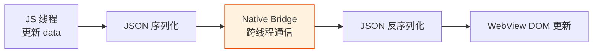

# 06. 数据流与状态管理：Page Data 的正确姿势

小程序的 Page 实例持有一个 `data` 对象，通过 `setData` 修改数据来驱动视图更新。这个模型看起来简单，但当页面复杂度上升、组件嵌套变深时，数据流就开始变得混乱。

本篇拆解小程序的数据流机制，介绍三种状态管理方案：原生 Page data、类 Vuex 全局 Store、以及组件间通信的正确姿势。

> **环境：** 微信开发者工具 latest，小程序基础库 3.x

---

## 1. setData 的深层机制

### 1.1 每次 setData 都是一次快照传递

`setData` 不是 Vue 的响应式系统，不是精确追踪变化后最小更新，而是**整棵数据树的合并**。

```javascript
Page({
  data: {
    user: {
      name: '张三',
      age: 18,
      profile: {
        avatar: 'https://...',
        bio: '程序员',
      },
    },
    list: [1, 2, 3, 4, 5],
  },

  updateName() {
    // 错误：传整个对象，浪费性能
    this.setData({
      user: { name: '李四', age: 18, profile: this.data.user.profile },
    });

    // 正确：路径更新，只传变化的部分
    this.setData({
      'user.name': '李四',
    });

    // 正确：也支持路径字符串写法
    this.setData({
      'user.profile.bio': '资深程序员',
    });
  },

  updateList() {
    // 常见坑：直接 push，引用不变
    this.data.list.push(6);
    this.setData({ list: this.data.list }); // 可能不触发更新

    // 正确：创建新数组引用
    const newList = [...this.data.list, 6];
    this.setData({ list: newList });

    // 删除同理
    const filteredList = this.data.list.filter(item => item !== 3);
    this.setData({ list: filteredList });
  },
});
```

### 1.2 setData 的性能代价



每次 `setData` 都会触发：序列化 → 跨线程传递 → 反序列化 → DOM 更新。数据量越大，代价越高。

**性能最佳实践**：
- 频繁更新的数据控制在 10KB 以内
- 大列表用分页，不要一次性加载 1000+ 条
- 避免在 `scroll` 事件中调用 `setData`
- 使用 `this.setData({ key: value }, () => { /* 回调 */ })` 等待更新完成后再操作 DOM

---

## 2. 跨页面通信：数据传递的正确姿势

### 2.1 URL 参数传递（适合简单数据）

```javascript
// 跳转时携带参数
wx.navigateTo({
  url: '/pages/detail/detail?id=123&name=张三',
});

// 目标页面获取参数
Page({
  onLoad(query) {
    console.log(query.id);    // "123"
    console.log(query.name);  // "张三"
  },
});
```

> 限制：URL 长度有限制（微信限制约 2KB），不适合传递大量数据或对象。

### 2.2 页面栈操作（适合返回时回传数据）

```javascript
// 页面 A：跳转到页面 B
wx.navigateTo({
  url: '/pages/edit/edit',
  events: {
    // 页面 B 通过 eventChannel 触发这里
    refreshData: (data) => {
      console.log('收到页面 B 的数据：', data);
      this.setData({ updated: true });
    },
  },
});

// 在页面 A 中监听
const eventChannel = this.getOpenerEventChannel();
eventChannel.on('refreshData', (data) => {
  this.setData({ refreshData: data });
});
```

```javascript
// 页面 B：返回时传递数据
Page({
  onLoad(options) {
    const eventChannel = this.getOpenerEventChannel();
  },

  submit() {
    // 返回上一页并触发事件
    const eventChannel = this.getOpenerEventChannel();
    eventChannel.emit('refreshData', { updated: true, value: 123 });
    wx.navigateBack();
  },
});
```

### 2.3 全局 getApp（适合全局共享数据）

```javascript
// app.js
App({
  globalData: {
    userInfo: null,
    cartList: [],
    settings: { theme: 'light' },
  },

  updateUserInfo(userInfo) {
    this.globalData.userInfo = userInfo;
  },

  addToCart(item) {
    this.globalData.cartList.push(item);
    // 通知所有订阅者（需要配合事件总线）
  },
});
```

```javascript
// 页面中使用
const app = getApp();

Page({
  onShow() {
    // 获取全局数据
    this.setData({
      userInfo: app.globalData.userInfo,
    });
  },

  updateUser() {
    app.updateUserInfo({ name: '张三' });
  },
});
```

> **注意**：`getApp()` 获取的是同一个实例，在 `app.js` 的 `onLaunch` 执行完成后才能拿到完整数据。

### 2.4 Storage 中转（适合持久化或跨会话数据）

```javascript
// 页面 A：存入 Storage
wx.setStorageSync('tempData', { id: 123, name: '测试' });
wx.navigateTo({ url: '/pages/detail/detail' });

// 页面 B：读取并删除
Page({
  onLoad() {
    const tempData = wx.getStorageSync('tempData');
    wx.removeStorageSync('tempData'); // 用完即删
    console.log(tempData);
  },
});
```

---

## 3. 全局状态管理：类 Vuex 的 Store 封装

当应用复杂度增加时，全局状态管理变得必要。以下是一个不依赖任何第三方库的轻量 Store 实现：

### 3.1 Store 实现

```javascript
// utils/store.js

/**
 * 简易全局状态管理（类 Vuex 模式）
 * - 支持 getState 获取状态
 * - 支持 setState 更新状态（自动触发通知）
 * - 支持 subscribe 订阅状态变化
 */

class Store {
  constructor(state = {}) {
    this._state = state;
    this._listeners = [];
  }

  // 获取状态（浅拷贝，防止直接修改）
  getState() {
    return this._state;
  }

  // 获取某个状态字段
  get(path) {
    return path.split('.').reduce((obj, key) => obj?.[key], this._state);
  }

  // 更新状态（浅合并）
  setState(newState, callback) {
    const prevState = { ...this._state };
    this._state = { ...this._state, ...newState };

    // 通知所有订阅者
    this._notify(prevState);

    // 回调（setData 后的回调）
    if (callback && typeof callback === 'function') {
      callback();
    }
  }

  // 订阅状态变化
  subscribe(listener) {
    this._listeners.push(listener);

    // 返回取消订阅函数
    return () => {
      this._listeners = this._listeners.filter(fn => fn !== listener);
    };
  }

  // 通知所有订阅者
  _notify(prevState) {
    this._listeners.forEach(listener => {
      listener(this._state, prevState);
    });
  }
}

// 导出单例
export const store = new Store({
  userInfo: null,
  cartList: [],
  theme: 'light',
});

export default store;
```

### 3.2 页面中使用 Store

```javascript
// pages/index/index.js
import { store } from '../../utils/store.js';

Page({
  data: {
    userInfo: null,
    cartList: [],
  },

  onLoad() {
    // 初始化：从 Store 获取状态
    const state = store.getState();
    this.setData({
      userInfo: state.userInfo,
      cartList: state.cartList,
    });

    // 订阅状态变化
    this.unsubscribe = store.subscribe((newState, prevState) => {
      // 只更新变化的部分
      if (newState.userInfo !== prevState.userInfo) {
        this.setData({ userInfo: newState.userInfo });
      }
      if (newState.cartList !== prevState.cartList) {
        this.setData({ cartList: newState.cartList });
      }
    });
  },

  onUnload() {
    // 取消订阅
    if (this.unsubscribe) {
      this.unsubscribe();
    }
  },

  loginSuccess(userInfo) {
    // 更新 Store，页面自动响应
    store.setState({ userInfo });
  },
});
```

### 3.3 持久化 Store（同步 Storage）

```javascript
// utils/store-persist.js

class PersistedStore extends Store {
  constructor(state, storageKey) {
    // 优先从 Storage 恢复
    const persisted = wx.getStorageSync(storageKey);
    super({ ...state, ...persisted });
    this._storageKey = storageKey;
  }

  setState(newState, callback) {
    super.setState(newState, () => {
      // 持久化到 Storage
      wx.setStorageSync(this._storageKey, this._state);
      if (callback) callback();
    });
  }
}

// 用户信息持久化
export const userStore = new PersistedStore(
  { token: '', userInfo: null, settings: {} },
  'user_state'
);

// 购物车持久化
export const cartStore = new PersistedStore(
  { items: [], totalPrice: 0 },
  'cart_state'
);
```

---

## 4. 组件间通信

### 4.1 父子组件通信

```html
<!-- 父组件 wxml -->
<my-component
  title="{{pageTitle}}"
  bind:customEvent="handleCustomEvent"
  bind:update="handleUpdate"
/>
```

```javascript
// 父组件 js
Page({
  handleCustomEvent(e) {
    // e.detail 是子组件传出的数据
    console.log('收到子组件事件:', e.detail);
  },

  handleUpdate(e) {
    const { key, value } = e.detail;
    console.log(`更新：${key} = ${value}`);
  },
});
```

```javascript
// 子组件 js
Component({
  properties: {
    title: String,
  },

  methods: {
    handleTap() {
      // 触发自定义事件，传递数据
      this.triggerEvent('customEvent', {
        message: 'Hello from child',
        timestamp: Date.now(),
      });
    },

    updateParent() {
      this.triggerEvent('update', {
        key: 'count',
        value: this.data.count + 1,
      });
    },
  },
});
```

### 4.2 插槽（slot）

```html
<!-- 父组件 wxml：传入插槽内容 -->
<my-card>
  <view class="custom-content">
    <text>这是自定义内容</text>
    <text>{{parentData}}</text>
  </view>
</my-card>
```

```html
<!-- 子组件 wxml：定义插槽 -->
<view class="card">
  <view class="card-header">{{title}}</view>
  <slot></slot>  <!-- 默认插槽 -->
  <view class="card-footer">固定底部</view>
</view>
```

### 4.3 relations 实现跨级通信

小程序提供了 `relations` 来声明组件间的父子关系，实现跨级数据传递：

```javascript
// 子组件中声明
Component({
  relations: {
    './parent-component': {
      type: 'parent',
      linked(target) {
        console.log('被添加到父组件了', target);
      },
      linkChanged(target) {},
      unlinked(target) {},
    },
  },
});
```

---

## 5. 常见坑点

**1. setData 更新深层对象时路径写错**

```javascript
// 假设 data: { user: { profile: { name: '张三' } } }

// 错误：多层路径要用引号包裹
this.setData({ user.profile.name: '李四' }); // 语法错误

// 正确：路径字符串
this.setData({ 'user.profile.name': '李四' });

// 或者：完整替换（性能较差）
this.setData({
  user: { ...this.data.user, profile: { ...this.data.user.profile, name: '李四' } },
});
```

**2. 组件 properties 变化时 observers 未触发**

```javascript
Component({
  properties: {
    value: {
      type: Number,
      observer(newVal, oldVal) {
        // 注意：observer 函数不能用箭头函数定义
        // 因为需要在内部使用 this
        console.log('value changed:', newVal);
      },
    },
  },
});
```

**3. 在 onShow 中同步读取 Store 导致数据不一致**

```javascript
Page({
  data: { cartCount: 0 },

  onShow() {
    // 错误：Store 可能还没更新完成
    const cartStore = require('../../utils/store.js').store;
    this.setData({ cartCount: cartStore.getState().cartList.length });

    // 正确：在 subscribe 中同步，或在页面 onLoad 中初始化订阅
  },
});
```

---

## 延伸思考

小程序的单向数据流（`data → setData → 视图`）比 React 的 Flux 更简单，但也更脆弱。最大的风险在于：当多个页面/组件同时修改全局状态时，没有类似 Redux DevTools 的工具来追踪变化轨迹。

实践中建议：

- **页面私有数据**：放在 Page 的 `data` 中
- **跨页面共享数据**：放在 Store 中，通过 subscribe 模式让各页面响应
- **组件内部数据**：放在 Component 的 `data` 中，通过 `properties` 接收外部数据

三层分离，边界清晰，是避免状态混乱的关键。

---

## 总结

- `setData` 每次传递完整数据快照，深层更新用路径写法 `'key.subKey': value`
- 跨页面通信：URL 参数（简单数据）、EventChannel（返回回传）、Storage（中转/持久化）
- 全局 Store：轻量实现（单例 + subscribe）即可满足大多数场景
- 组件间通信：父→子用 `properties`，子→父用 `triggerEvent`
- 避免在 `scroll` 事件中调用 `setData`

---

## 参考

- [setData 机制说明](https://developers.weixin.qq.com/miniprogram/dev/framework/view/list.html)
- [Page 生命周期文档](https://developers.weixin.qq.com/miniprogram/dev/reference/api/Page.html)
- [组件间通信与事件](https://developers.weixin.qq.com/miniprogram/dev/framework/custom-component/events.html)
