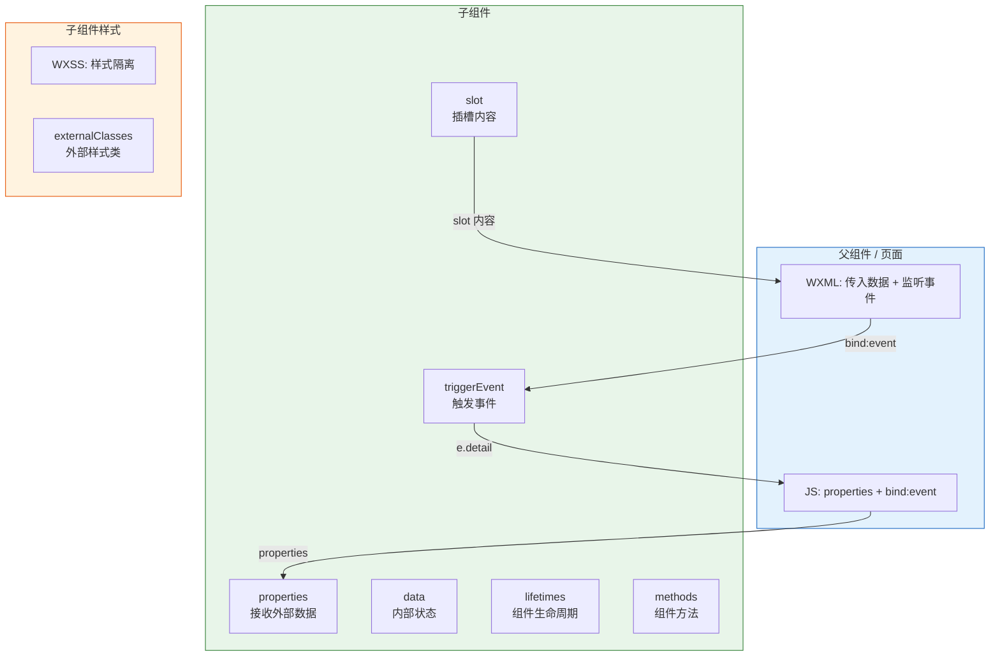

# 07. 自定义组件：从设计到封装

组件化开发是现代前端工程的基石。小程序的组件系统借鉴了 Web Components 的思想，支持封装、复用、参数传递和样式隔离。本篇从零构建一个生产级自定义组件，掌握组件的设计模式与最佳实践。

> **环境：** 微信开发者工具 latest，小程序基础库 3.x

---

## 1. Component 构造器 vs Page 构造器

自定义组件使用 `Component()` 构造器，而非 `Page()`。两者有以下关键区别：

| 特性 | Page() | Component() |
|------|--------|------------|
| `data` 初始 | 直接赋值 | 必须放在 `data` 字段 |
| 生命周期 | `onLoad`/`onShow` 等 | `lifetimes` 对象内 |
| 方法定义 | 直接写 | 必须放在 `methods` 对象内 |
| 页面级生命周期 | 不支持 | `pageLifetimes` |
| 响应式 properties | 不支持 | `properties` 定义 |
| observers | 不支持 | 支持（类似 Vue watch） |

---

## 2. 从零构建一个商品卡片组件

### 2.1 组件目录结构

```
components/
└── product-card/
    ├── product-card.js
    ├── product-card.wxml
    ├── product-card.wxss
    ├── product-card.json
    └── assets/
        └── default-image.png
```

### 2.2 组件配置

```json
// components/product-card/product-card.json
{
  "component": true,
  "usingComponents": {}
}
```

> **必须声明** `"component": true`，否则小程序会把当前文件当作页面处理。

### 2.3 组件 JS

```javascript
// components/product-card/product-card.js
Component({
  // ========== 组件数据 ==========
  data: {
    // 内部状态
    isCollected: false,
    isImageLoaded: false,
  },

  // ========== 外部传入的属性（类似 React props）==========
  properties: {
    // 完整写法：指定类型、默认值、observer
    product: {
      type: Object,
      value: null,
      observer(newVal, oldVal) {
        if (newVal) {
          this.processProductData(newVal);
        }
      },
    },
    // 简洁写法：类型推断
    index: Number,
    // 自定义样式类
    cardClass: {
      type: String,
      value: '',
    },
  },

  // ========== 外部样式类（允许父组件传入样式）==========
  externalClasses: ['custom-class', 'custom-title-class'],

  // ========== 组件生命周期 ==========
  lifetimes: {
    created() {
      console.log('组件实例创建');
    },
    attached() {
      console.log('组件挂载到页面节点树');
      // 可以在此初始化内部数据
    },
    ready() {
      // 组件首次渲染完成
      console.log('组件渲染完成');
    },
    moved() {
      console.log('组件被移动');
    },
    detached() {
      console.log('组件从页面节点树移除');
      // 清理资源：定时器、事件监听等
      if (this.data.timer) {
        clearTimeout(this.data.timer);
      }
    },
  },

  // ========== 所在页面的生命周期 ==========
  pageLifetimes: {
    show() {
      // 组件所在页面显示时触发
      // 可以实现"页面可见时刷新组件"的逻辑
    },
    hide() {
      // 组件所在页面隐藏时触发
    },
  },

  // ========== 组件方法（必须放在 methods 中）==========
  methods: {
    // 点击商品卡片
    onCardTap() {
      const { product } = this.properties;
      if (!product) return;

      // 触发自定义事件，通知父组件
      this.triggerEvent('tap', {
        productId: product.id,
        index: this.properties.index,
      });
    },

    // 点击图片
    onImageTap() {
      const { product } = this.properties;
      this.triggerEvent('imageTap', {
        url: product.imageUrl,
        productId: product.id,
      });
    },

    // 点击收藏
    onCollect() {
      const newState = !this.data.isCollected;
      this.setData({ isCollected: newState });
      this.triggerEvent('collect', {
        productId: this.properties.product.id,
        isCollected: newState,
      });
    },

    // 图片加载完成
    onImageLoad() {
      this.setData({ isImageLoaded: true });
    },

    // 图片加载失败
    onImageError() {
      // 使用默认图兜底
      this.setData({
        'product.imageUrl': '/components/product-card/assets/default-image.png',
      });
    },

    // 处理商品数据
    processProductData(product) {
      // 计算显示价格（保留两位小数）
      if (product.price) {
        product.displayPrice = product.price.toFixed(2);
      }
      this.setData({ processedProduct: product });
    },
  },
});
```

### 2.4 组件 WXML

```html
<!-- components/product-card/product-card.wxml -->
<view class="product-card {{cardClass}}"
      bindtap="onCardTap">
  <!-- 图片区域 -->
  <view class="image-wrapper">
    <!-- 骨架屏（图片未加载时显示） -->
    <view wx:if="{{!isImageLoaded}}" class="skeleton"></view>

    <image
      src="{{product.imageUrl}}"
      mode="aspectFill"
      class="product-image {{isImageLoaded ? 'loaded' : ''}}"
      bindtap="onImageTap"
      bindload="onImageLoad"
      binderror="onImageError"/>

    <!-- 收藏按钮 -->
    <view class="collect-btn" catchtap="onCollect">
      <text class="collect-icon {{isCollected ? 'active' : ''}}">
        {{isCollected ? '♥' : '♡'}}
      </text>
    </view>
  </view>

  <!-- 信息区域 -->
  <view class="info-wrapper">
    <text class="product-name {{customTitleClass}}">{{product.name}}</text>
    <text class="product-desc single-line">{{product.description}}</text>

    <view class="price-row">
      <text class="current-price">¥{{processedProduct.displayPrice}}</text>
      <text wx:if="{{product.originalPrice}}" class="original-price">
        ¥{{product.originalPrice}}
      </text>
      <text wx:if="{{product.discount}}" class="discount-tag">
        {{product.discount}}折
      </text>
    </view>

    <view class="footer-row">
      <text class="sales-count">{{product.salesCount}}人已买</text>
      <text class="location">{{product.location}}</text>
    </view>
  </view>
</view>
```

### 2.5 组件 WXSS

```css
/* components/product-card/product-card.wxss */

.product-card {
  background-color: #ffffff;
  border-radius: 12rpx;
  overflow: hidden;
  box-shadow: 0 2rpx 8rpx rgba(0, 0, 0, 0.06);
  transition: transform 0.2s, box-shadow 0.2s;
}

.product-card:active {
  transform: scale(0.98);
  box-shadow: 0 1rpx 4rpx rgba(0, 0, 0, 0.04);
}

/* 图片区域 */
.image-wrapper {
  position: relative;
  width: 100%;
  height: 0;
  padding-bottom: 100%; /* 1:1 正方形 */
  overflow: hidden;
}

.skeleton {
  position: absolute;
  top: 0;
  left: 0;
  width: 100%;
  height: 100%;
  background: linear-gradient(90deg, #f0f0f0 25%, #e0e0e0 50%, #f0f0f0 75%);
  background-size: 200% 100%;
  animation: shimmer 1.5s infinite;
}

@keyframes shimmer {
  0% { background-position: 200% 0; }
  100% { background-position: -200% 0; }
}

.product-image {
  position: absolute;
  top: 0;
  left: 0;
  width: 100%;
  height: 100%;
  opacity: 0;
  transition: opacity 0.3s;
}

.product-image.loaded {
  opacity: 1;
}

/* 收藏按钮 */
.collect-btn {
  position: absolute;
  top: 16rpx;
  right: 16rpx;
  width: 56rpx;
  height: 56rpx;
  background-color: rgba(255, 255, 255, 0.9);
  border-radius: 50%;
  display: flex;
  align-items: center;
  justify-content: center;
}

.collect-icon {
  font-size: 32rpx;
  color: #cccccc;
  transition: color 0.2s;
}

.collect-icon.active {
  color: #ff4757;
}

/* 信息区域 */
.info-wrapper {
  padding: 16rpx;
}

.product-name {
  font-size: 28rpx;
  color: #333333;
  line-height: 1.4;
  margin-bottom: 8rpx;
}

.product-desc {
  font-size: 24rpx;
  color: #999999;
  margin-bottom: 12rpx;
}

.single-line {
  overflow: hidden;
  text-overflow: ellipsis;
  white-space: nowrap;
}

/* 价格区域 */
.price-row {
  display: flex;
  align-items: baseline;
  margin-bottom: 12rpx;
}

.current-price {
  font-size: 32rpx;
  color: #ff4757;
  font-weight: bold;
}

.original-price {
  font-size: 22rpx;
  color: #cccccc;
  text-decoration: line-through;
  margin-left: 12rpx;
}

.discount-tag {
  font-size: 20rpx;
  color: #ff4757;
  background-color: #fff0f0;
  padding: 2rpx 8rpx;
  border-radius: 4rpx;
  margin-left: 8rpx;
}

/* 底部信息 */
.footer-row {
  display: flex;
  justify-content: space-between;
  align-items: center;
}

.sales-count {
  font-size: 22rpx;
  color: #999999;
}

.location {
  font-size: 22rpx;
  color: #cccccc;
}
```

### 2.6 父组件中使用

```html
<!-- pages/index/index.wxml -->
<view class="product-list">
  <product-card
    wx:for="{{products}}"
    wx:key="id"
    wx:for-index="index"
    product="{{item}}"
    index="{{index}}"
    card-class="custom-card"
    custom-title-class="title-red"
    bind:tap="onProductTap"
    bind:imageTap="onImageTap"
    bind:collect="onProductCollect"
  />
</view>
```

```javascript
// pages/index/index.js
Page({
  data: {
    products: [
      {
        id: 1,
        name: 'Apple iPhone 15 Pro',
        description: '全新钛金属设计，A17 Pro 芯片',
        price: 7999,
        originalPrice: 8999,
        discount: 89,
        imageUrl: '/assets/iphone.jpg',
        salesCount: 1234,
        location: '深圳',
      },
      // ...
    ],
  },

  // 点击商品卡片
  onProductTap(e) {
    const { productId } = e.detail;
    wx.navigateTo({
      url: `/pages/detail/detail?id=${productId}`,
    });
  },

  // 点击图片（放大查看）
  onImageTap(e) {
    const { url } = e.detail;
    wx.previewImage({ urls: [url] });
  },

  // 收藏状态变化
  onProductCollect(e) {
    const { productId, isCollected } = e.detail;
    console.log(`商品 ${productId} 收藏状态：${isCollected}`);
  },
});
```

---

## 3. 插槽（Slot）

### 3.1 默认插槽

```html
<!-- 父组件传入插槽内容 -->
<my-panel>
  <text>这是面板内容</text>
  <button bindtap="handleClick">操作按钮</button>
</my-panel>
```

```html
<!-- 子组件 my-panel.wxml -->
<view class="panel">
  <view class="panel-header">
    <text>{{title}}</text>
  </view>
  <view class="panel-body">
    <slot></slot>  <!-- 插槽位置 -->
  </view>
  <view class="panel-footer">
    <text>固定底部</text>
  </view>
</view>
```

### 3.2 命名插槽

```html
<!-- 父组件 -->
<my-dialog>
  <view slot="header">对话框标题</view>
  <view slot="body">
    <text>对话框内容...</text>
  </view>
  <view slot="footer">
    <button bindtap="onCancel">取消</button>
    <button bindtap="onConfirm">确认</button>
  </view>
</my-dialog>
```

```html
<!-- 子组件 -->
<view class="dialog">
  <view class="header">
    <slot name="header"></slot>
  </view>
  <view class="body">
    <slot name="body"></slot>
  </view>
  <view class="footer">
    <slot name="footer"></slot>
  </view>
</view>
```

---

## 4. behaviors：类似 Mixin 的复用

`behaviors` 允许将公共的 `properties`、`data`、`methods` 和 `lifetimes` 混入到组件中，实现代码复用。

### 4.1 定义公共 behavior

```javascript
// behaviors/timer-behavior.js
module.exports = Behavior({
  // 共享的 properties
  properties: {
    autoStart: {
      type: Boolean,
      value: false,
    },
    interval: {
      type: Number,
      value: 1000,
    },
  },

  // 共享的 data
  data: {
    elapsed: 0,
    running: false,
  },

  // 共享的方法
  methods: {
    startTimer() {
      if (this.data.running) return;
      this.setData({ running: true });
      this._timer = setInterval(() => {
        this.setData({ elapsed: this.data.elapsed + 1 });
      }, this.properties.interval);
    },
    stopTimer() {
      clearInterval(this._timer);
      this.setData({ running: false });
    },
    resetTimer() {
      this.stopTimer();
      this.setData({ elapsed: 0 });
    },
  },

  // 共享的生命周期
  lifetimes: {
    detached() {
      // 组件销毁时清理定时器
      if (this._timer) {
        clearInterval(this._timer);
      }
    },
  },
});
```

### 4.2 组件中使用 behavior

```javascript
// components/stopwatch/stopwatch.js
const timerBehavior = require('../../behaviors/timer-behavior.js');

Component({
  behaviors: [timerBehavior],

  properties: {
    title: String,
  },

  methods: {
    onTap() {
      if (this.data.running) {
        this.stopTimer();
      } else {
        this.startTimer();
      }
    },
  },
});
```

### 4.3 behaviors 优先级

```
组件自身 > 后引入的 behavior > 先引入的 behavior > 更早引入的 behavior
```

```javascript
Component({
  behaviors: [A, B],  // B 会覆盖 A 中的同名属性/方法
});
```

---

## 5. 组件架构流程图



---

## 6. 常见坑点

**1. behaviors 中的 properties 和组件自身 properties 冲突**

```javascript
// behaviors/shared.js
module.exports = Behavior({
  properties: {
    value: Number,
  },
});

// 组件中同时定义了 value
Component({
  behaviors: [shared],
  properties: {
    value: String,  // 会覆盖 behavior 中的定义
  },
});
```

**2. 组件 attached 时 properties 还未赋值**

```javascript
lifetimes: {
  attached() {
    // 这个阶段 properties 可能还是默认值
    console.log(this.properties.product); // null
    // 正确做法：使用 observer，或者依赖 ready 阶段
  },
  ready() {
    // ready 阶段所有 properties 都已经赋值完成
    console.log(this.properties.product); // 正确值
  },
}
```

**3. 组件样式污染全局**

```javascript
// 错误：组件样式泄漏
Component({
  options: {
    // 默认值是 isolated，即样式隔离
    // 但如果你不小心用了 app.wxss 中的全局类名，
    // 会导致样式依赖
  },
});

// 正确：显式声明样式隔离模式
Component({
  options: {
    styleIsolation: 'isolated',     // 完全隔离（推荐）
    // styleIsolation: 'shared',      // 允许外部样式影响组件
    // styleIsolation: 'apply-shared', // 单向影响
  },
});
```

**4. 组件内使用纯 WXML 模板复用时传参问题**

```html
<!-- 父组件 -->
<template is="item-template" data="{{item, index: 0}}"/>
<!-- 或者 -->
<template is="item-template" data="{{...item}}"/>
```

---

## 延伸思考

小程序组件系统的设计，与 React 的 Hooks + Composition 有异曲同工之妙：`properties` 类似 `props`，`methods` 类似 class 组件的方法，`behaviors` 类似 React 的自定义 Hooks（虽然更像是 Mixin 的变体）。

但小程序组件系统的局限性也很明显：

- **不支持函数式组件**：每个组件都必须是完整的 `Component()` 实例，代码量比 React 函数组件重得多
- **behaviors 缺乏命名空间隔离**：多个 behavior 中同名方法会产生覆盖冲突
- **组件间通信依赖事件系统**：没有 React Context 或 Vue Provide/Inject 那样的声明式注入机制

理解这些局限性，才能在架构选型时做出正确的判断——小程序原生组件适合封装**高复用、低耦合**的 UI 组件（如卡片、按钮、表单），但不适合构建需要深度数据共享的复杂应用。

---

## 总结

- `Component()` 构造器必须有 `methods`（不能像 Page 那样直接写方法）
- `lifetimes` 替代 Page 的生命周期钩子
- `properties` 是组件的"输入"，`triggerEvent` 是组件的"输出"
- `externalClasses` 允许父组件覆盖组件内部样式
- `behaviors` 实现代码复用，但注意同名属性的覆盖优先级
- `slot` 支持默认插槽和命名插槽
- `styleIsolation: 'isolated'` 保证组件样式不污染全局

---

## 参考

- [Component 构造器文档](https://developers.weixin.qq.com/miniprogram/dev/reference/api/Component.html)
- [组件间通信与事件](https://developers.weixin.qq.com/miniprogram/dev/framework/custom-component/events.html)
- [behaviors 使用说明](https://developers.weixin.qq.com/miniprogram/dev/framework/custom-component/behaviors.html)

---

**下一篇**进入 **内置组件进阶：复杂 UI 的构建块**——虚拟列表、Canvas、地图、视频等复杂组件的使用与注意事项。
