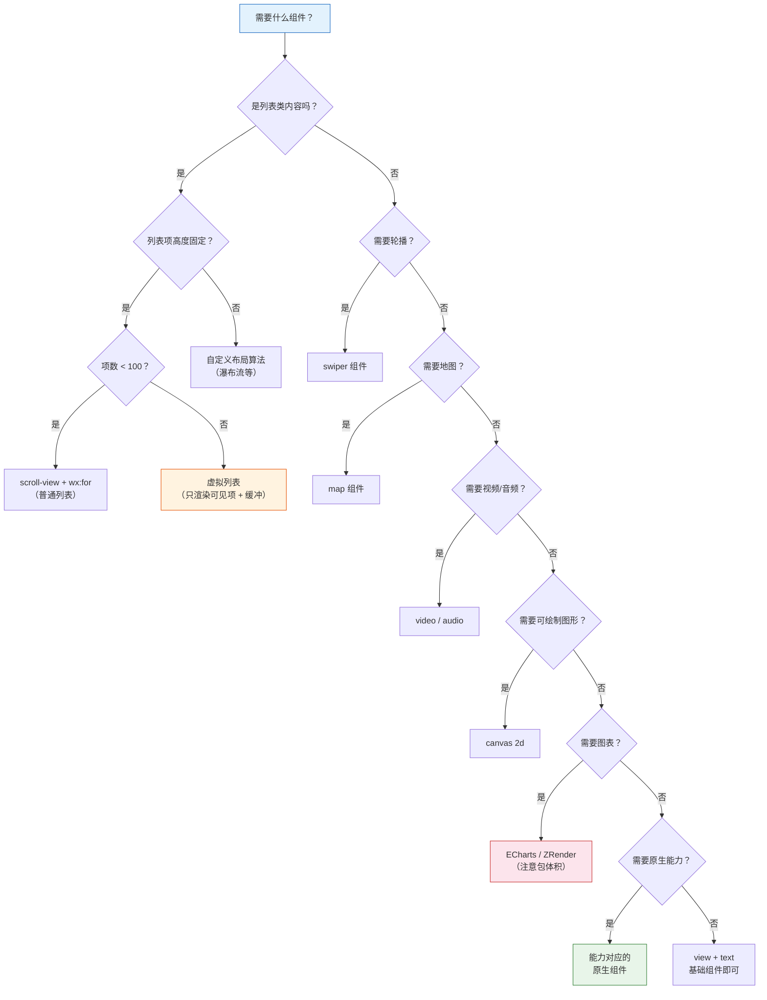

# 08. 内置组件进阶：复杂 UI 的构建块

小程序的内置组件覆盖了绝大多数业务场景，但每个组件都有独特的"脾气"——用法不对，轻则体验差，重则直接白屏。本篇深入讲解高频复杂组件的使用方法与避坑指南。

> **环境：** 微信开发者工具 latest，小程序基础库 3.x

---

## 1. scroll-view：虚拟列表与长列表优化

`scroll-view` 是小程序中实现可滚动容器的主力组件。但它有一个关键约束：**必须指定高度**。

### 1.1 基础用法

```html
<scroll-view
  scroll-y
  bindscrolltolower="onReachBottom"
  bindscroll="onScroll"
  scroll-top="{{scrollTop}}"
  scroll-with-animation
  refresher-enabled
  bindrefresherrefresh="onRefresh"
  refresher-triggered="{{refreshing}}">
  <view wx:for="{{list}}" wx:key="id">
    <text>{{item.name}}</text>
  </view>
</scroll-view>
```

```css
/* scroll-view 必须有固定或计算高度 */
.scroll-container {
  height: 100vh;         /* 占满视口 */
  /* 或者 */
  height: 1200rpx;       /* 固定高度 */
  /* 或者 */
  height: calc(100vh - 100rpx);  /* calc 计算 */
}
```

### 1.2 下拉刷新 + 上拉加载

```javascript
// pages/list/list.js
Page({
  data: {
    list: [],
    page: 1,
    hasMore: true,
    refreshing: false,
    scrollTop: 0,
  },

  onLoad() {
    this.loadData();
  },

  // 下拉刷新
  async onRefresh() {
    this.setData({ refreshing: true, page: 1, hasMore: true });
    await this.loadData(true);
    this.setData({ refreshing: false });
  },

  // 上拉加载更多
  onReachBottom() {
    if (!this.data.hasMore) return;
    this.setData({ page: this.data.page + 1 });
    this.loadData();
  },

  async loadData(isRefresh = false) {
    try {
      const newData = await fetchList(this.data.page);
      this.setData({
        list: isRefresh ? newData : this.data.list.concat(newData),
        hasMore: newData.length >= 20,
      });
    } catch (err) {
      wx.showToast({ title: '加载失败', icon: 'none' });
    }
  },
});
```

### 1.3 虚拟列表：解决长列表性能问题

当列表超过 100 条时，完整的 `wx:for` 渲染会成为性能瓶颈。虚拟列表的核心思路是：**只渲染可见区域 + 缓冲区**。

```javascript
// utils/virtual-list.js

/**
 * 虚拟列表工具类
 */
class VirtualList {
  constructor(options) {
    this.itemHeight = options.itemHeight;      // 每项高度
    this.listData = options.listData || [];   // 原始数据
    this.bufferCount = options.bufferCount || 3; // 缓冲行数
    this.containerHeight = options.containerHeight; // 容器高度
    this.scrollTop = 0;
  }

  // 计算可见范围
  getVisibleRange(scrollTop) {
    this.scrollTop = scrollTop;
    const startIndex = Math.max(0,
      Math.floor(scrollTop / this.itemHeight) - this.bufferCount
    );
    const visibleCount = Math.ceil(this.containerHeight / this.itemHeight);
    const endIndex = Math.min(
      this.listData.length - 1,
      startIndex + visibleCount + this.bufferCount * 2
    );
    return { startIndex, endIndex };
  }

  // 获取渲染数据
  getRenderData(scrollTop) {
    const { startIndex, endIndex } = this.getVisibleRange(scrollTop);
    const renderData = this.listData.slice(startIndex, endIndex + 1);
    return {
      renderData,
      totalHeight: this.listData.length * this.itemHeight,
      offsetY: startIndex * this.itemHeight,
    };
  }
}

module.exports = VirtualList;
```

```javascript
// pages/list/list.js
const VirtualList = require('../../utils/virtual-list.js');

Page({
  data: {
    renderList: [],
    totalHeight: 0,
    offsetY: 0,
    containerHeight: 0,
  },

  onLoad() {
    // 获取容器高度
    wx.createSelectorQuery()
      .select('.list-container')
      .boundingClientRect(rect => {
        this.containerHeight = rect.height;
        this.initVirtualList();
      })
      .exec();
  },

  initVirtualList() {
    this.virtualList = new VirtualList({
      itemHeight: 120,  // 每项固定高度
      listData: this.data.fullList,
      containerHeight: this.containerHeight,
    });
    this.updateList(0);
  },

  onScroll(e) {
    this.updateList(e.detail.scrollTop);
  },

  updateList(scrollTop) {
    const { renderData, totalHeight, offsetY } = this.virtualList.getRenderData(scrollTop);
    this.setData({
      renderList: renderData,
      totalHeight,
      offsetY,
    });
  },
});
```

```html
<!-- pages/list/list.wxml -->
<scroll-view
  scroll-y
  bindscroll="onScroll"
  class="list-container">
  <!-- 占位容器，撑起滚动区域 -->
  <view style="height: {{totalHeight}}rpx; position: relative;">
    <!-- 渲染列表（绝对定位，实现虚拟滚动） -->
    <view style="transform: translateY({{offsetY}}rpx);">
      <view wx:for="{{renderList}}" wx:key="id" class="list-item">
        <text>{{item.name}}</text>
      </view>
    </view>
  </view>
</scroll-view>
```

---

## 2. Canvas：离屏渲染与绘制

小程序的 Canvas 有两个版本：`2d` 和 `webgl`（基础库 2.9+）。`2d` 更常用，`webgl` 用于复杂图形和游戏。

### 2.1 基础 Canvas 2D

```html
<!-- pages/canvas/canvas.wxml -->
<canvas
  type="2d"
  id="myCanvas"
  style="width: 300px; height: 300px;"
  bindtouchstart="onTouchStart"
  bindtouchmove="onTouchMove"
  bindtouchend="onTouchEnd"/>
```

```javascript
// pages/canvas/canvas.js
Page({
  data: {
    ctx: null,
    isDrawing: false,
    points: [],
  },

  onReady() {
    // 必须等 Canvas 渲染完成才能获取 context
    wx.createSelectorQuery()
      .select('#myCanvas')
      .node(res => {
        const canvas = res.node;
        const ctx = canvas.getContext('2d');

        // 设置 canvas 尺寸（必须！）
        const dpr = wx.getSystemInfoSync().pixelRatio;
        canvas.width = 300 * dpr;
        canvas.height = 300 * dpr;
        ctx.scale(dpr, dpr);

        this.setData({ ctx, canvas });
        this.drawInitial();
      })
      .exec();
  },

  drawInitial() {
    const ctx = this.data.ctx;
    // 绘制背景
    ctx.fillStyle = '#ffffff';
    ctx.fillRect(0, 0, 300, 300);

    // 绘制文字
    ctx.font = '20px sans-serif';
    ctx.fillStyle = '#333333';
    ctx.fillText('Hello Canvas', 50, 150);
  },

  onTouchStart(e) {
    this.setData({ isDrawing: true, points: [e.touches] });
  },

  onTouchMove(e) {
    if (!this.data.isDrawing) return;
    const points = this.data.points.concat(e.touches);
    this.setData({ points });
    this.drawLine();
  },

  onTouchEnd() {
    this.setData({ isDrawing: false, points: [] });
  },

  drawLine() {
    const ctx = this.data.ctx;
    const points = this.data.points;
    if (points.length < 2) return;

    ctx.beginPath();
    ctx.moveTo(points[0].x, points[0].y);
    for (let i = 1; i < points.length; i++) {
      ctx.lineTo(points[i].x, points[i].y);
    }
    ctx.strokeStyle = '#07C160';
    ctx.lineWidth = 3;
    ctx.lineCap = 'round';
    ctx.stroke();
  },

  // 保存图片
  saveImage() {
    const canvas = this.data.canvas;
    wx.canvasToTempFilePath({
      canvas,
      success: (res) => {
        wx.saveImageToPhotosAlbum({
          filePath: res.tempFilePath,
          success: () => {
            wx.showToast({ title: '保存成功' });
          },
        });
      },
    });
  },
});
```

### 2.2 离屏 Canvas 优化

频繁在主 Canvas 上绘制会影响性能。可以创建一个离屏 Canvas 进行预渲染，然后一次性绘制到主 Canvas：

```javascript
// 创建离屏 Canvas
const offscreenCanvas = wx.createCanvas();
const offCtx = offscreenCanvas.getContext('2d');

// 离屏绘制（不触发视图更新）
offCtx.fillStyle = '#ff0000';
offCtx.fillRect(0, 0, 100, 100);

// 一次性绘制到主 Canvas
this.data.ctx.drawImage(offscreenCanvas, 0, 0);
```

---

## 3. 视频组件：video

### 3.1 基础用法

```html
<video
  src="{{videoUrl}}"
  poster="{{posterUrl}}"
  controls
  danmu-list="{{danmuList}}"
  enable-danmu
  autoplay="{{false}}"
  loop="{{false}}"
  muted="{{false}}"
  enable-play-gesture
  show-fullscreen-btn
  bindplay="onPlay"
  bindpause="onPause"
  bindended="onEnded"
  bindtimeupdate="onTimeUpdate"
  binderror="onError"/>
```

### 3.2 弹幕实现

```javascript
// pages/video/video.js
Page({
  data: {
    videoUrl: 'https://example.com/video.mp4',
    posterUrl: 'https://example.com/poster.jpg',
    danmuList: [
      { text: '666', color: '#ffffff', time: 5 },
      { text: '2333', color: '#ffff00', time: 10 },
    ],
    danmuText: '',
  },

  onReady() {
    this.videoContext = wx.createVideoContext('myVideo');
  },

  // 发送弹幕
  sendDanmu() {
    if (!this.data.danmuText) return;
    this.videoContext.sendDanmu({
      text: this.data.danmuText,
      color: '#' + Math.floor(Math.random() * 0xffffff).toString(16),
    });
    this.setData({ danmuText: '' });
  },

  onTimeUpdate(e) {
    // 更新播放进度
    const currentTime = e.detail.currentTime;
    const duration = e.detail.duration;
    this.setData({ currentTime, duration });
  },
});
```

---

## 4. 地图组件：map

### 4.1 基础地图

```html
<map
  id="myMap"
  longitude="{{longitude}}"
  latitude="{{latitude}}"
  scale="14"
  markers="{{markers}}"
  covers="{{covers}}"
  polyline="{{polyline}}"
  circles="{{circles}}"
  show-location
  bindmarkertap="onMarkerTap"
  bindcontroltap="onControlTap"
  bindregionchange="onRegionChange"/>
```

```javascript
// pages/map/map.js
Page({
  data: {
    longitude: 116.39742,
    latitude: 39.90923,
    markers: [
      {
        id: 1,
        longitude: 116.39742,
        latitude: 39.90923,
        title: '当前位置',
        iconPath: '/assets/location.png',
        width: 30,
        height: 30,
        callout: {
          content: '天安门广场',
          color: '#333',
          fontSize: 14,
          borderRadius: 10,
          bgColor: '#ffffff',
          padding: 10,
          display: 'ALWAYS',
        },
      },
    ],
    polyline: [
      {
        points: [
          { longitude: 116.39742, latitude: 39.90923 },
          { longitude: 116.39842, latitude: 39.91023 },
          { longitude: 116.39942, latitude: 39.91123 },
        ],
        color: '#07C160',
        width: 5,
        dottedLine: false,
      },
    ],
    circles: [
      {
        latitude: 39.90923,
        longitude: 116.39742,
        color: '#07C16033',
        fillColor: '#07C16022',
        radius: 1000,
        strokeWidth: 2,
      },
    ],
  },

  onReady() {
    this.mapContext = wx.createMapContext('myMap');
  },

  // 点击标记
  onMarkerTap(e) {
    const markerId = e.detail.markerId;
    const marker = this.data.markers.find(m => m.id === markerId);
    wx.showModal({
      title: marker.title,
      content: `坐标：${marker.longitude}, ${marker.latitude}`,
    });
  },

  // 移动地图
  onRegionChange(e) {
    if (e.type === 'end') {
      // 获取新的中心点坐标
      this.mapContext.getCenterLocation({
        success: (res) => {
          console.log('新中心点：', res);
        },
      });
    }
  },

  // 移动到当前位置
  moveToLocation() {
    this.mapContext.moveToLocation();
  },
});
```

---

## 5. swiper：轮播图的正确姿势

### 5.1 基础轮播

```html
<swiper
  indicator-dots="{{true}}"
  indicator-color="rgba(255,255,255,0.5)"
  indicator-active-color="#ffffff"
  autoplay="{{true}}"
  interval="3000"
  duration="500"
  circular="{{true}}"
  bindchange="onSwiperChange">
  <swiper-item wx:for="{{banners}}" wx:key="id">
    <image
      src="{{item.imageUrl}}"
      mode="aspectFill"
      bindtap="onBannerTap"
      data-id="{{item.id}}"/>
  </swiper-item>
</swiper>
```

### 5.2 分页器指示点自定义

```html
<view class="banner-wrapper">
  <swiper
    indicator-dots="{{false}}"
    bindchange="onSwiperChange"
    current="{{currentBanner}}">
    <!-- 轮播项 -->
  </swiper>

  <!-- 自定义指示点 -->
  <view class="dots">
    <view
      wx:for="{{banners}}"
      wx:key="id"
      class="dot {{currentBanner === index ? 'active' : ''}}"/>
  </view>
</view>
```

```css
.banner-wrapper {
  position: relative;
}

.dots {
  position: absolute;
  bottom: 20rpx;
  left: 50%;
  transform: translateX(-50%);
  display: flex;
}

.dot {
  width: 16rpx;
  height: 16rpx;
  border-radius: 50%;
  background-color: rgba(255, 255, 255, 0.5);
  margin: 0 6rpx;
  transition: all 0.3s;
}

.dot.active {
  width: 48rpx;
  border-radius: 8rpx;
  background-color: #ffffff;
}
```

---

## 6. 组件选择决策树

面对不同的 UI 需求，如何选择最合适的小程序组件？



### 6.1 框架对比总表

| 维度 | 原生小程序 | uni-app | Taro |
|------|-----------|---------|------|
| 语法 | WXML/WXSS/JS | Vue / React | React / Vue / Nerv |
| 组件系统 | 原生 Component | Vue Component | React Component |
| 状态管理 | 原生/第三方 | Vuex / Pinia | Redux / Zustand |
| 包体积 | 最小（无框架开销） | 中等 | 较大（React 运行时） |
| 性能 | 最好 | 较好（HBuilderX 编译优化） | 依赖运行时 |
| 生态 | 微信官方组件 | 跨 7 端（小程序 + App + H5） | 跨多端（小程序 + App + H5 + RN） |
| 学习曲线 | 低 | 中（需了解 Vue/React） | 高（React 体系） |

---

## 7. 常见坑点

**1. video 组件层级最高，无法被其他组件遮挡**

video 是原生组件，在 iOS 上永远处于最顶层。如果需要覆盖层（如关闭按钮），只能把按钮放在 video 外面，通过 `position: absolute` 覆盖。

**2. map 组件需要申请 key 且有配额限制**

```javascript
// app.json 中注册腾讯地图 key
{
  "permission": {
    "scope.userLocation": {
      "desc": "用于展示附近商家位置"
    }
  },
  "requiredPrivateInfos": ["getLocation"]
}
```

**3. swiper 嵌套在 scroll-view 中会冲突**

scroll-view 和 swiper 都依赖触摸事件，嵌套使用会导致滚动行为不可预期。解决思路：使用 swiper 的 `vertical` 模式，或者用 `swiper-item` 代替 scroll-view。

**4. Canvas 在 iOS 和 Android 表现不一致**

Canvas 的 `2d` context 在部分 Android 机型上有兼容性问题（如 `fillText` 换行、`globalCompositeOperation` 失效）。建议通过 `canvas.toDataURL()` 截图测试，确保 Android 端正常。

---

## 延伸思考

小程序的内置组件生态相对封闭，每个组件都有明确的职责边界。这种"强约束"的设计让代码更容易维护，但也意味着灵活性受限。

当内置组件不满足需求时，通常有三个选择：

1. **原生 Canvas/WebGL**：自己做渲染，灵活但代码量大
2. **第三方 Canvas 库**：如 ECharts、ZRender，封装良好但包体积大
3. **Web 端移植**：将已有的 Canvas 实现移植到小程序（需要适配 API）

选择哪个，取决于项目的性能要求、团队的技术储备和包体积预算。盲目引入大型 Canvas 库是最常见的错误——你以为在"节省开发时间"，实际上在"浪费用户等待时间"。

---

## 总结

- `scroll-view` 必须指定高度，下拉刷新配合 `refresher-enabled`
- 长列表（100+ 条）使用虚拟列表优化渲染性能
- Canvas 2D 需等 `onReady` 后获取 context，务必设置 `dpr` 缩放
- video 组件层级最高，UI 覆盖需要用 absolute 定位
- map 组件需要申请腾讯地图 key，支持 markers/polyline/circles
- swiper 适合轮播图，配合自定义 dots 实现高级交互
- 跨框架选型时：原生性能最优，uni-app/Taro 生态更强

---

## 参考

- [video 组件文档](https://developers.weixin.qq.com/miniprogram/dev/component/video.html)
- [swiper 轮播组件](https://developers.weixin.qq.com/miniprogram/dev/component/swiper.html)
- [内置组件一览](https://developers.weixin.qq.com/miniprogram/dev/component/)
