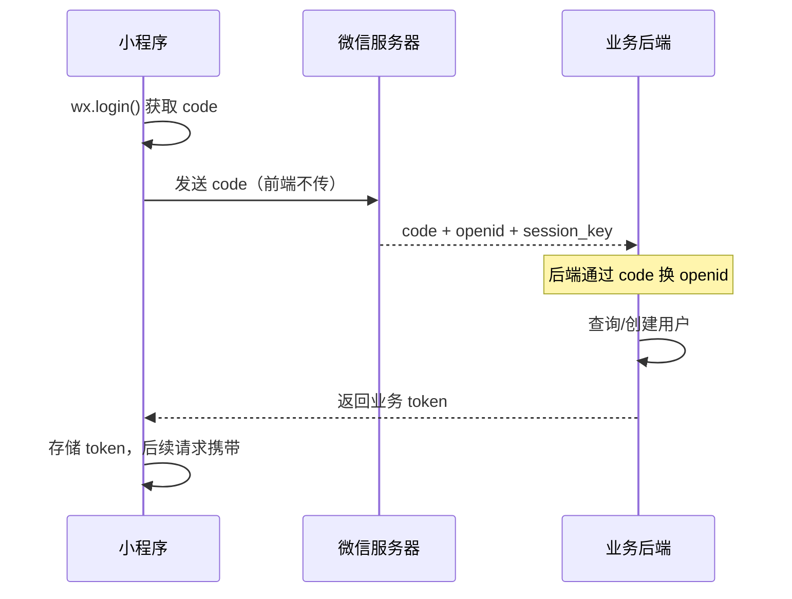
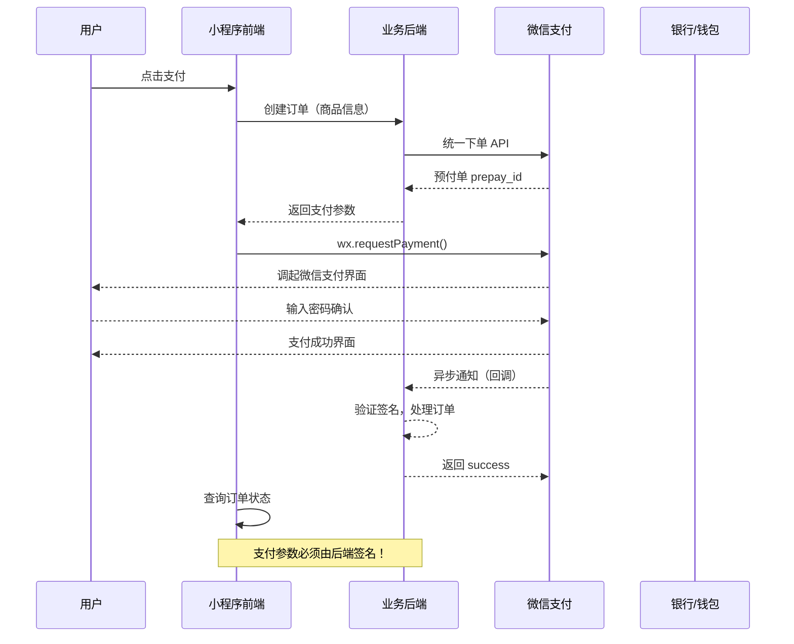

# 09. 微信开放能力：登录、支付、订阅

微信小程序最核心的价值，是能获取微信生态的能力——登录、支付、分享、定位、推送。这些能力让小程序能完成从"工具"到"服务"的跨越。本篇深入讲解最重要的三大开放能力：**微信登录**、**微信支付**、**订阅消息**的完整实现。

> **环境：** 微信开发者工具 latest，小程序基础库 3.x，已完成小程序账号注册和 AppID 配置

---

## 1. 微信登录：从小程序到业务后端

微信登录是几乎所有小程序的核心能力。它的本质是：**通过微信获取用户的唯一标识（openid），在业务后端建立账户体系**。

### 1.1 登录流程全图解



> **重要**：小程序登录的 code 换 openid 操作**必须在后端完成**，因为 AppSecret 不能暴露在前端代码中。

### 1.2 小程序端实现

```javascript
// utils/auth.js

/**
 * 微信登录流程（前端部分）
 */
const login = async () => {
  return new Promise((resolve, reject) => {
    // 1. 调用 wx.login 获取 code
    wx.login({
      success: async (res) => {
        if (!res.code) {
          reject(new Error('获取 code 失败'));
          return;
        }

        try {
          // 2. 将 code 发送到业务后端，换取 openid 和 token
          const result = await request('/api/login', {
            method: 'POST',
            data: { code: res.code },
            showLoading: true,
          });

          // 3. 存储登录凭证
          wx.setStorageSync('token', result.token);
          wx.setStorageSync('userInfo', result.userInfo);

          resolve(result);
        } catch (err) {
          reject(err);
        }
      },
      fail: (err) => {
        reject(err);
      },
    });
  });
};

/**
 * 检查登录态（静默登录）
 */
const checkSession = () => {
  return new Promise((resolve, reject) => {
    wx.checkSession({
      success: () => {
        // session_key 有效，检查本地 token
        const token = wx.getStorageSync('token');
        if (token) {
          resolve(true);
        } else {
          resolve(false);
        }
      },
      fail: () => {
        // session_key 过期，需要重新登录
        resolve(false);
      },
    });
  });
};

/**
 * 获取用户信息（需用户授权）
 */
const getUserInfo = async () => {
  return new Promise((resolve, reject) => {
    wx.getUserProfile({
      desc: '用于完善用户资料',  // 必须填写，说明获取目的
      success: async (res) => {
        // res.userInfo: 用户信息（不含 openid）
        // res.rawData: 不含签名的原始数据
        // res.signature: 用于校验 rawData 的签名
        // res.encryptedData: 加密数据（含 openid 等敏感信息）
        // res.iv: 解密向量

        // 将加密数据发送到后端解密
        try {
          const result = await request('/api/decodeUserInfo', {
            method: 'POST',
            data: {
              encryptedData: res.encryptedData,
              iv: res.iv,
              signature: res.signature,
              rawData: res.rawData,
            },
          });
          resolve(result);
        } catch (err) {
          reject(err);
        }
      },
      fail: reject,
    });
  });
};

module.exports = { login, checkSession, getUserInfo };
```

### 1.3 自动登录封装

```javascript
// app.js
const { login, checkSession } = require('./utils/auth.js');

App({
  globalData: {
    isLoggedIn: false,
    userInfo: null,
  },

  onLaunch() {
    this.autoLogin();
  },

  async autoLogin() {
    // 1. 检查 session 是否有效
    const isSessionValid = await checkSession();
    if (!isSessionValid) {
      // 2. 静默登录
      try {
        await login();
        this.globalData.isLoggedIn = true;
      } catch (err) {
        console.error('静默登录失败：', err);
        this.globalData.isLoggedIn = false;
      }
    } else {
      // 3. session 有效，检查 token
      const token = wx.getStorageSync('token');
      this.globalData.isLoggedIn = !!token;
    }
  },
});
```

---

## 2. 微信支付：从前端到回调

微信支付是小程序中最复杂的 API，涉及签名、加密、回调验证等多个环节。以下是**小程序调起支付**的完整流程：

### 2.1 支付流程全图解



### 2.2 后端返回支付参数（前端只调用，不生成）

```javascript
// 后端返回给小程序的支付参数（示例）
const paymentParams = {
  timeStamp: String(Date.now()),        // 时间戳（字符串）
  nonceStr: 'random_string_32',          // 随机字符串
  package: 'prepay_id=wx1234567890',    // 预付单 ID
  signType: 'MD5',                       // 签名类型（MD5 或 HMAC-SHA256）
  paySign: 'C380BEC2BFD727A4B6845133519F3AD6', // 签名（后端计算）
};
```

### 2.3 小程序端调用支付

```javascript
// utils/payment.js

/**
 * 微信支付完整流程（小程序端）
 * @param {string} orderId - 业务订单 ID
 * @param {number} totalFee - 支付金额（单位：分）
 */
const requestPayment = async (orderId, totalFee) => {
  try {
    // ========== 步骤一：向业务后端请求支付参数 ==========
    const { timeStamp, nonceStr, package: prepayId, signType, paySign } =
      await request('/api/createPayment', {
        method: 'POST',
        data: { orderId, totalFee },
      });

    // ========== 步骤二：调起微信支付 ==========
    return new Promise((resolve, reject) => {
      wx.requestPayment({
        timeStamp,    // 注意：必须和后端传的一致
        nonceStr,
        package: prepayId,  // 注意：参数名是 package
        signType,
        paySign,
        success: (res) => {
          console.log('支付成功：', res);
          // 注意：此处不能认为支付已成功！
          // 支付成功必须以微信回调通知或主动查询为准
          resolve({ status: 'success' });
        },
        fail: (err) => {
          // 用户取消或支付失败
          console.log('支付取消/失败：', err);
          if (err.errMsg === 'requestPayment:fail cancel') {
            reject({ status: 'cancel', message: '用户取消支付' });
          } else {
            reject({ status: 'fail', message: err.errMsg });
          }
        },
      });
    });

  } catch (err) {
    throw err;
  }
};

/**
 * 查询订单支付状态（轮询方案）
 */
const pollPaymentStatus = async (orderId, maxAttempts = 5) => {
  for (let i = 0; i < maxAttempts; i++) {
    await sleep(2000); // 每 2 秒轮询一次
    const status = await request(`/api/queryOrder/${orderId}`);
    if (status === 'paid') {
      return { status: 'success' };
    }
  }
  return { status: 'pending', message: '支付状态待确认' };
};
```

### 2.4 支付回调处理

```javascript
// utils/payment.js

/**
 * 支付成功后的页面处理
 */
const handlePaymentSuccess = (orderId) => {
  // 1. 跳转到支付成功页
  wx.redirectTo({
    url: `/pages/payment/success?orderId=${orderId}`,
  });

  // 2. 隐藏所有 loading
  wx.hideLoading();

  // 3. 发送订阅消息（如果需要）
  wx.requestSubscribeMessage({
    tmplIds: ['payment_success_template_id'],
    success: (res) => {
      if (res['payment_success_template_id'] === 'accept') {
        // 用户同意了订阅消息
      }
    },
  });
};

/**
 * 支付失败/取消的处理
 */
const handlePaymentFail = (orderId, message) => {
  wx.showModal({
    title: '支付失败',
    content: message || '支付遇到问题，请重试',
    confirmText: '重新支付',
    cancelText: '取消',
    success: (res) => {
      if (res.confirm) {
        // 重新发起支付
        wx.navigateBack({ delta: 1 });
      } else {
        // 取消，回到订单列表
        wx.redirectTo({
          url: '/pages/order/list',
        });
      }
    },
  });
};
```

---

## 3. 订阅消息：从模板消息到订阅消息

微信的模板消息在 2020 年被订阅消息取代。两者的核心区别：**模板消息可以强制推送（但有被投诉风险），订阅消息必须用户主动授权**。

### 3.1 订阅消息与模板消息对比

| 维度 | 订阅消息 | 模板消息 |
|------|---------|---------|
| 授权方式 | 用户主动订阅（一次性或长期） | 无需用户同意 |
| 推送时机 | 用户行为触发（支付成功、发货通知等） | 任意时机 |
| 有效期 | 一次性：每次触发需重新订阅；长期：用户取消前有效 | 7 天有效期 |
| 限制 | 每天最多推送 3 条（服务通知） | 每用户每周 4 条 |
| 申请 | 在微信公众平台申请模板 | 在小程序后台申请模板 |

### 3.2 小程序端订阅实现

```javascript
// utils/notice.js

/**
 * 请求订阅消息授权
 * @param {string[]} templateIds - 模板 ID 数组
 * @returns {Promise}
 */
const subscribeMessage = (templateIds) => {
  return new Promise((resolve, reject) => {
    wx.requestSubscribeMessage({
      tmplIds: templateIds,
      success: (res) => {
        const accepted = [];
        const rejected = [];
        templateIds.forEach(id => {
          if (res[id] === 'accept') {
            accepted.push(id);
          } else if (res[id] === 'reject') {
            rejected.push(id);
          } else if (res[id] === 'ban') {
            console.warn(`模板 ${id} 被后台拒收`);
          }
        });
        resolve({ accepted, rejected });
      },
      fail: (err) => {
        // 用户拒绝或系统错误
        reject(err);
      },
    });
  });
};

/**
 * 常用订阅场景封装
 */

// 支付成功通知
const subscribePaymentSuccess = () => {
  return subscribeMessage(['PAYMENT_SUCCESS_TEMPLATE_ID']);
};

// 订单发货通知
const subscribeOrderShipped = () => {
  return subscribeMessage(['ORDER_SHIPPED_TEMPLATE_ID']);
};

// 优惠活动通知（需要用户主动订阅）
const subscribePromo = () => {
  return subscribeMessage(['PROMO_TEMPLATE_ID']);
};
```

### 3.3 订阅场景的最佳实践

```javascript
// pages/payment/success/success.js

Page({
  onLoad(options) {
    this.handlePayment();
  },

  async handlePayment() {
    try {
      // 1. 请求订阅消息授权
      await subscribeMessage([
        'PAYMENT_SUCCESS_TEMPLATE_ID',
        'ORDER_SHIPPED_TEMPLATE_ID',
      ]);
      // 2. 显示成功页面
    } catch (err) {
      console.log('用户拒绝订阅');
      // 3. 仍然显示成功页面（订阅不是强制的）
    }
  },
});
```

---

## 4. 常见开放能力补充

### 4.1 分享能力

```javascript
// pages/index/index.js

// 方式一：监听分享事件（全局）
Page({
  onShareAppMessage(res) {
    if (res.from === 'button') {
      // 来源：页面内按钮
      console.log('来自按钮 id：', res.target.id);
    }
    return {
      title: '自定义分享标题',
      path: '/pages/index/index?referrer=userId123',
      imageUrl: '/assets/share-cover.jpg',
    };
  },

  // 方式二：使用 button 组件（open-type="share"）
  // <button open-type="share">分享</button>
});
```

### 4.2 位置能力

```javascript
// utils/location.js

/**
 * 获取当前位置
 */
const getCurrentLocation = () => {
  return new Promise((resolve, reject) => {
    wx.getLocation({
      type: 'gcj02',  // gcj02：国测局坐标（腾讯地图使用）
      // wgs84：GPS 坐标
      success: (res) => {
        resolve({
          latitude: res.latitude,
          longitude: res.longitude,
          speed: res.speed,
          accuracy: res.accuracy,
        });
      },
      fail: (err) => {
        if (err.errMsg.includes('auth deny')) {
          reject(new Error('用户拒绝了定位权限'));
        } else {
          reject(err);
        }
      },
    });
  });
};

/**
 * 打开位置设置页面
 */
const openLocationSetting = () => {
  wx.openSetting({
    success: (res) => {
      console.log(res.authSetting);
    },
  });
};
```

---

## 5. 常见坑点

**1. 支付参数在后端签名，前端只调用**

```javascript
// 错误：前端自己计算签名（泄露 AppSecret）
const paySign = md5(`...`); // 绝对不能这样做！

// 正确：后端签名后返回，前端只调用
wx.requestPayment({
  timeStamp: result.timeStamp,
  nonceStr: result.nonceStr,
  package: result.package,
  signType: result.signType,
  paySign: result.paySign,
});
```

**2. 登录时没有静默失败处理**

```javascript
// 错误：登录失败直接报错，用户体验差
const res = await login();
this.setData({ userInfo: res.userInfo });

// 正确：区分静默失败和强提醒
const res = await login().catch(err => {
  // 静默失败：用户可以先浏览，登录不是强制
  console.warn('登录失败，继续浏览');
  return null;
});
```

**3. 订阅消息请求过于频繁**

每次 `requestSubscribeMessage` 调用都会弹出授权框。如果在页面 `onShow` 中反复调用，会严重影响用户体验。

```javascript
// 错误：在 onShow 中每次都请求
onShow() {
  subscribeMessage(['TEMPLATE_ID']); // 每次进入都弹框！
}

// 正确：用 localStorage 记录是否已请求
onShow() {
  const subscribed = wx.getStorageSync('subscribed');
  if (!subscribed) {
    wx.setStorageSync('subscribed', true);
    subscribeMessage(['TEMPLATE_ID']);
  }
}
```

---

## 延伸思考

微信开放能力的核心矛盾是：**便利性和安全性的永恒博弈**。

登录看似简单，但每次请求 code、换取 openid、判断 session 有效性，都涉及用户隐私和资金安全。支付更复杂——任何在前端生成的签名都是无效的，因为 AppSecret 不能暴露在前端。

理解这个设计逻辑，比记住 API 用法更重要：**小程序是微信的"租客"，不是"主人"。所有关键操作都要经过微信服务器的中转和验证**。

这也是为什么小程序不适合做 P2P 转账、区块链等需要"完全去中心化"的场景——微信生态本身就是中心化的，它通过控制 API 来控制整个生态的风险。

---

## 总结

- **微信登录**：`wx.login()` 获取 code，后端换 openid 和 token，前端存储后用于后续请求
- **微信支付**：前端请求后端获取支付参数，`wx.requestPayment()` 调起支付，支付成功必须以后端回调为准
- **订阅消息**：用户主动授权，分一次性订阅和长期订阅，不可强制推送
- **AppSecret 不能暴露在前端**，所有签名操作必须在后端完成
- **分享能力**：`onShareAppMessage` 控制转发内容，`button open-type="share"` 触发转发

## 参考

- [wx.login 登录文档](https://developers.weixin.qq.com/miniprogram/dev/api/open-api/login/wx.login.html)
- [微信支付开发文档](https://pay.weixin.qq.com/wiki/doc/apiv3_partner/apis/)
- [订阅消息文档](https://developers.weixin.qq.com/miniprogram/dev/framework/user-privacy/miniprogram/subscribe.html)

---

**下一篇**进入 **本地存储、云函数与 CDN**——Storage 选型、云开发入门、CDN 加速策略。
