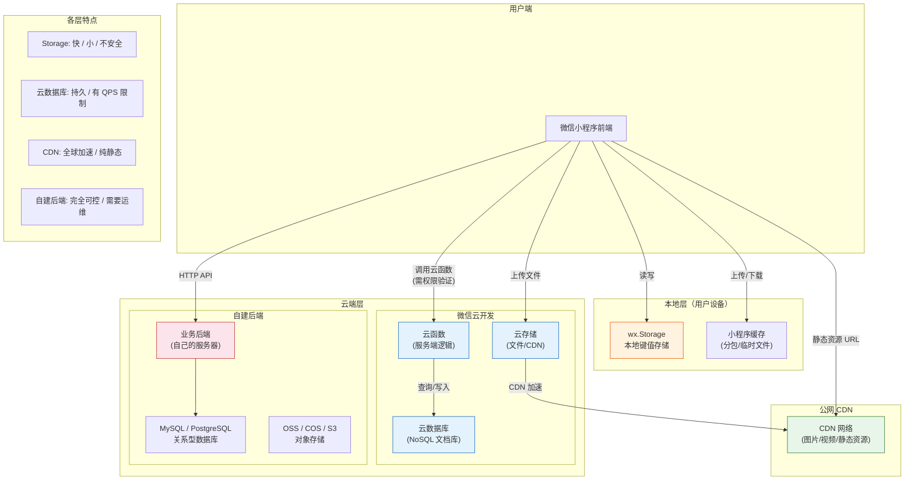

# 10. 本地存储、云函数与 CDN

一个完整的小程序后端体系，离不开**存储**（本地 + 云端）和**CDN 加速**。本篇覆盖 Storage 的正确使用姿势、云开发快速入门，以及 CDN 图片优化策略。

> **环境：** 微信开发者工具 latest，小程序基础库 3.x

---

## 1. 本地存储：sync vs async vs limit

小程序的本地存储有三个 API 系列，性能和使用场景各不相同。

### 1.1 三个 API 系列的对比

| API | 同步性 | 是否阻塞主线程 | 推荐场景 |
|-----|--------|--------------|---------|
| `wx.getStorageSync()` | 同步 | 是（阻塞） | 初始化时读取少量数据 |
| `wx.getStorage()` | 异步 | 否 | 大多数场景 |
| `wx.getStorageInfo()` | 异步 | 否 | 检查存储使用情况 |
| `wx.setStorageSync()` | 同步 | 是（阻塞） | 用户操作后立即保存（但需注意卡顿） |
| `wx.setStorage()` | 异步 | 否 | 大多数写入场景 |

```javascript
// ========== 同步 API ==========
// 优点：代码简洁
// 缺点：阻塞主线程，大数据量时可能导致页面卡顿

const token = wx.getStorageSync('token');
const userInfo = wx.getStorageSync('userInfo');
wx.setStorageSync('token', newToken);


// ========== 异步 API（推荐）==========
// 优点：不阻塞主线程
// 缺点：代码稍复杂（配合 async/await 使用）

async initApp() {
  try {
    const { data: token } = await wx.getStorage({ key: 'token' });
    const { data: userInfo } = await wx.getStorage({ key: 'userInfo' });
    this.globalData.token = token;
    this.globalData.userInfo = userInfo;
  } catch (err) {
    console.log('存储中无数据');
  }
}


// ========== 批量操作 ==========
// 适合一次性读取多个 key
wx.getStorageInfo({
  success: (res) => {
    console.log('所有 key：', res.keys);
    console.log('存储大小：', res.currentSize, 'KB');
    console.log('限制大小：', res.limitSize, 'KB');
  },
});

// 批量设置
wx.setStorage({
  key: 'userInfo',
  data: { name: '张三', age: 18 },
});
wx.setStorage({
  key: 'settings',
  data: { theme: 'dark' },
});
```

### 1.2 Storage 的安全边界

> **重要警告**：小程序 Storage 是**明文存储**在用户设备上的，任何人都可以通过手机的文件管理器访问。这意味着敏感信息（Token、密码、身份证号）**不应该直接存储在 Storage 中**。

```javascript
// 错误做法：明文存储敏感信息
wx.setStorageSync('token', 'eyJhbGciOiJIUzI1NiIsInR5cCI6IkpXVCJ9...');
wx.setStorageSync('password', '123456');

// 正确做法：
// 方案一：后端通过 HttpOnly Cookie 代替前端存储 Token
// 方案二：对敏感数据加密后再存储
const crypto = require('./utils/crypto.js');
const encrypted = crypto.encrypt(JSON.stringify(sensitiveData));
wx.setStorage({ key: 'encrypted_data', data: encrypted });

// 方案三：使用微信提供的加密存储能力（如果有）
```

### 1.3 Storage 封装：带过期时间的键值存储

```javascript
// utils/storage.js

/**
 * 增强版 Storage：支持设置过期时间
 */

const STORAGE_PREFIX = '__expire__';

/**
 * 存储数据（带过期时间）
 * @param {string} key - 键名
 * @param {*} data - 数据
 * @param {number} expire - 过期时间（毫秒）
 */
const setWithExpire = (key, data, expire) => {
  const expireTime = Date.now() + expire;
  wx.setStorage({
    key,
    data: {
      value: data,
      expireTime,
    },
  });
};

/**
 * 获取数据（自动判断过期）
 * @param {string} key - 键名
 * @returns {*} - 数据，过期或不存在返回 null
 */
const getWithExpire = (key) => {
  try {
    const { data } = wx.getStorageSync(key);
    if (!data) return null;

    // 检查是否过期
    if (data.expireTime && Date.now() > data.expireTime) {
      wx.removeStorageSync(key); // 自动删除过期数据
      return null;
    }

    return data.value;
  } catch (err) {
    return null;
  }
};

// 使用示例
// 存储 Token，2 小时后过期
setWithExpire('token', 'abc123', 2 * 60 * 60 * 1000);

// 读取 Token（过期自动返回 null）
const token = getWithExpire('token');
if (!token) {
  // Token 过期，需要重新登录
  await login();
}
```

---

## 2. 云开发：快速上手云函数与云数据库

云开发（CloudBase）是微信提供的一站式后端服务，包含：**云函数**（服务端代码）、**云数据库**（NoSQL）、**云存储**（文件存储）。

### 2.1 开通云开发

在微信开发者工具中，点击右上角"云开发"按钮，按提示开通即可。开通后获得**环境 ID**（用于 SDK 初始化）。

### 2.2 云函数：服务端代码

```javascript
// cloudfunctions/getUserInfo/index.js

// 初始化云数据库
const cloud = require('wx-server-sdk');
cloud.init({ env: cloud.DYNAMIC_CURRENT_ENV });

const db = cloud.database();

// 云函数入口
exports.main = async (event, context) => {
  // event: 小程序端传递的参数
  // context: 运行环境信息（不信任！）
  const { userId } = event;

  try {
    // 查询数据库
    const result = await db.collection('users')
      .where({ _id: userId })
      .field({
        name: true,
        avatar: true,
        phone: false, // 不返回敏感字段
      })
      .get();

    return {
      success: true,
      data: result.data[0],
    };
  } catch (err) {
    return {
      success: false,
      error: err.message,
    };
  }
};
```

### 2.3 小程序端调用云函数

```javascript
// pages/profile/profile.js

// 初始化云开发
const cloud = require('wx-server-sdk');
cloud.init({ env: 'cloud-env-xxx' });

Page({
  data: {
    userInfo: null,
  },

  async fetchUserInfo() {
    try {
      const result = await wx.cloud.callFunction({
        name: 'getUserInfo',  // 云函数名称
        data: {
          userId: 'user_123',
        },
      });
      this.setData({ userInfo: result.result.data });
    } catch (err) {
      wx.showToast({ title: '获取失败', icon: 'none' });
    }
  },
});
```

### 2.4 云数据库操作

```javascript
// utils/database.js

const cloud = require('wx-server-sdk');
cloud.init({ env: cloud.DYNAMIC_CURRENT_ENV });

const db = cloud.database();

// ========== 增 ==========
async function addDocument(collectionName, data) {
  return await db.collection(collectionName).add({
    data: {
      ...data,
      createdAt: db.serverDate(), // 服务端时间
      updatedAt: db.serverDate(),
    },
  });
}

// ========== 查 ==========
async function queryDocuments(collectionName, where, options = {}) {
  let query = db.collection(collectionName).where(where);

  if (options.field) {
    query = query.field(options.field);
  }
  if (options.orderBy) {
    query = query.orderBy(options.orderBy.field, options.orderBy.order);
  }
  if (options.limit) {
    query = query.limit(options.limit);
  }

  return await query.get();
}

// ========== 改 ==========
async function updateDocument(collectionName, docId, data) {
  return await db.collection(collectionName).doc(docId).update({
    data: {
      ...data,
      updatedAt: db.serverDate(),
    },
  });
}

// ========== 删 ==========
async function deleteDocument(collectionName, docId) {
  return await db.collection(collectionName).doc(docId).remove();
}

// 使用示例
async function createPost(postData) {
  const result = await addDocument('posts', {
    title: postData.title,
    content: postData.content,
    authorId: postData.authorId,
    tags: postData.tags,
  });
  return result.id;
}
```

### 2.5 云存储：文件上传与下载

```javascript
// utils/cloud-storage.js

/**
 * 上传文件到云存储
 * @param {string} filePath - 临时文件路径（通过 wx.chooseImage 等获取）
 * @param {string} cloudPath - 云存储路径
 */
const uploadFile = (filePath, cloudPath) => {
  return new Promise((resolve, reject) => {
    wx.cloud.uploadFile({
      cloudPath, // 注意：cloudPath 不能包含 / 开头
      filePath,
      success: (res) => {
        // res.fileID: 云存储的文件 ID
        // 获取文件访问链接
        wx.cloud.getTempFileURL({
          fileList: [res.fileID],
          success: (urlRes) => {
            resolve({
              fileID: res.fileID,
              url: urlRes.fileList[0].tempFileURL,
            });
          },
        });
      },
      fail: reject,
    });
  });
};

/**
 * 选择图片并上传
 */
async function chooseAndUploadImage() {
  // 1. 选择图片
  const { tempFilePaths } = await wx.chooseImage({
    count: 1,
    sizeType: ['compressed'],
    sourceType: ['album', 'camera'],
  });

  // 2. 生成云存储路径
  const cloudPath = `images/${Date.now()}-${Math.random().toString(36).slice(2)}.jpg`;

  // 3. 上传
  const result = await uploadFile(tempFilePaths[0], cloudPath);
  console.log('图片 URL：', result.url);
  return result.url;
}
```

---

## 3. CDN 加速与图片优化

CDN（内容分发网络）是小程序图片加载优化的核心手段。核心思路是：**把图片存到 CDN，从 CDN 加载，减少主服务器压力，加快访问速度**。

### 3.1 CDN URL 参数：按需裁剪

主流 CDN（如七牛、阿里云 OSS、腾讯云 COS）都支持 URL 参数动态裁剪：

```javascript
// 假设基础图片 URL
const baseUrl = 'https://cdn.example.com/image.jpg';

// CDN 参数裁剪
const cdnUrl = `${baseUrl}?imageMogr2/thumbnail/!300x300r/gravity/Center/crop/300x300`;
// !300x300r：裁剪为 300x300，保持比例，超出部分裁剪
// gravity/Center：居中裁剪

// 常用 CDN 参数组合
const urls = {
  // 缩略图（小图）
  thumbnail: `${baseUrl}?imageMogr2/thumbnail/!100x100r`,

  // 中等图（列表页）
  medium: `${baseUrl}?imageMogr2/thumbnail/!300x300r`,

  // 大图（详情页）
  large: `${baseUrl}?imageMogr2/thumbnail/!600x600r`,

  // 圆形裁剪（头像）
  circle: `${baseUrl}?imageMogr2/circle/r/100`,

  // 质量压缩
  compressed: `${baseUrl}?imageMogr2/quality/80`,

  // 格式转换（WebP，可节省 30% 体积）
  webp: `${baseUrl}?imageMogr2/format/webp`,
};
```

### 3.2 图片加载策略

```javascript
// utils/image-loader.js

/**
 * 根据用途选择最优图片尺寸
 * @param {string} originalUrl - 原始图片 URL
 * @param {string} useCase - 用途：avatar | list | detail | banner
 */
const getOptimizedImageUrl = (originalUrl, useCase = 'list') => {
  const cdnBase = 'https://cdn.example.com';
  const path = originalUrl.replace(cdnBase, '');

  // 如果原图本身已经 CDN 化，直接用 URL 参数
  if (originalUrl.includes('cdn.example.com')) {
    switch (useCase) {
      case 'avatar':
        return `${originalUrl}?imageMogr2/thumbnail/!200x200r/format/webp`;
      case 'list':
        return `${originalUrl}?imageMogr2/thumbnail/!300x300r/format/webp`;
      case 'detail':
        return `${originalUrl}?imageMogr2/thumbnail/!600x600r/format/webp`;
      case 'banner':
        return `${originalUrl}?imageMogr2/thumbnail/!750x400r/format/webp`;
      default:
        return originalUrl;
    }
  }

  return originalUrl; // 非 CDN 图片，直接返回
};

/**
 * 带占位图的图片加载
 */
const loadImageWithPlaceholder = (imageUrl, placeholderUrl = '/assets/placeholder.png') => {
  return new Promise((resolve) => {
    // 先显示占位图
    const img = wx.createImage();
    img.src = imageUrl;
    img.onload = () => resolve(imageUrl);
    img.onerror = () => {
      console.error('图片加载失败：', imageUrl);
      resolve(placeholderUrl); // 兜底占位图
    };
  });
};
```

### 3.3 分包懒加载：图片不在主包

```json
{
  "subPackages": [
    {
      "root": "pages/shop/",
      "pages": [
        "goods/detail",
        "goods/list",
        "goods/comments"
      ]
    },
    {
      "root": "pages/user/",
      "pages": [
        "profile",
        "settings",
        "about"
      ]
    }
  ]
}
```

> **关键**：分包后，每个分包只能访问自己的资源。如果主包中的图片需要被分包使用，要么放在主包，要么上传到 CDN。

---

## 4. 数据流全景图：Storage vs 云数据库 vs CDN

三种存储方式在小程序中承担不同的角色，理解它们的关系才能做出正确的架构决策：



### 6.1 存储选型决策表

| 数据类型 | 推荐存储 | 原因 |
|---------|---------|------|
| 用户偏好（主题、语言） | Storage | 轻量、低频访问 |
| Token / 会话 | Storage + 加密 | 需配合后端验证 |
| 用户生成内容（帖子、评论） | 云数据库 / 自建后端 | 需要持久化、查询 |
| 图片 / 视频 | CDN / 云存储 | 体积大、需要加速 |
| 离线缓存数据 | Storage + 过期管理 | 定期清理 |

---

## 5. 常见坑点

```javascript
// 检查存储使用情况
wx.getStorageInfo({
  success: (res) => {
    if (res.currentSize >= res.limitSize * 0.8) {
      wx.showModal({
        title: '存储空间不足',
        content: '请清理不必要的缓存数据',
      });
    }
  },
});
```

**2. 云函数调用报错 "env not found"**

```javascript
// 错误：在云函数中硬编码环境 ID
cloud.init({ env: 'my-env-xxx' }); // 每次换环境都要改代码

// 正确：使用动态环境
cloud.init({ env: cloud.DYNAMIC_CURRENT_ENV }); // 自动使用当前云函数所在环境
```

**3. 图片 URL 没有协议前缀**

```javascript
// 错误：从后端返回的图片 URL 缺少 https://
const imageUrl = 'cdn.example.com/image.jpg'; // 相对路径

// 正确：确保 URL 完整
const imageUrl = 'https://cdn.example.com/image.jpg';
```

**4. Storage 数据类型隐式转换**

```javascript
// wx.getStorageSync 会保留原始数据类型
wx.setStorageSync('count', 5);
const count = wx.getStorageSync('count'); // number: 5

// 但如果存储的是对象，取出来用 instanceof Object 判断
wx.setStorageSync('user', { name: '张三' });
const user = wx.getStorageSync('user');
// user 可能是 undefined（第一次读取失败）
if (user) {
  console.log(user.name);
}
```

---

## 延伸思考

Storage、云开发和 CDN，构成了小程序后端的"三层存储架构"：

- **Storage（本地）**：最快速，但容量小（默认 10MB）、不持久（卸载小程序后清除）、不安全
- **云数据库（云端）**：可持久化、结构化查询，但读写有 QPS 限制（每秒 20-100 次）
- **CDN（公网）**：无存储限制、全球加速，但不支持动态内容（图片视频等静态资源）

选择哪一层存储，取决于数据的使用模式：**高频访问的轻量数据**用 Storage，**需要持久化的结构化数据**用云数据库，**静态资源（图片、视频）**用 CDN。

---

## 总结

- **Storage sync API** 简单但阻塞主线程，async API 是更推荐的选择
- Storage **明文存储**，敏感信息必须加密或通过后端管理
- **云函数**：运行在微信服务端，可以访问云数据库（适合需要权限验证的后端逻辑）
- **云数据库**：NoSQL 文档数据库，适合存储结构灵活的业务数据
- **CDN**：图片懒加载 + URL 参数裁剪 + WebP 格式 = 三重优化叠加

---

## 参考

- [wx.setStorage 文档](https://developers.weixin.qq.com/miniprogram/dev/api/storage/wx.setStorage.html)
- [云开发官方文档](https://developers.weixin.qq.com/miniprogram/dev/wxcloud/basis/getting-started.html)
- [CDN 加速与配置](https://developers.weixin.qq.com/miniprogram/dev/framework/ability/network.html)
