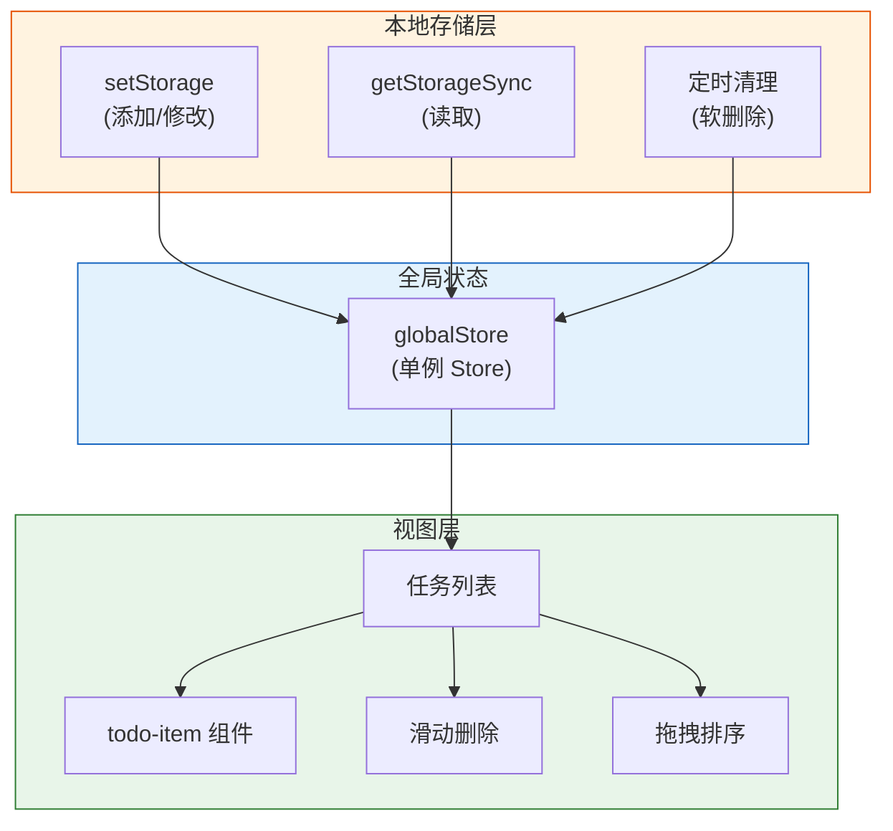

# 11. 实战（一）：TodoList 任务管理

本系列第一个实战项目：TodoList 任务管理。这是一个看似简单，但涵盖了小程序核心能力（本地存储、组件化、状态管理、滑动交互）的经典练手项目。

最终效果：可添加/删除/完成任务，支持滑动删除、拖拽排序、本地持久化、暗黑模式。

> **环境：** 微信开发者工具 latest，小程序基础库 3.x

---

## 1. 需求分析与架构设计

### 1.1 功能清单

| 功能 | 优先级 | 实现方案 |
|------|--------|---------|
| 添加任务 | P0 | 输入框 + 回车/按钮提交 |
| 完成任务 | P0 | 点击切换完成状态 |
| 删除任务 | P0 | 左滑删除（touch 操作） |
| 任务列表 | P0 | 本地存储 + 状态驱动渲染 |
| 任务持久化 | P1 | wx.setStorage |
| 撤销删除 | P1 | 软删除 + 倒计时清除 |
| 拖拽排序 | P2 | movable-area |
| 暗黑模式 | P2 | 系统主题监听 + CSS 变量 |

### 1.2 项目结构

```
pages/
└── index/
    ├── index.js            # 页面逻辑
    ├── index.wxml           # 页面结构
    ├── index.wxss           # 页面样式
    └── index.json           # 页面配置

components/
└── todo-item/
    ├── todo-item.js        # 任务项组件
    ├── todo-item.wxml
    ├── todo-item.wxss
    └── todo-item.json

utils/
├── storage.js             # 存储工具（带过期）
└── date.js                # 日期格式化

app.wxss                   # 全局样式 + CSS 变量
```

### 1.3 架构流程图



---

## 2. 全局 Store 封装

```javascript
// utils/store.js

class Store {
  constructor(state = {}) {
    this._state = state;
    this._listeners = [];
  }

  getState() {
    return this._state;
  }

  setState(newState, callback) {
    const prevState = { ...this._state };
    this._state = { ...this._state, ...newState };
    this._notify(prevState);
    if (callback) callback();
  }

  subscribe(listener) {
    this._listeners.push(listener);
    return () => {
      this._listeners = this._listeners.filter(fn => fn !== listener);
    };
  }

  _notify(prevState) {
    this._listeners.forEach(listener => {
      listener(this._state, prevState);
    });
  }
}

// 导出单例
const store = new Store({
  todos: [],          // 任务列表
  deletedTodo: null,  // 被删除的任务（用于撤销）
  theme: 'light',     // 当前主题
});

export default store;
```

---

## 3. 存储工具封装

```javascript
// utils/storage.js

const STORAGE_KEY = 'todo_list';

/**
 * 从 Storage 加载任务列表
 */
function loadTodos() {
  try {
    const data = wx.getStorageSync(STORAGE_KEY);
    return data || [];
  } catch (err) {
    console.error('加载任务失败：', err);
    return [];
  }
}

/**
 * 保存任务列表到 Storage
 */
function saveTodos(todos) {
  try {
    wx.setStorageSync(STORAGE_KEY, todos);
  } catch (err) {
    console.error('保存任务失败：', err);
  }
}

/**
 * 生成唯一 ID
 */
function generateId() {
  return `${Date.now()}-${Math.random().toString(36).slice(2, 8)}`;
}

/**
 * 添加任务
 */
function addTodo(text) {
  const todos = loadTodos();
  const newTodo = {
    id: generateId(),
    text: text.trim(),
    completed: false,
    createdAt: Date.now(),
    deletedAt: null,  // null 表示未删除
  };
  todos.unshift(newTodo);  // 新任务插入到列表头部
  saveTodos(todos);
  return newTodo;
}

/**
 * 删除任务（软删除）
 */
function softDeleteTodo(id) {
  const todos = loadTodos();
  const todo = todos.find(t => t.id === id);
  if (todo) {
    todo.deletedAt = Date.now();
    saveTodos(todos);
    return todo;
  }
  return null;
}

/**
 * 永久删除（撤销超时后调用）
 */
function permanentDeleteTodo(id) {
  const todos = loadTodos();
  const filtered = todos.filter(t => t.id !== id);
  saveTodos(filtered);
}

/**
 * 清理已软删除的任务（超过撤销时限）
 */
function cleanupDeletedTodos(undoTimeout = 5000) {
  const todos = loadTodos();
  const now = Date.now();
  const validTodos = todos.filter(t => {
    if (t.deletedAt && (now - t.deletedAt) > undoTimeout) {
      return false; // 超过撤销时限，删除
    }
    return true;
  });
  saveTodos(validTodos);
  return validTodos;
}

/**
 * 撤销删除
 */
function restoreTodo(id) {
  const todos = loadTodos();
  const todo = todos.find(t => t.id === id);
  if (todo) {
    todo.deletedAt = null;
    saveTodos(todos);
    return todo;
  }
  return null;
}

/**
 * 切换完成状态
 */
function toggleTodo(id) {
  const todos = loadTodos();
  const todo = todos.find(t => t.id === id);
  if (todo) {
    todo.completed = !todo.completed;
    saveTodos(todos);
    return todo;
  }
  return null;
}

/**
 * 更新任务文本
 */
function updateTodoText(id, newText) {
  const todos = loadTodos();
  const todo = todos.find(t => t.id === id);
  if (todo) {
    todo.text = newText.trim();
    saveTodos(todos);
    return todo;
  }
  return null;
}

export {
  loadTodos,
  saveTodos,
  addTodo,
  softDeleteTodo,
  permanentDeleteTodo,
  cleanupDeletedTodos,
  restoreTodo,
  toggleTodo,
  updateTodoText,
  generateId,
};
```

---

## 4. 任务项组件

```javascript
// components/todo-item/todo-item.js

Component({
  properties: {
    todo: {
      type: Object,
      value: null,
    },
    index: {
      type: Number,
      value: 0,
    },
  },

  data: {
    // 滑动相关状态
    swipeX: 0,
    swipeThreshold: 150,  // 滑动阈值
    isDeleting: false,
  },

  methods: {
    // 点击复选框
    onToggle() {
      this.triggerEvent('toggle', {
        id: this.properties.todo.id,
      });
    },

    // 点击任务项（编辑）
    onItemTap() {
      this.triggerEvent('edit', {
        id: this.properties.todo.id,
        text: this.properties.todo.text,
      });
    },

    // 左滑开始
    onTouchStart(e) {
      this.startX = e.touches[0].clientX;
    },

    // 左滑中
    onTouchMove(e) {
      const currentX = e.touches[0].clientX;
      const deltaX = this.startX - currentX;
      // 只允许左滑（delta > 0）
      if (deltaX > 0) {
        this.setData({
          swipeX: Math.min(deltaX, 180),  // 最多左滑 180px
        });
      }
    },

    // 左滑结束
    onTouchEnd() {
      const { swipeX, swipeThreshold } = this.data;
      if (swipeX > swipeThreshold) {
        // 滑动超过阈值，显示删除按钮
        this.setData({ swipeX: 160 });
      } else {
        // 滑动未超过阈值，恢复原位
        this.setData({ swipeX: 0 });
      }
    },

    // 确认删除
    onDelete() {
      this.setData({ isDeleting: true });
      this.triggerEvent('delete', {
        id: this.properties.todo.id,
      });
    },
  },
});
```

```html
<!-- components/todo-item/todo-item.wxml -->

<view class="todo-item-wrapper">
  <!-- 滑动层（背景删除按钮） -->
  <view class="swipe-bg">
    <view class="delete-btn" bindtap="onDelete">删除</view>
  </view>

  <!-- 主内容层 -->
  <view
    class="todo-item {{todo.completed ? 'completed' : ''}} {{isDeleting ? 'deleting' : ''}}"
    style="transform: translateX(-{{swipeX}}rpx)"
    bindtouchstart="onTouchStart"
    bindtouchmove="onTouchMove"
    bindtouchend="onTouchEnd"
    bindtap="onItemTap">

    <!-- 复选框 -->
    <view class="checkbox {{todo.completed ? 'checked' : ''}}" bindtap="onToggle">
      <text wx:if="{{todo.completed}}">✓</text>
    </view>

    <!-- 任务文字 -->
    <text class="todo-text {{todo.completed ? 'text-done' : ''}}">
      {{todo.text}}
    </text>
  </view>
</view>
```

```css
/* components/todo-item/todo-item.wxss */

.todo-item-wrapper {
  position: relative;
  overflow: hidden;
  border-radius: 12rpx;
  margin-bottom: 16rpx;
}

.swipe-bg {
  position: absolute;
  top: 0;
  right: 0;
  height: 100%;
  width: 160rpx;
  background-color: #ff4757;
  display: flex;
  align-items: center;
  justify-content: center;
}

.delete-btn {
  color: #ffffff;
  font-size: 28rpx;
  font-weight: bold;
}

.todo-item {
  position: relative;
  display: flex;
  align-items: center;
  padding: 24rpx;
  background-color: var(--card-bg);
  transition: transform 0.3s ease;
  z-index: 1;
}

.todo-item.completed {
  background-color: var(--card-bg-dim);
}

.todo-item.deleting {
  transform: translateX(-100%) !important;
  transition: transform 0.3s ease;
}

/* 复选框 */
.checkbox {
  width: 44rpx;
  height: 44rpx;
  border: 3rpx solid var(--border-color);
  border-radius: 50%;
  display: flex;
  align-items: center;
  justify-content: center;
  margin-right: 20rpx;
  flex-shrink: 0;
  transition: all 0.2s;
}

.checkbox.checked {
  background-color: var(--primary-color);
  border-color: var(--primary-color);
  color: #ffffff;
  font-size: 24rpx;
}

/* 任务文字 */
.todo-text {
  flex: 1;
  font-size: 30rpx;
  color: var(--text-color);
  line-height: 1.5;
}

.todo-text.text-done {
  text-decoration: line-through;
  color: var(--text-color-dim);
}
```

---

## 5. 页面主逻辑

```javascript
// pages/index/index.js

import store from '../../utils/store.js';
import {
  loadTodos,
  addTodo,
  softDeleteTodo,
  permanentDeleteTodo,
  cleanupDeletedTodos,
  restoreTodo,
  toggleTodo,
} from '../../utils/storage.js';

Page({
  data: {
    todos: [],
    inputValue: '',
    showUndo: false,
    undoTimer: null,
    deletedTodo: null,
  },

  // ========== 生命周期 ==========
  onLoad() {
    // 初始化：加载任务列表
    const todos = loadTodos().filter(t => !t.deletedAt);  // 排除软删除的
    this.setData({ todos });

    // 订阅 Store 变化
    this.unsubscribe = store.subscribe((newState, prevState) => {
      if (newState.todos !== prevState.todos) {
        this.setData({ todos: newState.todos });
      }
    });
  },

  onUnload() {
    // 清理订阅
    if (this.unsubscribe) {
      this.unsubscribe();
    }
    // 清理定时器
    if (this.data.undoTimer) {
      clearTimeout(this.data.undoTimer);
    }
  },

  // ========== 事件处理 ==========

  // 输入框内容变化
  onInput(e) {
    this.setData({ inputValue: e.detail.value });
  },

  // 添加任务（回车或点击按钮）
  onAddTodo() {
    const text = this.data.inputValue.trim();
    if (!text) {
      wx.showToast({ title: '请输入任务内容', icon: 'none' });
      return;
    }

    const newTodo = addTodo(text);
    store.setState({ todos: [newTodo, ...store.getState().todos] });
    this.setData({ inputValue: '' });

    wx.vibrateShort({ type: 'light' });  // 震动反馈
  },

  // 切换完成状态
  onToggle(e) {
    const { id } = e.detail;
    const todo = toggleTodo(id);
    if (todo) {
      const todos = loadTodos().filter(t => !t.deletedAt);
      store.setState({ todos });
    }
  },

  // 删除任务（软删除 + 撤销机制）
  onDelete(e) {
    const { id } = e.detail;
    const deletedTodo = softDeleteTodo(id);
    if (!deletedTodo) return;

    // 更新视图（隐藏已删除的任务）
    const todos = loadTodos().filter(t => !t.deletedAt);
    store.setState({ todos });

    // 显示撤销提示
    this.setData({ showUndo: true, deletedTodo });

    // 设置撤销倒计时
    if (this.data.undoTimer) {
      clearTimeout(this.data.undoTimer);
    }

    this.data.undoTimer = setTimeout(() => {
      // 超时后永久删除
      permanentDeleteTodo(deletedTodo.id);
      this.setData({ showUndo: false, deletedTodo: null });
    }, 5000);
  },

  // 撤销删除
  onUndo() {
    if (!this.data.deletedTodo) return;

    restoreTodo(this.data.deletedTodo.id);
    const todos = loadTodos().filter(t => !t.deletedAt);
    store.setState({ todos });

    if (this.data.undoTimer) {
      clearTimeout(this.data.undoTimer);
    }

    this.setData({ showUndo: false, deletedTodo: null });
    wx.showToast({ title: '已撤销', icon: 'none' });
  },

  // 编辑任务
  onEdit(e) {
    const { id, text } = e.detail;
    wx.showModal({
      title: '编辑任务',
      editable: true,
      placeholderText: '请输入新内容',
      content: text,
      success: (res) => {
        if (res.confirm && res.content.trim()) {
          const todos = loadTodos();
          const todo = todos.find(t => t.id === id);
          if (todo) {
            todo.text = res.content.trim();
            wx.setStorageSync('todo_list', todos);
            const allTodos = loadTodos().filter(t => !t.deletedAt);
            store.setState({ todos: allTodos });
          }
        }
      },
    });
  },
});
```

---

## 6. 页面结构与样式

```html
<!-- pages/index/index.wxml -->

<view class="page" style="--theme-bg: {{isDark ? '#1a1a1a' : '#f5f5f5'}}; --theme-card: {{isDark ? '#2a2a2a' : '#ffffff'}};">

  <!-- 头部 -->
  <view class="header">
    <text class="title">任务清单</text>
    <text class="subtitle">{{todos.length}} 个任务 · {{completedCount}} 已完成</text>
  </view>

  <!-- 输入区域 -->
  <view class="input-wrapper">
    <input
      class="todo-input"
      value="{{inputValue}}"
      placeholder="添加新任务..."
      bindinput="onInput"
      bindconfirm="onAddTodo"
      confirm-type="done"
    />
    <view class="add-btn" bindtap="onAddTodo">
      <text>添加</text>
    </view>
  </view>

  <!-- 任务列表 -->
  <scroll-view scroll-y class="todo-list">
    <block wx:if="{{todos.length > 0}}">
      <todo-item
        wx:for="{{todos}}"
        wx:key="id"
        todo="{{item}}"
        index="{{index}}"
        bind:toggle="onToggle"
        bind:delete="onDelete"
        bind:edit="onEdit"
      />
    </block>

    <!-- 空状态 -->
    <block wx:else>
      <view class="empty-state">
        <text class="empty-icon">📝</text>
        <text class="empty-text">还没有任务</text>
        <text class="empty-hint">添加一个新任务开始吧</text>
      </view>
    </block>
  </scroll-view>

  <!-- 撤销提示 -->
  <view wx:if="{{showUndo}}" class="undo-bar">
    <text>任务已删除</text>
    <view class="undo-btn" bindtap="onUndo">
      <text>撤销</text>
    </view>
  </view>

</view>
```

```css
/* pages/index/index.wxss */

/* CSS 变量（暗黑模式） */
page {
  --primary-color: #07C160;
  --card-bg: #ffffff;
  --card-bg-dim: #f9f9f9;
  --text-color: #333333;
  --text-color-dim: #999999;
  --border-color: #e0e0e0;
  --bg-color: #f5f5f5;
}

@media preprocessor-theme-dark {
  page {
    --card-bg: #2a2a2a;
    --card-bg-dim: #252525;
    --text-color: #e0e0e0;
    --text-color-dim: #888888;
    --border-color: #444444;
    --bg-color: #1a1a1a;
  }
}

.page {
  min-height: 100vh;
  background-color: var(--bg-color);
  padding: 0 32rpx;
}

/* 头部 */
.header {
  padding: 60rpx 0 40rpx;
}

.title {
  display: block;
  font-size: 48rpx;
  font-weight: bold;
  color: var(--text-color);
  margin-bottom: 12rpx;
}

.subtitle {
  font-size: 26rpx;
  color: var(--text-color-dim);
}

/* 输入区域 */
.input-wrapper {
  display: flex;
  align-items: center;
  margin-bottom: 32rpx;
}

.todo-input {
  flex: 1;
  height: 88rpx;
  padding: 0 24rpx;
  background-color: var(--card-bg);
  border-radius: 44rpx;
  font-size: 28rpx;
  box-shadow: 0 2rpx 12rpx rgba(0, 0, 0, 0.06);
}

.add-btn {
  width: 120rpx;
  height: 88rpx;
  background-color: var(--primary-color);
  border-radius: 44rpx;
  display: flex;
  align-items: center;
  justify-content: center;
  margin-left: 16rpx;
  color: #ffffff;
  font-size: 28rpx;
}

.add-btn:active {
  opacity: 0.8;
}

/* 任务列表 */
.todo-list {
  height: calc(100vh - 300rpx);
}

/* 空状态 */
.empty-state {
  display: flex;
  flex-direction: column;
  align-items: center;
  padding-top: 120rpx;
}

.empty-icon {
  font-size: 96rpx;
  margin-bottom: 24rpx;
}

.empty-text {
  font-size: 32rpx;
  color: var(--text-color);
  margin-bottom: 12rpx;
}

.empty-hint {
  font-size: 26rpx;
  color: var(--text-color-dim);
}

/* 撤销提示 */
.undo-bar {
  position: fixed;
  bottom: 60rpx;
  left: 50%;
  transform: translateX(-50%);
  display: flex;
  align-items: center;
  padding: 20rpx 32rpx;
  background-color: #333333;
  color: #ffffff;
  border-radius: 44rpx;
  font-size: 28rpx;
  box-shadow: 0 4rpx 20rpx rgba(0, 0, 0, 0.2);
  animation: slideUp 0.3s ease;
}

@keyframes slideUp {
  from {
    opacity: 0;
    transform: translateX(-50%) translateY(20rpx);
  }
  to {
    opacity: 1;
    transform: translateX(-50%) translateY(0);
  }
}

.undo-btn {
  margin-left: 24rpx;
  padding: 8rpx 24rpx;
  background-color: rgba(255, 255, 255, 0.2);
  border-radius: 24rpx;
  font-size: 26rpx;
}
```

---

## 7. 常见坑点

**1. 软删除后列表不同步**

删除任务后立即从 `store.getState().todos` 中过滤掉，而不是等待 Storage 操作完成。确保 `softDeleteTodo` 和 UI 更新在同一个同步块中完成。

**2. 多个撤销定时器冲突**

每次软删除都创建新的定时器覆盖旧的。使用 `if (this.data.undoTimer) clearTimeout()` 确保只有一个撤销定时器在运行。

**3. CSS 变量在模拟器和真机表现不一致**

暗黑模式的 `@media preprocessor-theme-dark` 在开发者工具中需要切换"详情 → 外观 → 调试 Dark Mode"才能看到效果。

---

## 延伸思考

TodoList 虽小，但涵盖了小程序开发的三大核心模式：

- **数据驱动**：`setData` + Store 订阅，让数据和视图始终同步
- **组件封装**：`todo-item` 组件隔离了滑动逻辑和样式复用
- **存储抽象**：将 Storage 操作封装成工具函数，页面逻辑不直接接触 Storage

这三个模式构成了小程序工程化的基础。复杂应用不过是在这三个模式上叠加了更多层次和边界。

---

## 总结

- 使用 Store 单例管理全局任务列表，配合订阅模式实现跨组件同步
- Storage 封装支持软删除 + 撤销机制，提升用户体验
- `touch` 系列事件实现左滑删除（不用任何第三方库）
- CSS 变量 + `preprocessor-theme-dark` 实现系统级暗黑模式
- `wx.vibrateShort` 提供触觉反馈，增强操作感

---

## 参考

- [Storage 中软删除模式参考](https://developers.weixin.qq.com/miniprogram/dev/framework/usability/storage.html)
- [touch 事件体系](https://developers.weixin.qq.com/miniprogram/dev/framework/view/component.html)
- [wx.vibrateShort 触觉反馈](https://developers.weixin.qq.com/miniprogram/dev/api/device/vibrate/wx.vibrateShort.html)
