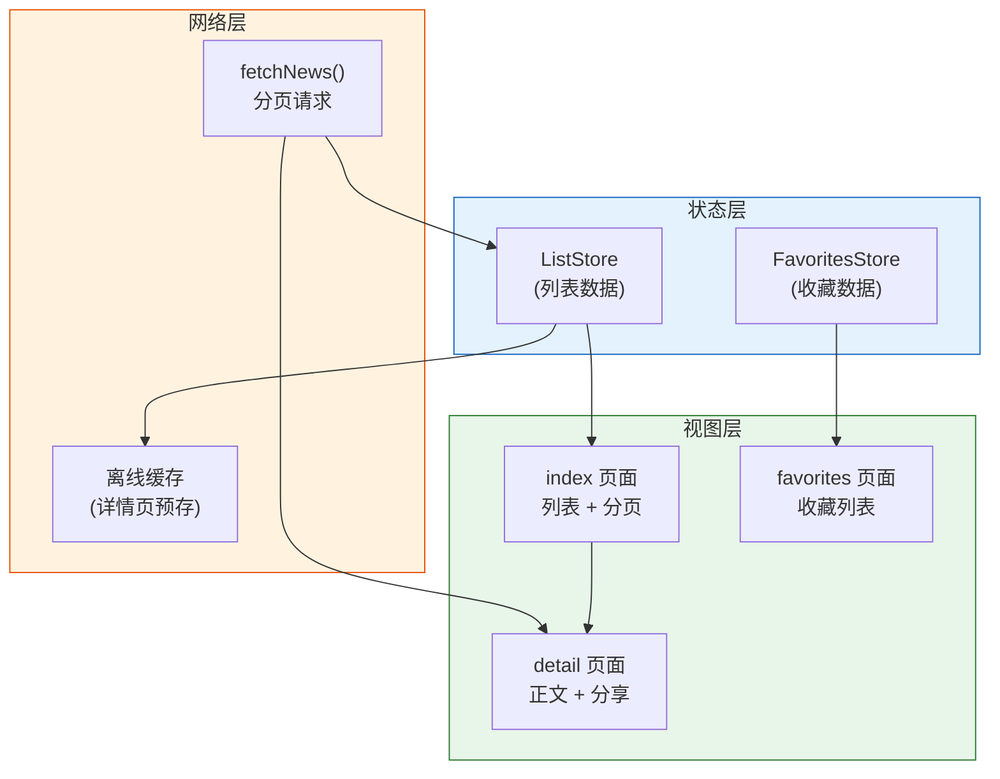

# 12. 实战（二）：新闻阅读器

本系列第二个实战项目：新闻阅读器。这是一个典型的内容类应用，涵盖了**列表页优化**（虚拟列表 + 图片懒加载）、**详情页复用**、**收藏与离线缓存**等核心能力。

最终效果：新闻列表（支持分页加载、图片懒加载） + 详情页（模板复用、分享、收藏） + 本地收藏列表。

> **环境：** 微信开发者工具 latest，小程序基础库 3.x，需要新闻 API（可使用 NewsAPI 或聚合数据）

---

## 1. 需求分析与架构设计

### 1.1 功能清单

| 功能 | 优先级 | 实现方案 |
|------|--------|---------|
| 新闻列表 | P0 | scroll-view + 分页加载 |
| 图片懒加载 | P0 | IntersectionObserver |
| 详情页 | P0 | navigator 跳转 |
| 收藏功能 | P1 | Storage 持久化 |
| 分享能力 | P1 | onShareAppMessage |
| 离线缓存 | P2 | 详情页内容缓存到 Storage |
| 暗黑模式 | P2 | CSS 变量 + 系统监听 |

### 1.2 页面结构

```
pages/
├── index/                    # 首页（新闻列表）
│   ├── index.js
│   ├── index.wxml
│   ├── index.wxss
│   └── index.json
├── detail/                   # 详情页
│   ├── detail.js
│   ├── detail.wxml
│   ├── detail.wxss
│   └── detail.json
└── favorites/               # 收藏列表
    ├── favorites.js
    ├── favorites.wxml
    ├── favorites.wxml
    └── favorites.json

components/
├── news-card/               # 新闻卡片组件
│   └── ...
└── lazy-image/              # 懒加载图片组件
      └── ...

utils/
├── api.js                    # API 请求封装
├── storage.js               # Storage 工具
└── date.js                   # 日期格式化
```

### 1.3 阅读器三层架构



---

## 2. API 请求封装

```javascript
// utils/api.js

import { get } from './http.js';

const NEWS_API_BASE = 'https://newsapi.example.com/v2';  // 替换为实际 API

/**
 * 获取新闻列表
 * @param {number} page - 页码
 * @param {number} pageSize - 每页数量
 */
async function fetchNewsList(page = 1, pageSize = 10) {
  try {
    const data = await get(`${NEWS_API_BASE}/top-headlines`, {
      country: 'zh',
      page,
      pageSize,
    });
    return {
      articles: data.articles || [],
      total: data.totalResults || 0,
      page,
      pageSize,
      hasMore: page * pageSize < (data.totalResults || 0),
    };
  } catch (err) {
    console.error('获取新闻列表失败：', err);
    throw err;
  }
}

/**
 * 获取新闻详情
 * @param {string} newsId - 新闻 ID
 */
async function fetchNewsDetail(newsId) {
  try {
    const data = await get(`${NEWS_API_BASE}/articles/${newsId}`);
    return data;
  } catch (err) {
    console.error('获取新闻详情失败：', err);
    throw err;
  }
}

export {
  fetchNewsList,
  fetchNewsDetail,
};
```

---

## 3. 懒加载图片组件

```javascript
// components/lazy-image/lazy-image.js

Component({
  properties: {
    src: {
      type: String,
      value: '',
    },
    mode: {
      type: String,
      value: 'aspectFill',  // aspectFill | aspectFit | widthFix
    },
    defaultSrc: {
      type: String,
      value: '/assets/default-image.png',
    },
  },

  data: {
    loaded: false,
    realSrc: '',
  },

  lifetimes: {
    attached() {
      this.initObserver();
    },
    detached() {
      if (this.observer) {
        this.observer.disconnect();
      }
    },
  },

  observers: {
    src(newVal) {
      if (newVal) {
        this.setData({ realSrc: newVal, loaded: false });
      } else {
        this.setData({ realSrc: this.properties.defaultSrc });
      }
    },
  },

  methods: {
    initObserver() {
      // 使用 IntersectionObserver 监听元素是否进入视口
      this.observer = wx.createIntersectionObserver(this);
      this.observer
        .relativeToViewport({ bottom: 100 })  // 提前 100px 加载
        .observe('.lazy-image', (res) => {
          if (res.intersectionRatio > 0) {
            // 进入视口，加载图片
            this.setData({ loaded: true });
            // 停止监听
            this.observer.disconnect();
          }
        });
    },

    onImageLoad() {
      this.setData({ loaded: true });
    },

    onImageError() {
      // 加载失败，显示默认图
      this.setData({ realSrc: this.properties.defaultSrc });
    },
  },
});
```

```html
<!-- components/lazy-image/lazy-image.wxml -->

<view class="lazy-image-wrapper">
  <!-- 占位骨架屏 -->
  <view wx:if="{{!loaded}}" class="skeleton"></view>

  <!-- 图片 -->
  <image
    wx:if="{{loaded && realSrc}}"
    class="lazy-image {{loaded ? 'visible' : ''}}"
    src="{{realSrc}}"
    mode="{{mode}}"
    bindload="onImageLoad"
    binderror="onImageError"/>

  <!-- 默认图（未加载或加载失败） -->
  <image
    wx:if="{{!loaded || !realSrc}}"
    class="lazy-image"
    src="{{defaultSrc}}"
    mode="{{mode}}"/>
</view>
```

```css
/* components/lazy-image/lazy-image.wxss */

.lazy-image-wrapper {
  position: relative;
  width: 100%;
  height: 100%;
  overflow: hidden;
}

.skeleton {
  position: absolute;
  top: 0;
  left: 0;
  width: 100%;
  height: 100%;
  background: linear-gradient(90deg, #f0f0f0 25%, #e0e0e0 50%, #f0f0f0 75%);
  background-size: 200% 100%;
  animation: shimmer 1.5s infinite;
}

@keyframes shimmer {
  0% { background-position: 200% 0; }
  100% { background-position: -200% 0; }
}

.lazy-image {
  width: 100%;
  height: 100%;
  opacity: 0;
  transition: opacity 0.3s ease;
}

.lazy-image.visible {
  opacity: 1;
}
```

---

## 4. 新闻列表页

```javascript
// pages/index/index.js

import { fetchNewsList } from '../../utils/api.js';
import { getFavorites, addFavorite, removeFavorite } from '../../utils/storage.js';

Page({
  data: {
    articles: [],
    page: 1,
    hasMore: true,
    loading: false,
    refreshing: false,
  },

  onLoad() {
    this.loadData();
    // 监听收藏状态变化
    this.unsubscribe = wx eventBus?.on?.('favoritesChanged', () => {
      this.setData({}); // 触发 WXML 重新渲染（更新收藏图标）
    });
  },

  onUnload() {
    if (this.unsubscribe) this.unsubscribe();
  },

  // 下拉刷新
  async onPullDownRefresh() {
    this.setData({ refreshing: true, page: 1, hasMore: true });
    try {
      const result = await fetchNewsList(1);
      this.setData({
        articles: result.articles,
        hasMore: result.hasMore,
        page: 1,
      });
    } catch (err) {
      wx.showToast({ title: '刷新失败', icon: 'none' });
    } finally {
      this.setData({ refreshing: false });
      wx.stopPullDownRefresh();
    }
  },

  // 上拉加载更多
  async onReachBottom() {
    if (!this.data.hasMore || this.data.loading) return;
    this.setData({ loading: true });
    try {
      const nextPage = this.data.page + 1;
      const result = await fetchNewsList(nextPage);
      this.setData({
        articles: [...this.data.articles, ...result.articles],
        hasMore: result.hasMore,
        page: nextPage,
      });
    } catch (err) {
      wx.showToast({ title: '加载失败', icon: 'none' });
    } finally {
      this.setData({ loading: false });
    }
  },

  async loadData() {
    if (this.data.loading) return;
    this.setData({ loading: true });
    try {
      const result = await fetchNewsList(this.data.page);
      this.setData({
        articles: result.articles,
        hasMore: result.hasMore,
      });
    } catch (err) {
      wx.showToast({ title: '加载失败', icon: 'none' });
    } finally {
      this.setData({ loading: false });
    }
  },

  // 点击收藏
  onToggleFavorite(e) {
    const { article } = e.currentTarget.dataset;
    const favorites = getFavorites();
    const isFavorited = favorites.some(f => f.url === article.url);

    if (isFavorited) {
      removeFavorite(article.url);
      wx.showToast({ title: '已取消收藏', icon: 'none' });
    } else {
      addFavorite(article);
      wx.showToast({ title: '已收藏', icon: 'none' });
    }

    // 触发收藏状态更新
    this.setData({ favoritesUpdated: Date.now() });
  },

  // 分享
  onShareAppMessage() {
    return {
      title: '这篇新闻很有料，推荐给你',
      path: '/pages/index/index',
    };
  },
});
```

```html
<!-- pages/index/index.wxml -->

<view class="page">
  <!-- 新闻列表 -->
  <scroll-view
    scroll-y
    bindscrolltolower="onReachBottom"
    bindscroll="onScroll"
    class="news-list"
    refresher-enabled
    bindrefresherrefresh="onPullDownRefresh"
    refresher-triggered="{{refreshing}}">

    <block wx:for="{{articles}}" wx:key="url">
      <view class="news-card" bindtap="goToDetail" data-article="{{item}}">
        <!-- 图片 -->
        <view class="card-image">
          <lazy-image
            src="{{item.urlToImage}}"
            mode="aspectFill"
            style="width: 100%; height: 100%;"/>
        </view>

        <!-- 内容 -->
        <view class="card-content">
          <text class="card-title">{{item.title}}</text>
          <text class="card-desc">{{item.description}}</text>

          <view class="card-footer">
            <text class="card-source">{{item.source.name}}</text>
            <text class="card-time">{{formatTime(item.publishedAt)}}</text>

            <!-- 收藏按钮 -->
            <view
              class="favorite-btn {{isFavorited(item.url) ? 'active' : ''}}"
              catchtap="onToggleFavorite"
              data-article="{{item}}">
              <text>{{isFavorited(item.url) ? '♥' : '♡'}}</text>
            </view>
          </view>
        </view>
      </view>
    </block>

    <!-- 加载状态 -->
    <view wx:if="{{loading}}" class="loading-tip">加载中...</view>
    <view wx:elif="{{!hasMore}}" class="loading-tip">没有更多了</view>
  </scroll-view>
</view>
```

---

## 5. 新闻详情页

```javascript
// pages/detail/detail.js

import { fetchNewsDetail } from '../../utils/api.js';
import { addFavorite, removeFavorite, getFavorites, cacheDetail, getCachedDetail } from '../../utils/storage.js';

Page({
  data: {
    article: null,
    loading: false,
    isFavorited: false,
    cachedContent: null,
  },

  onLoad(options) {
    const { article } = options;
    // article 可能是字符串，需要解析
    if (article) {
      try {
        const parsed = JSON.parse(decodeURIComponent(article));
        this.setData({ article: parsed });
        this.checkFavorite(parsed.url);
        this.cacheDetail(parsed);
      } catch (err) {
        console.error('解析文章数据失败：', err);
      }
    }

    // 设置分享内容
    wx.showShareMenu({
      withShareTicket: true,
      menus: ['shareAppMessage', 'shareTimeline'],
    });
  },

  // 检查是否已收藏
  checkFavorite(url) {
    const favorites = getFavorites();
    const isFavorited = favorites.some(f => f.url === url);
    this.setData({ isFavorited });
  },

  // 缓存详情（供离线阅读）
  cacheDetail(article) {
    try {
      cacheDetail(article.url, article);
    } catch (err) {
      console.error('缓存详情失败：', err);
    }
  },

  // 切换收藏
  onToggleFavorite() {
    const { article, isFavorited } = this.data;
    if (!article) return;

    if (isFavorited) {
      removeFavorite(article.url);
      wx.showToast({ title: '已取消收藏', icon: 'none' });
    } else {
      addFavorite(article);
      wx.showToast({ title: '已收藏', icon: 'none' });
    }

    this.setData({ isFavorited: !isFavorited });
  },

  // 保存图片
  onSaveImage() {
    if (!this.data.article?.urlToImage) return;
    wx.saveImageToPhotosAlbum({
      filePath: this.data.article.urlToImage,
      success: () => {
        wx.showToast({ title: '保存成功' });
      },
      fail: () => {
        wx.showToast({ title: '保存失败', icon: 'none' });
      },
    });
  },

  // 复制链接
  onCopyLink() {
    if (!this.data.article?.url) return;
    wx.setClipboardData({
      data: this.data.article.url,
      success: () => {
        wx.showToast({ title: '链接已复制' });
      },
    });
  },

  // 分享
  onShareAppMessage() {
    const { article } = this.data;
    return {
      title: article?.title || '推荐文章',
      path: `/pages/detail/detail?article=${encodeURIComponent(JSON.stringify(article))}`,
      imageUrl: article?.urlToImage,
    };
  },
});
```

```html
<!-- pages/detail/detail.wxml -->

<view class="page" wx:if="{{article}}">
  <!-- 文章头图 -->
  <view wx:if="{{article.urlToImage}}" class="header-image">
    <image src="{{article.urlToImage}}" mode="widthFix" class="cover-image"/>
    <view class="image-overlay"></view>
  </view>

  <!-- 文章标题 -->
  <view class="article-header">
    <text class="article-title">{{article.title}}</text>
    <view class="article-meta">
      <text class="source">{{article.source.name}}</text>
      <text class="time">{{formatDate(article.publishedAt)}}</text>
    </view>
  </view>

  <!-- 文章正文 -->
  <view class="article-content">
    <text class="content-text">{{article.content}}</text>
    <text class="description-text">{{article.description}}</text>
  </view>

  <!-- 底部操作栏 -->
  <view class="action-bar">
    <view class="action-item" bindtap="onToggleFavorite">
      <text class="action-icon {{isFavorited ? 'active' : ''}}">
        {{isFavorited ? '♥ 已收藏' : '♡ 收藏'}}
      </text>
    </view>
    <view class="action-item" bindtap="onSaveImage">
      <text class="action-icon">📷 保存图片</text>
    </view>
    <view class="action-item" bindtap="onCopyLink">
      <text class="action-icon">🔗 复制链接</text>
    </view>
  </view>

  <!-- 原文链接 -->
  <view wx:if="{{article.url}}" class="source-link" bindtap="onCopyLink">
    <text>阅读原文</text>
    <text class="arrow">></text>
  </view>
</view>
```

---

## 6. 常见坑点

**1. 列表图片同时加载导致卡顿**

没有懒加载的情况下，列表中的图片会同时发起请求，导致网络阻塞。`IntersectionObserver` 的 `relativeToViewport({ bottom: 100 })` 让图片在距离视口 100px 时才开始加载，大幅降低并发压力。

**2. 分享时 article 对象过大导致 URL 超长**

通过 URL 参数传递 article 对象时，如果对象过大（如包含完整正文），URL 会超过微信 2KB 限制。解决方案：将 article 作为全局数据或 Storage 中转，URL 只传递一个 ID。

**3. 离线缓存的文章无法渲染富文本**

Storage 中存储的文章内容是纯文本。新闻 API 返回的 HTML 内容在小程序的 `rich-text` 组件中渲染时，需要处理样式兼容性问题（小程序不支持所有 CSS 属性）。

---

## 延伸思考

新闻阅读器是一个典型的**内容消费型应用**，核心关注点是**加载速度和阅读体验**。

在这个场景中，有几个典型的性能权衡：

- **骨架屏 vs 真实数据**：骨架屏让用户感觉"加载中"比"白屏"好，但骨架屏本身也是一种开发成本。实践中，骨架屏 + 真实数据的混合策略最常见。
- **图片质量 vs 加载速度**：CDN + 裁剪参数是最佳选择，但需要和后端协商图片服务支持。
- **缓存策略**：列表页不缓存（新闻实效性强），详情页可缓存（内容相对稳定）。

理解这些权衡，比记住具体实现更重要。

---

## 总结

- **虚拟列表 + IntersectionObserver** 实现高性能图片懒加载
- **Storage 中转**（替代 URL 参数）解决大对象传递问题
- **收藏功能**基于 URL 唯一标识，支持跨页面状态同步
- **分享能力**：`onShareAppMessage` + `showShareMenu` 双配置
- **离线缓存**：详情页内容写入 Storage，下次打开先展示缓存再请求更新

---

## 参考

- [IntersectionObserver 官方文档](https://developers.weixin.qq.com/miniprogram/dev/api/wxml/IntersectionObserver.html)
- [骨架屏实现思路参考](https://developers.weixin.qq.com/miniprogram/dev/framework/performance/skeleton-screen.html)
- [分享功能文档](https://developers.weixin.qq.com/miniprogram/dev/reference/api/Page.html)
