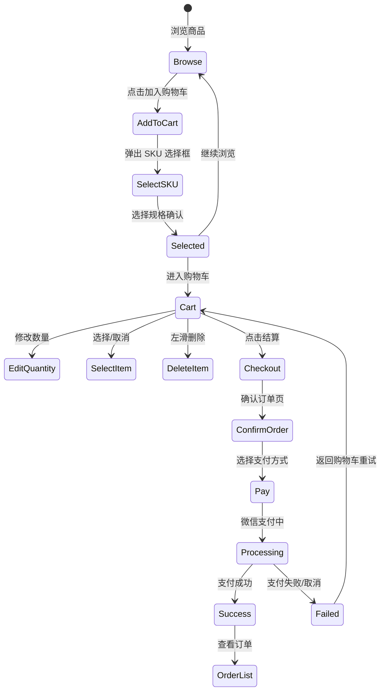
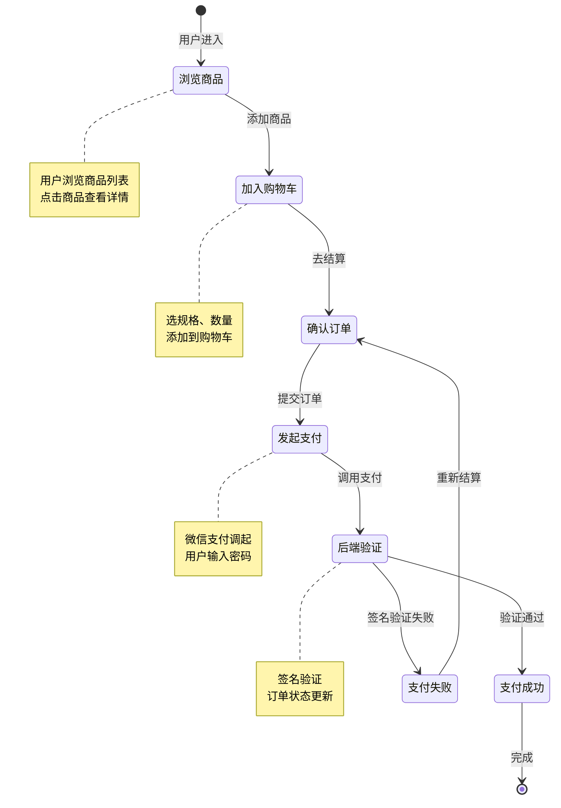
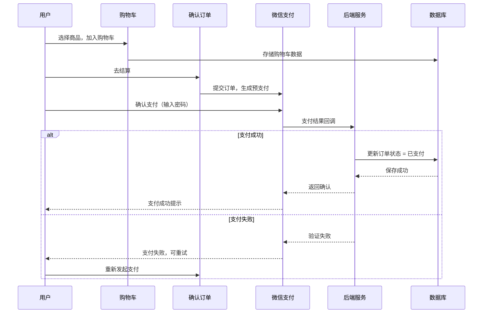

# 13. 实战（三）：电商购物车

本系列第三个实战项目：电商购物车。这是一个复杂度最高的项目，涵盖了**SKU 选择**、**数量联动**、**价格实时计算**、**微信支付集成**等核心电商能力。

最终效果：商品列表 → 购物车（SKU 选择、数量修改、价格计算） → 结算 → 微信支付 → 订单确认。

> **环境：** 微信开发者工具 latest，小程序基础库 3.x，需要真实的微信支付商户号（本篇提供完整的前端实现）

---

## 1. 需求分析与架构设计

### 1.1 功能清单

| 功能 | 优先级 | 实现方案 |
|------|--------|---------|
| 商品列表 | P0 | 商品卡片 + 加入购物车 |
| 购物车管理 | P0 | 加减数量、删除、选中 |
| SKU 选择 | P0 | 底部弹窗 + 规格互斥 |
| 价格计算 | P0 | 实时计算 + 精确到分 |
| 结算 | P1 | 确认订单 + 微信支付 |
| 订单列表 | P1 | tab 切换（待支付/已支付） |
| 支付结果回调 | P1 | 页面 onShow 查询状态 |

### 1.2 购物车状态机



---

## 2. 购物车 Store

```javascript
// utils/cart-store.js

/**
 * 购物车 Store：全局状态管理
 */

const CART_KEY = 'cart_items';

class CartStore {
  constructor() {
    this._state = {
      items: [],        // 购物车商品列表
      selectedIds: [],  // 已选中的商品 ID 列表
      totalPrice: 0,    // 总价（分）
      totalCount: 0,    // 总数量
    };
    this._init();
  }

  _init() {
    try {
      const items = wx.getStorageSync(CART_KEY) || [];
      this._state.items = items;
      this._recalculate();
    } catch (err) {
      console.error('加载购物车失败：', err);
    }
  }

  getState() {
    return { ...this._state };
  }

  // ========== 操作方法 ==========

  /**
   * 添加商品到购物车
   * @param {Object} goods - 商品信息
   * @param {Object} sku - 选择的 SKU
   * @param {number} quantity - 数量
   */
  addItem(goods, sku, quantity = 1) {
    const existing = this._state.items.find(
      item => item.goodsId === goods.id && item.skuId === sku.id
    );

    if (existing) {
      existing.quantity += quantity;
    } else {
      this._state.items.push({
        id: `${goods.id}_${sku.id}_${Date.now()}`, // 唯一 ID
        goodsId: goods.id,
        skuId: sku.id,
        name: goods.name,
        image: sku.image || goods.image,
        price: sku.price,    // SKU 价格
        originalPrice: sku.originalPrice || goods.originalPrice,
        specs: sku.specs,   // 规格信息 [{name: '颜色', value: '红色'}, ...]
        quantity,
        selected: false,
        addedAt: Date.now(),
      });
    }

    this._save();
    this._notify();
    return this._state;
  }

  /**
   * 修改商品数量
   */
  updateQuantity(id, quantity) {
    const item = this._state.items.find(i => i.id === id);
    if (item) {
      item.quantity = Math.max(1, quantity);
      this._save();
      this._notify();
    }
  }

  /**
   * 删除商品
   */
  removeItem(id) {
    this._state.items = this._state.items.filter(i => i.id !== id);
    this._state.selectedIds = this._state.selectedIds.filter(sid => sid !== id);
    this._save();
    this._notify();
  }

  /**
   * 切换选中状态
   */
  toggleSelected(id) {
    const item = this._state.items.find(i => i.id === id);
    if (item) {
      item.selected = !item.selected;
      this._updateSelectedIds();
      this._recalculate();
      this._save();
      this._notify();
    }
  }

  /**
   * 全选/取消全选
   */
  toggleSelectAll() {
    const allSelected = this._state.items.every(i => i.selected);
    this._state.items.forEach(item => {
      item.selected = !allSelected;
    });
    this._updateSelectedIds();
    this._recalculate();
    this._save();
    this._notify();
  }

  /**
   * 清空已选商品
   */
  clearSelected() {
    this._state.items = this._state.items.filter(i => !i.selected);
    this._state.selectedIds = [];
    this._recalculate();
    this._save();
    this._notify();
  }

  // ========== 私有方法 ==========

  _updateSelectedIds() {
    this._state.selectedIds = this._state.items
      .filter(i => i.selected)
      .map(i => i.id);
  }

  _recalculate() {
    const selectedItems = this._state.items.filter(i => i.selected);
    this._state.totalPrice = selectedItems.reduce(
      (sum, item) => sum + item.price * item.quantity, 0
    );
    this._state.totalCount = selectedItems.reduce(
      (sum, item) => sum + item.quantity, 0
    );
  }

  _save() {
    try {
      wx.setStorageSync(CART_KEY, this._state.items);
    } catch (err) {
      console.error('保存购物车失败：', err);
    }
  }

  _notify() {
    // 通知所有订阅者（通知页面更新）
    // 通过 eventChannel 或 Store 的 subscribe 模式
    const eventChannel = getApp().eventChannel;
    if (eventChannel) {
      eventChannel.emit?.('cartUpdated', this.getState());
    }
  }

  subscribe(listener) {
    const listeners = [];
    if (!getApp()._cartListeners) {
      getApp()._cartListeners = [];
    }
    getApp()._cartListeners.push(listener);
    return () => {
      getApp()._cartListeners = getApp()._cartListeners.filter(l => l !== listener);
    };
  }

  notifySubscribers() {
    const state = this.getState();
    (getApp()._cartListeners || []).forEach(listener => listener(state));
  }
}

// 导出单例
const cartStore = new CartStore();
export default cartStore;
```

---

## 3. SKU 选择弹窗组件

```javascript
// components/sku-picker/sku-picker.js

Component({
  properties: {
    show: {
      type: Boolean,
      value: false,
    },
    goods: {
      type: Object,
      value: null,
    },
    selectedSku: {
      type: Object,
      value: null,
    },
  },

  data: {
    // 规格选项状态
    specOptions: {},       // { color: ['红色', '蓝色'], size: ['S', 'M', 'L'] }
    selectedSpecs: {},     // { color: '红色', size: 'M' }
    matchedSku: null,      // 匹配到的 SKU
    quantity: 1,
  },

  observers: {
    'goods, show': function(goods, show) {
      if (show && goods) {
        this.initSpecs();
      }
    },
    selectedSpecs: function(specs) {
      this.findMatchedSku(specs);
    },
  },

  lifetimes: {
    attached() {
      this.initSpecs();
    },
  },

  methods: {
    // 初始化规格选项
    initSpecs() {
      const { goods } = this.properties;
      if (!goods) return;

      const specOptions = {};
      // 假设 goods.specs 是 [{name: '颜色', values: ['红色', '蓝色']}, ...]
      (goods.specs || []).forEach(spec => {
        specOptions[spec.name] = spec.values || [];
      });

      this.setData({ specOptions });
    },

    // 选择规格项
    onSelectSpec(e) {
      const { specName, specValue } = e.currentTarget.dataset;
      this.setData({
        selectedSpecs: {
          ...this.data.selectedSpecs,
          [specName]: specValue,
        },
      });
    },

    // 检查规格项是否可选
    isSpecValueDisabled(specName, specValue) {
      // 检查选择该规格后，是否存在匹配的 SKU
      const testSpecs = { ...this.data.selectedSpecs, [specName]: specValue };
      return !this.hasSkuMatch(testSpecs);
    },

    // 检查规格组合是否有 SKU 匹配
    hasSkuMatch(specs) {
      const { goods } = this.properties;
      if (!goods || !goods.skus) return false;

      return goods.skus.some(sku => {
        return Object.entries(specs).every(([name, value]) => {
          return sku.specs?.some(s => s.name === name && s.value === value);
        });
      });
    },

    // 根据已选规格找到匹配的 SKU
    findMatchedSku(specs) {
      const { goods } = this.properties;
      if (!goods || !goods.skus) {
        this.setData({ matchedSku: null });
        return;
      }

      // 检查是否所有规格都已选择
      const allSpecsSelected = Object.keys(specs).length >= (goods.specs?.length || 0);
      const hasAllSpecs = Object.values(specs).every(v => v);

      if (!allSpecsSelected || !hasAllSpecs) {
        this.setData({ matchedSku: null });
        return;
      }

      // 查找匹配的 SKU
      const matchedSku = goods.skus.find(sku => {
        return Object.entries(specs).every(([name, value]) => {
          return sku.specs?.some(s => s.name === name && s.value === value);
        });
      });

      this.setData({ matchedSku });
    },

    // 修改数量
    onQuantityChange(e) {
      const { type } = e.currentTarget.dataset;
      let quantity = this.data.quantity;
      if (type === 'add') {
        quantity += 1;
      } else if (type === 'minus') {
        quantity = Math.max(1, quantity - 1);
      } else {
        quantity = parseInt(e.detail.value, 10) || 1;
      }
      this.setData({ quantity });
    },

    // 关闭弹窗
    onClose() {
      this.triggerEvent('close');
    },

    // 确认选择
    onConfirm() {
      const { matchedSku, quantity, goods } = this.data;
      if (!matchedSku) {
        wx.showToast({ title: '请选择完整的规格', icon: 'none' });
        return;
      }

      this.triggerEvent('confirm', {
        goods,
        sku: matchedSku,
        quantity,
      });
    },
  },
});
```

```html
<!-- components/sku-picker/sku-picker.wxml -->

<!-- 遮罩层 -->
<view wx:if="{{show}}" class="mask" bindtap="onClose"></view>

<!-- 弹窗 -->
<view wx:if="{{show}}" class="sku-picker {{show ? 'show' : ''}}">
  <!-- 商品信息 -->
  <view class="goods-info">
    <image src="{{matchedSku.image || goods.image}}" mode="aspectFill" class="goods-image"/>
    <view class="goods-detail">
      <text class="goods-name">{{goods.name}}</text>
      <text class="goods-price">¥{{matchedSku.price || goods.price}}</text>
      <text class="goods-stock">库存：{{matchedSku.stock || 0}}</text>
    </view>
    <view class="close-btn" bindtap="onClose">×</view>
  </view>

  <!-- 规格选择 -->
  <view class="specs-section">
    <view wx:for="{{goods.specs}}" wx:for-item="spec" wx:key="name" class="spec-group">
      <text class="spec-name">{{spec.name}}</text>
      <view class="spec-values">
        <view
          wx:for="{{spec.values}}"
          wx:for-item="value"
          wx:key="{{value}}"
          class="spec-value {{selectedSpecs[spec.name] === value ? 'selected' : ''}} {{isSpecValueDisabled(spec.name, value) ? 'disabled' : ''}}"
          bindtap="onSelectSpec"
          data-spec-name="{{spec.name}}"
          data-spec-value="{{value}}">
          {{value}}
        </view>
      </view>
    </view>
  </view>

  <!-- 数量选择 -->
  <view class="quantity-section">
    <text class="quantity-label">数量</text>
    <view class="quantity-control">
      <view class="qty-btn minus" bindtap="onQuantityChange" data-type="minus">-</view>
      <input
        class="qty-input"
        type="number"
        value="{{quantity}}"
        bindchange="onQuantityChange"
        data-type="input"/>
      <view class="qty-btn add" bindtap="onQuantityChange" data-type="add">+</view>
    </view>
  </view>

  <!-- 确认按钮 -->
  <view class="confirm-btn {{matchedSku ? '' : 'disabled'}}" bindtap="onConfirm">
    <text>确定</text>
  </view>
</view>
```

---

## 4. 购物车页面

```javascript
// pages/cart/cart.js

import cartStore from '../../utils/cart-store.js';
import { requestPayment } from '../../utils/payment.js';

Page({
  data: {
    items: [],
    selectedIds: [],
    totalPrice: 0,    // 单位：元
    totalCount: 0,
    allSelected: false,
    isEditing: false,  // 编辑模式
  },

  onShow() {
    // 每次显示页面时，从 Store 获取最新状态
    this.refreshFromStore();

    // 监听 Store 变化（通过 eventChannel）
    const app = getApp();
    if (app.eventChannel) {
      app.eventChannel.on('cartUpdated', (state) => {
        this.setData({
          items: state.items,
          selectedIds: state.selectedIds,
          totalPrice: (state.totalPrice / 100).toFixed(2),
          totalCount: state.totalCount,
        });
      });
    }
  },

  onHide() {
    // 离开页面时解绑监听
    const app = getApp();
    if (app.eventChannel?.off) {
      app.eventChannel.off('cartUpdated');
    }
  },

  refreshFromStore() {
    const state = cartStore.getState();
    const allSelected = state.items.length > 0 &&
      state.items.every(i => i.selected);

    this.setData({
      items: state.items,
      selectedIds: state.selectedIds,
      totalPrice: (state.totalPrice / 100).toFixed(2),
      totalCount: state.totalCount,
      allSelected,
    });
  },

  // 切换单个商品选中状态
  onToggleSelect(e) {
    const { id } = e.currentTarget.dataset;
    cartStore.toggleSelected(id);
    this.refreshFromStore();
  },

  // 全选/取消全选
  onToggleSelectAll() {
    cartStore.toggleSelectAll();
    this.refreshFromStore();
  },

  // 修改数量
  onQuantityChange(e) {
    const { id } = e.currentTarget.dataset;
    const quantity = parseInt(e.detail.value, 10) || 1;
    cartStore.updateQuantity(id, quantity);
    this.refreshFromStore();
  },

  // 删除商品（滑动删除）
  onDelete(e) {
    const { id } = e.currentTarget.dataset;
    wx.showModal({
      title: '确认删除',
      content: '确定从购物车移除该商品？',
      success: (res) => {
        if (res.confirm) {
          cartStore.removeItem(id);
          this.refreshFromStore();
          wx.showToast({ title: '已删除', icon: 'none' });
        }
      },
    });
  },

  // 清空已选商品
  onClearSelected() {
    wx.showModal({
      title: '确认清空',
      content: '确定清空已选商品？',
      success: (res) => {
        if (res.confirm) {
          cartStore.clearSelected();
          this.refreshFromStore();
        }
      },
    });
  },

  // 编辑模式切换
  onToggleEditMode() {
    this.setData({ isEditing: !this.data.isEditing });
  },

  // 结算
  async onCheckout() {
    if (this.data.selectedIds.length === 0) {
      wx.showToast({ title: '请选择商品', icon: 'none' });
      return;
    }

    const state = cartStore.getState();
    const selectedItems = state.items.filter(i => i.selected);

    // 跳转到确认订单页
    wx.navigateTo({
      url: `/pages/order/confirm?items=${encodeURIComponent(JSON.stringify(selectedItems))}`,
    });
  },

  // 分享
  onShareAppMessage() {
    return {
      title: '我的购物车，精选好物等你来',
      path: '/pages/cart/cart',
    };
  },
});
```

```html
<!-- pages/cart/cart.wxml -->

<view class="page">
  <!-- 顶部标题栏 -->
  <view class="header-bar">
    <text class="page-title">购物车</text>
    <view class="edit-btn" bindtap="onToggleEditMode">
      <text>{{isEditing ? '完成' : '编辑'}}</text>
    </view>
  </view>

  <!-- 购物车列表 -->
  <scroll-view scroll-y class="cart-list">
    <block wx:if="{{items.length > 0}}">
      <view wx:for="{{items}}" wx:key="id" class="cart-item">
        <!-- 选中按钮 -->
        <view
          class="select-btn {{item.selected ? 'selected' : ''}}"
          bindtap="onToggleSelect"
          data-id="{{item.id}}">
          <text wx:if="{{item.selected}}">✓</text>
        </view>

        <!-- 商品图片 -->
        <image src="{{item.image}}" mode="aspectFill" class="item-image"/>

        <!-- 商品信息 -->
        <view class="item-info">
          <text class="item-name">{{item.name}}</text>
          <text class="item-specs">{{item.specs.map(s => s.value).join(' / ')}}</text>
          <view class="item-bottom">
            <text class="item-price">¥{{(item.price / 100).toFixed(2)}}</text>

            <!-- 数量控制 -->
            <view class="quantity-control">
              <view class="qty-btn minus" bindtap="onQuantityChange" data-id="{{item.id}}" data-type="minus">-</view>
              <text class="qty-value">{{item.quantity}}</text>
              <view class="qty-btn add" bindtap="onQuantityChange" data-id="{{item.id}}" data-type="add">+</view>
            </view>
          </view>
        </view>

        <!-- 删除按钮（编辑模式下显示） -->
        <view wx:if="{{isEditing}}" class="delete-btn" bindtap="onDelete" data-id="{{item.id}}">
          <text>删除</text>
        </view>
      </view>
    </block>

    <!-- 空购物车 -->
    <block wx:else>
      <view class="empty-state">
        <text class="empty-icon">🛒</text>
        <text class="empty-text">购物车是空的</text>
        <text class="empty-hint">去挑选心仪的商品吧</text>
      </view>
    </block>
  </scroll-view>

  <!-- 底部结算栏 -->
  <view wx:if="{{items.length > 0}}" class="bottom-bar">
    <!-- 全选 -->
    <view class="select-all" bindtap="onToggleSelectAll">
      <view class="select-btn {{allSelected ? 'selected' : ''}}">
        <text wx:if="{{allSelected}}">✓</text>
      </view>
      <text class="select-all-text">全选</text>
    </view>

    <!-- 价格信息 -->
    <view class="price-info">
      <text class="total-label">合计：</text>
      <text class="total-price">¥{{totalPrice}}</text>
    </view>

    <!-- 结算按钮 -->
    <view class="checkout-btn" bindtap="onCheckout">
      <text>结算({{totalCount}})</text>
    </view>
  </view>
</view>
```

---

### 可视化：电商购物流程状态机

下面通过图示展示电商购物流程的完整状态流转，包括成功路径和失败重试路径。

#### 购物流程状态图



#### 购物流程时序图



#### 购物流程动画演示

下方动画演示完整的购物流程：

```html
<div class="ecom-demo">
  <div class="demo-title">电商购物流程状态机</div>

  <div class="ecom-flow">
    <div class="ecom-node success-path" id="en-browse">
      <div class="node-num">①</div>
      <div class="node-title">浏览商品</div>
    </div>
    <div class="ecom-arrow" id="ea1">↓</div>
    <div class="ecom-node success-path" id="en-cart">
      <div class="node-num">②</div>
      <div class="node-title">加入购物车</div>
    </div>
    <div class="ecom-arrow" id="ea2">↓</div>
    <div class="ecom-node success-path" id="en-confirm">
      <div class="node-num">③</div>
      <div class="node-title">确认订单</div>
    </div>
    <div class="ecom-arrow" id="ea3">↓</div>
    <div class="ecom-node success-path" id="en-pay">
      <div class="node-num">④</div>
      <div class="node-title">发起支付</div>
    </div>
    <div class="ecom-arrow" id="ea4">↓</div>
    <div class="ecom-node success-path" id="en-backend">
      <div class="node-num">⑤</div>
      <div class="node-title">后端验证</div>
    </div>

    <div class="ecom-branch">
      <div class="ecom-node success-end" id="en-success">
        <div class="node-num">✓</div>
        <div class="node-title">支付成功</div>
      </div>
      <div class="ecom-node fail-path" id="en-fail">
        <div class="node-num">✗</div>
        <div class="node-title">验证失败</div>
      </div>
    </div>
    <div class="ecom-arrow fail-arrow" id="ea5" style="display:none">↺</div>
    <div class="ecom-arrow retry-arrow" id="ea6" style="display:none">返回重试</div>
  </div>

  <div class="log-panel">
    <div class="log-title">流程日志</div>
    <div class="log-content" id="ecomLog"></div>
  </div>

  <div class="controls">
    <button class="btn" onclick="ecomStep()">▶ 下一步</button>
    <button class="btn" onclick="ecomSuccess()">⏵ 成功路径</button>
    <button class="btn fail" onclick="ecomFail()">⏵ 失败路径</button>
    <button class="btn" onclick="ecomReset()">↺ 重置</button>
  </div>
</div>

<style>
.ecom-demo {
  background: #1a1a2e;
  border-radius: 12px;
  padding: 24px;
  font-family: 'SF Mono', 'Fira Code', monospace;
  color: #e0e0e0;
  max-width: 500px;
  margin: 0 auto;
}
.demo-title {
  text-align: center;
  font-size: 16px;
  color: #ffd700;
  margin-bottom: 20px;
}
.ecom-flow {
  display: flex;
  flex-direction: column;
  align-items: center;
  gap: 4px;
  margin-bottom: 20px;
}
.ecom-node {
  width: 160px;
  background: #16213e;
  border: 2px solid #0f3460;
  border-radius: 10px;
  padding: 12px;
  text-align: center;
  transition: all 0.4s ease;
}
.node-num {
  font-size: 20px;
  margin-bottom: 4px;
}
.node-title {
  font-size: 13px;
  color: #cdd6f4;
  font-weight: bold;
}
.ecom-arrow {
  font-size: 18px;
  color: #ffd700;
  transition: all 0.3s;
}
.ecom-node.active {
  border-color: #ffd700;
  background: #2a2a4a;
  box-shadow: 0 0 20px rgba(255, 215, 0, 0.3);
  transform: scale(1.05);
}
.ecom-node.done {
  border-color: #00ff88;
  background: #0a3d2a;
}
.ecom-node.done .node-title { color: #00ff88; }
.ecom-node.fail.active {
  border-color: #ff6b6b;
  background: #3d1a1a;
  box-shadow: 0 0 20px rgba(255, 107, 107, 0.3);
}
.ecom-branch {
  display: flex;
  gap: 16px;
  margin-top: 8px;
}
.ecom-node.fail-end {
  border-color: #ff6b6b;
  background: #3d1a1a;
}
.ecom-node.fail-end .node-title { color: #ff6b6b; }
.fail-arrow {
  color: #ff6b6b;
  display: none;
}
.retry-arrow {
  color: #ffa726;
  font-size: 12px;
  display: none;
}
.log-panel {
  background: #0d1117;
  border: 1px solid #30363d;
  border-radius: 8px;
  padding: 12px;
  max-height: 100px;
  overflow-y: auto;
  margin-bottom: 16px;
}
.log-title { font-size: 12px; color: #6c7086; margin-bottom: 8px; }
.log-entry {
  font-size: 12px;
  line-height: 1.6;
  opacity: 0;
  animation: fadeIn 0.3s forwards;
}
.log-entry .step { color: #ffd700; font-weight: bold; }
.log-entry .success { color: #00ff88; }
.log-entry .fail { color: #ff6b6b; }
@keyframes fadeIn { to { opacity: 1; } }
.controls {
  display: flex;
  justify-content: center;
  gap: 8px;
  flex-wrap: wrap;
}
.btn {
  background: #4a4a6a;
  border: none;
  color: #fff;
  padding: 8px 16px;
  border-radius: 6px;
  cursor: pointer;
  font-family: inherit;
  font-size: 13px;
  transition: background 0.2s;
}
.btn:hover { background: #6a6a8a; }
.btn.fail { background: #6b3a3a; }
.btn.fail:hover { background: #8b4a4a; }
</style>

<script>
const successPath = [
  { node: 'en-browse', log: '<span class="step">[①]</span> 用户浏览商品列表' },
  { node: 'en-cart', log: '<span class="step">[②]</span> 点击「加入购物车」' },
  { node: 'en-confirm', log: '<span class="step">[③]</span> 进入确认订单页，核对商品' },
  { node: 'en-pay', log: '<span class="step">[④]</span> 提交订单，微信支付调起' },
  { node: 'en-backend', log: '<span class="step">[⑤]</span> 后端接收支付结果，签名验证中...' },
];
const failStep = { node: 'en-fail', log: '<span class="fail">[✗]</span> 签名验证失败！返回重试' };
let ecomIdx = 0;
let ecomTimer = null;

function ecomActivate(path, idx) {
  if (idx < 0 || idx >= path.length) return;
  const s = path[idx];
  document.getElementById(s.node).classList.add('active');
  const log = document.getElementById('ecomLog');
  log.innerHTML += `<div class="log-entry">${s.log}</div>`;
  log.scrollTop = log.scrollHeight;
  setTimeout(() => {
    document.getElementById(s.node).classList.remove('active');
    document.getElementById(s.node).classList.add('done');
  }, 600);
}

function ecomActivateFail() {
  document.getElementById('en-fail').classList.add('active');
  document.getElementById('ea5').style.display = 'block';
  document.getElementById('ea6').style.display = 'block';
  const log = document.getElementById('ecomLog');
  log.innerHTML += `<div class="log-entry">${failStep.log}</div>`;
  log.scrollTop = log.scrollHeight;
}

function ecomStep() {
  if (ecomTimer) { clearTimeout(ecomTimer); ecomTimer = null; }
  ecomActivate(successPath, ecomIdx);
  ecomIdx++;
  if (ecomIdx >= successPath.length) ecomIdx = 0;
}

function ecomSuccess() {
  if (ecomTimer) { clearTimeout(ecomTimer); ecomTimer = null; }
  ecomIdx = 0;
  document.querySelectorAll('.ecom-node, .ecom-arrow').forEach(n => {
    n.classList.remove('active', 'done');
    if (n.id === 'ea5' || n.id === 'ea6') n.style.display = 'none';
  });
  document.getElementById('ecomLog').innerHTML = '';
  // Add success final node
  let hasSuccess = document.getElementById('en-success');
  if (!hasSuccess) {
    const successNode = document.createElement('div');
    successNode.id = 'en-success';
    successNode.className = 'ecom-node success-end';
    successNode.innerHTML = '<div class="node-num">✓</div><div class="node-title">支付成功</div>';
    document.querySelector('.ecom-branch').prepend(successNode);
  }
  function next() {
    if (ecomIdx >= successPath.length) {
      document.getElementById('en-success').classList.add('done');
      document.getElementById('ecomLog').innerHTML +=
        `<div class="log-entry"><span class="success">[✓] 支付成功！订单完成</span></div>`;
      ecomIdx = 0;
      return;
    }
    ecomActivate(successPath, ecomIdx);
    ecomIdx++;
    ecomTimer = setTimeout(next, 1000);
  }
  next();
}

function ecomFail() {
  if (ecomTimer) { clearTimeout(ecomTimer); ecomTimer = null; }
  ecomIdx = 0;
  document.querySelectorAll('.ecom-node, .ecom-arrow').forEach(n => {
    n.classList.remove('active', 'done');
    if (n.id === 'ea5' || n.id === 'ea6') n.style.display = 'none';
  });
  document.getElementById('ecomLog').innerHTML = '';
  function next() {
    if (ecomIdx >= successPath.length) {
      ecomActivateFail();
      ecomIdx = 0;
      return;
    }
    ecomActivate(successPath, ecomIdx);
    ecomIdx++;
    ecomTimer = setTimeout(next, 800);
  }
  next();
}

function ecomReset() {
  if (ecomTimer) { clearTimeout(ecomTimer); ecomTimer = null; }
  ecomIdx = 0;
  document.querySelectorAll('.ecom-node, .ecom-arrow').forEach(n => {
    n.classList.remove('active', 'done');
    if (n.id === 'ea5' || n.id === 'ea6') n.style.display = 'none';
  });
  document.getElementById('ecomLog').innerHTML = '';
}
</script>
```

> **说明**：点击「成功路径」演示正常支付流程；点击「失败路径」演示签名验证失败后的重试流程。

---

## 6. 微信支付后端 Mock：Node.js 完整示例

电商项目中的微信支付涉及多个环节，以下是一个基于 Express + Node.js 的后端 Mock 实现，涵盖**统一下单**、**签名生成**、**回调验证**三个核心环节。

### 6.1 项目结构

```
backend/
├── package.json
├── src/
│   ├── app.ts              # Express 入口
│   ├── config/
│   │   └── wx.ts          # 微信支付配置
│   ├── routes/
│   │   └── payment.ts      # 支付相关路由
│   └── utils/
│       ├── signature.ts    # 签名工具
│       └── xml.ts          # XML 解析
```

### 6.2 微信支付配置

```typescript
// src/config/wx.ts

export const WX_PAY_CONFIG = {
  // 微信支付商户号
  mchId: process.env.WX_MCH_ID || '1234567890',

  // 微信支付 API v2 密钥（32位）
  apiKey: process.env.WX_API_KEY || 'your_32位_api_key_here',

  // 微信支付证书（用于退款等敏感操作）
  // 需要下载 .pem 格式的证书
  certPath: process.env.WX_CERT_PATH || './certs/apiclient_cert.pem',
  keyPath: process.env.WX_KEY_PATH || './certs/apiclient_key.pem',

  // 统一下单接口地址
  unifiedorderUrl: 'https://api.mch.weixin.qq.com/pay/unifiedorder',

  // 支付回调地址（需要公网可访问）
  notifyUrl: process.env.WX_NOTIFY_URL || 'https://your-domain.com/api/payment/notify',
};

// 生成的订单号
export function generateTradeNo(): string {
  const timestamp = Date.now().toString();
  const random = Math.random().toString(36).substring(2, 8);
  return `ORDER${timestamp}${random}`.toUpperCase();
}
```

### 6.3 签名工具（MD5 或 HMAC-SHA256）

```typescript
// src/utils/signature.ts

import crypto from 'crypto';

/**
 * 生成微信支付签名（MD5 方式）
 * 文档：https://pay.weixin.qq.com/wiki/doc/apiv3/wechatpay/wechatpay5_1.shtml
 */
export function generateSignature(params: Record<string, string | number>): string {
  // 1. 按字典序排序参数
  const sortedKeys = Object.keys(params)
    .filter(k => params[k] !== '' && params[k] !== undefined && params[k] !== null)
    .sort();

  // 2. 拼接字符串
  const stringA = sortedKeys
    .map(k => `${k}=${params[k]}`)
    .join('&');

  // 3. 拼接 API 密钥
  const stringSignTemp = `${stringA}&key=${WX_PAY_CONFIG.apiKey}`;

  // 4. MD5 签名并转大写
  const sign = crypto
    .createHash('md5')
    .update(stringSignTemp, 'utf8')
    .digest('hex')
    .toUpperCase();

  return sign;
}

/**
 * 验证微信回调签名
 */
export function verifySignature(
  params: Record<string, string>,
  signature: string
): boolean {
  const calculatedSign = generateSignature(params);
  return calculatedSign === signature.toUpperCase();
}

/**
 * 生成随机字符串（nonce_str）
 */
export function generateNonceStr(length = 32): string {
  const chars = 'ABCDEFGHIJKLMNOPQRSTUVWXYZabcdefghijklmnopqrstuvwxyz0123456789';
  let result = '';
  for (let i = 0; i < length; i++) {
    result += chars.charAt(Math.floor(Math.random() * chars.length));
  }
  return result;
}

/**
 * 将对象转换为 XML（用于请求）
 */
export function toXML(obj: Record<string, string>): string {
  return Object.entries(obj)
    .map(([k, v]) => `<${k}><![CDATA[${v}]]></${k}>`)
    .join('');
}

/**
 * 将 XML 解析为对象（用于回调）
 */
export function parseXML(xml: string): Record<string, string> {
  // 简单实现，生产环境建议用 fast-xml-parser
  const result: Record<string, string> = {};
  const regex = /<(\w+)><!\[CDATA\[([^\]]+)\]\]><\/\1>/g;
  let match;
  while ((match = regex.exec(xml)) !== null) {
    result[match[1]] = match[2];
  }
  return result;
}
```

### 6.4 统一下单 API

```typescript
// src/routes/payment.ts

import express from 'express';
import axios from 'axios';
import crypto from 'crypto';
import fs from 'fs';
import {
  WX_PAY_CONFIG,
  generateTradeNo,
} from '../config/wx.js';
import {
  generateSignature,
  generateNonceStr,
  toXML,
  parseXML,
} from '../utils/signature.js';

const router = express.Router();

/**
 * POST /api/payment/create
 * 小程序前端调用此接口获取支付参数
 */
router.post('/create', async (req, res) => {
  const { orderId, totalFee, description, openid } = req.body;

  if (!orderId || !totalFee || !openid) {
    return res.status(400).json({ code: 400, message: '参数不完整' });
  }

  // 订单号（由后端生成）
  const outTradeNo = generateTradeNo();

  // 构建统一下单参数
  const params: Record<string, string> = {
    appid: process.env.WX_APP_ID || '',
    mch_id: WX_PAY_CONFIG.mchId,
    nonce_str: generateNonceStr(),
    body: description || '商品购买',
    out_trade_no: outTradeNo,
    total_fee: String(totalFee), // 单位：分（必须是整数）
    spbill_create_ip: req.ip || '127.0.0.1',
    notify_url: WX_PAY_CONFIG.notifyUrl,
    trade_type: 'JSAPI',
    openid,
  };

  // 生成签名
  params.sign = generateSignature(params);

  // 发送统一下单请求
  try {
    const { data: xmlResponse } = await axios.post(
      WX_PAY_CONFIG.unifiedorderUrl,
      toXML(params),
      {
        headers: { 'Content-Type': 'text/xml' },
      }
    );

    const result = parseXML(xmlResponse);

    if (result.return_code === 'SUCCESS' && result.result_code === 'SUCCESS') {
      // ===== 返回支付参数给小程序端 =====
      const timestamp = Math.floor(Date.now() / 1000).toString();
      const noncestr = generateNonceStr();

      // 小程序调起支付的参数（注意：第二次签名）
      const payParams: Record<string, string> = {
        appId: result.appid,
        timeStamp: timestamp,
        nonceStr: noncestr,
        package: `prepay_id=${result.prepay_id}`,
        signType: 'MD5',
      };
      const paySign = generateSignature(payParams);

      res.json({
        code: 0,
        data: {
          outTradeNo,          // 商户订单号
          prepayId: result.prepay_id,  // 预支付交易会话标识
          timeStamp: timestamp,
          nonceStr: noncestr,
          paySign,              // 调起支付的签名
        },
      });
    } else {
      console.error('统一下单失败:', result.err_code, result.err_code_des);
      res.status(500).json({
        code: 500,
        message: result.err_code_des || '统一下单失败',
      });
    }
  } catch (err) {
    console.error('请求微信支付失败:', err);
    res.status(500).json({ code: 500, message: '支付服务异常' });
  }
});

/**
 * POST /api/payment/notify
 * 微信支付回调接口（需要公网可访问）
 */
router.post('/notify', async (req, res) => {
  const xmlBody = req.body.toString();
  const params = parseXML(xmlBody);

  // 1. 验证签名
  const receivedSign = params.sign;
  const paramsForSign = { ...params };
  delete paramsForSign.sign;

  if (!verifySignature(paramsForSign, receivedSign)) {
    console.error('回调签名验证失败');
    return res.send(toXML({ return_code: 'FAIL', return_msg: '签名失败' }));
  }

  // 2. 处理支付结果
  if (params.return_code === 'SUCCESS') {
    if (params.result_code === 'SUCCESS') {
      const { out_trade_no, transaction_id, total_fee } = params;

      // ===== 这里是关键：更新订单状态 =====
      console.log(`支付成功: ${out_trade_no}, 微信流水号: ${transaction_id}, 金额: ${total_fee}分`);

      // 业务处理：
      // 1. 根据 out_trade_no 查询本地订单
      // 2. 验证订单金额是否匹配（防止伪造）
      // 3. 更新订单状态为"已支付"
      // 4. 发送订阅消息通知用户
      // 5. 返回成功

      await updateOrderStatus(out_trade_no, 'paid', transaction_id);

      res.send(toXML({
        return_code: 'SUCCESS',
        return_msg: 'OK',
      }));
    } else {
      // 支付失败
      console.error('支付结果失败:', params.err_code, params.err_code_des);
      res.send(toXML({
        return_code: 'FAIL',
        return_msg: params.err_code_des || '支付失败',
      }));
    }
  } else {
    res.send(toXML({ return_code: 'FAIL', return_msg: '通信失败' }));
  }
});

/**
 * POST /api/payment/query
 * 小程序查询支付状态
 */
router.get('/query/:outTradeNo', async (req, res) => {
  const { outTradeNo } = req.params;

  // 调用微信支付查询接口（实现类似统一下单，省略）
  // ...

  res.json({ code: 0, data: { status: 'paid' } });
});

// 辅助函数
async function updateOrderStatus(
  outTradeNo: string,
  status: string,
  transactionId: string
) {
  // 根据实际情况实现
  console.log(`更新订单 ${outTradeNo} 状态为 ${status}`);
}

export default router;
```

### 6.5 小程序端调用（更新后的支付流程）

```javascript
// utils/payment.js（更新版）

/**
 * 微信支付完整流程（小程序端）
 */
const requestPayment = async (orderId, totalFee, description) => {
  // 1. 获取用户 openid（已登录情况下）
  const { code } = await wx.login();
  const { openid } = await wx.cloud?.callFunction({
    name: 'getOpenid',
  }) || {};

  if (!openid) {
    throw new Error('未获取到用户 openid');
  }

  try {
    // 2. 调用后端统一下单接口，获取支付参数
    const { data } = await wx.request({
      url: `${API_BASE}/payment/create`,
      method: 'POST',
      data: {
        orderId,
        totalFee,      // 单位：分（整数）
        description,
        openid,
      },
    });

    if (data.code !== 0) {
      throw new Error(data.message || '创建支付订单失败');
    }

    const { prepayId, timeStamp, nonceStr, paySign } = data.data;

    // 3. 调起微信支付
    return new Promise((resolve, reject) => {
      wx.requestPayment({
        timeStamp,      // 注意：必须用后端返回的值
        nonceStr,
        package: `prepay_id=${prepayId}`,
        signType: 'MD5',
        paySign,
        success: (res) => {
          console.log('支付成功:', res);
          resolve({ status: 'success', orderId });
        },
        fail: (err) => {
          if (err.errMsg === 'requestPayment:fail cancel') {
            reject({ status: 'cancel', message: '用户取消支付' });
          } else {
            reject({ status: 'fail', message: err.errMsg });
          }
        },
      });
    });

  } catch (err) {
    throw err;
  }
};

/**
 * 查询支付结果（主动轮询，补充回调）
 */
const pollPaymentStatus = async (orderId, maxAttempts = 5) => {
  for (let i = 0; i < maxAttempts; i++) {
    await sleep(2000); // 每 2 秒轮询一次
    try {
      const { data } = await wx.request({
        url: `${API_BASE}/payment/query/${orderId}`,
      });
      if (data.data.status === 'paid') {
        return { status: 'success' };
      }
    } catch (err) {
      console.error('查询失败:', err);
    }
  }
  return { status: 'pending', message: '支付状态待确认' };
};

// 支付成功页
const handlePaymentSuccess = (orderId) => {
  wx.redirectTo({ url: `/pages/payment/success?orderId=${orderId}` });
};
```

### 6.6 关键注意事项

> **安全红线**：小程序前端只能调用 `wx.requestPayment()`，支付参数（特别是 `paySign`）必须由后端生成。前端永远不要自己计算签名或拼接支付参数。

| 场景 | 做法 |
|------|------|
| 金额单位 | 后端下单用**分**（整数），前端 display 用**元** |
| 签名方式 | 推荐 HMAC-SHA256，比 MD5 更安全 |
| 回调验证 | 必须验证签名，验证订单金额，验证 return_code |
| 回调幂等 | 同一订单号多次回调只处理一次 |
| 订单金额 | 必须在后端查表比对，防止前端伪造金额 |

---

## 7. 常见坑点

**1. 价格精度问题**

价格存储和计算必须用**分（整数）**为单位，显示时再除以 100 转为元。JavaScript 浮点运算 `0.1 + 0.2 = 0.30000000000000004`，直接用元进行金额计算会产生误差。

```javascript
// 错误：浮点运算
const price = 0.1 + 0.2; // 0.30000000000000004

// 正确：分 → 元
const priceInFen = 10 + 20;  // 30 分
const priceInYuan = (priceInFen / 100).toFixed(2); // "0.30"
```

**2. SKU 选择时库存为 0 的处理**

用户选择了一个无库存的 SKU 组合时，应该禁用该选项，而不是允许选择后在结算时报错。通过 `hasSkuMatch` 方法在选择时检查库存。

**3. 支付回调处理的竞态问题**

微信支付成功后的回调是异步的，可能在页面跳转之后才到达。支付结果页应在 `onShow` 中主动查询后端接口确认最终支付状态，而不是仅依赖回调。

---

## 延伸思考

电商购物流程的复杂度在于**状态管理的精确性**。每一步操作都可能影响多个相关数据：

- 加购一件商品 → 购物车数量 +1 → 总价 + 商品价格
- 修改 SKU → 可能有库存变化 → 可能有价格变化 → 更新总价
- 删除商品 → 从列表移除 → 从选中列表移除 → 更新总价和数量

这种**联动更新**是购物车系统最核心的挑战。CartStore 的设计目标是：**所有状态变更都通过 Store 的方法，页面只负责渲染订阅结果**。这样可以确保状态变更逻辑集中、可追踪、不遗漏。

---

## 总结

- **CartStore**：集中管理所有购物车状态，所有变更通过方法触发，页面订阅渲染
- **SKU 弹窗**：规格互斥逻辑 + 库存匹配检查，UI 层和逻辑层完全分离
- **价格计算**：全程以"分"为单位整数运算，显示时除以 100 保留两位小数
- **微信支付**：前端只调起支付，支付结果以后端回调为准，前端轮询确认
- **状态机模型**：清晰的状态流转定义，让复杂流程可控可追踪

---

## 参考

- [微信支付统一下单 API](https://pay.weixin.qq.com/wiki/doc/apiv3_partner/apiv3/chapter6_1.shtml)
- [支付安全注意事项](https://pay.weixin.qq.com/wiki/doc/apiv3_partner/apiv3/chapter5_1.shtml)
- [价格精度处理参考](https://developers.weixin.qq.com/miniprogram/dev/framework/performance/tips/start_up.html)
