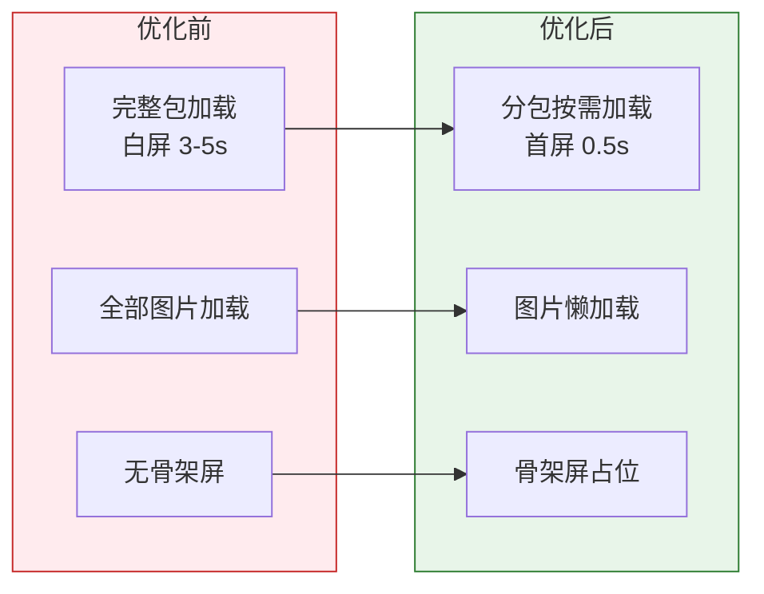
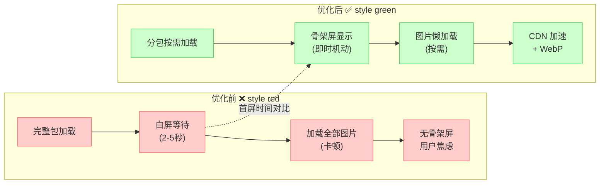

# 14. 性能优化与调试：从小程序到精品

一个功能完整的小程序，和一个流畅优雅的小程序之间，隔着无数个性能优化的坑。本篇覆盖小程序性能优化的核心手段：首屏优化、渲染优化、网络优化、包体积控制，以及微信提供的调试工具。

> **环境：** 微信开发者工具 latest，小程序基础库 3.x

---

## 1. 性能优化的核心指标

小程序性能有四个核心指标：

| 指标 | 含义 | 目标值 |
|------|------|--------|
| **首屏时间（FCP）** | 从启动到第一帧内容渲染 | < 2s |
| **交互响应（TTI）** | 用户可操作的时间 | < 3s |
| **内存占用** | 运行时的内存峰值 | < 200MB |
| **包体积** | 小程序代码包大小 | 主包 < 2MB，总包 < 12MB |



---

## 2. 首屏优化：骨架屏 + 分包加载

### 2.1 分包加载

分包是小程序最重要的首屏优化手段。将代码拆分成主包（启动必须）和多个分包（按需加载），可以显著降低首次下载的体积。

```json
{
  "pages": [
    "pages/index/index",
    "pages/user/user"
  ],
  "subPackages": [
    {
      "root": "pages/shop/",
      "pages": [
        "goods/list",
        "goods/detail",
        "goods/comments"
      ]
    },
    {
      "root": "pages/order/",
      "pages": [
        "cart",
        "confirm",
        "payment",
        "list",
        "detail"
      ]
    }
  ]
}
```

```javascript
// 分包页面加载方式与普通页面完全一致
// 首次访问时，微信自动下载分包，无需额外处理

// 预下载分包（提升下次访问速度）
wx.preLoadSubPackage({
  rootPath: 'pages/shop/',
  success() {
    console.log('shop 分包预加载完成');
  },
});

// 也可以使用 API 预加载
wx.loadSubPackage({
  rootPath: 'pages/shop/',
  success: () => {
    // 分包加载成功
  },
});
```

> **关键约束**：每个分包不能超过 2MB，总包体积不超过 12MB。主包包含小程序启动必须的文件（app.js、app.json、pages/index 等）。

### 2.2 骨架屏

骨架屏在内容加载前显示占位结构，让用户感知"正在加载"而非"白屏"。

```html
<!-- components/skeleton/skeleton.wxml -->
<view class="skeleton">
  <!-- 头部骨架 -->
  <view class="skeleton-header">
    <view class="skeleton-avatar"></view>
    <view class="skeleton-info">
      <view class="skeleton-title"></view>
      <view class="skeleton-desc"></view>
    </view>
  </view>

  <!-- 内容骨架 -->
  <view class="skeleton-content">
    <view wx:for="{{[1, 2, 3]}}" wx:key="index" class="skeleton-item">
      <view class="skeleton-image"></view>
      <view class="skeleton-text">
        <view class="skeleton-line long"></view>
        <view class="skeleton-line medium"></view>
        <view class="skeleton-line short"></view>
      </view>
    </view>
  </view>
</view>
```

```css
/* components/skeleton/skeleton.wxss */

.skeleton {
  padding: 32rpx;
}

/* 骨架动画 */
.skeleton-avatar,
.skeleton-title,
.skeleton-desc,
.skeleton-image,
.skeleton-line {
  background: linear-gradient(
    90deg,
    #f0f0f0 25%,
    #e8e8e8 50%,
    #f0f0f0 75%
  );
  background-size: 200% 100%;
  animation: shimmer 1.5s infinite;
  border-radius: 8rpx;
}

@keyframes shimmer {
  0% { background-position: 200% 0; }
  100% { background-position: -200% 0; }
}

/* 各元素尺寸 */
.skeleton-avatar {
  width: 96rpx;
  height: 96rpx;
  border-radius: 50%;
  margin-right: 24rpx;
}

.skeleton-title {
  height: 32rpx;
  width: 60%;
  margin-bottom: 16rpx;
}

.skeleton-desc {
  height: 24rpx;
  width: 40%;
}

.skeleton-image {
  width: 200rpx;
  height: 200rpx;
  margin-bottom: 16rpx;
}
```

---

## 3. 渲染优化：setData 的艺术

### 3.1 只传必要数据

```javascript
// 错误：传递整个数据对象
this.setData({
  user: {
    id: this.data.user.id,
    name: this.data.user.name,
    age: this.data.user.age,
    avatar: this.data.user.avatar,
    friends: this.data.user.friends,  // 大量数据
    posts: this.data.user.posts,      // 大量数据
  },
});

// 正确：只传变化的部分
this.setData({
  'user.name': newName,
});
```

### 3.2 列表更新优化

```javascript
// 错误：整体替换大列表
const newList = this.data.list.map(item => {
  if (item.id === updatedItem.id) {
    return { ...item, ...updatedItem };
  }
  return item;
});
this.setData({ list: newList });

// 正确：使用路径更新（如果更新频率高）
const index = this.data.list.findIndex(item => item.id === updatedItem.id);
if (index !== -1) {
  this.setData({
    [`list[${index}].name`]: updatedItem.name,
    [`list[${index}].status`]: updatedItem.status,
  });
}
```

### 3.3 避免在 scroll 事件中 setData

```javascript
// 错误：滚动时实时更新状态（卡顿）
onScroll(e) {
  const scrollTop = e.detail.scrollTop;
  this.setData({ scrollTop }); // 每帧都触发，极耗性能
}

// 正确：节流更新（每 300ms 更新一次）
let scrollTimer = null;
onScroll(e) {
  if (scrollTimer) return;
  scrollTimer = setTimeout(() => {
    this.setData({ scrollTop: e.detail.scrollTop });
    scrollTimer = null;
  }, 300);
}

// 更优方案：CSS position: sticky 代替 JS 监听滚动
```

### 3.4 页面初次渲染优化

```javascript
// onLoad 中先设置基础骨架数据，立即渲染
onLoad() {
  // 第一步：立即渲染骨架屏
  this.setData({ loading: true });

  // 第二步：异步请求真实数据
  this.fetchData().then(data => {
    this.setData({
      loading: false,
      ...data,
    });
  });
},
```

---

## 4. 图片优化：懒加载 + CDN

### 4.1 懒加载实现

```javascript
// components/lazy-image/lazy-image.js

Component({
  properties: {
    src: String,
    defaultSrc: {
      type: String,
      value: '/assets/placeholder.png',
    },
  },

  data: {
    loaded: false,
    realSrc: '',
  },

  lifetimes: {
    attached() {
      this.setData({ realSrc: this.properties.src || '' });
      this.createObserver();
    },
    detached() {
      if (this.observer) {
        this.observer.disconnect();
      }
    },
  },

  methods: {
    createObserver() {
      // 使用 IntersectionObserver 监听元素可见性
      this.observer = wx.createIntersectionObserver(this);
      this.observer
        .relativeToViewport({ bottom: 100 })
        .observe('.lazy-image', (res) => {
          if (res.intersectionRatio > 0) {
            // 进入视口，加载图片
            this.setData({
              loaded: true,
              realSrc: this.properties.src,
            });
            this.observer.disconnect();
          }
        });
    },

    onImageLoad() {
      this.setData({ loaded: true });
    },

    onImageError() {
      this.setData({ realSrc: this.properties.defaultSrc });
    },
  },
});
```

### 4.2 CDN 裁剪

```javascript
// utils/image.js

/**
 * 获取 CDN 优化后的图片 URL
 * @param {string} url - 原始 URL
 * @param {Object} options - 裁剪选项
 */
function getOptimizedUrl(url, options = {}) {
  if (!url || !url.includes('cdn.')) return url;

  const {
    width,
    height,
    format = 'webp',  // 使用 WebP 格式，节省 30% 体积
    quality = 80,
    mode = 'aspectfill',
  } = options;

  const params = [];
  if (width) params.push(`w_${width}`);
  if (height) params.push(`h_${height}`);
  if (format) params.push(`f_${format}`);
  if (quality) params.push(`q_${quality}`);

  if (params.length === 0) return url;

  return `${url}?imageMogr2/${params.join('/')}`;
}

// 使用示例
const optimizedUrl = getOptimizedUrl(
  'https://cdn.example.com/image.jpg',
  { width: 300, height: 300, format: 'webp' }
);
```

---

### 可视化：渲染链路优化对比

下面通过对比图展示优化前后的性能差异和关键优化技术。

#### 优化前后对比图



#### 时间性能对比动画

```html
<div class="perf-demo">
  <div class="demo-title">渲染链路优化对比</div>

  <div class="compare-grid">
    <!-- 优化前 -->
    <div class="compare-col before">
      <div class="col-label red">优化前 ❌</div>
      <div class="perf-chain">
        <div class="perf-node" id="p1-load">
          <span class="perf-icon">📦</span>
          <span class="perf-text">完整包加载</span>
          <div class="time-bar"><div class="time-fill red" style="width:100%"></div></div>
        </div>
        <div class="perf-arrow">↓</div>
        <div class="perf-node" id="p1-blank">
          <span class="perf-icon">⬜</span>
          <span class="perf-text">白屏等待</span>
          <div class="time-bar"><div class="time-fill red" style="width:100%"></div></div>
        </div>
        <div class="perf-arrow">↓</div>
        <div class="perf-node" id="p1-img">
          <span class="perf-icon">🖼️</span>
          <span class="perf-text">加载全部图片</span>
          <div class="time-bar"><div class="time-fill red" style="width:100%"></div></div>
        </div>
        <div class="perf-arrow">↓</div>
        <div class="perf-node" id="p1-skeleton">
          <span class="perf-icon">❌</span>
          <span class="perf-text">无骨架屏</span>
          <div class="time-bar"><div class="time-fill red" style="width:100%"></div></div>
        </div>
      </div>
      <div class="time-total red-bg">
        <div class="total-label">首屏时间</div>
        <div class="total-time">3-5 秒</div>
      </div>
    </div>

    <!-- 优化后 -->
    <div class="compare-col after">
      <div class="col-label green">优化后 ✅</div>
      <div class="perf-chain">
        <div class="perf-node" id="p2-sub">
          <span class="perf-icon">📦</span>
          <span class="perf-text">分包按需加载</span>
          <div class="time-bar"><div class="time-fill green" style="width:20%"></div></div>
        </div>
        <div class="perf-arrow">↓</div>
        <div class="perf-node" id="p2-skeleton">
          <span class="perf-icon">🎭</span>
          <span class="perf-text">骨架屏显示</span>
          <div class="time-bar"><div class="time-fill green" style="width:30%"></div></div>
        </div>
        <div class="perf-arrow">↓</div>
        <div class="perf-node" id="p2-lazy">
          <span class="perf-icon">🖼️</span>
          <span class="perf-text">图片懒加载</span>
          <div class="time-bar"><div class="time-fill green" style="width:40%"></div></div>
        </div>
        <div class="perf-arrow">↓</div>
        <div class="perf-node" id="p2-cdn">
          <span class="perf-icon">🌐</span>
          <span class="perf-text">CDN + WebP</span>
          <div class="time-bar"><div class="time-fill green" style="width:15%"></div></div>
        </div>
      </div>
      <div class="time-total green-bg">
        <div class="total-label">首屏时间</div>
        <div class="total-time">0.5-1 秒</div>
      </div>
    </div>
  </div>

  <div class="compare-arrow">
    <span class="arrow-text">性能提升</span>
    <span class="arrow-value">3-10×</span>
  </div>

  <div class="tech-grid">
    <div class="tech-card">
      <div class="tech-icon">📦</div>
      <div class="tech-title">分包加载</div>
      <div class="tech-desc">主包体积 < 2MB，页面按需加载</div>
    </div>
    <div class="tech-card">
      <div class="tech-icon">🎭</div>
      <div class="tech-title">骨架屏</div>
      <div class="tech-desc">Loading 占位，消除白屏焦虑</div>
    </div>
    <div class="tech-card">
      <div class="tech-icon">🖼️</div>
      <div class="tech-title">图片懒加载</div>
      <div class="tech-desc">只加载视口内图片，节省流量</div>
    </div>
    <div class="tech-card">
      <div class="tech-icon">🌐</div>
      <div class="tech-title">CDN + WebP</div>
      <div class="tech-desc">边缘节点加速，格式优化 30%</div>
    </div>
  </div>
</div>

<style>
.perf-demo {
  background: #1a1a2e;
  border-radius: 12px;
  padding: 24px;
  font-family: 'SF Mono', 'Fira Code', monospace;
  color: #e0e0e0;
  max-width: 720px;
  margin: 0 auto;
}
.demo-title {
  text-align: center;
  font-size: 16px;
  color: #ffd700;
  margin-bottom: 20px;
}
.compare-grid {
  display: grid;
  grid-template-columns: 1fr 1fr;
  gap: 20px;
  margin-bottom: 16px;
}
.compare-col {
  background: #16213e;
  border-radius: 10px;
  padding: 16px;
  border: 1px solid;
}
.compare-col.before {
  border-color: #ff6b6b;
}
.compare-col.after {
  border-color: #51cf66;
}
.col-label {
  text-align: center;
  font-size: 14px;
  font-weight: bold;
  margin-bottom: 12px;
}
.col-label.red { color: #ff6b6b; }
.col-label.green { color: #51cf66; }
.perf-chain {
  display: flex;
  flex-direction: column;
  align-items: center;
  gap: 4px;
  margin-bottom: 12px;
}
.perf-node {
  width: 100%;
  background: #0d1117;
  border-radius: 8px;
  padding: 10px 14px;
  display: flex;
  align-items: center;
  gap: 10px;
  border: 1px solid #30363d;
  transition: all 0.3s;
}
.perf-icon { font-size: 18px; flex-shrink: 0; }
.perf-text { font-size: 12px; color: #cdd6f4; flex: 1; }
.perf-arrow {
  font-size: 16px;
  color: #ffd700;
  margin: 2px 0;
}
.time-bar {
  width: 50px;
  height: 6px;
  background: #30363d;
  border-radius: 3px;
  overflow: hidden;
  flex-shrink: 0;
}
.time-fill {
  height: 100%;
  border-radius: 3px;
  transition: width 1s ease;
}
.time-fill.red { background: #ff6b6b; }
.time-fill.green { background: #51cf66; }
.time-total {
  text-align: center;
  border-radius: 8px;
  padding: 10px;
  margin-top: 8px;
}
.red-bg { background: rgba(255,107,107,0.15); border: 1px solid rgba(255,107,107,0.3); }
.green-bg { background: rgba(81,207,102,0.15); border: 1px solid rgba(81,207,102,0.3); }
.total-label { font-size: 11px; color: #6c7086; }
.total-time { font-size: 18px; font-weight: bold; }
.red-bg .total-time { color: #ff6b6b; }
.green-bg .total-time { color: #51cf66; }
.compare-arrow {
  text-align: center;
  margin-bottom: 16px;
  padding: 8px;
  background: rgba(255,215,0,0.1);
  border-radius: 8px;
  border: 1px solid rgba(255,215,0,0.3);
}
.arrow-text { font-size: 12px; color: #ffd700; }
.arrow-value { font-size: 16px; font-weight: bold; color: #ffd700; margin-left: 8px; }
.tech-grid {
  display: grid;
  grid-template-columns: repeat(4, 1fr);
  gap: 10px;
}
.tech-card {
  background: #16213e;
  border: 1px solid #0f3460;
  border-radius: 8px;
  padding: 12px;
  text-align: center;
  transition: all 0.3s;
}
.tech-icon { font-size: 24px; margin-bottom: 6px; }
.tech-title { font-size: 12px; font-weight: bold; color: #ffd700; margin-bottom: 4px; }
.tech-desc { font-size: 11px; color: #6c7086; line-height: 1.4; }
@media (max-width: 600px) {
  .compare-grid { grid-template-columns: 1fr; }
  .tech-grid { grid-template-columns: repeat(2, 1fr); }
}
</style>
```

> **说明**：通过分包加载、骨架屏、图片懒加载、CDN + WebP 四项优化，可将首屏时间从 3-5 秒降低到 0.5-1 秒。

---

## 6. 调试工具与性能监控

### 6.1 开发者工具性能面板

```javascript
// 使用 Trace 工具分析渲染性能
// 1. 在开发者工具中打开「调试器 → Performance」
// 2. 点击「录制」，执行操作
// 3. 停止录制，查看火焰图

// 关键指标：
// - Long Task：超过 50ms 的任务（需要优化）
// - setData 调用频率：越少越好
// - 渲染层 JS 执行时间
```

### 6.2 Performance API

```javascript
// 小程序 Performance API
const monitor = wx.getPerformance();

// 创建性能观测器
const observer = monitor.createObserver((entry) => {
  console.log('性能数据：', entry);
});

// 开始观测
observer.observe({
  entryTypes: ['navigation', 'render', 'script', 'storage'],
});

// 上报性能数据（生产环境）
function reportPerformance(data) {
  wx.reportPerformance?.('record', data);
}
```

### 6.3 常用性能检测代码

```javascript
// pages/index/index.js

Page({
  data: {
    loadTime: 0,
    renderTime: 0,
  },

  onLoad() {
    // 记录页面加载时间
    const loadStart = Date.now();

    this.fetchData().then(() => {
      const loadEnd = Date.now();
      this.setData({ loadTime: loadEnd - loadStart });
      reportPerformance({ type: 'pageLoad', time: loadEnd - loadStart });
    });
  },

  onReady() {
    // 记录渲染完成时间
    const readyTime = Date.now() - getApp().globalData.startTime;
    this.setData({ renderTime: readyTime });
    reportPerformance({ type: 'pageReady', time: readyTime });
  },
});
```

### 6.4 内存泄漏检测

```javascript
// 使用开发者工具的 Memory 面板
// 1. 执行一系列操作
// 2. 触发 GC（点击 Collect garbage）
// 3. 对比操作前后的内存快照

// 代码层面的内存泄漏检查：
// 1. 定时器未清理
onUnload() {
  if (this.timer) clearInterval(this.timer);
  if (this.animationFrame) cancelAnimationFrame(this.animationFrame);
},

// 2. 事件监听未移除
onLoad() {
  // 使用箭头函数保存引用，或在组件 detached 时清理
  this.handleScroll = this.throttle(this.onScroll.bind(this), 300);
  wx.onAppRoute(this.handleScroll);
},

onUnload() {
  wx.offAppRoute(this.handleScroll);
},
```

---

## 7. 包体积优化

### 7.1 分析包体积

在微信开发者工具中：详情 → 基本信息 → 显示"包大小分析"。

| 文件类型 | 优化建议 |
|---------|---------|
| 图片 | 使用 CDN，压缩为 WebP，图标用 iconfont |
| JS | tree-shaking，移除未使用代码，按需引入 |
| WXSS | 删除未使用样式，CSS 变量复用 |
| npm 包 | 只引入用到的部分，避免全量引入 |

### 7.2 图片资源优化

```javascript
// 使用 iconfont 代替图片图标
// 1. 在 iconfont.cn 下载字体文件
// 2. 放在 fonts/iconfont.wxss
// 3. 在 app.wxss 中引入 @import "./fonts/iconfont.wxss";

// 使用 CDN 代替本地图片
// <image src="{{item.cdnUrl}}"/>  // 推荐

// 小图标使用 inline SVG（base64 编码）
const svgIcon = 'data:image/svg+xml;base64,PHN2ZyB4bWxu...';
```

### 7.3 tree-shaking 和按需引入

```javascript
// 错误：全量引入
import _ from 'lodash';
const { debounce, throttle } = _;

// 正确：按需引入
import debounce from 'lodash/debounce';
import throttle from 'lodash/throttle';

// 正确：直接引入小工具函数，不引入整个库
import { formatDate } from '../../utils/date.js';
```

---

## 8. 常见坑点

**1. setData 传入函数或 undefined**

```javascript
// 错误：传入 undefined
this.setData({ value: undefined }); // 可能导致渲染错误
this.setData({ callback: () => {} }); // 函数无法序列化

// 正确：过滤无效值
const data = { name: '张三' };
if (value !== undefined) data.name = value;
this.setData(data);
```

**2. 在 onShow 中重复请求数据**

```javascript
// 错误：从其他页面返回时重复请求
onShow() {
  this.fetchData(); // 每次进入页面都请求
}

// 正确：用状态标记是否需要刷新
onShow() {
  if (this.data.needRefresh) {
    this.fetchData();
    this.setData({ needRefresh: false });
  }
},

onHide() {
  this.setData({ needRefresh: true });
},
```

**3. 图片尺寸过大导致内存溢出**

小程序在内存不足时会自动卸载 WebView，导致页面白屏。图片宽高不要超过屏幕分辨率（通常 2x），大图使用 `mode="aspectFit"` 或 `widthFix` 而非 `width: 100%`。

---

## 延伸思考

性能优化是一个**持续投入**的过程，而非一次性工程。核心原则是：

1. **先测量，后优化**：用 Trace 工具找出瓶颈，而不是凭感觉优化
2. **优化边际效应**：先优化收益最大的部分（通常首屏和长列表）
3. **不要过度优化**：过度优化会增加代码复杂度，维护成本可能超过性能收益
4. **关注真实用户**：开发者工具的模拟器与真机性能有差距，最终要以真机测试为准

---

## 总结

- **分包加载**：将代码按需拆分，主包 < 2MB，首屏加载体积大幅降低
- **骨架屏**：消除白屏焦虑，让用户感知加载进度
- **setData 优化**：只传必要数据、避免 scroll 中更新、使用路径写法
- **图片懒加载**：IntersectionObserver 监听视口进入，按需加载
- **CDN + WebP**：图片体积减少 30-50%，加载速度提升显著
- **Trace 工具**：用数据说话，找出真正的性能瓶颈

---

## 参考

- [性能分析工具 Trace](https://developers.weixin.qq.com/miniprogram/dev/framework/performance/trace.html)
- [小程序性能优化指南](https://developers.weixin.qq.com/miniprogram/dev/framework/performance/tips/start_up.html)
- [包体积优化建议](https://developers.weixin.qq.com/miniprogram/dev/framework/performance/size.html)
