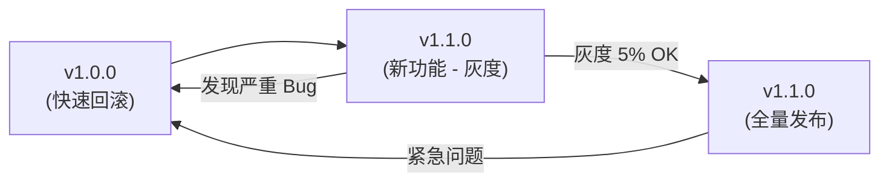

# 15. 工程化与发布：CI/CD + 灰度发布

从"能跑"到"能上线"，中间隔着工程化、自动化和质量保障。本篇覆盖小程序开发的完整工程化链路：环境配置、代码规范、CI/CD 流水线、灰度发布与回滚。

> **环境：** 微信开发者工具 latest，小程序基础库 3.x，需要 Node.js 20+ 和 Git

---

## 1. 项目配置与环境管理

### 1.1 多环境配置

小程序通常有三个环境：开发、预发布、生产。通过 `project.config.json` 和环境变量管理。

```json
// project.config.json
{
  "description": "项目配置文件",
  "packOptions": {
    "ignore": [
      { "type": "file", "value": ".env.dev" },
      { "type": "file", "value": ".env.prod" }
    ]
  },
  "setting": {
    "es6Modules": true,
    "urlCheck": false,  // 开发阶段关闭域名校验
    "enhance": true,    // 启用增强编译
    "bigPackageSizeSupport": true
  },
  "appid": "wxxxxxxxxxxx",
  "projectname": "my-miniprogram",
  "compileType": "miniprogram"
}
```

```javascript
// config/env.js

/**
 * 环境配置管理器
 */

const ENV = process.env.NODE_ENV || 'development';

const configs = {
  development: {
    name: '开发环境',
    apiBase: 'https://dev-api.example.com',
    wsBase: 'wss://dev-api.example.com',
    enableLog: true,
    mockData: true,
  },

  staging: {
    name: '预发布环境',
    apiBase: 'https://staging-api.example.com',
    wsBase: 'wss://staging-api.example.com',
    enableLog: true,
    mockData: false,
  },

  production: {
    name: '生产环境',
    apiBase: 'https://api.example.com',
    wsBase: 'wss://api.example.com',
    enableLog: false,
    mockData: false,
  },
};

export default configs[ENV] || configs.development;
```

```javascript
// utils/request.js
import config from '../config/env.js';

const request = (options) => {
  return new Promise((resolve, reject) => {
    wx.request({
      url: config.apiBase + options.url,
      ...options,
      success: resolve,
      fail: reject,
    });
  });
};
```

### 1.2 Git 分支管理策略

```
main (保护分支)
├── develop (开发分支)
│   ├── feature/xxx (功能分支)
│   ├── fix/xxx (修复分支)
│   └── release/1.0.0 (发布分支)
└── hotfix/xxx (热修复分支)
```

```bash
# 常规开发流程
git checkout develop
git checkout -b feature/user-auth
# 开发完成后
git checkout develop
git merge feature/user-auth
git branch -d feature/user-auth

# 发布流程
git checkout develop
git checkout -b release/1.0.0
# 测试通过后
git checkout main
git merge release/1.0.0
git tag v1.0.0
git push origin main --tags
```

---

## 2. GitHub Actions CI/CD 流水线

### 2.1 完整 CI/CD 配置

```yaml
# .github/workflows/deploy.yml

name: Miniprogram CI/CD

on:
  push:
    branches:
      - main
      - develop
  pull_request:
    branches:
      - develop

env:
  NODE_VERSION: '20.x'

jobs:
  # ========== 静态检查 ==========
  lint:
    name: Code Lint
    runs-on: ubuntu-latest
    steps:
      - uses: actions/checkout@v4

      - name: Setup Node.js
        uses: actions/setup-node@v4
        with:
          node-version: ${{ env.NODE_VERSION }}
          cache: 'npm'

      - name: Install dependencies
        run: npm ci

      - name: Run ESLint
        run: npm run lint

      - name: Run Prettier check
        run: npm run format:check

  # ========== 单元测试 ==========
  test:
    name: Unit Tests
    runs-on: ubuntu-latest
    steps:
      - uses: actions/checkout@v4

      - name: Setup Node.js
        uses: actions/setup-node@v4
        with:
          node-version: ${{ env.NODE_VERSION }}
          cache: 'npm'

      - name: Install dependencies
        run: npm ci

      - name: Run tests
        run: npm test

      - name: Upload coverage
        uses: codecov/codecov-action@v3
        with:
          files: ./coverage/lcov.info

  # ========== 构建与上传 ==========
  build:
    name: Build & Upload
    runs-on: ubuntu-latest
    needs: [lint, test]
    if: github.event_name == 'push' && (github.ref == 'refs/heads/main' || github.ref == 'refs/heads/develop')

    steps:
      - uses: actions/checkout@v4

      - name: Setup Node.js
        uses: actions/setup-node@v4
        with:
          node-version: ${{ env.NODE_VERSION }}
          cache: 'npm'

      - name: Install dependencies
        run: npm ci

      - name: Build for staging
        if: github.ref == 'refs/heads/develop'
        run: |
          npm run build -- --env staging
          echo "APP_ID=${{ secrets.WX_APP_ID_STAGING }}" >> $GITHUB_ENV
        env:
          NODE_ENV: staging

      - name: Build for production
        if: github.ref == 'refs/heads/main'
        run: |
          npm run build -- --env production
          echo "APP_ID=${{ secrets.WX_APP_ID_PROD }}" >> $GITHUB_ENV
        env:
          NODE_ENV: production

      - name: Upload to WeChat
        uses: cloudxj/media-upload@v3
        with:
          appid: ${{ env.APP_ID }}
          privatekey: ${{ secrets.WX_PRIVATE_KEY }}
          version: ${{ github.ref_name == 'main' && '1.0.0' || '0.0.1-dev' }}
          desc: ${{ github.event.head_commit.message }}

      - name: Deploy notification
        if: github.ref == 'refs/heads/main'
        run: |
          curl -X POST ${{ secrets.DINGTALK_WEBHOOK }} \
            -H 'Content-Type: application/json' \
            -d '{"msgtype": "text", "text": {"content": "🚀 生产版本已上传，请前往微信公众平台提交审核"}}'
```

### 2.2 package.json 脚本配置

```json
{
  "scripts": {
    "dev": "miniprogram-tools dev",
    "build": "miniprogram-tools build",
    "build:staging": "NODE_ENV=staging npm run build",
    "build:prod": "NODE_ENV=production npm run build",
    "lint": "eslint pages components utils --ext .js",
    "lint:fix": "eslint pages components utils --ext .js --fix",
    "format:check": "prettier --check \"**/*.{js,wxml,wxss,json}\"",
    "format:fix": "prettier --write \"**/*.{js,wxml,wxss,json}\"",
    "test": "jest --coverage",
    "prepare": "husky install"
  },
  "devDependencies": {
    "eslint": "^9.0.0",
    "prettier": "^3.0.0",
    "husky": "^9.0.0",
    "jest": "^29.0.0"
  }
}
```

---

## 3. 微信开发者工具 CLI

微信开发者工具支持命令行操作，可以实现自动化构建和上传。

### 3.1 CLI 命令

```bash
# 安装微信开发者工具 CLI（需要开启「工具 → 命令行调用」）
# macOS: /Applications/wechatwebdevtools.app/Contents/MacOS/cli

# 登录（需要微信扫码授权）
cli login

# 编译项目
cli compile --project . --compile-type miniprogram --output ./dist

# 上传代码
cli upload --project . --version 1.0.0 --desc "修复支付回调问题"

# 预览（生成二维码）
cli preview --project . --output ./preview.jpg
```

### 3.2 GitHub Actions 中的集成

```yaml
# 使用 GitHub Actions 调用微信 CLI
- name: WeChat CLI Upload
  run: |
    /Applications/wechatwebdevtools.app/Contents/MacOS/cli login --qr-output ${{ github.workspace }}/qr.png
    # 上传二维码到 GitHub Artifact 供人工确认
    echo "等待授权...（需要管理员扫码）"
    # 或使用预先授权的 CLI
    /Applications/wechatwebdevtools.app/Contents/MacOS/cli upload \
      --project . \
      --version ${{ github.sha }} \
      --desc ${{ github.event.head_commit.message }}
  env:
    NODE_ENV: production
```

---

## 4. 灰度发布与回滚

### 4.1 灰度发布策略

微信小程序的灰度发布通过后台"版本管理"实现，不支持像 Web 一样的动态流量分配。但可以通过以下方式模拟灰度：

| 灰度方式 | 实现方案 | 适用场景 |
|---------|---------|---------|
| 用户标签灰度 | 后端接口判断，返回不同版本数据 | 接口兼容 |
| 白名单灰度 | Storage 中记录用户 ID，白名单用户体验新功能 | 功能灰度 |
| 分批次审核 | 先提交审核 50% 用户，再扩大范围 | 发布节奏控制 |
| A/B 实验 | 随机分配用户到 A/B 组 | 数据驱动优化 |

### 4.1 白名单灰度方案

```javascript
// utils/feature-flags.js

const GRAY_USERS_KEY = 'gray_users';
const GRAY_FEATURES_KEY = 'gray_features';

/**
 * 检查用户是否在灰度名单中
 */
function isGrayUser(userId) {
  const grayUsers = wx.getStorageSync(GRAY_USERS_KEY) || [];
  return grayUsers.includes(userId);
}

/**
 * 检查某个功能是否对当前用户开放
 */
function isFeatureEnabled(featureName) {
  const features = wx.getStorageSync(GRAY_FEATURES_KEY) || {};
  return features[featureName] === true;
}

/**
 * 特性开关使用示例
 */
function getHomeConfig(userId) {
  const useNewHomePage = isGrayUser(userId) &&
    isFeatureEnabled('new_home_page');

  if (useNewHomePage) {
    return {
      homePage: '/pages/new-home/index',
      showBanner: true,
    };
  }

  return {
    homePage: '/pages/index/index',
    showBanner: false,
  };
}
```

### 4.2 版本回滚机制

微信小程序不支持像 Web 那样随时回滚，必须通过"版本管理"功能降级到历史版本。因此：

1. **发布前备份**：每次发布前，在后台手动保存一个"备用版本"
2. **灰度后全量**：灰度验证无问题后，再提交全量审核
3. **快速回滚流程**：如果全量后发现问题，立即在后台将"当前版本"切换为上一个稳定版本



---

## 5. 代码规范与质量门禁

### 5.1 ESLint 配置

```javascript
// .eslintrc.js
module.exports = {
  env: {
    es2022: true,
    wechatapp: true,
  },
  extends: ['eslint:recommended'],
  rules: {
    // 小程序相关规则
    'no-undef': 'off',      // 小程序全局变量不报错
    'no-unused-vars': 'warn',

    // 强制使用 const
    'prefer-const': 'error',

    // 强制使用 === / !==
    'eqeqeq': ['error', 'always'],

    // 禁止 console（生产环境）
    'no-console': process.env.NODE_ENV === 'production' ? 'warn' : 'off',

    // 箭头函数
    'arrow-spacing': ['error', { before: true, after: true }],

    // 缩进（小程序使用 2 空格）
    'indent': ['error', 2],
  },
};
```

### 5.2 Prettier 配置

```javascript
// .prettierrc.js
module.exports = {
  semi: false,           // 不加分号
  singleQuote: true,      // 单引号
  tabWidth: 2,            // 2 空格缩进
  useTabs: false,
  trailingComma: 'none',  // 不加尾随逗号
  printWidth: 100,        // 单行最大 100 字符
  arrowParens: 'avoid',
  endOfLine: 'auto',
};
```

### 5.3 Git Hooks（使用 Husky）

```json
// package.json
{
  "husky": {
    "hooks": {
      "pre-commit": "npm run lint && npm run test",
      "commit-msg": "commitlint -E HUSKY_GIT_PARAMS"
    }
  }
}
```

```bash
# .commitlint.config.js
module.exports = {
  extends: ['@commitlint/config-conventional'],
  rules: {
    'type-enum': [
      2,
      'always',
      ['feat', 'fix', 'docs', 'style', 'refactor', 'test', 'chore'],
    ],
  },
};
```

---

## 6. 微信审核避坑指南

### 6.1 常见被拒原因

| 被拒原因 | 解决方案 |
|---------|---------|
| 诱导关注/分享 | 不能强制分享，不能用利益诱导分享 |
| 虚拟支付 | 不能在小程序内购买虚拟商品（游戏点券等） |
| 用户授权模糊 | 必须在隐私政策中明确说明获取哪些数据 |
| 功能不完整 | 测试所有功能，确保无死链和功能异常 |
| 类目不符 | 选择正确的小程序类目，不要跨类目提交 |
| 滥用模板消息 | 发送频率不超过限制，内容与用户行为相关 |

### 6.2 审核自检清单

```markdown
## 发布前自检清单

### 功能完整性
- [ ] 所有按钮可点击且有响应
- [ ] 所有表单可提交
- [ ] 错误处理（网络失败、无数据等）已覆盖
- [ ] 分享功能正常

### 合规性
- [ ] 无强制分享提示
- [ ] 无虚拟支付内容
- [ ] 隐私政策已填写
- [ ] 用户授权说明清晰

### 内容质量
- [ ] 无占位符内容（TODO、示例文字）
- [ ] 无外部链接跳转
- [ ] 图片无侵权风险
- [ ] 文字内容无违规

### 技术稳定性
- [ ] 真机测试通过
- [ ] 内存占用正常（< 200MB）
- [ ] 无控制台报错
- [ ] 包体积在限制内
```

---

## 7. 常见坑点

**1. CI/CD 中忘记设置正确的 AppID**

开发和生产环境使用不同的 AppID。在 GitHub Secrets 中分别配置 `WX_APP_ID_DEV`、`WX_APP_ID_STAGING`、`WX_APP_ID_PROD`，workflow 中根据分支选择正确的 ID。

**2. 分包后资源路径问题**

分包中引用的资源（如图片）必须放在分包目录下，或者上传到 CDN。主包资源无法被分包直接引用（除非使用 CDN URL）。

**3. 审核期间关闭了体验版**

提交审核后，体验版会自动变为"审核中"状态，无法扫码体验。审核通过前，测试人员无法使用该版本。

**4. 微信 CLI 未开启权限**

开发者工具 CLI 需要在"工具 → 设置 → 通用设置"中开启"启用 CLI 调用"选项。否则 CI 服务器调用时会报错。

---

## 延伸思考

工程化的本质是**将重复性的工作自动化**，让开发者专注于业务逻辑。小程序的 CI/CD 相比 Web 应用有一个特殊约束：**必须通过微信后台提交审核**，无法实现真正的"一键发布"。

因此，小程序的 CI/CD 重点在：
- **自动化构建**：保证每次构建产物一致
- **自动化测试**：在提交审核前发现问题
- **发布通知**：审核通过/失败后及时通知团队
- **灰度控制**：控制新版本的放量节奏

理解这些约束，才能设计出适合小程序的工程化流程。

---

## 总结

- **多环境配置**：通过 `process.env` 和 `project.config.json` 管理开发/预发布/生产环境
- **GitHub Actions**：自动化构建、测试、部署流水线
- **代码规范**：ESLint + Prettier + Husky 保证代码质量
- **灰度发布**：白名单灰度方案 + 版本管理备份
- **审核避坑**：诱导分享、虚拟支付、授权说明是三大高频被拒原因
- **CI/CD 约束**：小程序无法"一键发布"，必须经过微信审核流程

---

## 参考

- [微信开发者工具 CLI 文档](https://developers.weixin.qq.com/miniprogram/dev/devtools/cli.html)
- [GitHub Actions 官方文档](https://docs.github.com/actions)
- [小程序发布流程指南](https://developers.weixin.qq.com/miniprogram/dev/framework/operating/side-chain.html)
