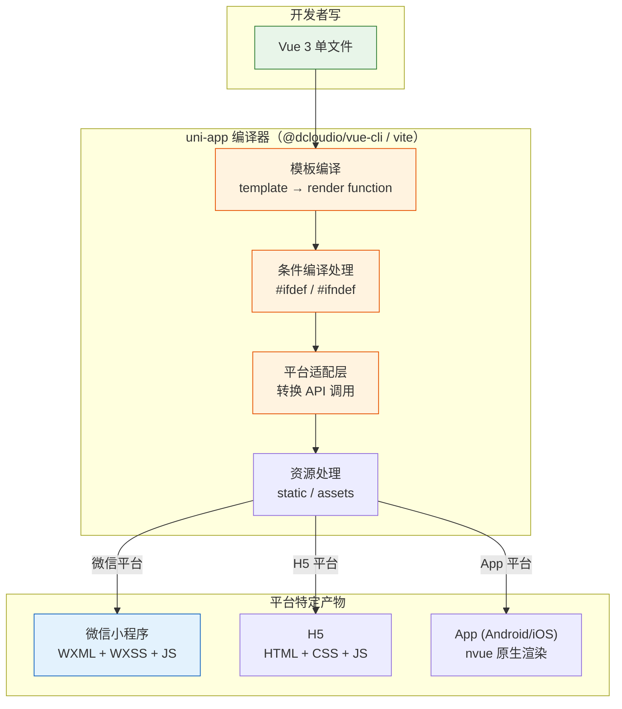

# 16. 扩展一：uni-app 跨平台实战

uni-app 是一个使用 Vue.js 语法开发小程序、H5、App 的跨平台框架，由 DCloud 维护。本篇对比原生小程序，讲解 uni-app 的核心优势和开发模式。

> **环境：** Node.js 20+, HBuilderX（推荐）或 CLI

---

## 1. uni-app vs 原生小程序

### 1.1 核心对比

| 维度 | 原生小程序 | uni-app |
|------|-----------|---------|
| 语法 | WXML/WXSS/JS | Vue 2 / Vue 3 |
| 平台 | 仅微信小程序 | 7 个平台（小程序 + H5 + App） |
| 性能 | 最好 | 接近原生（编译优化） |
| 包体积 | 最小 | 略大（有 Vue 运行时） |
| 生态 | 微信官方 | DCloud 社区（插件丰富） |
| 学习曲线 | 低 | 中（需了解 Vue） |

### 1.2 什么时候选 uni-app

- **多端复用**：需要同时发布小程序、H5、App
- **Vue 团队**：团队熟悉 Vue，不想学 WXML
- **快速开发**：对性能要求不是极致，注重开发效率

- **什么时候选原生**：小程序仅微信平台、性能极致重要、团队已有小程序经验

---

## 2. 项目初始化

### 2.1 HBuilderX 方式（推荐）

1. 下载 [HBuilderX](https://www.dcloud.io/hbuilderx.html)
2. 新建项目 → 选择 `uni-app` → 填写项目名
3. 选择 Vue 版本（推荐 Vue 3）

### 2.2 CLI 方式

```bash
# 创建项目
npx degit dcloudio/uni-preset-vue#vite my-project

# 安装依赖
cd my-project
npm install

# 运行到小程序
npm run dev:mp-weixin

# 运行到 H5
npm run dev:h5
```

### 2.3 项目结构

```
my-project/
├── src/
│   ├── pages/
│   │   └── index/
│   │       └── index.vue      # 页面文件
│   ├── static/                 # 静态资源
│   ├── App.vue                # 应用入口
│   ├── main.js               # JS 入口
│   ├── manifest.json          # 应用配置
│   ├── pages.json             # 页面路由配置
│   └── uni.scss               # 全局样式变量
├── package.json
└── vite.config.js            # Vite 配置
```

---

## 3. Vue 3 语法速通

### 3.1 模板语法

```vue
<!-- pages/index/index.vue -->

<template>
  <view class="container">
    <!-- 数据绑定（与 Vue 一致） -->
    <text>{{ message }}</text>

    <!-- 条件渲染 -->
    <view v-if="show">显示</view>
    <view v-else>隐藏</view>

    <!-- 列表渲染 -->
    <view
      v-for="(item, index) in list"
      :key="item.id"
      class="item">
      <text>{{ index + 1 }}. {{ item.name }}</text>
    </view>

    <!-- 事件绑定（与 Vue 不同：小程序用 bindtap） -->
    <button @click="handleClick">点击</button>

    <!-- 表单双向绑定 -->
    <input v-model="inputValue" />

    <!-- 原生组件（标签名不同） -->
    <scroll-view scroll-y>
      <view>滚动内容</view>
    </scroll-view>
  </view>
</template>

<script setup>
// Vue 3 Composition API
import { ref, computed, onMounted } from 'vue';

// 数据
const message = ref('Hello uni-app');
const list = ref([
  { id: 1, name: 'Apple' },
  { id: 2, name: 'Banana' },
]);
const inputValue = ref('');

// 方法
const handleClick = () => {
  console.log('点击了');
};

// 计算属性
const upperMessage = computed(() => message.value.toUpperCase());

// 生命周期
onMounted(() => {
  console.log('页面加载完成');
});
</script>

<style scoped>
/* scoped：样式隔离 */
.container {
  padding: 32rpx;
}

.item {
  padding: 16rpx;
  border-bottom: 1rpx solid #eee;
}
</style>
```

---

## 4. 条件编译：跨平台差异处理

uni-app 最大的工程挑战是：不同平台的 API 和 UI 有差异。条件编译是解决方案。

### 4.1 条件编译语法

```vue
<script>
// JS 中的条件编译
export default {
  methods: {
    onShare() {
      // #ifdef MP-WEIXIN
      // 只有微信小程序执行
      wx.showShareMenu();
      // #endif

      // #ifdef H5
      // 只有 H5 执行
      this.copyLink();
      // #endif

      // #ifdef APP-PLUS
      // 只有 App 执行
      plus.share.sendWithSystem({ content: '分享内容' });
      // #endif
    },
  },
};
</script>

<style>
/* CSS 中的条件编译 */
.container {
  /* #ifdef MP-WEIXIN */
  padding: 20rpx;  /* 小程序特殊样式 */
  /* #endif */

  /* #ifdef H5 */
  padding: 20px;   /* H5 使用 px */
  /* #endif */
}
</style>
```

### 4.2 常见条件编译场景

| 场景 | 小程序 | H5 | App |
|------|--------|-----|-----|
| 分享 | `wx.showShareMenu` | `navigator.share` | `plus.share` |
| 登录 | `wx.login` | 普通表单 | 第三方 SDK |
| 支付 | `wx.requestPayment` | 跳转支付 | 第三方 SDK |
| 导航栏 | `uni.setNavigationBarTitle` | CSS 控制 | `plus.navigator` |

### 4.3 平台判断 API

```javascript
// 运行时判断平台
const platform = uni.getSystemInfoSync().platform;
console.log(platform); // 'android' | 'ios' | 'devtools'

// 编译时判断（uni-app 提供的常量）
// #ifdef MP-WEIXIN
const isMiniprogram = true;
// #endif

// #ifdef H5
const isH5 = true;
// #endif
```

---

## 5. API 差异处理

uni-app 对微信小程序 API 做了封装，统一使用 `uni.xxx` 调用，在不同平台自动适配。

### 5.1 统一 API

```javascript
// 原生小程序
wx.request({ url, success() {} });
wx.showToast({ title });
wx.navigateTo({ url });

// uni-app（跨平台）
uni.request({ url });
uni.showToast({ title });
uni.navigateTo({ url });
```

### 5.2 uni-app 的跨平台能力

```javascript
// 选择图片（自动适配各平台）
uni.chooseImage({
  count: 9,
  success: (res) => {
    console.log(res.tempFilePaths);
  },
});

// 支付（统一调用）
uni.requestPayment({
  provider: 'wxpay',  // 或 'alipay'
  orderInfo: {},
  success() {
    uni.showToast({ title: '支付成功' });
  },
});
```

### 5.3 平台特有 API

```javascript
// 小程序特有 API
// #ifdef MP-WEIXIN
wx.getDeviceInfo();
// #endif

// App 特有 API
// #ifdef APP-PLUS
plus.device.getInfo();
// #endif

// H5 特有 API
// #ifdef H5
document.title = 'new title';
// #endif
```

---

## 6. 组件系统

### 6.1 原生组件

uni-app 支持使用原生小程序的组件：

```json
// pages.json
{
  "usingComponents": {
    "my-header": "/components/my-header/my-header"
  }
}
```

```vue
<!-- 使用原生自定义组件 -->
<template>
  <my-header title="商品详情" />
</template>
```

### 6.2 uView UI 组件库

[uView](https://www.uviewui.com/) 是 uni-app 最流行的 UI 组件库：

```bash
# 安装
npm install uview-ui

# main.js 中引入
import uview from 'uview-ui';
Vue.use(uview);
```

```vue
<!-- 使用组件 -->
<template>
  <view>
    <u-button type="primary">主要按钮</u-button>
    <u-cell-group>
      <u-cell title="单元格"></u-cell>
    </u-cell-group>
  </view>
</template>
```

---

## 7. 与原生小程序的关键差异

### 7.1 渲染层差异

原生小程序使用 WebView 渲染，uni-app 使用 Vue 的模板编译器将 `.vue` 文件编译为小程序代码。

这意味着：
- uni-app 不支持动态组件（`<component :is="componentName">`）
- 某些 Vue 指令（如 `v-show`）在编译后可能有性能差异
- slot 行为与原生小程序一致

### 7.2 性能差异

uni-app 的编译产物比原生代码多一层 Vue 运行时。对于简单页面，差异可忽略；对于复杂页面，可能有 5-10% 的性能差距。

优化手段：
- 使用 `onPageScroll` 时使用节流
- 避免频繁 `setData`（uni-app 中对应 `nextTick`）
- 使用 `v-once` 标记静态内容

```vue
<!-- 静态内容使用 v-once，只渲染一次 -->
<view v-once>{{ staticConfig.title }}</view>
```

### 7.3 包体积对比

```
原生小程序：
  主包：1.5MB（代码 + 资源）

uni-app：
  主包：1.5MB + Vue 运行时 ~300KB = 1.8MB
```

如果接近微信 2MB 限制，需要：
- 使用分包加载
- 图片资源迁移到 CDN
- 精简不用的 uni-app 模块

---

## 8. uni-app 编译流程图

理解 uni-app 如何将 Vue 代码编译为各平台代码，是掌握它的关键：



### 6.1 uni-app 迷你实战：计数器（Vue 3 Composition API）

以下是一个完整的 uni-app 页面示例，对比原生小程序看差异：

```vue
<!-- pages/index/index.vue -->

<template>
  <view class="container">
    <!-- 数据绑定（与 Vue 完全一致） -->
    <text class="count">{{ count }}</text>

    <!-- 事件绑定（@tap 代替 bindtap） -->
    <button @tap="increment">+1</button>
    <button @tap="decrement">-1</button>
    <button @tap="reset">重置</button>

    <!-- 条件渲染 -->
    <text v-if="count > 5" class="warning">计数已超过 5！</text>

    <!-- 列表渲染 -->
    <view v-for="(item, index) in history" :key="index" class="history-item">
      <text>{{ item }}</text>
    </view>
  </view>
</template>

<script setup>
import { ref, computed } from 'vue';

// 数据（ref = 响应式状态）
const count = ref(0);
const history = ref([]);

// 计算属性
const isPositive = computed(() => count.value > 0);

// 方法
const increment = () => {
  count.value++;
  history.value.unshift(`+1 → ${count.value}`);
};

const decrement = () => {
  count.value--;
  history.value.unshift(`-1 → ${count.value}`);
};

const reset = () => {
  count.value = 0;
  history.value = [];
};

// 生命周期
import { onLoad } from '@dcloudio/uni-app';

onLoad((options) => {
  console.log('页面参数:', options);
  // uni-app 特有的 onLoad
});
</script>

<style scoped>
.container {
  padding: 32rpx;
  display: flex;
  flex-direction: column;
  align-items: center;
}
.count {
  font-size: 96rpx;
  font-weight: bold;
  color: #07C160;
  margin: 40rpx 0;
}
.warning {
  color: #ff4757;
  font-size: 28rpx;
  margin-top: 20rpx;
}
.history-item {
  padding: 12rpx;
  color: #999;
  font-size: 24rpx;
}
</style>
```

### 6.2 uni-app 与原生小程序写法对比

| 特性 | 原生小程序 | uni-app |
|------|-----------|---------|
| 模板引擎 | WXML | Vue template |
| 条件渲染 | `wx:if` | `v-if` |
| 列表渲染 | `wx:for` | `v-for` |
| 事件绑定 | `bindtap` | `@tap` |
| 数据绑定 | `{{}}` | `{{}}`（Vue 语法） |
| 状态管理 | `setData` | `ref` / `reactive` |
| 生命周期 | `onLoad` | `onLoad`（uni-app 兼容） |
| 页面跳转 | `wx.navigateTo` | `uni.navigateTo` |

---

## 9. 常见坑点

**1. 条件编译位置写错**

条件编译的 `#ifdef` 必须在行首，不能有缩进：

```javascript
// 错误（缩进了）
  // #ifdef MP-WEIXIN

// 正确（行首）
// #ifdef MP-WEIXIN
```

**2. 跨平台 API 行为不一致**

`uni.getStorage` 在不同平台的异步行为可能不同。建议统一使用 `uni.getStorageSync` 和 `uni.setStorageSync`：

```javascript
// 统一用同步 API，避免行为差异
const token = uni.getStorageSync('token');
uni.setStorageSync('token', newToken);
```

**3. App 端不支持小程序组件**

在 App 端，微信小程序的原生组件（如 video、map）使用的是 App 原生组件，API 和小程序端有差异。需要在条件编译中分别处理。

---

## 延伸思考

uni-app 的本质是一个**编译时跨平台**方案——在编译时将统一的 Vue 代码编译为各平台的代码。这与 React Native 的运行时跨平台有本质区别。

编译时跨平台的优点是：代码量更可控、性能更好；缺点是：编译器复杂度高、某些动态特性受限。

选择 uni-app 还是原生，关键在于**团队的技术栈和业务目标**。如果你的团队全是 Vue 开发者，需要同时支持 App + 小程序，uni-app 是合理选择。如果只需要小程序，或者对性能有极致要求，原生开发仍是最佳方案。

---

## 总结

- **uni-app**：Vue 语法 + 编译时跨平台，支持 7 个平台
- **条件编译**：`#ifdef` / `#ifndef` 处理平台差异
- **统一 API**：`uni.xxx` 自动适配各平台
- **适合场景**：多端复用、Vue 团队、快速开发
- **不适合场景**：极致性能要求、微信小程序专属能力深度使用

---

## 参考

- [uni-app 官方文档](https://uniapp.dcloud.net.cn/)
- [条件编译文档](https://uniapp.dcloud.net.cn/platform/)
- [DCloud 插件市场](https://ext.dcloud.net.cn/)
