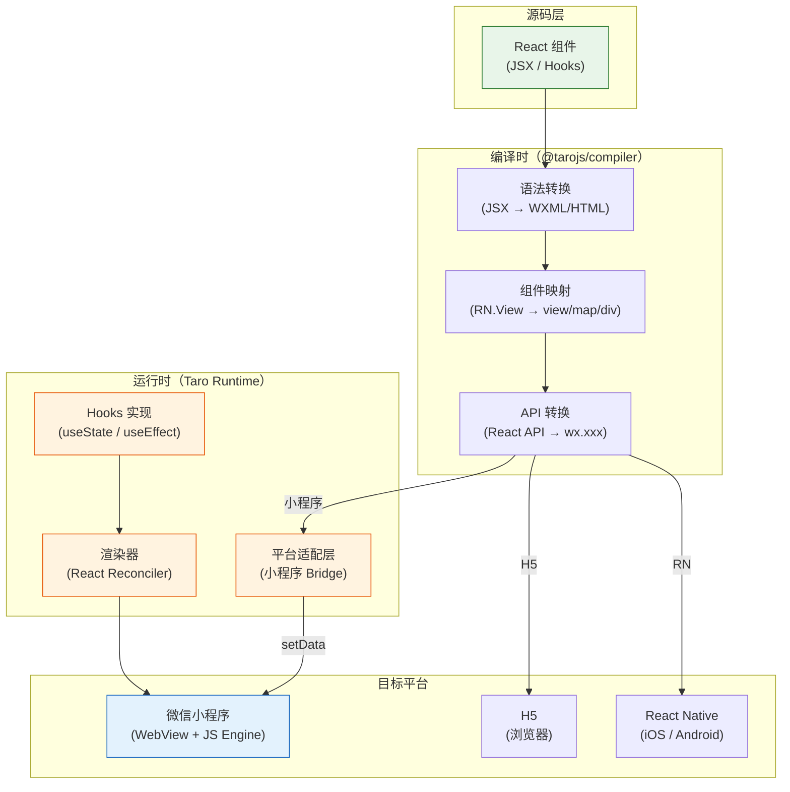

# 17. 扩展二：Taro 3.x React 化改造

Taro 是京东开源的跨平台框架，支持使用 React（默认）、Vue、Nerv 等框架开发小程序。本篇聚焦 Taro 3.x 的 React 模式，对比原生小程序，讲解其核心特性和最佳实践。

> **环境：** Node.js 20+, Taro CLI

---

## 1. Taro vs 原生小程序

### 1.1 核心对比

| 维度 | 原生小程序 | Taro 3.x (React) |
|------|-----------|-----------------|
| 语法 | WXML/WXSS/JS | React JSX |
| 平台 | 仅微信小程序 | 10+ 平台 |
| 渲染方式 | 编译时转换 | 运行时适配 |
| 状态管理 | 原生 setData | React Hooks |
| 性能 | 最好 | 略低于原生（React 运行时） |
| 学习曲线 | 低 | 中（需了解 React） |

### 1.2 Taro 3.x 的架构

Taro 3.x 使用**运行时的适配层**实现跨平台：

```
Taro 源码（React）
    ↓ 编译
平台无关的 IR（中间表示）
    ↓ 运行时适配
小程序 / H5 / RN / ...
```

与 Taro 2.x（纯编译时）的区别：3.x 增加了运行时层，可以更好地处理动态特性，但包体积略大。

### 1.3 什么时候选 Taro

- **React 团队**：熟悉 React，不想学 WXML/WXSS
- **多端复用**：需要同时支持小程序 + H5 + App + RN
- **已有 React 项目**：复用现有 React 组件

---

## 2. 项目初始化

### 2.1 创建项目

```bash
# 安装 CLI
npm install -g @tarojs/cli

# 创建项目（React 版本）
taro create my-project --template react

# 进入项目
cd my-project

# 安装依赖
npm install

# 开发微信小程序
npm run dev:weapp

# 编译微信小程序
npm run build:weapp
```

### 2.2 项目结构

```
my-project/
├── src/
│   ├── app.tsx              # 应用入口（类似 App.js）
│   ├── app.config.ts        # 应用配置（对应 app.json）
│   ├── pages/
│   │   └── index/
│   │       ├── index.tsx   # 页面逻辑（React 组件）
│   │       ├── index.config.ts  # 页面配置（对应 index.json）
│   │       └── index.scss   # 页面样式（支持 SCSS）
│   ├── components/          # 公共组件
│   ├── hooks/               # 自定义 Hooks
│   ├── store/               # 状态管理
│   └── styles/              # 全局样式
├── package.json
└── config/
    └── index.ts             # Taro 构建配置
```

---

## 3. React 语法速通

### 3.1 页面组件

```tsx
// src/pages/index/index.tsx

import { useState, useEffect, useCallback } from 'react';
import { View, Text, Button, Input } from '@tarojs/components';
import Taro from '@tarojs/taro';
import './index.scss';

// Page 装饰器（Taro 2.x 风格）
// @tarojs/components 提供了小程序组件的 React 封装

export default function IndexPage() {
  // ========== 状态 ==========
  const [message, setMessage] = useState('Hello Taro');
  const [count, setCount] = useState(0);
  const [inputValue, setInputValue] = useState('');

  // ========== 生命周期 ==========
  // 对应原生小程序的 onLoad / onShow / onMounted 等
  useEffect(() => {
    console.log('页面加载');
    // 初始化请求
    fetchData();
    // 返回清理函数（对应 onUnload）
    return () => {
      console.log('页面卸载');
    };
  }, []);

  // ========== 方法 ==========
  const fetchData = async () => {
    try {
      const res = await Taro.request({ url: '/api/data' });
      console.log(res);
    } catch (err) {
      console.error(err);
    }
  };

  const handleClick = useCallback(() => {
    setCount(count + 1);
    Taro.showToast({ title: `点击了 ${count + 1} 次` });
  }, [count]);

  // ========== 渲染 ==========
  return (
    <View className="container">
      <Text className="title">{message}</Text>
      <Text className="count">计数：{count}</Text>

      <Button onClick={handleClick}>点我 +1</Button>

      <Input
        className="input"
        value={inputValue}
        onInput={(e) => setInputValue(e.detail.value)}
        placeholder="输入内容"
      />

      <Text className="input-preview">你输入了：{inputValue}</Text>
    </View>
  );
}

// 页面配置（对应 index.json）
IndexPage.config = {
  navigationBarTitleText: 'Taro 示例',
  enablePullDownRefresh: true,
};
```

### 3.2 组件

```tsx
// src/components/product-card/index.tsx

import { View, Text, Image } from '@tarojs/components';
import './index.scss';

interface ProductCardProps {
  title: string;
  price: number;
  imageUrl: string;
  onAddCart?: (id: string) => void;
}

export default function ProductCard({
  title,
  price,
  imageUrl,
  onAddCart,
}: ProductCardProps) {
  const handleAdd = () => {
    onAddCart?.('product-123');
  };

  return (
    <View className="product-card">
      <Image
        src={imageUrl}
        mode="aspectFill"
        className="product-image"
      />
      <View className="product-info">
        <Text className="product-title">{title}</Text>
        <View className="product-footer">
          <Text className="product-price">¥{price}</Text>
          <View className="add-btn" onClick={handleAdd}>
            <Text>加入购物车</Text>
          </View>
        </View>
      </View>
    </View>
  );
}
```

---

## 4. Hooks 与状态管理

### 4.1 useState / useEffect

```tsx
// 计数器示例
import { useState, useEffect } from 'react';

function Counter() {
  const [count, setCount] = useState(0);

  // 组件挂载时执行一次
  useEffect(() => {
    console.log('mounted');
  }, []);  // 空依赖数组：只执行一次

  // 依赖 count，每次 count 变化都执行
  useEffect(() => {
    console.log('count changed:', count);
  }, [count]);

  // 组件卸载时清理
  useEffect(() => {
    const timer = setInterval(() => {
      setCount(c => c + 1);
    }, 1000);

    // 返回清理函数
    return () => clearInterval(timer);
  }, []);

  return <Text>{count}</Text>;
}
```

### 4.2 自定义 Hooks

```tsx
// src/hooks/useStorage.ts

import { useState } from 'react';
import Taro from '@tarojs/taro';

/**
 * Storage Hook：读写 Storage
 */
function useStorage<T>(key: string, initialValue: T) {
  const [storedValue, setStoredValue] = useState<T>(() => {
    try {
      const item = Taro.getStorageSync(key);
      return item || initialValue;
    } catch (err) {
      return initialValue;
    }
  });

  const setValue = (value: T | ((val: T) => T)) => {
    try {
      const valueToStore = value instanceof Function ? value(storedValue) : value;
      Taro.setStorageSync(key, valueToStore);
      setStoredValue(valueToStore);
    } catch (err) {
      console.error('Storage error:', err);
    }
  };

  return [storedValue, setValue] as const;
}

export default useStorage;

// 使用示例
function Profile() {
  const [token, setToken] = useStorage('token', '');
  const [theme, setTheme] = useStorage('theme', 'light');

  return (
    <View>
      <Text>Token: {token}</Text>
      <Button onClick={() => setToken('new-token')}>更新 Token</Button>
    </View>
  );
}
```

### 4.3 状态管理：Zustand

Taro 项目中推荐使用 [Zustand](https://zustand.docs.pmnd.rs/)（比 Redux 更轻量的 React 状态管理库）：

```typescript
// src/store/counter.ts
import { create } from 'zustand';

interface CounterState {
  count: number;
  increment: () => void;
  decrement: () => void;
  reset: () => void;
}

const useCounterStore = create<CounterState>((set) => ({
  count: 0,
  increment: () => set((state) => ({ count: state.count + 1 })),
  decrement: () => set((state) => ({ count: state.count - 1 })),
  reset: () => set({ count: 0 }),
}));

export default useCounterStore;

// 在组件中使用
function Counter() {
  const { count, increment, decrement, reset } = useCounterStore();

  return (
    <View>
      <Text>{count}</Text>
      <Button onClick={increment}>+1</Button>
      <Button onClick={decrement}>-1</Button>
      <Button onClick={reset}>重置</Button>
    </View>
  );
}
```

---

## 5. 路由与页面跳转

### 5.1 编程式导航

```tsx
import Taro from '@tarojs/taro';

function navigate() {
  // 跳转到页面
  Taro.navigateTo({ url: '/pages/detail/detail?id=123' });

  // 跳转 TabBar 页面
  Taro.switchTab({ url: '/pages/cart/cart' });

  // 返回上一页
  Taro.navigateBack();

  // 重定向
  Taro.redirectTo({ url: '/pages/index/index' });
}

// 获取页面参数（在组件内使用 hooks）
import { useRouter } from '@tarojs/taro';

function DetailPage() {
  const router = useRouter();
  const { id } = router.params;

  return <Text>商品 ID：{id}</Text>;
}
```

### 5.2 声明式导航（Link）

```tsx
import { View } from '@tarojs/components';
import { navigateTo } from '@tarojs/taro';

// 声明式（推荐在 TabBar 页面间跳转）
<View onClick={() => Taro.switchTab({ url: '/pages/cart/cart' })}>
  去购物车
</View>
```

---

## 6. Taro 3.x 运行时架构图

Taro 3.x 与 Taro 2.x 的本质区别在于：3.x 引入了运行时适配层，增加了包体积但提升了动态特性支持能力：



### 6.1 Taro + TypeScript 迷你实战：计数器

以下是一个完整的 Taro 页面示例，展示 Taro 项目的实际写法：

```tsx
// src/pages/index/index.tsx

import { useState, useCallback } from 'react';
import { View, Text, Button } from '@tarojs/components';
import Taro from '@tarojs/taro';
import './index.scss';

// ===== 类型定义 =====

interface TodoItem {
  id: string;
  text: string;
  completed: boolean;
}

interface HistoryItem {
  action: string;
  value: number;
  timestamp: number;
}

// ===== 页面组件 =====

export default function IndexPage() {
  // 状态（useState = 响应式数据）
  const [count, setCount] = useState(0);
  const [history, setHistory] = useState<HistoryItem[]>([]);

  // 方法（useCallback = 缓存函数引用）
  const increment = useCallback(() => {
    setCount(c => c + 1);
    setHistory(h => [{ action: '+1', value: count + 1, timestamp: Date.now() }, ...h]);
    Taro.vibrateShort({ type: 'light' });
  }, [count]);

  const decrement = useCallback(() => {
    setCount(c => c - 1);
    setHistory(h => [{ action: '-1', value: count - 1, timestamp: Date.now() }, ...h]);
  }, [count]);

  const reset = useCallback(() => {
    setCount(0);
    setHistory([]);
  }, []);

  const completedCount = history.filter(h => h.value > 0).length;

  return (
    <View className="page">
      {/* 计数显示 */}
      <Text className="count">{count}</Text>
      {count > 5 && <Text className="warning">计数已超过 5！</Text>}

      {/* 操作按钮 */}
      <View className="btn-group">
        <Button className="btn" onClick={increment}>+1</Button>
        <Button className="btn" onClick={decrement}>-1</Button>
        <Button className="btn btn-reset" onClick={reset}>重置</Button>
      </View>

      {/* 历史记录 */}
      <View className="history">
        <Text className="history-title">共 {completedCount} 次递增</Text>
        {history.map((item, index) => (
          <Text key={item.timestamp} className="history-item">
            {item.action} → {item.value}
          </Text>
        ))}
      </View>
    </View>
  );
}

// 页面配置
IndexPage.config = {
  navigationBarTitleText: '计数器',
  enablePullDownRefresh: false,
};
```

```scss
// src/pages/index/index.scss

.page {
  min-height: 100vh;
  background: #f5f5f5;
  padding: 64rpx 32rpx;
  display: flex;
  flex-direction: column;
  align-items: center;
}

.count {
  font-size: 160rpx;
  font-weight: bold;
  color: #07C160;
  margin: 40rpx 0;
  font-family: -apple-system;
}

.warning {
  color: #ff4757;
  font-size: 28rpx;
  margin-bottom: 20rpx;
}

.btn-group {
  display: flex;
  gap: 24rpx;
  margin-bottom: 60rpx;
}

.btn {
  width: 160rpx;
  height: 80rpx;
  line-height: 80rpx;
  border-radius: 16rpx;
  background: #07C160;
  color: #fff;
  font-size: 32rpx;
}

.btn-reset {
  background: #ff4757;
}

.history {
  width: 100%;
  background: #fff;
  border-radius: 16rpx;
  padding: 24rpx;
}

.history-title {
  font-size: 26rpx;
  color: #999;
  margin-bottom: 16rpx;
  display: block;
}

.history-item {
  display: block;
  font-size: 24rpx;
  color: #666;
  padding: 8rpx 0;
}
```

---

## 7. Taro 与原生的关键差异

### 7.1 JSX vs WXML

Taro 将 JSX 编译为 WXML，最大差异在于：

| JSX | WXML |
|-----|------|
| `{condition && <View>显示</View>}` | `<block wx:if="{{condition}}">` |
| `{list.map(item => <View key={item.id}>{item.name}</View>)}` | `<view wx:for="{{list}}" wx:key="id">` |
| `className` | `class` |
| `htmlFor` | `catch` / `bind` |

### 7.2 React Hooks vs Page data

```tsx
// Taro React 风格
function TodoPage() {
  const [todos, setTodos] = useState([]);
  const [input, setInput] = useState('');

  const addTodo = () => {
    if (!input.trim()) return;
    setTodos([...todos, { id: Date.now(), text: input, done: false }]);
    setInput('');
  };

  return (
    <View>
      <Input value={input} onInput={e => setInput(e.detail.value)} />
      <Button onClick={addTodo}>添加</Button>
      {todos.map(todo => (
        <View key={todo.id}>{todo.text}</View>
      ))}
    </View>
  );
}
```

对比原生小程序，需要 `setData` 更新：

```javascript
// 原生小程序
Page({
  data: { todos: [], input: '' },

  onInput(e) {
    this.setData({ input: e.detail.value });
  },

  addTodo() {
    if (!this.data.input.trim()) return;
    this.setData({
      todos: [...this.data.todos, { id: Date.now(), text: this.data.input }],
      input: '',
    });
  },
});
```

React 的状态管理更加直观，不需要手动同步 `this.data`。

### 6.3 性能注意事项

```tsx
// 避免在渲染中创建函数（每次渲染都创建新引用）
function BadExample() {
  return (
    <View>
      {/* 错误：每次渲染都创建新函数 */}
      <Button onClick={() => console.log('click')}>按钮</Button>
    </View>
  );
}

// 正确：使用 useCallback 缓存函数引用
function GoodExample() {
  const handleClick = useCallback(() => {
    console.log('click');
  }, []);

  return (
    <View>
      <Button onClick={handleClick}>按钮</Button>
    </View>
  );
}
```

---

## 8. 与原生小程序的能力对比

| 能力 | 原生小程序 | Taro 3.x |
|------|-----------|----------|
| setData | 精确控制 | React 虚拟 DOM diff |
| 自定义组件 | Component 构造器 | React 组件 |
| 生命周期 | onLoad/onShow/onReady | useEffect |
| 组件通信 | properties + triggerEvent | props + callback |
| 全局状态 | getApp().globalData | Zustand / Redux |
| Canvas | 2d / webgl | 支持（需适配） |
| 分包加载 | 原生支持 | 支持 |
| 云开发 | wx.cloud | Taro.cloud |

---

## 9. 常见坑点

**1. JSX 中使用三元运算符代替 wx:if**

```tsx
// 错误：三元运算符中包含复杂逻辑
{isShow && fetchData() && <View>内容</View>}

// 正确：使用条件渲染分离
{isShow ? (
  hasData ? <View>内容</View> : <Loading />
) : null}
```

**2. 循环渲染忘记 key**

```tsx
// 错误：没有 key
{todos.map(todo => <TodoItem todo={todo} />)}

// 正确：添加 key
{todos.map(todo => <TodoItem key={todo.id} todo={todo} />)}
```

**3. useEffect 依赖数组遗漏**

```tsx
// 错误：每次渲染都执行
useEffect(() => {
  fetchData();
});

// 正确：指定依赖
useEffect(() => {
  fetchData();
}, []);  // 空数组：只在挂载时执行

// 或者
useEffect(() => {
  fetchData(userId);
}, [userId]);  // userId 变化时执行
```

---

## 延伸思考

Taro 的本质是一个**React → 小程序的编译器 + 运行时适配层**。这意味着：

- **React 的所有能力**（Hooks、Context、Suspense）都可以在小程序中使用
- **但小程序的所有限制**仍然存在——不能操作 DOM、不能使用 `window`、跨线程通信的代价依然存在
- **React 的某些模式**在小程序中无法使用（如动态 `<style>` 标签）

理解 Taro 的能力边界，才能避免"把 React 当浏览器 React 来写"的陷阱。Taro 是一个"用 React 语法写小程序"的工具，不是"把 React 应用跑在小程序里"。

---

## 总结

- **Taro 3.x**：React 语法 + 运行时跨平台适配层
- **Hooks**：useState/useEffect/useCallback/useMemo 是核心
- **状态管理**：Zustand 比 Redux 更轻量，适合小程序场景
- **JSX vs WXML**：className、htmlFor、条件渲染语法差异
- **适合场景**：React 团队、需要复用 React 组件、跨多端
- **不适合场景**：对性能极致要求、不熟悉 React、仅需微信小程序

---

## 参考

- [Taro 官方文档](https://taro-docs.jd.com/)
- [Taro 3.x 迁移指南](https://taro-docs.jd.com/docs/3.x)
- [Zustand 状态管理](https://zustand.docs.pmnd.rs/)
- [React Hooks 官方文档](https://react.dev/reference/react)

经过 17 篇文章的学习，你应该已经具备：

- **理解架构**：双线程架构、渲染层与逻辑层分离
- **掌握语法**：WXML / WXSS / JS 的核心语法
- **熟练组件**：自定义组件、插槽、behaviors
- **工程能力**：本地存储、云开发、CDN、性能优化
- **项目实战**：TodoList、新闻阅读器、电商购物车三大项目
- **跨平台扩展**：uni-app（Vue）和 Taro（React）

小程序开发的最佳路径是：**先掌握原生，理解原理，再选择框架**。框架能提高效率，但理解底层才能驾驭复杂场景。
