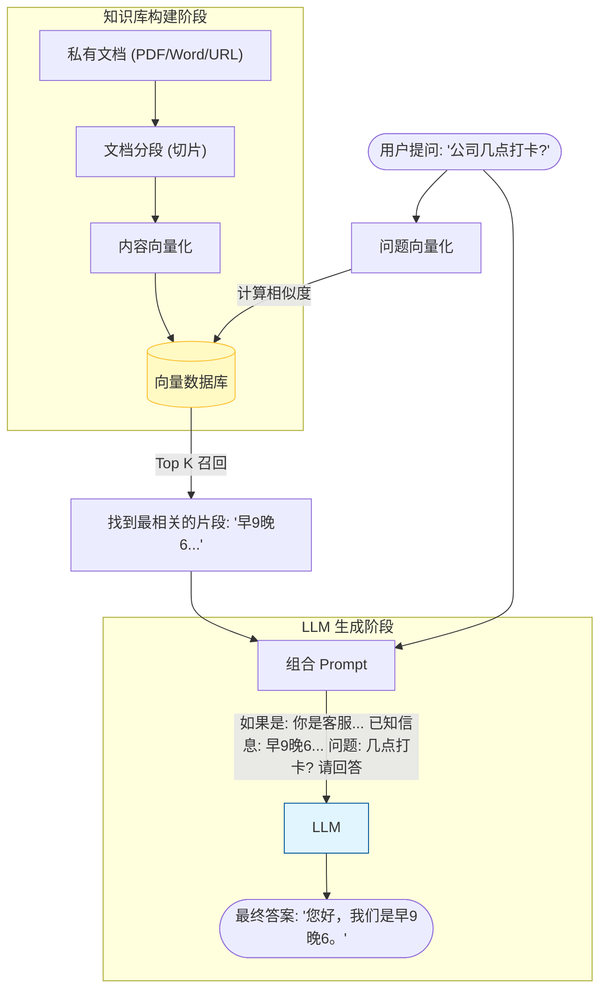

# Coze 零基础精通系列 03：知识库 (Knowledge Base) —— 给 AI 装上“私有大脑”

> **上一篇回顾**：本系列已介绍如何用结构化提示词（Prompt）约束 AI 的行为。  
> **本篇目标**：让 AI 学会它原本不知道的知识（如公司文档、个人简历）。

---

## 1. 为什么 AI 会“一本正经胡说八道”？

大模型（LLM）的训练数据是截止到过去的公开互联网数据。若询问：
> “这一期 Coze 教程的第三篇文章讲了什么？”
> AI 大概率会瞎编，因为它根本没看过本地电脑。

要解决这个问题，不能把大脑拆了重练（太贵），而是要给它配一个 **外挂硬盘** —— 这就是 **知识库**。
在技术圈，这叫 **RAG (Retrieval-Augmented Generation，检索增强生成)**。

## 2. 核心原理：RAG 是如何工作的？

别被缩写吓跑，RAG 的原理就是一个 **“开卷考试”** 的过程。

想象一下，老师（用户）问了一个超纲问题，学生（AI）不会做。但是学生手里有一本教科书（知识库）。
1.  **检索 (Retrieval)**：学生先翻书，找到相关的段落。
2.  **增强 (Augmented)**：学生把书里的段落抄到脑子里，结合问题一起思考。
3.  **生成 (Generation)**：学生组织语言，回答老师的问题。

计算机内部处理流程如下：



### 关键概念通俗版：
*   **切片 (Chunking)**：AI 一次吃不下太长的文章，所以要把文档切成一小段一小段的（比如 500 字一段）。
*   **向量化 (Embedding)**：计算机不认识字，只认识数学。它把“苹果”变成一组数字 `[0.1, 0.9, ...]`。
    *   “香蕉”的数字离“苹果”很近。
    *   “卡车”的数字离“苹果”很远。
    *   所以当你搜“水果”，它能找到“苹果”和“香蕉”，这就是 **语义搜索**。

> 💡 **知识库类型对比**：
> *   **文本知识库 (Text)**：适合非结构化文档（PDF、Word、SOP 手册）。原理是 RAG 切片。
> *   **表格知识库 (Table)**：适合结构化数据（价格表、员工花名册、库存表）。可以直接上传 Excel，Bot 会尝试用 SQL 精准查询，准确率远高于文本检索。

## 3. 实战案例：打造“专属简历问答助手”

以求职场景为例，如果希望做一个 Bot，发给 HR，让 HR 直接问 Bot，而不是看枯燥的 PDF。

### 第一步：准备粮草（数据）
找一份简历（PDF 或 Markdown 格式），或者写一段自我介绍。

### 第二步：创建知识库
1. 在 Coze 首页顶部导航栏点击 **“知识库” (Knowledge)**。
2. 点击 **“创建知识库”**，选 **文本格式**。
3. 上传简历文件。
4. **清洗与分段**：Coze 会自动分段。可以点开看看，如果切得太碎，把一些连贯的段落手动合并（一般默认自动即可）。
5. 等待状态变为 **“启用中”**。

> 💡 **进阶技巧**：知识库创建完成后，建议进行 **“命中测试” (Retrieval Testing)**。在设置页面的测试窗口输入几个问题，检查 AI 能否召回正确的段落。如果搜不到，可能需要调整切片规则或增加文档密度。

### 第三步：给 Bot 装上外挂
1. 回到之前创建的（或者新建一个）Bot。
2. 在中间的 **“知识库”** 区域，点击 `+` 号。
3. 选择刚才创建的 `我的简历库`。
4. **调整 Prompt**：
   在提示词里加上一句引导：
   ```markdown
   # Skills
   你拥有我的详细简历信息。当用户询问关于我的经历时，请必须优先搜索知识库中的内容来回答，不要编造。
   ```

### 第四步：查看效果
在右侧预览区提问：
> “这个候选人做过什么项目？”
> “他的教育背景如何？”

你会发现，Bot 不再是瞎编乱造，而是精准地引用了简历里的原话，甚至还会帮忙总结高光时刻！

---

## 总结
知识库是 Coze 最强大的功能之一。它让通用的 AI 变成了**懂业务、懂用户**的 AI。
*   **上传**文档。
*   **自动切片**与向量化。
*   Bot **自动检索**并回答。

基本功能的实现并不复杂。但为了实现自动发邮件、自动写周报等功能，需要更强大的工具。
下一篇，将解锁 AI 的“手脚” —— **工作流 (Workflow)**，这才是 Coze 真正拉开差距的杀手锏。
