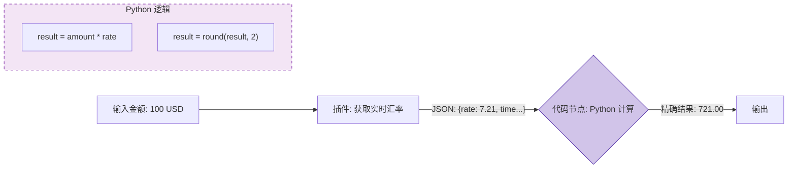

# Coze 零基础精通系列 07：高级逻辑 (Code Nodes) —— 突破“无代码”的极限

> **上一篇回顾**：已用数据库存储数据。  
> **本篇目标**：当“拖拽”无法满足需求时，用少量的代码（Code）实现精准控制，以及处理批量任务。

---

## 1. 为什么“无代码”平台还需要写代码？

即使是 GPT-4，也有它的弱点：
*   **数学差**：问 `3.1415 * 99933.2`，它经常算错。
*   **格式乱**：处理复杂的 JSON 嵌套时，有时候提取字段不准确。
*   **逻辑绕**：处理 "if-else" 还行，但处理 "for 循环"（比如把 10 条新闻逐条分析）就比较吃力。

这时候，需要 **代码节点 (Code Node)**。它弥补了 LLM 在精确计算和逻辑控制上的短板。

## 2. 核心原理：沙箱与循环

### 2.1 代码节点 (Code Node)
可以在 Coze 的工作流里插入一个运行 Python 或 JavaScript 的小盒子。
*   **输入**：上一个节点的 Output。
*   **处理**：用标准的编程语法处理数据（如正则匹配、数学运算、列表操作）。
*   **输出**：处理好的干净数据。

> 💡 **进阶技巧**：注意 **沙箱限制**。Coze 的代码节点通常无法访问外网（不能使用 `requests` 库请求外部 API），且只能使用平台预装的 Python/JS 库（如 `numpy`）。如需复杂网络请求，请使用插件。

### 2.2 循环节点 (Loop Node)
如果搜到了 10 篇网页，想把它们**每一篇**都读一遍并总结，普通工作流只能处理整个 List。
**循环节点**可以遍历这个 List，对**每一个** Item 执行一次相同的子工作流。



## 3. 实战案例：精准“汇率计算器”

本节演示汇率换算，为确保精度，使用代码计算。

### 第一步：获取数据
1. 创建工作流。
2. Start 节点接收 `currency_from`, `currency_to`, `amount`。
3. 添加 **Google Finance** 或类似插件，查询当前汇率。

### 第二步：编写代码
1. 添加 **Code** 节点。
2. 语言选择 **Python**。
3. **Input**：添加变量 `rate` (从插件获取), `amount` (从 Start 获取)。
4. **代码编写**：
   ```python
   async def main(args: Args) -> Output:
       params = args.params
       
       # 强制让计算机做浮点运算，而不是让 AI 猜
       rate = float(params['rate'])
       amount = float(params['amount'])
       
       # 计算结果，保留4位小数
       converted = amount * rate
       formatted_result = round(converted, 4)
       
       # 构造返回值
       ret: Output = {
           "result": formatted_result,
           "message": f"{amount} 换算结果为 {formatted_result}"
       }
       return ret
   ```

### 第三步：输出结果
LLM 会拿到这个精准的数字，再把它包装成好听的话回复给用户。

---

## 4. 进阶玩法：批处理 (Batch Processing)

假设构建一个“公众号爆款标题打分器”。
1.  **输入**：用户一次性发送 5 个标题。
2.  **处理**：需要对这 5 个标题**分别**进行多维度的评分（吸引力、情绪值、关键词）。
3.  **循环**：
    *   使用 **Loop** 节点包裹住“评分 LLM”。
    *   Coze 会自动把 5 个标题拆开，跑 5 次评分。
    *   最后把 5 个结果打包成一个 List 返回。

---

## 总结
*   **LLM** 负责创意、理解、模糊处理。
*   **Code** 负责计算、逻辑、精确处理。

Bot 的能力已经非常完善。但目前它通常以单体形式存在。
下一篇，将进入 **多智能体 (Multi-Agent)** 模式，介绍如何让多个 Bot 协同工作。
