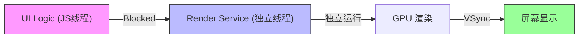
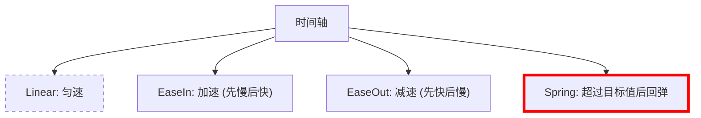
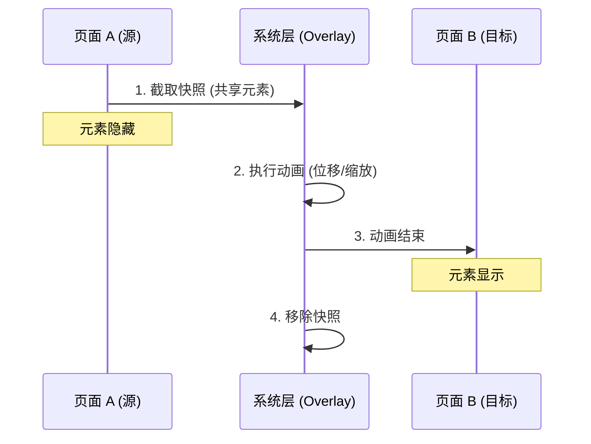

# 鸿蒙开发进阶（五）：动效与转场 (Animations)

> 🔗 **项目地址**：[https://github.com/briefness/HarmonyDemo](https://github.com/briefness/HarmonyDemo)

> 好的动效不仅是装饰，更是人机交互的引导线。

本章将介绍动画编写方法，并探究 **帧率 (Frame Rate)** 和 **插值器 (Interpolator)** 背后的原理。

## 一、理论基础：帧率与感知

### 1.1 60Hz vs 90Hz/120Hz
*   **60Hz**: 标准刷新率，每帧 **16.6ms**。
*   **120Hz (ProMotion)**: 高刷，每帧 **8.3ms**。

**掉帧 (Jank)**：
如果 UI 线程处理耗时超过了 16.6ms，系统就来不及渲染这一帧，导致卡顿。
HarmonyOS 的 RenderService 独立于主线程，能保证声明式动画（如 `animation` 属性）尽量流畅，不被 JS 逻辑阻塞。



### 1.2 动画的本质 (Interpolation)
所谓动画，就是数值在时间轴上的**插值**。
*   Start: `x = 0` (t = 0ms)
*   End: `x = 100` (t = 1000ms)
*   **Frame 16ms**: `x = 1.6`
*   **Frame 32ms**: `x = 3.2`
系统会在每一帧 VSync 信号到来时，计算出当前的 `x` 值，并通知渲染引擎重绘。

## 二、插值器 (Interpolator)

为什么有些动画看起来“生硬”，有些看起来“Q弹”？区别在于**速度曲线**。

`Curve.EaseInOut` 本质上是一条 **贝塞尔曲线 (Bezier Curve)**。

*   **Linear (线性)**: 匀速运动。
*   **Ease-In (渐入)**: 起步慢，加速快。适合物体**离开**屏幕。
*   **Ease-Out (渐出)**: 起步快，减速慢。适合物体**进入**屏幕（符合物理摩擦力规律）。
*   **Spring (弹簧)**: 模拟胡克定律，带有回弹效果，使界面更具互动感。



```typescript
.animation({ 
  curve: Curve.Linear // 旋转 loading 可用
  curve: Curve.EaseOut // 推荐默认
  curve: Curves.springMotion() // 跟手动画必备
})
```

## 三、属性动画 (Implicit Animation)

这是常用的动画方式。
**核心思维**：只需要修改属性（状态），系统负责补间 (Tweening)。

```typescript
Image(...)
  .width(this.w)
  .height(this.h)
  .animation({ duration: 1000, curve: Curve.EaseOut }) 
```
执行 `this.w = 200` 时，系统自动计算 `(200 - 100) / 60帧` 的增量，并在每帧刷新。

## 四、显式动画 (Explicit Animation)

如果需要更精准地控制动画时机，或者同时让多个无关的属性一起变化，请用 `animateTo`。

```typescript
animateTo({ duration: 500 }, () => {
  // 这里的状态变更会被"录制"下来，产生动画
  this.isShow = true;
  this.offset = 100;
  this.color = Color.Red;
});
```

### 4.2 性能陷阱与优化
不是所有属性都适合做动画。
*   **高性能属性**: `opacity`, `translate`, `scale`, `rotate`。
    *   原因: 这些属性只影响**合成阶段 (Composite)** 或者 GPU 纹理变换，不涉及布局计算。
*   **低性能属性**: `width`, `height`, `margin`, `padding`, `layoutWeight`。
    *   原因: 修改它们会触发 **Relayout (重排)**。系统需要重新计算整个组件树的位置，消耗 CPU 极大，容易导致掉帧。
    
> **优化技巧**: 如果想把图片放大，尽量用 `.scale({ x: 2, y: 2 })` 而不是 `.width(200)`。

## 五、共享元素转场 (GeometryTransition)

这是提升应用质感的有效手段。

**实现原理**：
1.  系统识别两个页面中 ID 相同的组件。
2.  计算它们的位置 (Position) 和大小 (Size) 差异。
3.  创建一个临时的“快照 (Snapshot)”，在顶层窗口上执行位移和形变动画。



## 六、总结

动画能提升用户体验。
*   **原则**：进入用快速减速 (Ease-Out)，离开用慢速加速 (Ease-In)。
*   **性能**：优先使用 `translate/scale/rotate`，因为它们只影响合成阶段 (Composite)，不触发重排 (Layout)。

下一篇，将学习如何使用 **Canvas** 进行底层绘图。


