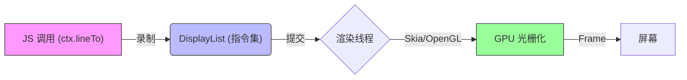
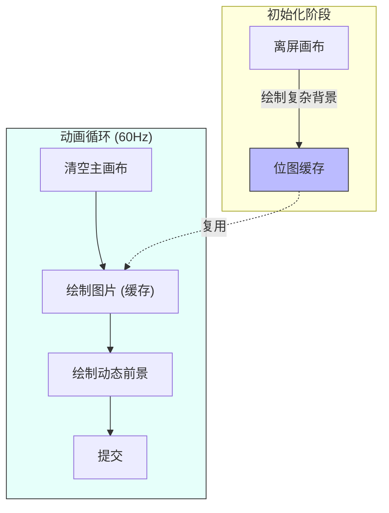

# 鸿蒙开发进阶（六）：自定义绘图 (Canvas)

> 🔗 **项目地址**：[https://github.com/briefness/HarmonyDemo](https://github.com/briefness/HarmonyDemo)

> 当标准组件无法满足需求时，可以使用 **Canvas**。

## 一、理论基础：图形引擎

HarmonyOS 的 2D 绘图引擎支持标准 Canvas API，底层的 **DisplayList** 机制提升了渲染效率。

### 1.1 DisplayList (显示列表)
当调用 `ctx.lineTo(...)` 时，系统没有立即操作像素内存（光栅化），而是在**录制指令**。这些指令被存储在 **DisplayList** 中。



当这一帧结束时，DisplayList 被发送给 **RenderThread** 或 GPU 回放。
**优势**：
1.  **非阻塞**: JS 线程录制指令速度快。
2.  **硬件加速**: 复杂的渐变、阴影可由 GPU Shader 处理。

## 二、Canvas 基础

HarmonyOS 的 Canvas API 与 Web Canvas (HTML5) 高度一致。

### 2.1 坐标系
*   **原点 (0,0)**: 左上角。
*   **X 轴**: 向右增加。
*   **Y 轴**: 向下增加。

## 三、实战案例：动态仪表盘

本节将绘制一个带渐变色的圆形进度条：

### 3.1 关键 API 解析
*   `ctx.arc(x, y, r, startAngle, endAngle)`: 画圆弧。注意角度使用 **弧度** (Radians)。
*   `ctx.createLinearGradient(...)`: 创建渐变笔刷。
*   `ctx.clearRect(...)`: **动画每一帧之前必须清空画布**。否则画面会重叠。

## 四、性能深度优化

Canvas 绘图强大，但滥用会导致掉帧。

### 4.1 避免在循环中创建对象
```typescript
// ❌ 错误示范：每一帧都 new 对象，导致 GC 频繁触发
function draw() {
  const grad = ctx.createLinearGradient(...); 
}

// ✅ 正确示范：复用对象
const grad = ctx.createLinearGradient(...);
function draw() {
  ctx.fillStyle = grad;
}
```

### 4.2 离屏渲染 (OffscreenCanvas)
如果背景复杂且静止：
1.  在 **OffscreenCanvas** 上绘制背景（缓存为 Bitmap）。
2.  在主循环中，使用 `ctx.drawImage(offscreen)` 贴图。
这是**空间换时间**的策略。



## 五、总结

Canvas 提供了强大的绘图能力，同时也要求理解图形管线。
*   DisplayList 机制提升了速度。
*   控制 GC 频率是性能优化的关键。

下一篇，将探讨**组件化**架构，介绍如何优雅地组织大型项目代码。


