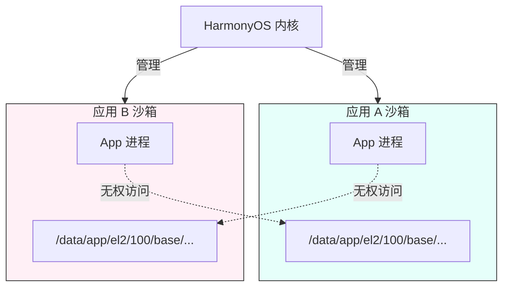
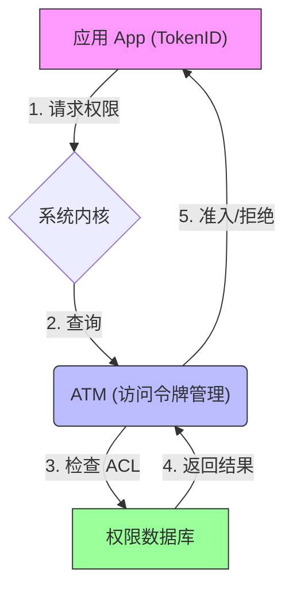
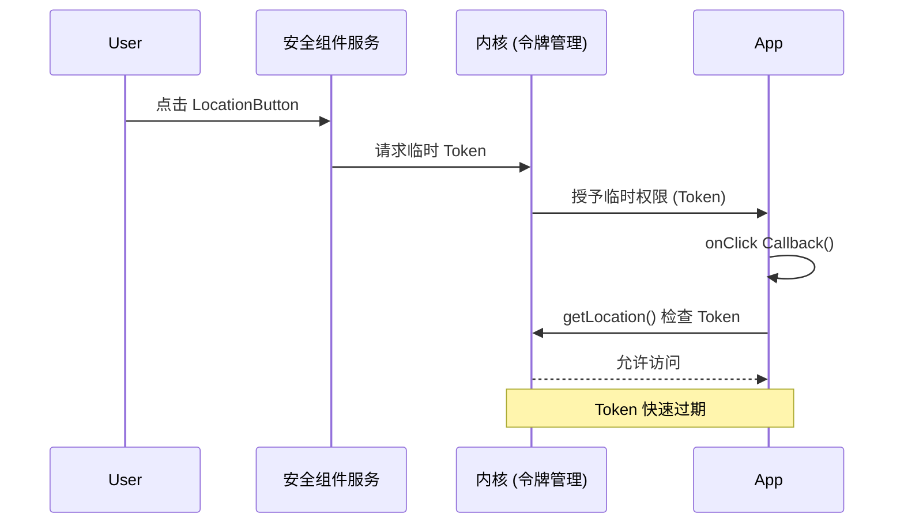

# 鸿蒙开发高级（十五）：硬件访问与沙箱机制 (Hardware & Sandbox)

> 🔗 **项目地址**：[https://github.com/briefness/HarmonyDemo](https://github.com/briefness/HarmonyDemo)

> **更新说明**：本文将介绍安全控件及 **应用沙箱 (App Sandbox)** 和 **Token 鉴权** 机制。

## 一、理论基础：应用沙箱 (Sandbox)

### 1.1 什么是沙箱？
在 HarmonyOS 中，每个应用都运行在自己独立的沙箱环境中。
*   **文件隔离**: App A 看到的 `/data/storage` 和 App B 看到的完全不同。其他应用的文件不可直接访问。
*   **进程隔离**: 前文提到的 Actor 模型，保证了内存隔离。



### 1.2 权限控制 (ACL & Token)
当应用申请权限时，系统是如何记录的？



*   **TokenID**: 每个应用安装时分配一个唯一的 TokenID。
*   **ATM (Access Token Manager)**: 系统核心服务。当调用 `Location` API 时，内核会拿着应用的 TokenID 去 ATM 查 ACL (Access Control List)。
    *   如果有权限 -> 放行。
    *   如果没有 -> 抛出 SecurityException。

## 二、安全控件 (Security Component)

基于交互的授权模式。

### 2.1 核心原理
为什么点了 `LocationButton` 就能定位？
1.  **受信任的 UI**: 该按钮由系统进程渲染，应用无法伪造、无法完全遮挡。
2.  **临时授权**: 用户点击瞬间，系统通过内核向应用进程发放一个**临时 Token**。
3.  **时效性**: 这个 Token 仅在回调函数执行期间或短时间内有效。



### 2.2 实战：LocationButton
```typescript
LocationButton()
  .onClick((event, result) => {
    if (result === LocationButtonOnClickResult.SUCCESS) {
       // 此时 ATM 临时放开了权限检查
       this.getLocation();
    }
  })
```

## 三、隐私与 Picker

### 3.1 最小化授权
以前读取相册需要 `READ_IMAGE` 权限，这意味着应用能扫描所有照片。
现在使用 `PhotoViewPicker`：
1.  App 拉起系统图库（独立进程）。
2.  用户选择 1 张图。
3.  系统只把这 **1 张图的 Read 权限** 授予给 App。
这体现了 **“最小特权原则”**。

## 四、总结

HarmonyOS 的安全体系构建在：
1.  **沙箱**: 物理隔离。
2.  **Token**: 身份认证。
3.  **安全控件**: 交互即授权。

至此，已完成了系统能力的学习。
下一阶段（也是最后阶段），将进入 **生态融合与工程化**，探讨原子化服务、性能调优和发布签名的流程。


