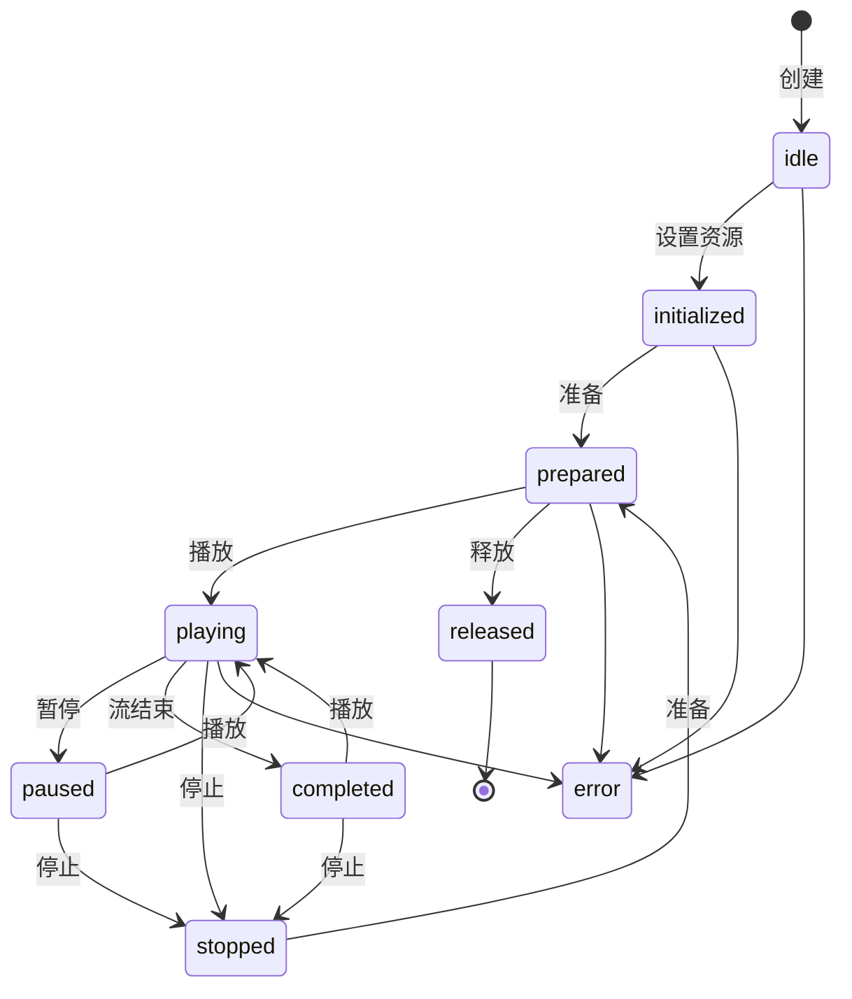
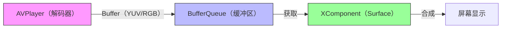
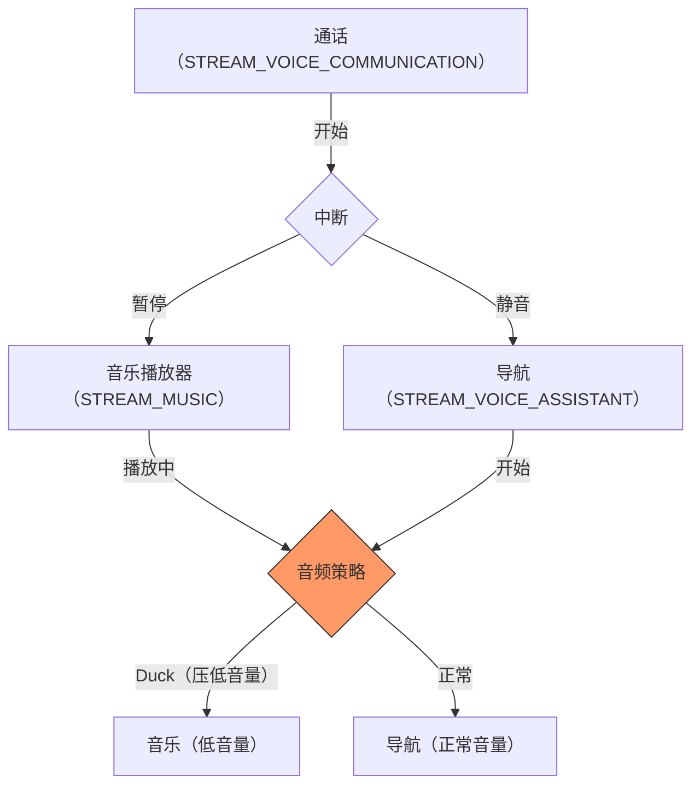

# 鸿蒙开发进阶（十一）：媒体娱乐 (Audio & Video)

> 🔗 **项目地址**：[https://github.com/briefness/HarmonyDemo](https://github.com/briefness/HarmonyDemo)

> **MediaKit**: 在短视频时代，视频播放能力是 App 的必备技能。

HarmonyOS NEXT 提供了强大的 `media.AVPlayer`，支持音视频播放。与简单组件不同，媒体播放涉及**状态机 (State Machine)**、**渲染管道 (Rendering Pipeline)** 和 **音频并发策略 (Concurrency Policy)**。

## 一、核心理论：AVPlayer 状态机

AVPlayer 是一个严谨的状态机。理解状态流转是保证稳定性的关键。



### 1.1 关键状态详解：
*   **idle**: 刚创建，无资源。
*   **initialized**: 设置了 `url`。系统知道要播什么，但未知是否支持。
*   **prepared**: 这里系统加载完元数据（时长、尺寸）。**只有到了这一步，才能安全地获取视频信息并控制 UI。**
*   **playing/paused**: 播放/暂停。网络缓冲时可能仍维持 playing 状态。
*   **released**: 销毁。**注意**：退出页面时必须 release，否则解码器资源无法释放，可能导致后续播放失败。

**务必熟悉官方的状态流转图**，并根据当前状态做防御性编程。

## 二、渲染原理：生产者与消费者模型

HarmonyOS 推荐使用 `XComponent`，因为其效率更高。

### 2.1 Surface 与 BufferQueue
视频播放是一个典型的 **生产者-消费者** 模型：



1.  **生产者**: `AVPlayer` (解码器)。输出原始图像数据 (Buffer)。
2.  **消费者**: `XComponent` (Surface)。接收 Buffer 并合成上屏。

两者通过 **BufferQueue**（图形缓冲区队列）连接。
将 `surfaceId` 传给 `AVPlayer`，相当于把解码器输出直接接到屏幕输入。

**优势**：
*   **零拷贝 (Zero-Copy)**：数据在 GPU 内存流转，极大降低 CPU 占用。
*   **低延迟**：硬件解码直接上屏。

这也是 `XComponent` 必须选 `surface` 类型的原因。

### 2.2 为什么不用 `<Video>` 组件？
`<Video>` 组件简单，但如果需要以下功能，必须用 **AVPlayer + XComponent**：
*   自定义控制栏 UI
*   实现弹幕
*   滤镜处理
*   复杂的埋点统计
*   **高性能渲染**

## 三、代码实战要点：绑定 Surface

```typescript
XComponent({ type: XComponentType.SURFACE, controller: this.mXComponentController })
  .onLoad(() => {
    // 拿到"画布"ID，告诉播放器把画面画到这上面
    this.surfaceId = this.mXComponentController.getXComponentSurfaceId();
    this.avPlayer.surfaceId = this.surfaceId; 
  })
```
注意：`XComponent` 的 `onLoad` 时机非常关键，必须确保 Surface 创建成功后，再把 ID 给 AVPlayer。

## 四、音频焦点与并发策略 (Concurrency)

这部分常被忽略，但对体验影响巨大。
当视频播放时，如何处理后台音乐、闹钟、导航语音？

HarmonyOS 通过 **AudioSession** 和 **AudioRendererInfo** 管理这些策略。

### 4.1 音频流类型 (StreamUsage)
创建 `AVPlayer` 时，需指定用途：

*   **MUSIC (音乐)**: 高优先级。导航说话时，通常会“压低音量”继续播放。
*   **MOVIE (电影)**: 类似音乐，需沉浸体验。
*   **GAME (游戏)**: 游戏音效。
*   **VOICE_COMMUNICATION (通话)**: 极高优先级，会打断音乐。

系统默认的**焦点模式**：
1.  **独占 (Exclusive)**: 如电话。
2.  **共享 (Mixable)**: 如游戏音效和背景音乐。
3.  **压低 (Duck)**: 如导航播报。



**最佳实践**：
在 `AVPlayer` 初始化时正确设置 `audioRendererInfo`，系统会处理大部分逻辑。

```typescript
// 电影模式，通常会被通话打断，但可能跟导航共存（压低）
avPlayer.audioRendererInfo = {
  usage: audio.StreamUsage.STREAM_USAGE_MOVIE,
  rendererFlags: 0 
}
```

## 五、媒体会话 (AVSession)

若希望在锁屏或控制中心控制播放，需要使用 **AVSession**。

`AVSession` 是 App 与系统媒体控制器之间的桥梁。
1.  **App 告诉系统**：正在播放的内容信息。
2.  **系统告诉 App**：用户操作（如“下一首”）。

AVSession 还有助于 App 在后台持续运行，通过系统判定为重要任务。

## 六、总结

媒体开发不仅是调用 API，更是在管理**资源**和**策略**。
*   **状态机**保证流程健壮。
*   **Surface** 保证渲染性能。
*   **AudioSession** 保证听感和谐。

掌握这些理论，能够显著提升应用质量。

下一篇，将探讨如何让 App 在后台“活”下来：**通知与后台任务 (Notifications)**。


