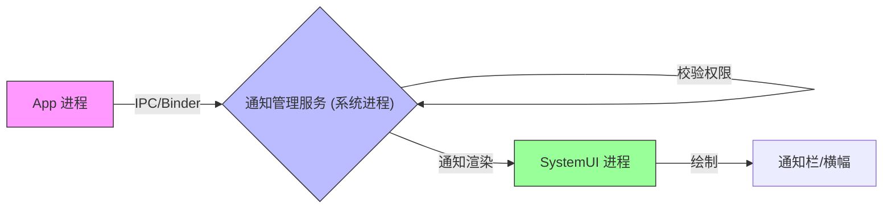
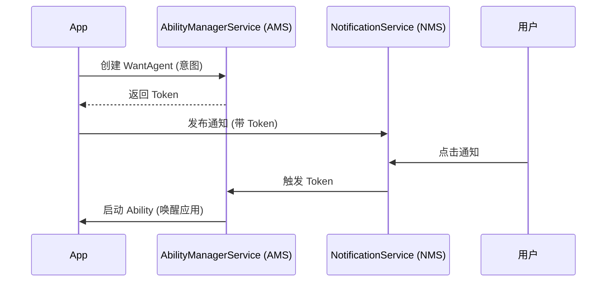

# 鸿蒙开发进阶（十二）：通知与后台任务 (Notifications)

> 🔗 **项目地址**：[https://github.com/briefness/HarmonyDemo](https://github.com/briefness/HarmonyDemo)

> **更新说明**：本文将解析 **IPC 通信** 和 **系统代理服务**，阐述通知与后台任务的机制。

## 一、理论基础：IPC 与 代理服务

### 1.1 跨进程通信 (IPC)
当调用 `notificationManager.publish()` 时，并非直接在 App 进程中绘制弹窗。



底层执行了跨进程通信 (IPC)：
1.  **App 进程**: 序列化通知数据 (NotificationRequest)，通过 Binder 驱动发送给系统服务。
2.  **NotificationManagerService (NMS)**: 系统进程收到请求，校验权限。
3.  **SystemUI**: NMS 通知 SystemUI 进程渲染通知栏。

### 1.2 代理服务 (Proxy Service)
对于 **代理提醒 (ReminderAgent)**，原理更进一步。
*   应用将**任务**委托给系统。
*   **ReminderService** 是常驻内存的系统服务。即使应用进程被回收，系统服务仍会准时触发提醒。
*   系统服务会负责唤醒设备、播放铃声，并拉起应用（如果配置了 WantAgent）。

## 二、通知 (NotificationKit)

### 2.1 核心要素
1.  **Content**: 通知的 UI 载体。
2.  **Slot (通道)**: 决定通知的干扰程度。
    *   **SOCIAL**: 社交消息（有声、震动）。
    *   **SERVICE**: 后台服务（静音）。
    *   **OTHER**: 其他推广（静音、折叠）。

### 2.2 WantAgent (点击意图)
`WantAgent` 是一个被系统持有的“延迟执行意图”。
它本质上是一个序列化的 Action，可以在未来某个时刻（如用户点击通知时）由 AMS (AbilityManagerService) 触发。



## 三、后台任务 (Background Tasks)

系统默认采用 **冻结策略**：App 切后台几秒后，JS 线程挂起，定时器停止。

### 3.1 短时任务 (Transient Task)
向系统申请临时后台运行时间。
```typescript
let delayId = backgroundTaskManager.requestSuspendDelay('reason', () => {
  // 超时回调：任务未完成，保存进度并清理
});
```

### 3.2 长时任务 (Continuous Task)
必须绑定一个 `NOTIFICATION_ID`。
这也体现了**前台服务 (Foreground Service)** 的设计逻辑：**用户必须知情**。后台运行必须在通知栏体现。

## 四、总结

传统的保活机制在 HarmonyOS 上不再适用。
*   **IPC 机制** 决定了通知由系统接管。
*   **代理机制** 决定了定时任务不需要应用存活。

建议使用 `ReminderAgent` 和 `WorkScheduler` 实现相关功能。

下一篇，将进入混合开发的领域：**Web 组件与 JSBridge**。


