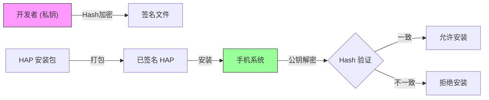
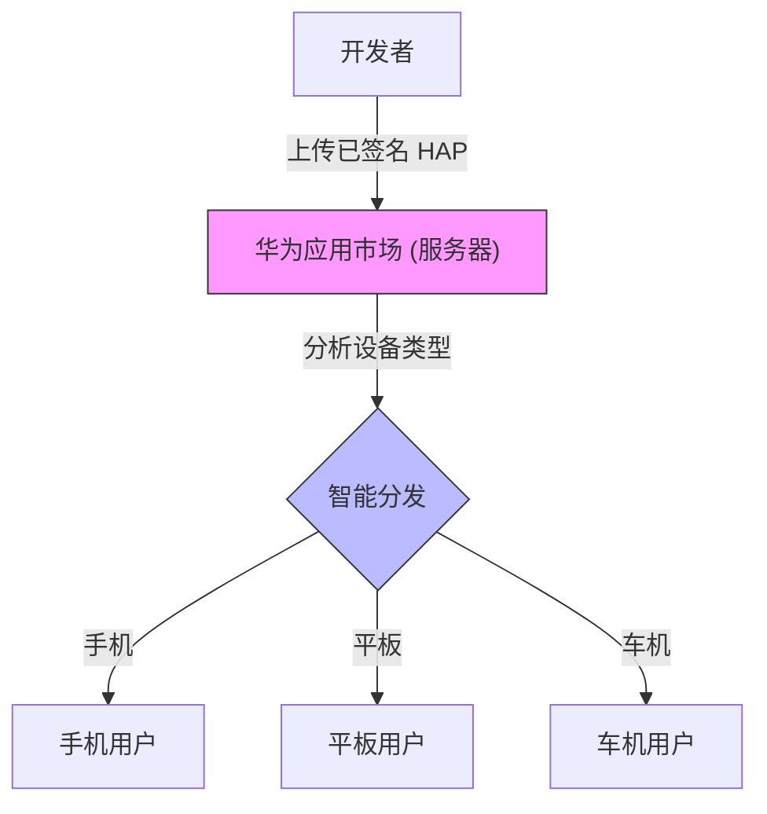

# 鸿蒙开发高级（十八）：分发与商业化 (Publishing)

> 🔗 **项目地址**：[https://github.com/briefness/HarmonyDemo](https://github.com/briefness/HarmonyDemo)

> **更新说明**：本文将介绍 **数字签名 (Code Signing)** 原理、AppScope 及上架流程。

## 一、理论基础：数字签名与 AppScope

### 1.1 为什么需要签名？
防止篡改。

1.  **非对称加密**: 开发者持有**私钥 (Private Key)**，华为持有**公钥 (Public Key)**。
2.  **签名过程**: 私钥对 App 的 HASH 值加密，生成签名信息。
3.  **验签过程**: 手机安装时，系统用公钥解密签名，验证 HASH 是否一致。

### 1.2 AppScope 工程结构
`AppScope` 文件夹是全工程的公共配置。
*   `bundleName`: 应用的唯一标识（如 `com.example.app`）。**上架后不可修改**。
*   `versionCode`: 必须单调递增。

## 二、隐私合规 (Privacy)

这是上架过程中的关键环节。

### 2.1 隐私政策时机
**规则**: 在用户点击“同意”按钮之前，App **不能发送网络请求**。
建议：
在 `EntryAbility.onCreate` 里检查标记位。如果未同意，直接加载一个纯本地的 `PrivacyPage`，阻断主页面的初始化。

## 三、多设备分发

HarmonyOS 的核心愿景是 **One Super Device**。
在 `Project Structure` 勾选 Tablet/Car，并做好响应式布局。
AppGallery 会自动将应用分发给不同设备用户，无需上传多个包。

## 四、全系列总结

至此，全系列**理论增强**圆满结束。
从第一篇的 ArkTS 编译原理，到最后一篇的 RSA 数字签名。
不仅学会了 *How* (怎么写)，更深入理解了 *Why* (为什么这么设计)。

希望这些内容对开发 HarmonyOS 应用有所帮助。
**Happy Coding!**

