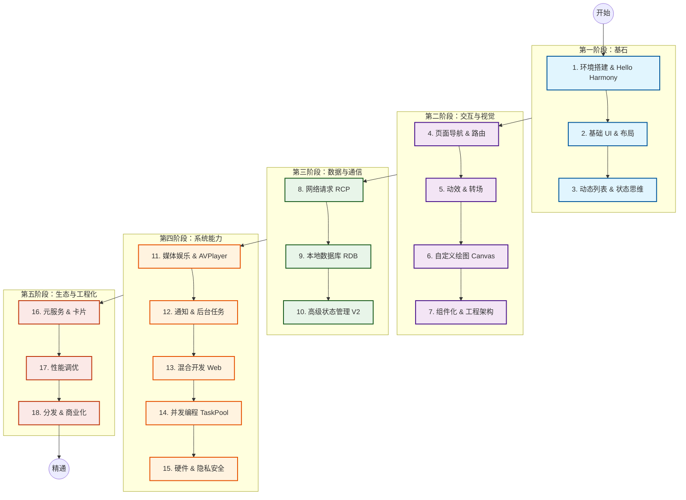

# 鸿蒙开发全栈实战：从入门到精通系列指南

这份指南是为想要掌握 HarmonyOS NEXT 开发准备的。从零基础入手，直到能独立开发商业级应用。

全系列分 **5 个阶段**，共 **18 个主题**，从环境搭建讲到性能优化。

## 🗺️ 学习路线图 (Learning Path)

建议按顺序学习，前面的内容是后面的基础。

---

## 📚 课程大纲与导航

### 第一阶段：基石 (Foundation)
> **目标**：理解 ArkTS 语法与声明式 UI 的思维方式。

1.  **[环境搭建与 Hello Harmony](./Articles/HelloHarmony.md)**
    *   **内容**: 安装 DevEco Studio，理解工程目录结构，编写第一行 ArkTS 代码。
    *   *关键点*: Toolchain, Build流程, 基本语法。

2.  **[基础 UI 与布局系统](./Articles/BasicUI.md)**
    *   **内容**: 掌握构建界面的积木。学习 Flex 布局（Row/Column），文本与按钮样式。
    *   *关键点*: 布局容器, 样式设置, 屏幕适配。

3.  **[动态列表与状态思维](./Articles/TodoList.md)**
    *   **内容**: 学习数据驱动的开发模式。制作一个交互式的待办事项列表。
    *   *关键点*: `@State`, `ForEach` 渲染循环, 事件绑定, MVVM.

### 第二阶段：交互与视觉 (Interaction & Visuals)
> **目标**：掌握多页面跳转、动画与自定义绘制。

4.  **[页面导航与路由深度解析](./Articles/Navigation.md)**
    *   **内容**: 管理复杂应用的页面栈，传递参数，实现页面间的数据流转。
    *   *关键点*: `Navigation` 组件, `NavPathStack`, 路由生命周期.

5.  **[动效与转场 (Animations)](./Articles/Animations.md)**
    *   **内容**: 实现元素共享跳转、属性渐变与粒子效果。
    *   *关键点*: `animation`, `animateTo`, 共享元素转场.

6.  **[自定义绘图与画布 (Canvas)](./Articles/Drawing.md)**
    *   **内容**: 使用 Canvas 绘制任意图形。实现股票走势图或仪表盘。
    *   *关键点*: `Canvas`, `Path` 路径, 2D 绘图上下文, DisplayList.

7.  **[组件化与工程架构 (Components & Architecture)](./Articles/Components.md)**
    *   **内容**: 封装复用组件，掌握官方推荐的**三层架构 (Product-Feature-Common)**。使用 HSP/HAR 打造模块化应用。
    *   *关键点*: `@Builder`, `AttributeModifier`, Layered Architecture, HSP/HAR.

### 第三阶段：数据与通信 (Data & Connectivity)
> **目标**：处理复杂的数据流动与本地存储。

8.  **[高性能网络请求 (RCP)](./Articles/Network.md)**
    *   **内容**: 使用最新的 RCP 模块与后端通信，处理拦截器与 Session。
    *   *关键点*: HTTP 请求, 拦截器链, 错误处理, TLS/SSL.

9.  **[本地数据库 (RDB)](./Articles/Persistence.md)**
    *   **内容**: 在端侧存储海量数据。使用关系型数据库进行增删改查。
    *   *关键点*: SQLite, 谓词查询, 数据库版本管理, Preferences.

10. **[高级状态管理 (State V2)](./Articles/AdvancedState.md)**
    *   **内容**: 处理复杂应用状态。使用 V2 装饰器深度监听嵌套对象。
    *   *关键点*: `@ObservedV2`, `@Trace`, 深度监听, 状态提升.

### 第四阶段：多媒体与系统能力 (Media & System)
> **目标**：实现后台任务、并发编程与硬件交互。

11. **[媒体娱乐 (Audio & Video)](./Articles/Media.md)**
    *   **内容**: 开发视频播放器，管理音频焦点。
    *   *关键点*: `AVPlayer`, 视频渲染控制, 音频会话管理.

12. **[通知与后台任务 (Notifications)](./Articles/Notifications.md)**
    *   **内容**: 即使应用退出也能触达用户。实现代理提醒与后台下载。
    *   *关键点*: 通知栏管理, 代理提醒, 长时任务, Background Tasks.

13. **[混合开发 (Web)](./Articles/Web.md)**
    *   **内容**: 在应用中嵌入 H5 页面，实现原生与 Web 双向通信。
    *   *关键点*: `Web` 组件, 同层渲染, JSBridge 双向通信.

14. **[并发编程 (Concurrency)](./Articles/Concurrency.md)**
    *   **内容**: 充分利用多核 CPU，防止主线程卡顿。掌握线程间的高效数据共享。
    *   *关键点*: TaskPool, Actor 模型, Sendable 协议, 线程通信.

15. **[硬件与隐私安全](./Articles/Hardware.md)**
    *   **内容**: 安全地访问位置、相机与相册。
    *   *关键点*: 权限申请 (Permission), 安全控件, 隐私合规.

### 第五阶段：生态融合与工程化 (Ecosystem & Engineering)
> **目标**：优化性能并完成应用上架。

16. **[元服务与卡片 (Atomic Services)](./Articles/ServiceWidgets.md)**
    *   **内容**: 开发桌面万能卡片，实现服务直达。
    *   *关键点*: FormKit, 卡片生命周期, 极简交互.

17. **[性能调优实战](./Articles/Performance.md)**
    *   **内容**: 诊断卡顿与掉帧。掌握 ArkTS 高性能编程规范。
    *   *关键点*: Profiler 工具, Smart Perf, 内存泄漏检测, 懒加载 (LazyForEach).

18. **[分发与商业化](./Articles/Publishing.md)**
    *   **内容**: 签名、打包、上架 AppGallery 全流程。
    *   *关键点*: 签名配置, AGC 后台, 隐私合规检查, 多渠道打包.
